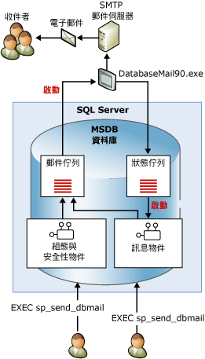

# Database Mail
[!INCLUDE[appliesto-ss-xxxx-xxxx-xxx-md](../../includes/appliesto-ss-xxxx-xxxx-xxx-md.md)] Database Mail 是從 [!INCLUDE[ssDEnoversion](../../includes/ssdenoversion-md.md)] 傳送電子郵件訊息的企業解決方案。 使用 Database Mail，資料庫應用程式就能夠將電子郵件訊息傳送給使用者。 這類訊息能包含查詢結果，也可以包含來自網路上任何資源的檔案。  
  
  
##   使用 Database Mail 的優點  
 Database Mail 具有可靠性、延展性、安全性及可支援性。  
  
### 可靠性  
  
-   Database Mail 會使用標準的 Simple Mail Transfer Protocol (SMTP) 來傳送郵件。 您不需要在執行 [!INCLUDE[ssNoVersion](../../includes/ssnoversion-md.md)]的電腦上安裝「擴充 MAPI」用戶端，就可以使用 Database Mail。  
  
-   處理序隔離。 為了將對 [!INCLUDE[ssNoVersion](../../includes/ssnoversion-md.md)]的影響減到最小，傳遞電子郵件的元件必須在 [!INCLUDE[ssNoVersion](../../includes/ssnoversion-md.md)]外部的個別處理序中執行。 即使外部處理序停止或失敗，[!INCLUDE[ssNoVersion](../../includes/ssnoversion-md.md)] 仍會繼續將電子郵件訊息排入佇列中。 佇列的訊息會在外部處理序或 SMTP 伺服器恢復連線後傳送。  
  
-   容錯移轉帳戶。 您可以使用 Database Mail 設定檔，指定多個 SMTP 伺服器。 萬一 SMTP 伺服器無法使用時，還是可以將郵件傳遞到另一個 SMTP 伺服器。  
  
-   叢集支援。 Database Mail 可感知叢集，而且在叢集上完全受到支援。  
  
### 延展性  
  
-   背景傳遞：Database Mail 提供背景或非同步傳遞功能。 呼叫 **sp_send_dbmail** 以傳送訊息時，Database Mail 會將要求加入 [!INCLUDE[ssSB](../../includes/sssb-md.md)] 佇列。 此舉會立即傳回預存程序。 外部電子郵件元件就會收到該要求，並傳遞電子郵件。  
  
-   多個設定檔：您可以使用 Database Mail，在 [!INCLUDE[ssNoVersion](../../includes/ssnoversion-md.md)] 執行個體內建立多個設定檔。 選擇性地傳送訊息時，您可以選擇 Database Mail 使用的設定檔。  
  
-   多個帳戶：每個設定檔都可以包含多個容錯移轉帳戶。 您可以設定不同的設定檔使用不同的帳戶，在多個電子郵件伺服器散發電子郵件。  
  
-   64 位元相容性： [!INCLUDE[ssNoVersion](../../includes/ssnoversion-md.md)]的 64 位元安裝完全支援 Database Mail。  
  
### 安全性  
  
-   預設為關閉狀態：為了要縮小 [!INCLUDE[ssNoVersion](../../includes/ssnoversion-md.md)]的介面區，預設會停用 Database Mail 預存程序。  
  
-   郵件安全性：若要傳送 Database Mail，您必須是 **msdb** 資料庫中 **DatabaseMailUserRole** 資料庫角色的成員。  
  
-   設定檔安全性：Database Mail 會強制執行郵件設定檔的安全性。 您要選擇擁有 Database Mail 設定檔存取權的 **msdb** 資料庫使用者或群組。 您可以將存取權授與給 **msdb**中的特定使用者或所有使用者。 私人設定檔限制清單上指定的使用者才有存取權。 公用設定檔可供資料庫的所有使用者使用。  
  
-   附件大小管理員：Database Mail 會強制執行附加檔案大小的可設定限制。 您可以使用 [sysmail_configure_sp](../../relational-databases/system-stored-procedures/sysmail-configure-sp-transact-sql.md) 預存程序來變更這項限制。  
  
-   禁止的副檔名：Database Mail 維護一個禁止的副檔名清單。 使用者無法附加副檔名出現在清單中的檔案。 您可以使用 sysmail_configure_sp 來變更此清單。  
  
-   Database Mail 會以 [!INCLUDE[ssNoVersion](../../includes/ssnoversion-md.md)] 引擎服務帳戶執行。 若要從資料夾將檔案附加至電子郵件，則 [!INCLUDE[ssNoVersion](../../includes/ssnoversion-md.md)] 引擎帳戶應具備存取包含該檔案之資料夾的權限。  
  
### 可支援性  
  
-   整合式組態：Database Mail 可維護 [!INCLUDE[ssDEnoversion](../../includes/ssdenoversion-md.md)]內電子郵件帳戶的資訊。 毋須在外部用戶端應用程式管理郵件設定檔。 「Database Mail 組態精靈」提供方便的介面，供設定 Database Mail 使用。 您也可以使用 [!INCLUDE[tsql](../../includes/tsql-md.md)]，來建立並維護 Database Mail 組態。  
  
-   記錄。 Database Mail 會將電子郵件活動記錄到 [!INCLUDE[ssNoVersion](../../includes/ssnoversion-md.md)]、Microsoft Windows 應用程式事件記錄檔，以及 **msdb** 資料庫中的資料表。  
  
-   稽核：Database Mail 會在 **msdb** 資料庫中保留所傳送的郵件與附件的複本。 您可以輕鬆稽核 Database Mail 的使用狀況，並檢閱所保留的郵件。  
  
-   支援 HTML：您可以使用 Database Mail 傳送 HTML 格式的電子郵件。  
  
  
##   Database Mail 架構  
 Database Mail 是根據使用 Service Broker 技術的佇列架構而設計。 當使用者執行 **sp_send_dbmail**時，預存程序會在郵件佇列中插入項目，並建立包含該電子郵件訊息的記錄。 在郵件佇列中插入新項目會啟動外部 Database Mail 處理序 (DatabaseMail.exe)。 外部處理序會讀取電子郵件資訊，並傳送電子郵件訊息到適當的電子郵件伺服器。 外部處理序會在「狀態」佇列中插入項目，表示傳送作業的結果。 在狀態佇列中插入新記錄會啟動內部預存程序，此預存程序會更新電子郵件訊息的狀態。 除了儲存已傳送 (或未傳送) 的電子郵件訊息之外，Database Mail 也會在系統資料表中記錄任何電子郵件附加檔案。 Database Mail 檢視提供可用於進行疑難排解的訊息狀態，並提供可用來管理 Database Mail 佇列的預存程序。  
  
   
  
  
##   Database Mail 元件簡介  
 Database Mail 是由下列主要元件所組成：  
  
-   組態與安全性元件  
  
     Database Mail 會將組態與安全性資訊儲存在 **msdb** 資料庫中。 組態與安全性物件會建立用於 Database Mail 的設定檔與帳戶。  
  
-   訊息元件  
  
     **msdb** 資料庫會充當郵件主機資料庫，其中會保存 Database Mail 用來傳送電子郵件的訊息物件。 這些物件包括 **sp_send_dbmail** 預存程序，以及保存訊息相關資訊的資料結構。  
  
-   Database Mail 可執行檔  
  
     Database Mail 可執行檔是一個外部程式，它會從 **msdb** 資料庫中的佇列讀取，並傳送訊息到電子郵件伺服器。  
  
-   記錄與稽核元件  
  
     Database Mail 會將記錄資訊記錄在 **msdb** 資料庫與 [!INCLUDE[msCoName](../../includes/msconame-md.md)] Windows 應用程式事件記錄檔中。  
  
 **設定 Agent 使用 Database Mail：**  
  
 SQL Server Agent 可以設定成使用 Database Mail。 警示通知和完成作業時的自動通知都需要 Database Mail。  
  
> [!WARNING]  
>  未將 [!INCLUDE[ssNoVersion](../../includes/ssnoversion-md.md)] Agent 設定成使用 Database Mail，作業內的個別作業步驟也可以傳送電子郵件。 例如， [!INCLUDE[tsql](../../includes/tsql-md.md)] 作業步驟可以使用 Database Mail，將查詢結果傳送到收件者清單。  
  
 您可以設定 [!INCLUDE[ssNoVersion](../../includes/ssnoversion-md.md)] Agent，在下列時機將電子郵件訊息傳送給預先定義的操作員：  
  
-   觸發警示時。 經過設定後，警示可以為發生的特定事件傳送電子郵件通知。 例如，將警示設成在發生必須立即處理的資料庫事件或作業系統狀況時通知操作員。 如需設定警示的詳細資訊，請參閱 [警示](http://msdn.microsoft.com/library/3f57d0f0-4781-46ec-82cd-b751dc5affef)。  
  
-   排程工作 (如資料庫備份或複寫事件) 成功或失敗。 例如，可以使用 [!INCLUDE[ssNoVersion](../../includes/ssnoversion-md.md)] Agent Mail，通知操作員在該月結束時的處理期間，是否發生錯誤。  
  
  
##   Database Mail 元件主題  
  
-   [Database Mail 組態物件](../../relational-databases/database-mail/database-mail-configuration-objects.md)  
  
-   [Database Mail 訊息物件](../../relational-databases/database-mail/database-mail-messaging-objects.md)  
  
-   [Database Mail 外部程式](../../relational-databases/database-mail/database-mail-external-program.md)  
  
-   [Database Mail 記錄與稽核](../../relational-databases/database-mail/database-mail-log-and-audits.md)  
  
-   [設定 SQL Server Agent Mail 使用 Database Mail](../../relational-databases/database-mail/configure-sql-server-agent-mail-to-use-database-mail.md)  
  
  
  
