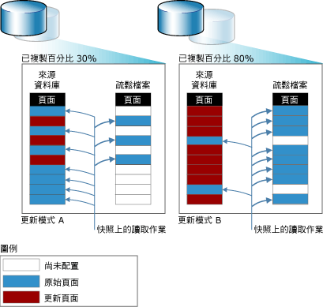

# 資料庫快照集 (SQL Server)

 [!INCLUDE [SQL Server](../../includes/applies-to-version/sqlserver.md)]

資料庫快照集是 [!INCLUDE[ssNoVersion](../../includes/ssnoversion-md.md)] 資料庫 (「來源資料庫」) 的唯讀、靜態檢視。 資料庫快照集會與快照集建立時的來源資料庫維持交易的一致性。 資料庫快照集一律會與其來源資料庫位於相同的伺服器執行個體上。 雖然資料庫快照集會以建立快照集時的相同狀態提供資料唯讀檢視，但快照集檔案大小會隨著來源資料庫變更而增加。 如需詳細資料，請參閱下面的[功能概觀](#FeatureOverview)一節。
  
 給定來源資料庫中可以存在多個快照集。 每個資料庫快照集會一直保存，直到資料庫擁有者明確卸除為止。  
  
> [!NOTE]  
>  資料庫快照集與快照集備份、交易的快照隔離或快照複寫無關。  
  
 **本主題內容：**  
  
-   [功能概觀](#FeatureOverview)  
  
-   [資料庫快照集的優點](#Benefits)  
  
-   [詞彙和定義](#TermsAndDefinitions)  
  
-   [資料庫快照集的必要條件和限制](#LimitationsRequirements)  
  
-   [相關工作](#RelatedTasks)  
  
##   功能概觀  
 資料庫快照集是在資料頁層級上操作的。 在第一次修改來源資料庫的頁面之前，系統就會將原始頁面從來源資料庫複製到快照集。 快照集會儲存原始頁面，保留快照集建立時已存在的資料記錄。 第一次進行修改的每一頁，都會重複相同的處理序。 對於使用者而言，資料庫快照集似乎不會改變，因為資料庫快照集上的讀取作業一定是存取原始資料頁 (不管原始資料頁位於何處)。  
  
 快照集在儲存所複製的原始頁面時，會使用一個或多個 *「疏鬆檔案」* (Sparse file)。 一開始，疏鬆檔案其實是一個空白檔案，沒有包含使用者資料，也尚未配置磁碟空間來存放使用者資料。 隨著來源資料庫中有越來越多頁面更新，檔案大小也跟著成長。 下圖說明兩個相反的更新模式，對於快照集大小的影響。 更新模式 A 所反映的環境，在快照集的生命期限內，只有 30% 的原始頁面有更新。 更新模式 B 所反映的環境，在快照集的生命期限內，有 80% 的原始頁面有更新。  
  
   
  
##   資料庫快照集的優點  
  
-   快照集可以用於報表用途。  
  
     用戶端可查詢資料庫快照集，方便根據快照集建立時的資料來撰寫報表。  
  
-   維護報表產生的歷程記錄資料。  
  
     快照集可對特定時間點的資料提供使用者存取。 例如，您可以在指定期間 (如財務季度) 結束時，建立資料庫快照集以供之後的報表使用。 接著，您可以在快照集執行期末報表。 如果磁碟空間容許的話，還可以永遠維持期末快照集，針對這些期間查詢結果；例如，調查組織效能。  
  
-   使用為了可用性用途而維護的鏡像資料庫，以卸載報表。  
  
     將資料庫快照集與資料庫鏡像一起使用，可讓您存取鏡像伺服器上的資料以供報表使用。 此外，在鏡像資料庫上執行查詢，可以釋放主體伺服器上的資源。 如需詳細資訊，請參閱 [資料庫鏡像和資料庫快照集 &#40;SQL Server&#41;](../../database-engine/database-mirroring/database-mirroring-and-database-snapshots-sql-server.md)(Sparse file)。  
  
-   保護資料以防發生管理疏失。  
  
-   在來源資料庫發生使用者錯誤的情況下，您可以將來源資料庫還原為建立給定資料庫快照集時所處的狀態。 您只會失去建立快照集之後的資料庫更新資料。  
  
     例如，在進行主要更新工作之前 (例如大量更新或結構描述變更)，在資料庫上建立資料庫快照集可保護資料。 如果發生錯誤，您可以將資料庫還原為快照集，利用快照集進行復原。 就此用途而言，還原可能遠比從備份還原快；不過，還原之後就不能再向前復原。  
  
    > [!IMPORTANT]  
    >  離線或損毀的資料庫不能還原。 因此，建立定期備份和測試還原計畫是保護資料庫的必要措施。  
  
    > [!NOTE]  
    >  資料庫快照集相依於來源資料庫。 因此，使用資料庫快照集還原資料庫，並非備份和還原策略的替代方案。 基本上還是請您執行所有排程備份。 如果您必須將來源資料庫還原到您建立資料庫快照集當時的時間點，請實作可讓您執行此作業的備份原則。  
  
-   保護資料以防使用者有所疏失。  
  
     定期建立資料庫快照集，可減輕因重大的使用者錯誤 (例如卸除的資料表) 所造成的影響。 如需更高階的保護，您可以建立一系列資料庫快照集，所涵蓋的時間長度足以辨識出大多數使用者造成的錯誤，並對之作出回應。 例如，視您的磁碟資源而定，您可能會在 24 小時的間隔內，維護 6 到 12 個回復快照集。 接著，每建立一個新的快照集，就會刪除最舊的快照集。  
  
    -   若要復原使用者造成的錯誤，您可以將資料庫還原為錯誤發生之前的快照集。 就此用途而言，還原可能遠比從備份還原快；不過，還原之後就不能再向前復原。  
  
    -   或者，可以利用快照集中的資訊，手動重新建構卸除的資料表，或其他遺失的資料。 例如，您可以將快照集中的資料大量複製到資料庫中，並手動將資料合併到資料庫內。  
  
    > [!NOTE]  
    >  使用資料庫快照集的理由，會決定資料庫上同時要有幾個快照集、建立新快照集的頻率，以及保留快照集的時間長度。  
  
-   管理測試資料庫  
  
     在測試環境中，在每一回測試開始時，對資料庫重複執行測試通訊協定以包含相同資料，是很有幫助的。 在執行第一回之前，應用程式開發人員或測試人員可以在測試資料庫上建立資料庫快照集。 在每一回測試執行之後，可還原資料庫快照集，使資料庫快速回到它先前的狀態。  
  
##   詞彙和定義  
 database snapshot  
 資料庫 (來源資料庫) 在交易上一致的唯讀、靜態檢視。  
  
 來源資料庫  
 若是資料庫快照集，則為快照集建立所在的資料庫。 資料庫快照集相依於來源資料庫。 資料庫的快照集必須與資料庫位於相同的伺服器執行個體上。 而且，如果該資料庫因某種原因而變成無法使用，則其所有資料庫快照集也會變成無法使用。  
  
 疏鬆檔案  
 NTFS 檔案系統提供的檔案，比其他方式需要更少磁碟空間。 疏鬆檔案可用來儲存複製到資料庫快照集的頁面。 初次建立時，疏鬆檔案所佔的磁碟空間很小。 當資料寫入資料庫快照集時，NTFS 也會逐漸將磁碟空間配置到對應的疏鬆檔案。  
  
##   資料庫快照集的必要條件和限制  
 **本節內容：**  
  
-   [先決條件](#Prerequisites)  
  
-   [對來源資料庫的限制](#LimitsOnSourceDb)  
  
-   [資料庫快照集的限制](#LimitsOnDbSS)  
  
-   [磁碟空間需求](#DiskSpace)  
  
-   [含離線檔案群組的資料庫快照集](#OfflineFGs)  
  
###   必要條件  
 可使用任何復原模式的來源資料庫必須符合下列必要條件：  
  
-   伺服器執行個體必須在支援資料庫快照集的 [!INCLUDE[ssNoVersion](../../includes/ssnoversion-md.md)] 版本上執行。 如需詳細資訊，請參閱 [SQL Server 2016 版本支援的功能](~/sql-server/editions-and-supported-features-for-sql-server-2016.md)。  
  
-   除非來源資料庫是資料庫鏡像工作階段中的鏡像資料庫，否則該資料庫必須處於線上狀態。  
  
-   您可以在可用性群組的任何主要或次要資料庫上建立資料庫快照集。 複本角色必須是不在 RESOLVING 狀態的 PRIMARY 或 SECONDARY。  
  
     當您建立資料庫快照集時，建議資料庫同步處理狀態為 SYNCHRONIZING 或 SYNCHRONIZED。 但是，當資料庫同步處理狀態為 NOT SYNCHRONIZING 時，可以建立資料庫快照集。  
  
     如需詳細資訊，請參閱 [資料庫快照集與 AlwaysOn 可用性群組 (SQL Server)](../../database-engine/availability-groups/windows/database-snapshots-with-always-on-availability-groups-sql-server.md)。  
  
-   若要在鏡像資料庫上建立資料庫快照集，資料庫必須處於「已同步處理」的鏡像狀態。  
  
-   來源資料庫無法設定為可擴充的共用資料庫。  

-   來源資料庫不能包含 MEMORY_OPTIMIZED_DATA 檔案群組。  如需詳細資訊，請參閱 [記憶體內部 OLTP 不支援的 SQL Server 功能](../../relational-databases/in-memory-oltp/unsupported-sql-server-features-for-in-memory-oltp.md)。
  
> [!NOTE]  
>  所有復原模式都支援資料庫快照集。  
  
###   對來源資料庫的限制  
 只要資料庫快照集存在，快照集的來源資料庫就會有下列限制：  
  
-   資料庫無法卸除、卸離或還原。  
  
    > [!NOTE]  
    >  來源資料庫的備份可照常運作，不受資料庫快照集的影響。  
  
-   效能會降低，這是因為每次更新頁面時，都會對快照集執行寫入時複製作業，因而導致來源資料庫上的 I/O 增加。  
  
-   無法從來源資料庫或任何快照集卸除檔案。  
  
###   資料庫快照集的限制  
 下列限制適用於資料庫快照集：  
  
-   建立及保留資料庫快照集的伺服器執行個體必須與來源資料庫相同。  
  
-   資料庫快照集永遠會處理完整的資料庫。  
  
-   資料庫快照集相依於來源資料庫，且不是備援儲存體。 資料庫快照集無法防止磁碟錯誤或其他類型的損毀。 因此，使用資料庫快照集還原資料庫，並非備份和還原策略的替代方案。 基本上還是請您執行所有排程備份。 如果您必須將來源資料庫還原到您建立資料庫快照集當時的時間點，請實作可讓您執行此作業的備份原則。  
  
-   當來源資料庫上更新過的頁面發送到快照集時，如果快照集正好用光了磁碟空間，或遇到一些其他錯誤，快照集會變成有疑問，因此必須刪除。  
  
-   快照集是唯讀的。 因為它們是唯讀的，所以無法升級。 因此，預期資料庫快照集在升級之後是無法使用的。  
  
-   您無法為 **model**、 **master**與 **tempdb** 資料庫製作快照。  
  
-   您無法變更資料庫快照集檔案的任何規格。  
  
-   您無法從資料庫快照集卸除檔案。  
  
-   您無法備份或還原資料庫快照集。  
  
-   您無法附加或卸離資料庫快照集。  
  
-   您無法在 FAT32 檔案系統或 RAW 磁碟分割上建立資料庫快照集。 資料庫快照集所使用的疏鬆檔案都由 NTFS 檔案系統提供。  
  
-   資料庫快照集不支援全文檢索索引。 全文檢索目錄不會從來源資料庫傳播。  
  
-   資料庫快照集在建立快照集時，會繼承其來源資料庫的安全性限制。 因為快照集是唯讀的，所以無法變更所繼承的權限，而且對來源進行的權限變更都無法反映在現有的快照集中。  
  
-   快照集永遠反映出快照集建立時的檔案群組狀態：線上檔案群組保持線上狀態、離線檔案群組保持離線狀態。 如需詳細資訊，請參閱本主題稍後的「含離線檔案群組的資料庫快照集」。  
  
-   如果來源資料庫變成 RECOVERY_PENDING，其資料庫快照集可能會無法存取。 不過，在解決來源資料庫的問題之後，其快照集應該就可以使用了。  
  
-   資料庫中任何 NTFS 唯讀檔或 NTFS 壓縮檔都不支援還原。  嘗試還原包含這兩種檔案群組類型的資料庫都會失敗。  
  
-   在記錄傳送組態中，只能在主要資料庫上建立資料庫快照集，不能在次要資料庫上建立。 如果在主要伺服器執行個體和次要伺服器執行個體之間切換角色，您必須先卸除所有的資料庫快照集，然後才能將主要資料庫設定為次要資料庫。  
  
-   資料庫快照集無法設定為可擴充的共用資料庫。  
  
-   資料庫快照集不支援 FILESTREAM 檔案群組。 如果 FILESTREAM 檔案群組存在來源資料庫中，它們就會在其資料庫快照集中標示為離線，而且這些資料庫快照集無法用於還原資料庫。  
  
    > [!NOTE]  
    >  針對資料庫快照集執行的 SELECT 陳述式不得指定 FILESTREAM 資料行，否則將會傳回下列錯誤訊息： `Could not continue scan with NOLOCK due to data movement.`  
  
-   如果唯讀快照集上的統計資料遺漏或過時， [!INCLUDE[ssDE](../../includes/ssde-md.md)] 會在 tempdb 中建立及維護暫時性統計資料。 如需詳細資訊，請參閱[統計資料](../../relational-databases/statistics/statistics.md)。  
  
###   磁碟空間需求  
 資料庫快照集會耗用磁碟空間。 如果資料庫快照集用光磁碟空間，它會標示為有疑問，因此必須卸除 (不過，來源資料庫不受影響，其上的動作會繼續正常執行)。但是，與資料庫的完整副本相比，快照集的空間利用率仍算是很有效率了。 快照集所需儲存空間，只要足夠儲存那些在存留時間內會有變更的頁面即可。 通常，快照集只會保存一段有限的時間，所以其大小不會是大問題。  
  
 不過，您保存快照集的時間越長，就越有可能用光可用空間。 疏鬆檔案的成長大小上限，就是建立快照集時對應來源資料庫檔案的大小。 若資料庫快照集用盡磁碟空間，則必須刪除 (卸除) 快照集。  
  
> [!NOTE]  
>  除了檔案空間以外，資料庫快照集耗用的資源數量大致上與資料庫相同。  
  
###   含離線檔案群組的資料庫快照集  
 當您嘗試執行下列任一動作時，來源資料庫中的離線檔案群組會影響到資料庫快照集：  
  
-   建立快照集  
  
     來源資料庫具有一個或多個離線檔案群組時，快照集會在這些檔案群組離線的狀態下順利建立。 但是，系統並不會為離線檔案群組建立疏鬆檔案。  
  
-   使檔案群組離線  
  
     您可以使來源資料庫中的檔案離線。 不過，如果建立快照集時，檔案群組是在線上，則在資料庫快照集中該檔案群組仍保持在線上。 如果建立快照集後查詢的資料已變更，其原始資料頁仍可從快照集中存取。 不過，若想使用查詢從快照集存取檔案群組中的未修改資料，可能會失敗並發生輸入/輸出 (I/O) 錯誤。  
  
-   使檔案群組上線  
  
     您不能使擁有任何資料庫快照集之資料庫中的檔案群組上線。 如果檔案群組在建立快照集時為離線狀態，或在有資料庫快照集存在時使檔案群組離線，檔案群組將保持離線狀態。 這是因為將檔案恢復上線涉及還原檔案，而如果資料庫上有資料庫快照集存在，就不能還原檔案。  
  
-   將來源資料庫還原到快照集  
  
     若要將來源資料庫還原到資料庫快照集，所有檔案群組都必須在線上，但建立快照集時已離線的檔案群組除外。  
  
##   相關工作  
  
-   [建立資料庫快照集 &#40;Transact-SQL&#41;](../../relational-databases/databases/create-a-database-snapshot-transact-sql.md)  
  
-   [檢視資料庫快照集 &#40;SQL Server&#41;](../../relational-databases/databases/view-a-database-snapshot-sql-server.md)  
  
-   [檢視資料庫快照集的疏鬆檔案大小 &#40;Transact-SQL&#41;](../../relational-databases/databases/view-the-size-of-the-sparse-file-of-a-database-snapshot-transact-sql.md)  
  
-   [將資料庫還原成資料庫快照集](../../relational-databases/databases/revert-a-database-to-a-database-snapshot.md)  
  
-   [卸除資料庫快照集 &#40;Transact-SQL&#41;](../../relational-databases/databases/drop-a-database-snapshot-transact-sql.md)  
  
## 另請參閱  
 [資料庫鏡像和資料庫快照集 &#40;SQL Server&#41;](../../database-engine/database-mirroring/database-mirroring-and-database-snapshots-sql-server.md)  
  
  

