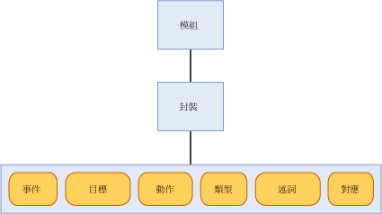

# <a name="sql-server-extended-events-packages"></a>SQL Server 擴充事件封裝
[!INCLUDE[appliesto-ss-asdb-xxxx-xxx-md](../../includes/appliesto-ss-asdb-xxxx-xxx-md.md)]

  封裝是 [!INCLUDE[ssNoVersion](../../includes/ssnoversion-md.md)] 擴充事件物件的容器。 有三種擴充事件封裝，包括以下項目：  
  
-   package0 - 擴充事件系統物件。 這是預設封裝。  
  
-   sqlserver - [!INCLUDE[ssNoVersion](../../includes/ssnoversion-md.md)] 相關的物件。  
  
-   sqlos - [!INCLUDE[ssNoVersion](../../includes/ssnoversion-md.md)] 作業系統 (SQLOS) 相關的物件。  
  
> [!NOTE]  
>  [!INCLUDE[ssNoVersion](../../includes/ssnoversion-md.md)] Audit 會使用 SecAudit 封裝。 您無法透過擴充事件資料定義語言 (DDL) 使用此封裝中的任何物件。  
  
 封裝是以名稱、GUID 及包含此封裝的二進位模組所識別。 如需詳細資訊，請參閱 [sys.dm_xe_packages &#40;Transact-SQL&#41;](../../relational-databases/system-dynamic-management-views/sys-dm-xe-packages-transact-sql.md)。  
  
 封裝可以包含下列的任何或所有物件，本主題稍後將會更詳細地討論：  
  
-   事件  
  
-   目標  
  
-   動作  
  
-   類型  
  
-   述詞  
  
-   地圖  
  
 不同封裝中的物件可以混合在事件工作階段中。 如需詳細資訊，請參閱 [SQL Server 擴充的事件工作階段](../../relational-databases/extended-events/sql-server-extended-events-sessions.md)。  
  
## <a name="package-contents"></a>封裝內容  
 下圖顯示封裝中可以存在的物件 (包含在模組內)。 模組可以是可執行檔或動態連結程式庫。  
  
   
  
### <a name="events"></a>事件  
 事件是程式 (例如 [!INCLUDE[ssNoVersion](../../includes/ssnoversion-md.md)]) 之執行路徑中所要的監視點。 事件引發會夾帶到達所要之點的事實以及事件開始引發之後的狀態資訊。  
  
 事件只能用來追蹤或是觸發動作， 這些動作可以是同步或非同步。  
  
> [!NOTE]  
>  事件不會知道為了回應事件引發所可能觸發的動作。  
  
 當封裝向擴充的事件註冊之後，就無法變更此封裝內的一組事件。  
  
 所有事件都有定義其內容的版本控制結構描述， 這個結構描述是由具有定義完善之類型的事件資料行所組成。 特定類型的事件一定要依照此結構描述內指定的相同順序來提供其資料。 但是，事件目標不需要使用提供的所有資料。  
  
#### <a name="event-categorization"></a>事件分類  
 擴充的事件會使用類似於 Windows 事件追蹤 (ETW) 的事件分類模型。 會有兩個事件屬性用於分類，也就是通道和關鍵字。 使用這些屬性可支援將擴充的事件與 ETW 及其工具整合。  
  
 **通路**  
  
 通道會識別事件的使用者。 下表將描述這些通道。  
  
|詞彙|定義|  
|----------|----------------|  
|管理|管理事件所針對的主要目標是使用者、管理員和支援人員。 在管理通道中找到的事件會指出問題，並列出定義完善的方案，供管理員做為採取動作之依據。 管理事件的一個範例就是應用程式無法連接到印表機。 這些事件不是會完善記載下來，就是有與其相關的訊息來告訴讀者該做什麼事情來修正問題。|  
|作業|作業事件是用來分析及診斷問題或出現次數， 這些事件可用來觸發以問題或出現次數為根據的工具或工作。 在系統中新增或移除印表機時即為作業事件的一個範例。|  
|分析|分析事件的發行量很大， 這些事件會描述程式作業，而且通常用於效能調查。|  
|偵錯|偵錯事件只能由開發人員使用，以便診斷問題進行偵錯。<br /><br /> 偵錯通道中的事件會傳回內部實作特定狀態資料。 事件所傳回的結構描述和資料在 SQL Server 的未來版本中可能會改變或變得無效。 因此，偵錯通道中的事件在 SQL Server 的未來版本中可能會改變或被移除，恕不另行通知。|  
  
 **關鍵字**  
  
 關鍵字是應用程式所特有，可實現更精細的相關事件群組，如此可讓您更輕鬆地指定及擷取您想用於工作階段的事件。 您可以使用下列查詢來取得關鍵字資訊。  
  
```  
select map_value Keyword from sys.dm_xe_map_values  
where name = 'keyword_map'  
```  
  
> [!NOTE]  
>  關鍵字會緊密地對應到 SQL 追蹤事件的目前群組。  
  
### <a name="targets"></a>目標  
 目標是事件取用者。 目標會處理事件 (在引發事件的執行緒上同步處理，或是在系統提供的執行緒上非同步處理)。 擴充的事件會提供幾個目標，您可適當地使用這些目標來導向事件輸出。 如需詳細資訊，請參閱＜ [SQL Server Extended Events Targets](http://msdn.microsoft.com/library/e281684c-40d1-4cf9-a0d4-7ea1ecffa384)＞。  
  
### <a name="actions"></a>動作  
 動作是針對事件的程式設計形式的回應或回應序列。 動作會繫結至事件，而每一個事件都可以有一組獨特的動作。  
  
> [!NOTE]  
>  用於特定一組事件的動作無法繫結至未知的事件。  
  
 繫結至事件的動作會在引發此事件的執行緒上同步叫用。 動作的類型有許多種，而且功能也非常多樣。 動作可以：  
  
-   擷取堆疊傾印，並檢查資料。  
  
-   將狀態資訊儲存在使用變動存放區的本機環境中。  
  
-   彙總事件資料。  
  
-   將資料附加至事件資料。  
  
 某些典型且著名的動作範例如下：  
  
-   堆疊傾印工具  
  
-   執行計畫偵測 (僅限[!INCLUDE[ssNoVersion](../../includes/ssnoversion-md.md)] )  
  
-   [!INCLUDE[tsql](../../includes/tsql-md.md)] 堆疊集合 (僅限[!INCLUDE[ssNoVersion](../../includes/ssnoversion-md.md)] )  
  
-   執行階段統計資料計算  
  
-   在例外狀況發生時蒐集使用者輸入  
  
### <a name="predicates"></a>述詞  
 述詞是一組邏輯規則，這些規則會在處理事件時加以評估。 如此可讓擴充的事件使用者選擇性地擷取以特定準則為根據的事件資料。  
  
 述詞可以在本機環境中儲存資料，本機環境可用來建立述詞，該述詞會在每隔 *n* 分鐘或是每當事件引發 *n* 次時傳回 True 一次。 這個本機環境存放區也可用來動態地更新此述詞，藉以在事件包含類似資料時抑制未來的事件引發。  
  
 述詞能夠擷取環境資訊，例如執行緒識別碼及事件特有的資料。 述詞會評估為完整布林運算式，並在發現整個運算式為 false 的第一個點支援最少運算 (Short Circuit)。  
  
> [!NOTE]  
>  如果稍早的述詞檢查失敗，可能就無法評估有副作用的述詞。  
  
### <a name="types"></a>類型  
 由於資料是串連在一起的位元組集合，所以需要此位元組集合的長度和特性，以便能夠解譯資料。 這項資訊會封裝在類型物件中。 下列是針對封裝物件所提供的類型：  
  
-   event  
  
-   action  
  
-   目標  
  
-   pred_source  
  
-   pred_compare  
  
-   型別  
  
 如需詳細資訊，請參閱 [sys.dm_xe_objects &#40;Transact-SQL&#41;](../../relational-databases/system-dynamic-management-views/sys-dm-xe-objects-transact-sql.md)。  
  
### <a name="maps"></a>地圖  
 對應表會將內部值對應到字串，如此可讓使用者得知該值所表示的意義。 使用者不只能夠取得數值，也可以取得有意義的內部值描述。 下列查詢將示範如何取得對應值。  
  
```  
select map_key, map_value from sys.dm_xe_map_values  
where name = 'lock_mode'  
```  
  
 上述的查詢會產生下列輸出。  
  
 `map_key     map_value`  
  
 `---------------------`  
  
 `0           NL`  
  
 `1           SCH_S`  
  
 `2           SCH_M`  
  
 `3           S`  
  
 `4           U`  
  
 `5           X`  
  
 `6           IS`  
  
 `7           IU`  
  
 `8           IX`  
  
 `9           SIU`  
  
 `10          SIX`  
  
 `11          UIX`  
  
 `12          BU`  
  
 `13          RS_S`  
  
 `14          RS_U`  
  
 `15          RI_NL`  
  
 `16          RI_S`  
  
 `17          RI_U`  
  
 `18          RI_X`  
  
 `19          RX_S`  
  
 `20          RX_U`  
  
 `21          RX_X`  
  
 `21          RX_X`  
  
 使用這個表格當做範例，假設您有一個名為 mode 的資料行，而且它的值為 5。 此表格指出 5 對應到 X，這表示鎖定類型為獨佔。  
  
## <a name="see-also"></a>另請參閱  
 [SQL Server 擴充的事件工作階段](../../relational-databases/extended-events/sql-server-extended-events-sessions.md)   
 [SQL Server 擴充的事件引擎](../../relational-databases/extended-events/sql-server-extended-events-engine.md)   
 [SQL Server Extended Events Targets](http://msdn.microsoft.com/library/e281684c-40d1-4cf9-a0d4-7ea1ecffa384)  
  
  
