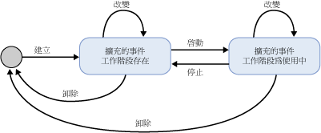
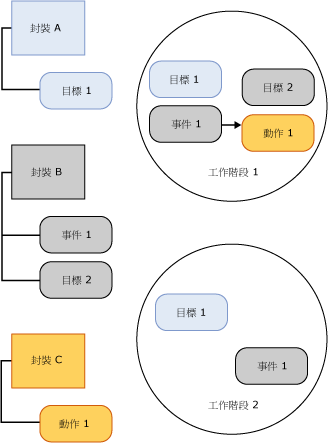

# SQL Server 擴充的事件工作階段
[!INCLUDE[appliesto-ss-asdb-xxxx-xxx-md](../../includes/appliesto-ss-asdb-xxxx-xxx-md.md)]

  [!INCLUDE[ssNoVersion](../../includes/ssnoversion-md.md)] 擴充的事件工作階段會建立在主控擴充之事件引擎的 [!INCLUDE[ssNoVersion](../../includes/ssnoversion-md.md)] 處理序中。 下列是擴充的事件工作階段的各個層面，可讓您了解擴充的事件基礎結構的來龍去脈以及進行的一般處理：  
  
-   工作階段狀態。 當執行 CREATE EVENT SESSION 和 ALTER EVENT SESSION 陳述式時，擴充的事件工作階段所處於的不同狀態。  
  
-   工作階段內容和特性。 擴充事件工作階段的內容，例如目標和事件，以及這些物件如何在工作階段內或是工作階段之間相互產生關聯。  
  
## 工作階段狀態  
 下圖顯示擴充事件工作階段的各個狀態。  
  
   
  
 在上圖中，請注意在針對事件工作階段發出不同的 DDL 命令時，該工作階段狀態就會變更。 下表說明這些狀態變更所代表的意義。  
  
|圖例標籤|DDL 陳述式|描述|  
|------------------------|-------------------|-----------------|  
|建立|CREATE EVENT SESSION|主機處理序會建立工作階段物件，此物件包含由 CREATE EVENT SESSION 所提供的中繼資料。 主機處理序會驗證工作階段定義、驗證使用者權限等級，並將中繼資料儲存在 master 資料庫內。 此時，工作階段不在使用中。|  
|Alter|ALTER EVENT SESSION, STATE=START|主機處理序會啟動工作階段。 主機處理序會讀取儲存的中繼資料、驗證工作階段定義、驗證使用者權限等級，並建立工作階段。 會載入工作階段物件 (如事件和目標)，且事件處理為使用中。|  
|Alter|ALTER EVENT SESSION, STATE=STOP|主機處理序會停止使用中工作階段，並保留中繼資料。|  
|Drop|DROP EVENT SESSION|根據工作階段是否在使用中，Drop (DROP SESSION) 將會刪除中繼資料並關閉使用中工作階段，或是刪除工作階段中繼資料。|  
  
> [!NOTE]  
>  ALTER EVENT SESSION 和 DROP EVENT SESSION 都可以套用到中繼資料或是使用中工作階段和中繼資料。  
  
## 工作階段內容和特性  
 擴充的事件工作階段具有隱含的界限，在此界限下，某個工作階段的組態不會變更另一個工作階段的組態。 但是，這些界限並不會防止事件或目標在一個以上的工作階段內使用。  
  
 下圖顯示工作階段內容以及封裝與工作階段之間的關聯性。  
  
   
  
 在上圖中，請注意：  
  
-   封裝物件與工作階段之間的對應是多對多對應，這表示物件可以出現在數個工作階段中，而且工作階段可以包含數個物件。  
  
-   相同的事件 (事件 1) 或目標 (目標 1) 可以在一個以上的工作階段內啟用。  
  
 工作階段具有下列特性：  
  
-   根據各個工作階段將動作和述詞繫結至事件。 如果您在工作階段 A 內有事件 1，其中包含動作 1 和述詞 Z，這樣完全不會影響在工作階段 B 內具有事件 1，且包含動作 2 和動作 3 而沒有述詞。  
  
-   原則會附加至工作階段，以處理緩衝和分派及因果追蹤。  
  
 **緩衝和分派**  
  
 緩衝指的是當事件工作階段正在執行時，要如何儲存事件資料。  緩衝原則會指定用於事件資料的記憶體數量及事件的遺失原則。 分派指的是事件在傳送至目標進行處理之前停留在緩衝區內的時間。  
  
 **因果追蹤**  
  
 因果追蹤讓您能夠追蹤多個工作之間的工作。 當啟用因果追蹤時，每一個引發的事件在系統中都有唯一的活動識別碼。 此活動識別碼是 GUID 值 (這個值在工作的所有事件中都維持不變) 及序號 (每次引發事件時都會隨之遞增) 的組合。 當某個工作造成要在另一個工作內執行作業時，父工作的活動識別碼就會傳送給子工作。 子工作會在第一次引發事件時輸出父工作的活動識別碼。  
  
 擴充的事件基礎結構會提供一個彈性的系統，可讓各種物件一起使用來解決特定的問題。  
  
## 另請參閱  
 [擴充事件](../../relational-databases/extended-events/extended-events.md)  
  
  
