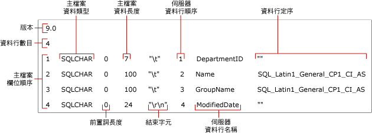

# <a name="non-xml-format-files-sql-server"></a>非 XML 格式檔案 (SQL Server)
  在 [!INCLUDE[ssCurrent](../../includes/sscurrent-md.md)]中，有兩種格式檔案支援大量匯出和匯入： *「非 XML 格式檔案」* (Non-XML Format File) 和 *「XML 格式檔案」*(XML Format File)。  
  
 **本主題內容：**  
  
-   [優點](#Benefits)  
  
-   [非 XML 格式檔案的結構](#Structure)  
  
-   [非 XML 格式檔案範例](#Examples)  
  
-   [相關工作](#RelatedTasks)  
  
##  <a name="Benefits"></a> 非 XML 格式檔案的優點  
  
-   您可以在 **format** 命令中指定 **bcp** 選項，以自動建立非 XML 格式檔案。  
  
-   在 **bcp** 命令中指定現有的格式檔案時，命令會使用記錄在格式檔案中的值，而且不提示您輸入檔案儲存類型、前置長度、欄位長度或欄位結束字元。  
  
-   您可以為特定資料類型 (如字元資料或原生資料) 建立格式檔案。  
  
-   您可以建立非 XML 格式檔案，其中包含以互動方式，針對每個資料欄位所指定的屬性。 如需詳細資訊，請參閱[使用 bcp 時指定相容性的資料格式 &#40;SQL Server&#41;](../../relational-databases/import-export/specify-data-formats-for-compatibility-when-using-bcp-sql-server.md)。  
  
> [!NOTE]  
>  XML 格式檔案提供了許多優於非 XML 格式檔案的優點。 如需詳細資訊，請參閱 [XML 格式檔案 &#40;SQL Server&#41;](../../relational-databases/import-export/xml-format-files-sql-server.md)。  
  
##  <a name="Structure"></a> 非 XML 格式檔案的結構  
 非 XML 格式檔案是具有特定結構的文字檔。 非 XML 格式檔案包含每個資料表資料行的檔案儲存類型、前置長度、欄位長度和欄位結束字元等相關資訊。  
  
 下圖說明非 XML 格式範例檔案的格式檔案欄位。  
  
 
  
 **Version** 和 **Number of columns** 欄位只出現一次。 下表描述其意義。  
  
|格式檔案欄位|說明|  
|------------------------|-----------------|  
|Version|**bcp** 公用程式的版本號碼：<br /><br /> 9.0 = [!INCLUDE[ssVersion2005](../../includes/ssversion2005-md.md)]<br /><br /> 10.0 = [!INCLUDE[ssKatmai](../../includes/sskatmai-md.md)]<br /><br /> 11.0 = [!INCLUDE[ssSQL11](../../includes/sssql11-md.md)]<br /><br /> 12.0 = [!INCLUDE[ssSQL14](../../includes/sssql14-md.md)]<br /><br /> 只能由 **bcp**辨識版本號碼，而不是由 [!INCLUDE[tsql](../../includes/tsql-md.md)]辨識。<br /><br /> <br /><br /> 注意：用於讀取格式檔案的 **bcp** 公用程式 (Bcp.exe) 版本必須與用於建立格式檔案的版本相同，或比它更新。 例如， [!INCLUDE[ssSQL11](../../includes/sssql11-md.md)]**bcp** 可以讀取由 [!INCLUDE[ssKatmai](../../includes/sskatmai-md.md)]**bcp**產生的 10.0 版格式檔案，但是 [!INCLUDE[ssKatmai](../../includes/sskatmai-md.md)]**bcp** 無法讀取由 [!INCLUDE[ssSQL14](../../includes/sssql14-md.md)]**bcp**產生的 12.0 版格式檔案。|  
|Number of columns|資料檔案的欄位數。 在所有資料列中此數目必須相同。|  
  
 其他格式檔案欄位描述要大量匯入或匯出的資料欄位。 每個資料欄位在格式檔案中，必須有個別的資料列來代表。 每個格式檔案資料列都包含下表所述之格式檔案欄位的值。  
  
|格式檔案欄位|說明|  
|------------------------|-----------------|  
|**主檔案欄位順序**|指出資料檔中每個欄位之位置的號碼。 資料列中的第一個欄位為 1，其餘依此類推。|  
|**主檔案資料類型**|指出存放在資料檔給定欄位中的資料類型。 對於 ASCII 資料檔，請使用 SQLCHAR；對於原生 (Native) 格式的資料檔，請使用預設的資料類型。 如需詳細資訊，請參閱 [使用 bcp 時指定檔案儲存類型 &#40;SQL Server&#41;](../../relational-databases/import-export/specify-file-storage-type-by-using-bcp-sql-server.md)。|  
|**前置長度**|該欄位的長度前置詞字元數。 有效的前置長度為 0、1、2、4 和 8。 若要避免指定長度前置詞，請將它設定為 0。 如果欄位包含 NULL 資料值，就必須指定長度前置詞。 如需詳細資訊，請參閱 [使用 bcp 時指定資料檔案的前置長度 &#40;SQL Server&#41;](../../relational-databases/import-export/specify-prefix-length-in-data-files-by-using-bcp-sql-server.md)。|  
|**主檔案資料長度**|儲存於資料檔特定欄位中的資料類型最大長度，以位元組為單位。<br /><br /> 如果您要為分隔的文字檔建立非 XML 格式檔案，可以將每個資料欄位的主檔案資料長度指定為 0。 當分隔文字檔的前置長度為 0 且已匯入結束字元，則會忽略欄位長度值，因為欄位使用的儲存空間即等於資料加上結束字元的長度。<br /><br /> 如需詳細資訊，請參閱 [使用 bcp 指定欄位長度 &#40;SQL Server&#41;](../../relational-databases/import-export/specify-field-length-by-using-bcp-sql-server.md)。|  
|**結束字元**|用來分隔資料檔中欄位的分隔符號。 一般的結束字元為逗點 (,)、定位點 (\t) 和行尾 (\r\n)。 如需詳細資訊，請參閱 [指定欄位與資料列結束字元 &#40;SQL Server&#41;](../../relational-databases/import-export/specify-field-and-row-terminators-sql-server.md)。|  
|**伺服器資料行順序**|資料行出現在 [!INCLUDE[ssNoVersion](../../includes/ssnoversion-md.md)] 資料表中的順序。 例如，如果資料檔的第四個欄位對應至 [!INCLUDE[ssNoVersion](../../includes/ssnoversion-md.md)] 資料表的第六個資料行，那麼第四個欄位的伺服器資料行順序為 6。<br /><br /> 若要防止資料表中的某個資料行接收資料檔中的任何資料，請將伺服器資料行順序值設為 0。|  
|**伺服器資料行名稱**|從 [!INCLUDE[ssNoVersion](../../includes/ssnoversion-md.md)] 資料表複製的資料行名稱。 欄位的實際名稱不是必要的，但是格式檔案中的欄位不能是空白。|  
|**資料行定序**|用來儲存資料檔的字元和 Unicode 資料的定序。|  
  
> [!NOTE]  
>  您可以修改格式檔案，讓您從欄位數目或順序與資料表資料行數目或順序不同的資料檔，進行大量匯入。 如需詳細資訊，請參閱本主題稍後的 [相關工作](#RelatedTasks) 清單。  
  
##  <a name="Examples"></a> 非 XML 格式檔案範例  
 下列範例顯示先前建立的非 XML 格式檔案 (`myDepartmentIdentical-f-c.fmt`)。 這個檔案針對 `HumanResources.Department` 範例資料庫的 `AdventureWorks2012` 資料表，描述其中每個資料行的字元資料欄位。  
  
 產生的格式檔案 `myDepartmentIdentical-f-c.fmt`包含下列資訊：  
  
```  
12.0  
4  
1       SQLCHAR       0       7       "\t"     1     DepartmentID     ""  
2       SQLCHAR       0       100     "\t"     2     Name             SQL_Latin1_General_CP1_CI_AS  
3       SQLCHAR       0       100     "\t"     3     GroupName        SQL_Latin1_General_CP1_CI_AS  
4       SQLCHAR       0       24      "\r\n"   4     ModifiedDate     ""  
```  
  
> [!NOTE]  
>  如需與這個非 XML 格式範例檔案有關的格式檔案欄位圖解，請參閱本主題稍早的 [非 XML 格式檔案結構](#Structure)。  
  
##  <a name="RelatedTasks"></a> 相關工作  
  
-   [建立格式檔案 &#40;SQL Server&#41;](../../relational-databases/import-export/create-a-format-file-sql-server.md)  
  
-   [使用格式檔案大量匯入資料 &#40;SQL Server&#41;](../../relational-databases/import-export/use-a-format-file-to-bulk-import-data-sql-server.md)  
  
-   [使用格式檔案略過資料表資料行 &#40;SQL Server&#41;](../../relational-databases/import-export/use-a-format-file-to-skip-a-table-column-sql-server.md)  
  
-   [使用格式檔案略過資料欄位 &#40;SQL Server&#41;](../../relational-databases/import-export/use-a-format-file-to-skip-a-data-field-sql-server.md)  
  
-   [使用格式檔案將資料表資料行對應至資料檔案欄位 &#40;SQL Server&#41;](../../relational-databases/import-export/use-a-format-file-to-map-table-columns-to-data-file-fields-sql-server.md)  
  
## <a name="see-also"></a>另請參閱  
 [bcp 公用程式](../../tools/bcp-utility.md)   
 [建立格式檔案 &#40;SQL Server&#41;](../../relational-databases/import-export/create-a-format-file-sql-server.md)   
 [XML 格式檔案 &#40;SQL Server&#41;](../../relational-databases/import-export/xml-format-files-sql-server.md)   
 [匯入或匯出資料的格式檔案 &#40;SQL Server&#41;](../../relational-databases/import-export/format-files-for-importing-or-exporting-data-sql-server.md)  
  
  
