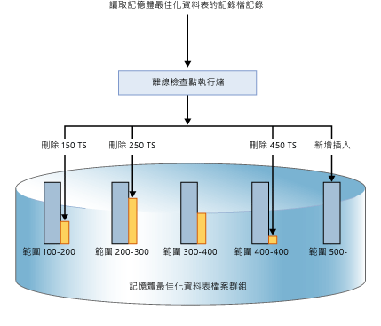
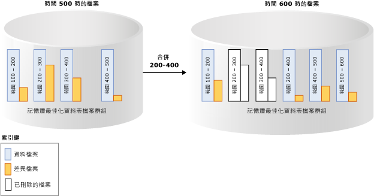

# 記憶體最佳化資料表的持久性
[!INCLUDE[tsql-appliesto-ss2014-xxxx-xxxx-xxx_md](../../includes/tsql-appliesto-ss2014-xxxx-xxxx-xxx-md.md)]

  [!INCLUDE[hek_2](../../includes/hek-2-md.md)] 為記憶體最佳化的資料表提供完整的持久性。 當變更記憶體最佳化資料表的交易認可時， [!INCLUDE[ssNoVersion](../../includes/ssnoversion-md.md)] (對磁碟基礎的資料表也一樣) 會保證這些變更是永久的 (即使資料庫重新啟動後也會存在)，前提是要提供基礎儲存。 持久性有兩個重要元件：交易記錄及磁碟儲存的保存資料變更。  
  
 如需任何持久性資料表大小限制的詳細資訊，請參閱 [估計記憶體最佳化資料表的記憶體需求](../../relational-databases/in-memory-oltp/estimate-memory-requirements-for-memory-optimized-tables.md)。 
  
## 交易記錄  
 磁碟基礎的資料表或持久記憶體最佳化資料表的所有變更，都可以在一個或多個交易記錄檔記錄上擷取。 當交易認可時， [!INCLUDE[ssNoVersion](../../includes/ssnoversion-md.md)] 會將與交易相關聯的記錄檔記錄寫入磁碟，然後才與交易已認可之應用程式或使用者工作階段進行通訊。 這樣可保證交易所做的變更是持久的。 記憶體最佳化資料表的交易記錄檔會與磁碟資料表所使用的相同記錄檔資料流完全整合在一起。 這項整合允許現有的交易記錄檔備份、復原及還原作業繼續運作，而不需要進行其他任何步驟。 不過，因為 [!INCLUDE[hek_2](../../includes/hek-2-md.md)] 會大幅增加工作負載的交易輸送量，所以記錄 IO 會成為效能瓶頸。 若要維持增加的輸送量，請確定記錄 IO 子系統可以處理增加的負載。  
  
## 資料和差異檔案  
 記憶體最佳化資料表中的資料會在記憶體內部堆積資料給構中儲存為自由格式的資料列，並透過一或多個記憶體內部索引連結。 資料列沒有任何頁面結構，例如用於磁碟基礎的資料表頁面結構。 為長期保存並允許截斷交易記錄檔，記憶體最佳化資料表的作業會保存在一組資料和差異檔案中。 這些檔案是使用非同步背景處理程序根據交易記錄產生。 資料和差異檔案位於一個或多個容器 (和 FILESTREAM 資料使用相同的機制)。 這些容器屬於記憶體最佳化檔案群組。  
  
 資料會遵循嚴格的順序寫入，使轉動式媒體的磁碟延遲減到最少。 您可以在不同的磁碟上使用多個容器以散發 I/O 活動。 從磁碟上的資料檔案和差異檔案將資料讀入記憶體時，不同磁碟上多個容器內的資料檔案和差異檔案將會提升資料庫還原/復原效能。  
  
 使用者交易不直接存取資料和差異檔案。 所有資料讀寫皆使用記憶體內部資料結構。  
  
### 資料檔案  
 資料檔案包含了由 INSERT 或 UPDATE 作業中的多筆交易所插入的一個或多個記憶體最佳化資料表而來的資料列。 例如，某個資料列可能來自記憶體最佳化資料表 T1，而下一個資料列可能來自記憶體最佳化資料表 T2。 資料列會以交易記錄中的交易順序附加到資料檔案，好讓資料存取循序進行。 相較於隨機 I/O，這樣的重要性順序會產生較佳的 I/O 輸送量。  
  
 一旦資料檔案已滿，新交易所插入的資料列將會儲存至另一個資料檔案。 經過一段時間後，從持久的記憶體最佳化資料表而來的資料列將由多個資料檔案各自儲存，每個資料檔案所包含的資料列來自互不相交但屬連續範圍的交易。 例如，交易認可時間戳記範圍為 (100, 200) 的資料檔案，包含交易 (具有大於 100 及小於或等於 200 的認可時間戳記) 所插入的所有資料列。 認可時間戳記是交易在準備認可時獲指派的一個單純遞增數字。 每筆交易都有其獨一無二的認可時間戳記。  
  
 當資料列遭到刪除或更新時，並不會就地移除或變更資料檔案中的該資料列，而是在另一類型的檔案中追蹤已刪除的資料列：差異檔案。 每個資料列的刪除和插入作業將統整為 Tuple，藉此處理更新作業。 這可使資料檔案排除隨機 IO。  
 
   大小：若為記憶體大於 16GB 的電腦，每個資料檔案的大小約為 128MB；若為記憶體小於或等於 16GB 的電腦，每個資料檔案的大小約為 16MB。 如果儲存子系統速度認定夠快，就可以在 [!INCLUDE[ssSQL15](../../includes/sssql15-md.md)] SQL Server 中使用大型的檢查點模式。 在大型的檢查點模式中，資料檔案的大小為 1GB。 這可讓高輸送量工作負載的儲存子系統有更高的效率。  
   
### 差異檔案  
 每一個資料檔案皆會與具有相同交易範圍，且將追蹤由該交易範圍內的交易所插入之已刪除資料列的差異檔案進行配對。 這種資料和差異檔案稱為檢查點檔案組 (CFP)，並為配置、取消配置與合併作業的單位。 例如，與交易範圍 (100, 200) 對應的差異檔案會儲存由範圍 (100, 200) 內的交易所插入的已刪除資料列。 就像資料檔案，對差異檔案的存取也是循序進行。  
  
 當資料列遭到刪除時，並不會從資料檔案移除該資料列，而是該資料列的參考將附加到與該資料列插入當時的交易範圍相關聯的差異檔案。 由於要刪除的資料列已存在於資料檔案中，差異檔案只會儲存參考資訊 `{inserting_tx_id, row_id, deleting_tx_id }` ，且將遵照原始刪除或更新作業的交易記錄順序。  
  

 大小：若為記憶體大於 16GB 的電腦，每個差異檔案的大小約為 16MB；若為記憶體小於或等於 16GB 的電腦，每個差異檔案的大小約為 1MB。 如果儲存子系統速度認定夠快，從 [!INCLUDE[ssSQL15](../../includes/sssql15-md.md)] SQL Server 開始就可以使用大型的檢查點模式。 在大型的檢查點模式中，差異檔案的大小為 128MB。  
 
## 擴展資料檔案和差異檔案  
 資料檔案和差異檔案會根據記憶體最佳化資料表認可交易所產生的交易記錄填寫，再將已插入及刪除的資料列相關資訊附加到適當的資料檔案和差異檔案。 不同於在檢查點完成時以隨機 I/O 方式排清資料/索引頁的磁碟資料表，記憶體最佳化資料表的保存是連續的背景作業。 如此將會存取多個差異檔案，因為交易可以刪除或更新任何先前交易所插入的任何資料列。 刪除資訊一律會附加到差異檔案的結尾。 例如，認可時間戳記為 600 的交易會插入一個新的資料列，並且刪除認可時間戳記為 150、250 和 450 的交易所插入的資料列，如下圖所示。 所有 4 個檔案 I/O 作業 (三個用於已刪除的資料列，一個用於新插入的資料列) 都是對應的差異檔案和資料檔案的附加專用作業。  
  
   
  
## 存取資料和差異檔案  
 在發生以下情況時，將會存取資料檔案和差異檔案組。  
  
 離線檢查點背景工作者  
 此執行緒會將記憶體最佳化的資料列的插入和刪除，附加到對應的資料檔案和差異檔案組。 [!INCLUDE[ssSQL14](../../includes/sssql14-md.md)] 有一個離線檢查點背景工作者，從 [!INCLUDE[ssSQL15](../../includes/sssql15-md.md)] 開始有多個離線檢查點背景工作者。  
  
 合併作業  
 此作業會合併一個或多個資料檔案和差異檔案組，並且建立新的資料檔案和差異檔案組。  
  
 當機復原期間  
 當 [!INCLUDE[ssNoVersion](../../includes/ssnoversion-md.md)] 重新啟動或資料庫回到線上時，記憶體最佳化的資料會使用資料檔案和差異檔案組來擴展。 從對應的資料檔案讀取資料列時，差異檔案會當做已刪除之資料列的篩選條件。 因為每個資料和差異檔案組是獨立的，所以這些檔案會平行載入，以減少將資料擴展到記憶體所花的時間。 資料載入記憶體之後，記憶體中 OLTP 引擎會套用檢查點檔案仍未涵蓋的使用中交易記錄，使記憶體最佳化資料完成。  
  
 還原作業期間  
 記憶體中 OLTP 檢查點檔案是從資料庫備份所建立，然後套用一個或多個交易記錄備份。 就像進行當機復原一樣，記憶體中 OLTP 引擎會將資料平行載入記憶體中，以減少對復原時間的衝擊。  
  
## 合併資料和差異檔案  
 記憶體最佳化資料表的資料是儲存於一個或多個資料檔案和差異檔案組 (又稱為檢查點檔案組或 CFP)。 資料檔案會儲存已插入的資料列，而差異檔案將參考已刪除的資料列。 在執行 OLTP 工作負載期間，隨著 DML 作業更新、插入和刪除資料列，會建立新的 CFP 以保存新資料列，並且將已刪除之資料列的參考附加至差異檔案。  
  
 經過一段時間的 DML 作業後，資料檔案和差異檔案數目的成長，會消耗更多的磁碟空間使用量並延長復原時間。  
  
 為了避免上列效率不佳的情況，較舊已關閉的資料檔案和差異檔案會依以下所述的合併原則進行合併，使儲存體陣列壓縮後的檔案數目減少，但仍代表相同的資料集。  
  
 合併作業將根據內部定義的合併原則，接受一個或多個相鄰且已關閉的檢查點檔案組 (CFP，成對的資料檔案和差異檔案，稱為合併來源) 當作輸入，並且產生單一 CFP 結果，稱為合併目標。 來源 CFP 的每個差異檔案中的項目用於篩選對應資料檔案中的資料列，以移除不再需要的資料列。 來源 CFP 中剩餘的資料列則會合併成單一目標 CFP。 在合併完成後，產生的合併目標 CFP 將取代來源 CFP (合併來源)。 合併來源 CFP 會歷經一個過渡階段後才從儲存體移除。  
  
 在底下的範例中，記憶體最佳化資料表檔案群組在時間戳記 500 有四個資料檔案和差異檔案組包含了得自先前交易的資料。 例如，第一個資料檔案中的資料列對應到時間戳記大於 100 且小於或等於 200 (或者以 (100, 200] 表示) 的交易。 在考量到資料列標記為已刪除的情況下，第二和第三個資料檔案會顯示為低於 50% 已滿。 合併作業會結合這兩個 CFP 並且建立新的 CFP，其包含了時間戳記大於 200 且小於或等於 400 的交易，也就是這兩個 CFP 合併的範圍。 如您所見，另有一個 CFP 的範圍為 (500, 600] 以及在交易範圍 (200, 400] 的非空白差異檔案，表示合併作業可與交易活動同時完成，包括刪除來源 CFP 中的更多資料列。  
  
   
  
 背景執行緒會使用合併原則評估所有已關閉的 CFP，然後起始一項或多項對合格 CFP 的合併要求。 這些合併要求將由離線檢查點執行緒來處理。 系統會定期評估合併原則，以及在檢查點關閉時進行評估。  
  
### [!INCLUDE[ssNoVersion](../../includes/ssnoversion-md.md)] 合併原則  
 [!INCLUDE[ssNoVersion](../../includes/ssnoversion-md.md)] 實作以下合併原則：  
  
-   在考量到已刪除的資料列之後，如果可以合併兩個或多個連續的 CFP，使其產生的資料列數能夠納入 1 個目標大小的 CFP，就會排程進行合併。 資料檔案和差異檔案的目標大小與原始大小相對應，如上所述。  
  
-   如果資料檔案超過兩倍的目標大小，而且一半以上的資料列已刪除，則單一 CFP 可以自行合併。 資料檔案可以超出目標大小，例如，單一交易或多個並行交易插入或更新大量資料，強制資料檔案超出其目標大小，因為交易無法跨越多個 CFP。  
  
 以下幾個範例顯示根據合併原則將會合併的 CFP：  
  
|相鄰的 CFP 來源檔案 (% 已滿)|合併選取|  
|-------------------------------------------|---------------------|  
|CFP0 (30%)、CFP1 (50%)、CFP2 (50%)、CFP3 (90%)|(CFP0、CFP1)   未選擇 CFP2 是因為此項目會使得產生的資料檔案超過理想大小的 100%。|  
|CFP0 (30%)、CFP1 (20%)、CFP2 (50%)、CFP3 (10%)|(CFP0、CFP1、CFP2)。 從左邊開始選擇檔案。   未選擇 CTP3 是因為此項目會使得產生的資料檔案超過理想大小的 100%。|  
|CFP0 (80%)、CFP1 (30%)、CFP2 (10%)、CFP3 (40%)|(CFP1、CFP2、CFP3)。 從左邊開始選擇檔案。   略過 CFP0 是因為此項目若與 CFP1 合併，產生的資料檔案將會超過理想大小的 100%。|  
  
 並非所有餘留可用空間的 CFP 都有資格進行合併。 例如，若兩個相鄰的 CFP 都是 60% 已滿，就沒有資格進行合併，而且這些 CFP 各自仍將有 40% 未使用的儲存空間。 最糟的情況是所有 CFP 皆為 50% 已滿，儲存空間利用率只達 50%。 已刪除的資料列可能由於 CFP 沒有資格進行合併而仍存在於儲存體中，但是記憶體中記憶體回收行程可能已從記憶體移除已刪除的資料列。 儲存體和記憶體的管理與記憶體回收無關。 使用中 CFP 所佔的儲存空間 (未必所有 CFP 一概更新) 最多可達記憶體中持久性資料表大小的 2 倍。  
  
### CFP 的生命週期  
 CPF 解除配置之前會歷經幾個過渡狀態。 轉換檔案的各個階段都要設定資料庫檢查點與備份記錄檔，最後清除不再需要的檔案。 如需這些階段的說明，請參閱 [sys.dm_db_xtp_checkpoint_files &#40;Transact-SQL&#41;](../../relational-databases/system-dynamic-management-views/sys-dm-db-xtp-checkpoint-files-transact-sql.md)。  
  
 您可以在記錄檔備份後面手動強制建立檢查點，以加速記憶體回收。 在實際狀況下，做為部分備份策略的自動檢查點和記錄備份，將能在這些階段中順利轉換 CFP，而不需要任何手動介入。 記憶體回收處理序造成的影響是，具有記憶體最佳化資料表的資料庫其儲存體大小可能高於在記憶體中的大小。 如未建立檢查點和記錄備份，檢查點檔案的磁碟使用量就會繼續成長。  
  
## 另請參閱  
 [建立及管理記憶體最佳化物件的儲存體](../../relational-databases/in-memory-oltp/creating-and-managing-storage-for-memory-optimized-objects.md)  
  
  
