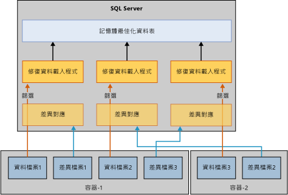

# 記憶體最佳化資料表的還原與復原
[!INCLUDE[tsql-appliesto-ss2016-xxxx-xxxx-xxx_md](../../includes/tsql-appliesto-ss2016-xxxx-xxxx-xxx-md.md)]

  復原或還原使用記憶體最佳化資料表之資料庫的基本機制，與僅使用磁碟資料表的資料庫類似。 但是與磁碟資料表不同之處在於，記憶體最佳化資料表必須載入記憶體中，資料庫才能供使用者存取。 這會在資料庫復原中加入一個新步驟。  
  
 在復原或還原作業期間，記憶體中 OLTP 引擎會讀取資料和差異檔案，以便將資料載入實體記憶體中。 載入時間是由以下條件所決定：  
  
-   要載入的資料數量。  
  
-   連續 I/O 頻寬。  
  
-   平行處理原則的程度，取決於檔案容器和處理器核心的數量。  
  
-   記錄檔記錄的數目，這些記錄位於需要重做之記錄檔的使用中部分。  
  
 當 [!INCLUDE[ssNoVersion](../../includes/ssnoversion-md.md)] 重新啟動時，每個資料庫都會經歷包括三個階段的復原階段：  
  
1.  分析階段。 在這個階段中，使用中交易記錄上會進行一個行程，用以偵測認可和未認可的交易。 記憶體中 OLTP 引擎會識別要載入的檢查點，並預先載入其系統資料表記錄項目。 另外還會處理一些檔案配置記錄檔記錄。  
  
2.  重做階段。 這個階段會在磁碟資料表和記憶體最佳化資料表上同時執行。  
  
     對於磁碟資料表，資料庫會移至目前的時間點，並取得未認可交易所採用的鎖定。  
  
     對於記憶體最佳化資料表，資料檔案和差異檔案組中的資料會載入記憶體中，然後根據上一個持久性檢查點更新使用中交易記錄的資料。  
  
     上述在磁碟和記憶體最佳化資料表上的作業完成時，資料庫就可供存取。  
  
3.  恢復階段。 在這個階段中，未認可的交易會回復。  
  
 將記憶體最佳化資料表載入記憶體中可能會影響復原時間目標 (RTO) 的效能。 為了改善從資料和差異檔案載入記憶體最佳化資料的時間，記憶體中 OLTP 引擎會平行載入資料/差異檔案，如下所示：  
  
-   建立差異對應篩選。 差異檔案會儲存已刪除資料列的參考。 每個容器會有一個執行緒讀取差異檔案，並建立差異對應篩選 (記憶體最佳化資料檔案群組可包含一個或多個容器)。  
  
-   將資料檔案做為資料流。  一旦建立差異對應篩選，就會使用與邏輯 CPU 數目相等的執行緒數目讀取資料檔案。 每個讀取資料檔案的執行緒都會讀取資料列、檢查相關聯的差異對應，並且只有在資料列未標示為已刪除時，才會將該資料列插入資料表。 在下述情況下，復原的這個部分可能繫於 CPU。  
  
   
  
 記憶體最佳化資料表通常能夠以 I/O 速度載入記憶體中，但是在某些情況下將資料列載入記憶體中的速度會變慢。 這些特定情況包括：  
  
-   雜湊索引的值區計數過低可能會導致過多衝突，造成插入資料列的速度變慢。 這種情況通常會導致整體 CPU 使用量變得非常高，尤其是接近復原結束時。 如果您已正確設定雜湊索引，它應該不會影響復原時間。  
  
-   具有一個或多個非叢集索引的大型記憶體最佳化資料表，它與值區計數大小已於建立時調整的雜湊索引不同，非叢集索引會動態成長，造成 CPU 使用量增加。  
  
## 另請參閱  
 [備份、還原及復原記憶體最佳化資料表](http://msdn.microsoft.com/library/3f083347-0fbb-4b19-a6fb-1818d545e281)  
  
  
