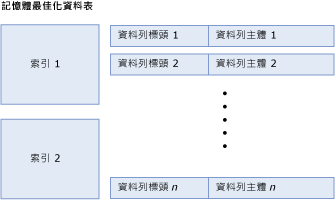
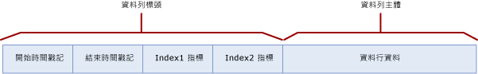
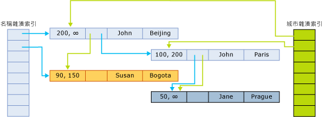

# <a name="table-and-row-size-in-memory-optimized-tables"></a>記憶體最佳化資料表中的資料表和資料列大小
[!INCLUDE[tsql-appliesto-ss2016-asdb-xxxx-xxx_md](../../includes/tsql-appliesto-ss2016-asdb-xxxx-xxx-md.md)]

  記憶體最佳化的表格由資料列與索引 (包含資料列的指標) 的集合組成。 在記憶體最佳化的資料表中，in-row 資料的長度不得超過 8,060 個位元組。 不過，啟動 [!INCLUDE[ssSQL15](../../includes/sssql15-md.md)] 時，可能會建立具有多個大型資料行 (例如，多個 varbinary(8000) 資料行) 和 LOB 資料行 (即 varbinary(max)、varchar(max) 和 nvarchar(max)) 的資料表。 超出 in-row 資料最大大小的資料行都會置於特殊內部資料表中的 off-row。 如需這些內部資料表的詳細資訊，請參閱 [sys.memory_optimized_tables_internal_attributes &#40;Transact-SQL&#41;](../../relational-databases/system-catalog-views/sys-memory-optimized-tables-internal-attributes-transact-sql.md)。
  
 計算資料表和資料列大小有兩個原因：  
  
-   資料表使用多少記憶體？  
  
    -   資料表所使用的記憶體數量無法精確計算。 許多因素都會影響使用的記憶體數量。 這些因素包括像是以頁面為基礎的記憶體配置、位置、快取和填補。 另外還包括擁有相關聯的作用中交易或等待記憶體回收的多個資料列版本。  
  
    -   資料表中的資料和索引所需的大小下限是由 [資料表大小] 的計算提供，討論如下。  
  
    -   計算記憶體用量是使用最佳近似值，而且建議您在部署計畫中納入容量規劃。  
  
-   資料列的資料大小，以及它是否符合 8,060 個位元組的資料列大小限制？ 若要回答這些問題，請使用 [資料列主體大小] 的計算，討論如下。  

無法放入 8060 位元組資料列大小限制的資料行都會置於個別內部資料表中的 off-row。 每個 off-row 資料行都會有對應的內部資料表，而內部資料表接著會有單一非叢集索引。 如需用於 off-row 資料行之內部資料表的詳細資訊，請參閱 [sys.memory_optimized_tables_internal_attributes &#40;Transact-SQL&#41;](../../relational-databases/system-catalog-views/sys-memory-optimized-tables-internal-attributes-transact-sql.md)。 
  
 下圖說明包含索引和資料列的資料表，這些索引和資料列各自擁有資料列標頭和主體：  
  
   
由索引和資料列組成之記憶體最佳化的資料表。  
  
 資料表的記憶體中大小 (以位元組為單位) 計算如下：  
  
```  
[table size] = [size of index 1] + … + [size of index n] + ([row size] * [row count])  
```  
  
 雜湊索引的大小在資料表建立時就已固定，並且取決於實際值區計數。 使用索引規格指定的 bucket_count 會無條件進位到最接近的二乘冪，以取得 [實際值區計數]。 例如，如果指定的 bucket_count 是 100000，則索引的 [實際值區計數] 為 131072。  
  
```  
[hash index size] = 8 * [actual bucket count]  
```  

 非叢集索引的大小順序是 `[row count] * [index key size]`。
  
 資料列大小的計算方式是加入標頭和主體：  
  
```  
[row size] = [row header size] + [actual row body size]  
[row header size] = 24 + 8 * [number of indices]  
```  
  
 **資料列主體大小**  
  
 下表中討論 [資料列主體大小] 的計算。  
  
 資料列主體大小有兩種不同的計算方式，也就是計算的大小和實際大小：  
  
-   計算的大小以 [計算的資料列主體大小] 表示，用於判斷是否超過 8,060 個位元組的資料列大小限制。  
  
-   實際大小以 [實際資料列主體大小] 表示，是資料列主體在記憶體中和檢查點檔案中的實際儲存體大小。  
  
 [計算的資料列主體大小] 和 [實際資料列主體大小] 兩者的計算方式十分類似。 唯一的差異在於 (n)varchar(i) 和 varbinary(i) 資料行大小的計算，如下列資料表底部所反映。 計算的資料列主體大小使用宣告的大小 *i* 作為資料行的大小，而實際的資料列主體大小使用實際的資料大小。  
  
 下表描述資料列主體大小的計算，指定為 [實際資料列主體大小] = SUM([淺層類型的大小]) + 2 + 2 * [深層類型資料行數目]。  
  
|章節|大小|註解|  
|-------------|----------|--------------|  
|淺層類型資料行|SUM([淺層類型的大小])。 個別類型的大小如下所示 (以位元組為單位)：<br /><br /> **Bit**：1<br /><br /> **Tinyint**：1<br /><br /> **Smallint**：2<br /><br /> **Int**：4<br /><br /> **Real**：4<br /><br /> **Smalldatetime**：4<br /><br /> **Smallmoney**：4<br /><br /> **Bigint**：8<br /><br /> **Datetime**：8<br /><br /> **Datetime2**：8<br /><br /> **Float**：8<br /><br /> **Money**：8<br /><br /> **Numeric** (precision <=18)：8<br /><br /> **Time**：8<br /><br /> **Numeric**(precision>18)：16<br /><br /> **Uniqueidentifier**：16||  
|淺層資料行填補|可能的值為：<br /><br /> 如果有深層類型資料行且淺層資料行的資料大小總計為奇數，則為 1。<br /><br /> 否則為 0|深層類型是指 (var)binary 和 (n)(var)char 類型。|  
|深層類型資料行的位移陣列|可能的值為：<br /><br /> 如果沒有深層類型資料行則為 0<br /><br /> 否則為 2 + 2 * [深層類型資料行數目]|深層類型是指 (var)binary 和 (n)(var)char 類型。|  
|NULL 陣列|[可為 null 的資料行數目] / 8，無條件進位到完整的位元組。|陣列中每個可為 null 的資料行都有一個位元。 這個位元會無條件進位到完整的位元組。|  
|NULL 陣列填補|可能的值為：<br /><br /> 如果有深層類型資料行且 NULL 陣列的大小為奇數個位元組，則為 1。<br /><br /> 否則為 0|深層類型是指 (var)binary 和 (n)(var)char 類型。|  
|填補|如果沒有深層類型資料行：0<br /><br /> 如果有深層類型資料行，則會根據淺層資料行所需的最大對齊加入 0-7 個位元組填補。 每個淺層資料行的對齊都需等於其大小 (如上面所記載)，除了 GUID 資料行需要 1 個位元組 (非 16) 的對齊，而數值資料行一律需要 8 個位元組 (絕不是 16) 的對齊。 所有淺層資料行之間都會使用最大對齊需求，並且加入 0-7 個位元組填補，使得目前為止的大小總計 (不包括深層類型資料行) 為所需對齊的倍數。|深層類型是指 (var)binary 和 (n)(var)char 類型。|  
|固定長度的深層類型資料行|SUM([固定長度的深層類型資料行大小])<br /><br /> 每個資料行的大小如下所示：<br /><br /> i 代表 char(i) 和 binary(i)。<br /><br /> 2 * i 代表 nchar(i)|固定長度的深層類型資料行為 char(i)、nchar(i) 或 binary(i) 類型的資料行。|  
|可變長度的深層類型資料行 [計算的大小]|SUM([可變長度的深層類型資料行計算的大小])<br /><br /> 每個資料行計算的大小如下所示：<br /><br /> i 代表 varchar(i) 和 varbinary(i)<br /><br /> 2 * i 代表 nvarchar(i)|這個資料列只會套用至 [計算的資料列主體大小]。<br /><br /> 可變長度的深層類型資料行為 varchar(i)、nvarchar(i) 或 varbinary(i) 類型的資料行。 計算的大小是由資料行的最大長度 (i) 所決定。|  
|可變長度的深層類型資料行 [實際大小]|SUM([可變長度的深層類型資料行的實際大小])<br /><br /> 每個資料行的實際大小如下所示：<br /><br /> n (n 是儲存在資料行中的字元數) 代表 varchar(i)。<br /><br /> 2 * n (n 是儲存在資料行中的字元數) 代表 nvarchar(i)。<br /><br /> n (n 是儲存在資料行中的位元組數) 代表 varbinary(i)。|這個資料列只會套用至 [實際資料列主體大小]。<br /><br /> 實際大小是由儲存在資料列的資料行中的資料所決定。|  
  
##  <a name="bkmk_RowStructure"></a> 資料列結構  
 記憶體最佳化資料表中的資料列具有下列元件：  
  
-   資料列標頭包含實作資料列版本設定所需的時間戳記。 資料列標頭也包含索引指標，用來實作雜湊值區的資料列鏈結 (如上文所述)。  
  
-   資料列主體包含實際資料行資料，包括一些輔助資訊，如可為 Null 的資料行的 null 陣列以及可變長度資料類型的位移陣列。  
  
 下圖說明有兩個索引的資料表之資料列結構：  
  
   
  
 開始和結束時間戳記表示特定資料列版本有效的期間。 在這個間隔中啟動的交易可以看到這個資料列版本。 如需詳細資料，請參閱 [與記憶體最佳化資料表的交易](../../relational-databases/in-memory-oltp/transactions-with-memory-optimized-tables.md)。  
  
 索引指標指向屬於雜湊值區之鏈結中的下一個資料列。 下圖說明有兩個資料行 (姓名、城市) 之資料表的結構，其中包含兩個索引，一個是姓名資料行的索引，另一個是城市資料行的索引。  
  
   
  
 在此圖中，John 和 Jane 名稱已雜湊到第一個貯體。 Susan 已雜湊到第二個貯體。 Beijing 和 Bogota 城市已雜湊到第一個貯體。 Paris 和 Prague 已雜湊到第二個貯體。  
  
 因此，名稱雜湊索引的鏈結如下：  
  
-   第一個貯體：(John, Beijing)、(John, Paris)、(Jane, Prague)  
  
-   第二個貯體：(Susan, Bogota)  
  
 城市索引的鏈結如下：  
  
-   第一個貯體：(John, Beijing)、(Susan, Bogota)  
  
-   第二個貯體：(John, Paris)、(Jane, Prague)  
  
 結束時間戳記 ∞ (無限大) 指出這是資料列的目前有效版本。 自從這個資料列版本寫入後，資料列尚未更新或刪除。  
  
 對於大於 200 的時間，資料表包含下列資料列：  
  
|名稱|City|  
|----------|----------|  
|John|Beijing|  
|Jane|Prague|  
  
 不過，開始時間為 100 的任何使用中交易都會看到下列版本的資料表：  
  
|名稱|City|  
|----------|----------|  
|John|Paris|  
|Jane|Prague|  
|Susan|Bogata|  
  
##  <a name="bkmk_ExampleComputation"></a> 範例：資料表和資料列大小計算  
 若是雜湊索引，實際值區計數會無條件進位到最接近的二乘冪。 例如，如果指定的 bucket_count 是 100000，則索引的實際值區計數為 131072。  
  
 假設 Orders 資料表具有下列定義：  
  
```tsql  
CREATE TABLE dbo.Orders (  
     OrderID int NOT NULL   
           PRIMARY KEY NONCLUSTERED,  
     CustomerID int NOT NULL   
           INDEX IX_CustomerID HASH WITH (BUCKET_COUNT=10000),  
     OrderDate datetime NOT NULL,  
     OrderDescription nvarchar(1000)  
) WITH (MEMORY_OPTIMIZED=ON)  
GO  
```  
  
 請注意，此資料表具有一個雜湊索引與一個非叢集索引 (主索引鍵)。 它還有三個固定長度資料行和一個可變長度資料行，且其中一個資料行可為 NULL (OrderDescription)。 假設 Orders 資料表有 8379 個資料列，而且 OrderDescription 資料行中值的平均長度為 78 個字元。  
  
 若要判斷資料表大小，請先判斷索引的大小。 這兩個索引的 bucket_count 都指定為 10000。 這會無條件進位到最接近的二乘冪：16384。 因此，Orders 資料表的索引大小總計為：  
  
```  
8 * 16384 = 131072 bytes  
```  
  
 剩下的是資料表資料大小，也就是  
  
```  
[row size] * [row count] = [row size] * 8379  
```  
  
 (範例資料表有 8379 個資料列)。現在我們有：  
  
```  
[row size] = [row header size] + [actual row body size]  
[row header size] = 24 + 8 * [number of indices] = 24 + 8 * 1 = 32 bytes  
```  
  
 接著就來計算 [實際資料列主體大小]：  
  
-   淺層類型資料行：  
  
    ```  
    SUM([size of shallow types]) = 4 [int] + 4 [int] + 8 [datetime] = 16  
    ```  
  
-   淺層資料行填補為 0，因為淺層資料行大小總計為偶數。  
  
-   深層類型資料行的位移陣列：  
  
    ```  
    2 + 2 * [number of deep type columns] = 2 + 2 * 1 = 4  
    ```  
  
-   NULL 陣列 = 1  
  
-   NULL 陣列填補 = 1，因為 NULL 陣列大小為奇數，而且有深層類型資料行。  
  
-   填補  
  
    -   8 是最大對齊需求。  
  
    -   目前為止的大小為 16 + 0 + 4 + 1 + 1 = 22。  
  
    -   最接近的 8 倍數是 24。  
  
    -   總填補為 24 – 22 = 2 個位元組。  
  
-   沒有固定長度的深層類型資料行 (固定長度的深層類型資料行：0)。  
  
-   深層類型資料行的實際大小為 2 * 78 = 156。 單一深層類型資料行 OrderDescription 的類型為 nvarchar。  
  
```  
[actual row body size] = 24 + 156 = 180 bytes  
```  
  
 若要完成計算：  
  
```  
[row size] = 32 + 180 = 212 bytes  
[table size] = 8 * 16384 + 212 * 8379 = 131072 + 1776348 = 1907420  
```  
  
 因此，記憶體中的總資料表大小約為 2 MB。 這並未涵蓋記憶體配置可能造成的負擔，以及存取這個資料表的交易所需的任何資料列版本設定。  
  
 這個資料表及其索引實際配置和使用的記憶體可透過下列查詢取得：  
  
```tsql  
select * from sys.dm_db_xtp_table_memory_stats  
where object_id = object_id('dbo.Orders')  
```  
  
## <a name="see-also"></a>另請參閱  
 [記憶體最佳化資料表](../../relational-databases/in-memory-oltp/memory-optimized-tables.md)  
  
  
