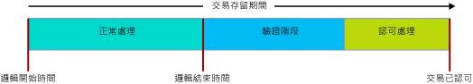

# <a name="transactions-with-memory-optimized-tables"></a>記憶體最佳化資料表的交易
[!INCLUDE[appliesto-ss-asdb-xxxx-xxx-md](../../includes/appliesto-ss-asdb-xxxx-xxx-md.md)]

  
本文說明記憶體最佳化資料表和原生編譯預存程序特定的所有交易層面。  
  
SQL Server 中的交易隔離等級會分別套用到記憶體最佳化資料表與硬碟資料表，而基礎機制並不相同。 了解這些差異，有助於程式設計人員設計高輸送量系統。 所有案例的共同目標都是要達成交易完整性。  

如需記憶體最佳化資料表上的交易特定錯誤狀況，請跳至 [衝突偵測和重試邏輯](#confdetretry34ni)一節。
  
如需一般資訊，請參閱 [SET TRANSACTION ISOLATION LEVEL (Transact-SQL)](../../t-sql/statements/set-transaction-isolation-level-transact-sql.md)。  
  
  
<a name="pessvoptim22ni"/>  
  
## <a name="pessimistic-versus-optimistic"></a>封閉式與開放式  
  
因為要達成交易完整性的方法分為封閉式與開放式，所以在功能上所有差異。 記憶體最佳化資料表會使用開放式方法：  
  
- 封閉式方法使用鎖定，在潛在衝突發生前加以封鎖。 會在執行陳述式時採用鎖定，並在認可交易時放開解除鎖定。  
  
- 衝突一發生，開放式方法會立即偵測到，並於認可時執行驗證檢查。  
  - 記憶體最佳化資料表不得發生錯誤 1205，也就是死結。  
  
開放式方法的額外負荷較少，而且通常更有效率，部分原因是大多數應用程式中不常發生交易衝突。 封閉式和開放式方法的主要功能差異，是在發生衝突時，封閉式方法會讓您等待，而開放式方法則是其中一筆交易失敗，且必須由用戶端重試。 強制使用 REPEATABLE READ 隔離等級時，功能差異較大，在 SERIALIZABLE 等級則差異最大。  
  
<a name="txninitmodes24ni"/>  
  
## <a name="transaction-initiation-modes"></a>交易初始模式  
  
SQL Server 有下列交易初始模式：  
  
- **自動認可** ：簡單查詢或 DML 陳述式一開始會隱含開啟交易，而陳述式的結尾會隱含認可交易。 **自動認可**是預設值。  
  - 在自動認可模式中，您通常不需要使用 FROM 子句撰寫記憶體最佳化資料表交易隔離等級的資料表提示程式碼。  
  
- **明確** - 您的 Transact-SQL 包含程式碼 BEGIN TRANSACTION，以及最終的 COMMIT TRANSACTION。 相同交易中可以包含二或多個陳述式。  
  - 在明確模式中，您必須使用資料庫選項 MEMORY_OPTIMIZED_ELEVATE_TO_SNAPSHOT，或在 FROM 子句針對記憶體最佳化資料表編寫有關交易隔離等級的資料表提示程式碼。  
  
- **隱含** - 強制使用 SET IMPLICIT_TRANSACTION ON 時。 IMPLICIT_BEGIN_TRANSACTION 可能會是更適合的名稱，因為此選項的作用就只是在 0 = @@trancount 時，在每個 UPDATE 陳述式之前隱含執行明確 BEGIN TRANSACTION 的對等項目。 因此，您的 T-SQL 程式碼會決定最終要不要發出明確 COMMIT TRANSACTION。   
  
- **ATOMIC 區塊** - ATOMIC 區塊中的所有陳述式一律執行為單一交易的一部分。 成功時將 ATOMIC 區塊的所有動作視為一個整體認可，或失敗後復原所有動作。 每個原生編譯的預存程序都需要 ATOMIC 區塊。  
  
<a name="codeexamexpmode25ni"/>  
  
### <a name="code-example-with-explicit-mode"></a>明確模式的程式碼範例  
  
以下解譯的 Transact-SQL 指令碼使用：  
  
- 明確交易。
- 記憶體最佳化資料表，名為 dbo.Order_mo。
- READ COMMITTED 交易隔離等級內容。  
  
因此，記憶體最佳化資料表上必須要有資料表提示。 提示必須提供給 SNAPSHOT 或隔離程度更高的等級。 在程式碼範例的案例中，提示為 WITH (SNAPSHOT)。 如果移除此提示，指令碼就會發生錯誤 41368，亦即無法執行自動重試。  

#### <a name="error-41368"></a>錯誤 41368

只有自動認可交易才支援使用 READ COMMITTED 隔離等級來存取記憶體最佳化的資料表。 明確或隱含交易則不支援。 請為使用 WITH (SNAPSHOT) 等資料表提示的記憶體最佳化資料表，提供支援的隔離等級。

```sql
SET TRANSACTION ISOLATION LEVEL READ COMMITTED;  
GO  

BEGIN TRANSACTION;  -- Explicit transaction.  

-- Order_mo  is a memory-optimized table.  
SELECT * FROM  
           dbo.Order_mo  as o  WITH (SNAPSHOT)  -- Table hint.  
      JOIN dbo.Customer  as c  on c.CustomerId = o.CustomerId;  
     
COMMIT TRANSACTION;
```
  
透過使用資料庫選項 `MEMORY_OPTIMIZED_ELEVATE_TO_SNAPSHOT`，即不需要 `WITH (SNAPSHOT)` 提示。 當此選項設為 `ON`時，較低隔離等級的記憶體最佳化資料表存取權，會自動提升為 SNAPSHOT 隔離。  

```sql
ALTER DATABASE CURRENT
    SET MEMORY_OPTIMIZED_ELEVATE_TO_SNAPSHOT = ON;
```

<a name="rowver28ni"/>  
  
## <a name="row-versioning"></a>資料列版本設定  
  
記憶體最佳化資料表即使在最嚴格的隔離等級 SERIALIZABLE，也會使用非常複雜的資料列版本設定系統，讓開放式方法有效率。 如需詳細資料，請參閱 [記憶體最佳化資料表簡介](../../relational-databases/in-memory-oltp/introduction-to-memory-optimized-tables.md)。  
  
當 READ_COMMITTED_SNAPSHOT 或 SNAPSHOT 隔離等級作用時，硬碟資料表會間接擁有資料列版本設定系統。 此系統是以 tempdb 為基礎，而記憶體最佳化的資料結構有資料列版本設定內建功能，可取得最高效率。  
  
<a name="confdegreeiso30ni"/>  
  
## <a name="isolation-levels"></a>隔離等級 
  
下表列出可能的交易隔離等級，順序從隔離程度最低到最高。 如需會發生的衝突以及處理這些衝突之重試邏輯的詳細資訊，請參閱 [衝突偵測和重試邏輯](#confdetretry34ni)。 
  
| 隔離等級 | 描述 |   
| :-- | :-- |   
| READ UNCOMMITTED | 無法使用：READ UNCOMMITTED 隔離下無法存取記憶體最佳化資料表。 如果工作階段層級的 TRANSACTION ISOLATION LEVEL 設為 READ UNCOMMITTED，使用 WITH (SNAPSHOT) 資料表提示或將資料庫設定 MEMORY_OPTIMIZED_ELEVATE_TO_SNAPSHOT 設為 ON，仍有可能存取 SNAPSHOT 隔離下的記憶體最佳化資料表。 | 
| READ COMMITTED | 只有在自動認可模式作用時，才受記憶體最佳化資料表支援。 如果工作階段層級的 TRANSACTION ISOLATION LEVEL 設為 READ COMMITTED，使用 WITH (SNAPSHOT) 資料表提示或將資料庫設定 MEMORY_OPTIMIZED_ELEVATE_TO_SNAPSHOT 設為 ON，仍有可能存取 SNAPSHOT 隔離下的記憶體最佳化資料表。<br/><br/>如果資料庫選項 READ_COMMITTED_SNAPSHOT 設為 ON，不允許存取相同陳述式中 READ COMMITTED 隔離下的記憶體最佳化和磁碟資料表。 |  
| SNAPSHOT | 受到記憶體最佳化資料表支援。 <br/><br/> 內部 SNAPSHOT 是記憶體最佳化資料表最基本的交易隔離等級。 <br/><br/> SNAPSHOT 使用的系統資源比 REPEATABLE READ 或 SERIALIZABLE 更少。 |  
| REPEATABLE READ | 受到記憶體最佳化資料表支援。 REPEATABLE READ 隔離保證在認可時，不會有並行交易更新此交易讀取的任何資料列。 <br/><br/> 因為是開放式模型，所以不會阻止並行交易更新此交易讀取的資料列。 反倒是在認可時，此交易會驗證不違反 REPEATABLE READ 隔離。 如果此交易違規，則會回復且必須重試。 | 
| SERIALIZABLE | 受到記憶體最佳化資料表支援。 <br/><br/> 命名為 *Serializable* 的原因是隔離相當嚴格，幾乎像是讓交易接續執行，而非並行執行。 | 


<a name="txnphaslife32ni"/>  
  
## <a name="transaction-phases-and-lifetime"></a>交易階段和存留期  
  
當涉及記憶體最佳化資料表時，交易的存留期會隨階段增加，如下圖所示：
  
  
  
後面接著階段描述。  
  
#### <a name="regular-processing-phase-1-of-3"></a>一般處理：階段 1 (之 3)  
  
- 這個階段是由查詢中的所有查詢和 DML 陳述式的執行所組成。  
- 在此階段，陳述式會將記憶體最佳化資料表的版本視為交易的邏輯開始時間。  
  
#### <a name="validation-phase-2-of-3"></a>驗證：階段 2 (之 3)  
  
- 指定結束時間即開始驗證階段，將交易標示為邏輯方面已完成。 完成此作業可讓依賴這筆交易的其他交易看到交易的所有變更。 成功認可此交易前，不允許認可相依的交易。 此外，不允許保留這類相依性的交易將結果集傳回用戶端，以確保用戶端只會看到已成功向資料庫認可的資料。  
- 這個階段包含可重複的讀取和可序列化的驗證。 針對可重複讀取驗證，會檢查是否有任何交易讀取的資料列在此之後更新。 針對可序列化驗證，會檢查是否已將任何資料列插入此交易掃描的任何資料範圍。 根據 [隔離等級和衝突](#confdegreeiso30ni)中的資料表，使用快照集隔離時，都會發生可重複讀取和可序列化驗證，以驗證唯一外部索引鍵條件約束的一致性。  
  
#### <a name="commit-processing-phase-3-of-3"></a>認可處理：階段 3 (之 3)  
  
- 在認可階段，耐久資料表的變更會寫入記錄中，而記錄會寫入磁碟中。 控制項接著會傳回用戶端。  
- 認可處理完成之後，所有相依的交易都會收到進行認可通知。  
  
您應該像平常一樣，在符合資料需求的前提下，盡可能使用最少且簡潔的工作交易單位。  
  
<a name="confdetretry34ni"/>  
  
## <a name="conflict-detection-and-retry-logic"></a>衝突偵測和重試邏輯 

有兩種導致交易失敗及回復的交易相關錯誤狀況。 在大多數的情況下，一旦發生這類失敗，就要重試交易，類似於發生死結時的狀況。
- 並行交易間的衝突。 這些是更新衝突和驗證失敗，而且可能是因為交易隔離等級違規或條件約束違規。
- 相依性失敗。 這是因為您依賴的交易無法認可，或相依性數目變得太大。

以下是當交易存取記憶體最佳化資料表時，會導致交易失敗的錯誤狀況。

| 錯誤碼 | 描述 | 原因 |
| :-- | :-- | :-- |
| **41302** | 嘗試更新目前交易開始後，已在其他交易中更新的資料列。 | 如果兩筆並行交易同時嘗試更新或刪除相同的資料列，就會發生這個錯誤狀況。 其中一筆交易會收到這個錯誤訊息，且必須重試。 <br/><br/>  | 
| **41305**| 可重複的讀取驗證失敗。 這筆交易完成認可前，從記憶體最佳化資料表讀取的資料列已為另一筆認可的交易更新。 | 使用 REPEATABLE READ 或 SERIALIZABLE 隔離時，如果並行交易的動作又造成 FOREIGN KEY 條件約束違規，就會發生此錯誤。 <br/><br/>這種外部索引鍵條件約束的並行違規很少見，通常是應用程式邏輯或資料項目的問題。 不過，如果和 FOREIGN KEY 條件約束有關的資料行沒有索引，也會發生此錯誤。 因此，指引是一律在記憶體最佳化資料表中，建立外部索引鍵資料行的索引的上。 <br/><br/> 如需外部索引鍵違規所致驗證失敗的詳細考量，請參閱 SQL Server 客戶諮詢小組的 [部落格文章](https://blogs.msdn.microsoft.com/sqlcat/2016/03/24/considerations-around-validation-errors-41305-and-41325-on-memory-optimized-tables-with-foreign-keys/) 。 |  
| **41325** | 可序列化的驗證失敗。 目前交易稍早掃描的範圍中插入了新的資料列。 我們將這種資料列稱為虛設項目列。 | 使用 SERIALIZABLE 隔離時，如果並行交易的動作又造成 PRIMARY KEY、UNIQUE 或 FOREIGN KEY 條件約束違規，就會發生此錯誤。 <br/><br/> 這種並行條件約束違規很少見，通常是應用程式邏輯或資料項目的問題。 不過，與可重複讀取驗證失敗相似，如果相關資料行的 FOREIGN KEY 條件約束不含任何索引，也會發生此錯誤。 |  
| **41301** | 相依性失敗︰相依性建立在稍後無法認可的另一個交易上。 | 這筆交易 (Tx1) 藉由讀取 Tx2 寫入的資料相依於另一筆交易 (Tx2)，而後者 (Tx2) 當時處於其驗證或認可處理階段。 接下來 Tx2 認可失敗。 Tx2 認可失敗最常見的原因是可重複讀取 (41305) 和可序列化 (41325) 驗證失敗，較不常見的原因則是記錄 IO 失敗。 |
| **41823** 和 **41840** | 已達到使用者資料在經記憶體最佳化的資料表和資料表變數中的配額。 | 錯誤 41823 適用於 SQL Server Express/Web/Standard Edition，以及 [!INCLUDE[sssdsfull](../../includes/sssdsfull-md.md)] 中的獨立資料庫。 錯誤 41840 適用於 [!INCLUDE[sssdsfull](../../includes/sssdsfull-md.md)] 中的彈性集區。 <br/><br/> 在大部分情況下，這些錯誤會指出已達到最大使用者資料大小，而解決此錯誤的方法是從經記憶體最佳化的資料表刪除資料。 不過，在少數情況下，這是暫時性錯誤。 因此，我們建議您在第一次發生這些錯誤時重試。<br/><br/> 與此清單中的其他錯誤一樣，錯誤 41823 和 41840 會造成使用中交易中止。 |
| **41839** | 交易超過認可相依性的數目上限。 |**適用於：** [!INCLUDE[ssSQL15](../../includes/sssql15-md.md)]。 較新版本的 [!INCLUDE[ssnoversion](../../includes/ssnoversion-md.md)] 和 [!INCLUDE[sssdsfull](../../includes/sssdsfull-md.md)] 對於認可相依性的數目沒有限制。<br/><br/> 給定的交易 (Tx1) 能夠相依的交易數目有限制。 這些交易是連出的相依性。 此外，能夠相依於指定交易 (Tx1) 的交易數目也有限制。 這些交易是連入的相依性。 兩者的限制皆為 8。 <br/><br/> 發生此錯誤的最常見情況，是大量的讀取交易存取由單一寫入交易寫入的資料。 如果讀取交易全都執行相同資料的大型掃描，以及如果寫入交易長時間處理驗證或認可，例如寫入交易在可序列化隔離下執行大型掃描 (延長驗證階段) 或交易記錄檔位於慢速記錄 IO 裝置 (延長認可處理的時間)，觸發這個狀況的可能性就會增加。 如果讀取交易正在執行大型掃描，且應該只存取少數資料列，可能會遺漏索引。 同樣地，如果寫入交易使用可序列化隔離且正在執行大型掃描，原本只想存取少數資料列，這也是沒有指示索引所致。 <br/><br/> 使用追蹤旗標 **9926** 可以提高認可相依性的數目限制。 只有在確認未曾遺漏任何索引後，仍然發生這個錯誤狀況時，才使用此追蹤旗標，因為在前列案例中，它可能會遮罩這些問題。 另一個警告是，每筆交易都有大量連入及連出相依性且個別交易都有多層相依性的複雜相依性圖表，可能會造成系統沒有效率。  |
 
  
### <a name="retry-logic"></a>重試邏輯 

當交易因為上述任一情況而失敗時，就應該重試交易。
  
您可以在用戶端或伺服器端實作重試邏輯。 一般是建議在用戶端實作重試邏輯，因為它更有效率，且可讓您在失敗發生之前處理交易傳回的結果集。  
  
<a name="retrytsqlcodeexam35ni"/>  
  
#### <a name="retry-t-sql-code-example"></a>重試 T-SQL 程式碼範例  
  
使用 T-SQL 的伺服器端重試邏輯，應該只用於不會將結果集傳回給用戶端的交易。 否則，重試會在預期要傳回給用戶端的結果集外，還可能產生其他結果集。  
  
以下解譯的 T-SQL 指令碼將說明，對於涉及記憶體最佳化資料表的交易衝突相關錯誤，重試邏輯可能會是什麼樣子。

```sql
-- Retry logic, in Transact-SQL.
DROP PROCEDURE If Exists usp_update_salesorder_dates;
GO

CREATE PROCEDURE usp_update_salesorder_dates
AS
BEGIN
    DECLARE @retry INT = 10;

    WHILE (@retry > 0)
    BEGIN
        BEGIN TRY
            BEGIN TRANSACTION;

            UPDATE dbo.SalesOrder_mo WITH (SNAPSHOT)
                set OrderDate = GetUtcDate()
                where CustomerId = 42;

            UPDATE dbo.SalesOrder_mo WITH (SNAPSHOT)
                set OrderDate = GetUtcDate()
                where CustomerId = 43;

            COMMIT TRANSACTION;

            SET @retry = 0;  -- //Stops the loop.
        END TRY

        BEGIN CATCH
            SET @retry -= 1;

            IF (@retry > 0 AND
                ERROR_NUMBER() in (41302, 41305, 41325, 41301, 41823, 41840, 41839, 1205)
                )
            BEGIN
                IF XACT_STATE() = -1
                    ROLLBACK TRANSACTION;

                WAITFOR DELAY '00:00:00.001';
            END
            ELSE
            BEGIN
                PRINT 'Suffered an error for which Retry is inappropriate.';
                THROW;
            END
        END CATCH

    END -- //While loop
END;
GO

--  EXECUTE usp_update_salesorder_dates;
```


<a name="crossconttxn38ni"/>  
  
## <a name="cross-container-transaction"></a>跨容器交易  
  
  
如果交易執行以下動作，即稱為跨容器交易：  
  
- 從解譯的 Transact-SQL 存取記憶體最佳化資料表；或  
- 在交易已經開啟時執行原生程序 (XACT_STATE() = 1)。  
  
「跨容器」一詞衍生自跨兩個交易管理容器執行交易的事實，一個用於磁碟資料表，另一個用於記憶體最佳化資料表。  
  
在單一跨容器交易內，不同的隔離等級可用於存取磁碟和記憶體最佳化資料表。 這項差異透過明確的資料表提示表示，例如 WITH (SERIALIZABLE)，或透過資料庫選項 MEMORY_OPTIMIZED_ELEVATE_TO_SNAPSHOT 表示，如果 TRANSACTION ISOLATION LEVEL 設定為 READ COMMITTED 或 READ UNCOMMITTED，則以隱含的方式將記憶體最佳化資料表的隔離等級提高到快照集。  
  
在下列 Transact-SQL 程式碼範例中：  
  
- 磁碟資料表 Table_D1，是使用 READ COMMITTED 隔離等級存取。  
- 記憶體最佳化資料表 Table_MO7，是使用 SERIALIZABLE 隔離等級存取。 Table_MO6 沒有特定的關聯隔離層級，因為插入永遠一致且基本在可序列化隔離下執行。  


```sql
-- Different isolation levels for
-- disk-based tables versus memory-optimized tables,
-- within one explicit transaction.

SET TRANSACTION ISOLATION LEVEL READ COMMITTED;
go

BEGIN TRANSACTION;

    -- Table_D1 is a traditional disk-based table, accessed using READ COMMITTED isolation.

    SELECT * FROM Table_D1;


    -- Table_MO6 and Table_MO7 are memory-optimized tables.
    -- Table_MO7 is accessed using SERIALIZABLE isolation,
    --   while Table_MO6 does not have a specific isolation level.

    INSERT Table_MO6
        SELECT * FROM Table_MO7 WITH (SERIALIZABLE);

COMMIT TRANSACTION;
go
```


<a name="limitations40ni"/>  
  
## <a name="limitations"></a>限制  
  
  
- 記憶體最佳化資料表不支援跨資料庫的交易。 如果交易存取記憶體最佳化資料表，該交易即無法存取其他任何資料庫，除了  
  - tempdb 資料庫。  
  - 從 master 資料庫唯讀。  
  
- 不支援分散式交易：使用 BEGIN DISTRIBUTED TRANSACTION 時，交易無法存取記憶體最佳化資料表。  
  
  
<a name="natcompstorprocs42ni"/>  
  
## <a name="natively-compiled-stored-procedures"></a>原生編譯的預存程序  
  
- 在原生程序中，ATOMIC 區塊必須宣告整個區塊的交易隔離等級，像是：  
  - `... BEGIN ATOMIC WITH (TRANSACTION ISOLATION LEVEL = SNAPSHOT, ...) ...`  
  
- 原生程序的主體中不允許任何明確交易控制陳述式。 BEGIN TRANSACTION、ROLLBACK TRANSACTION 等均不允許。  
  
- 如需使用 ATOMIC 區塊之交易控制的詳細資訊，請參閱 [ATOMIC 區塊](atomic-blocks-in-native-procedures.md)。  
  
<a name="othertxnlinks44ni"/>  
  
## <a name="other-transaction-links"></a>其他交易連結  
  
- [SET IMPLICIT_TRANSACTIONS](../../t-sql/statements/set-implicit-transactions-transact-sql.md)  
  
- [sp_getapplock (Transact-SQL)](../../relational-databases/system-stored-procedures/sp-getapplock-transact-sql.md)  
  
- [Database Engine 中資料列版本設定式的隔離等級](http://msdn.microsoft.com/library/ms177404.aspx)  
  
- [控制交易持久性](../../relational-databases/logs/control-transaction-durability.md)   
