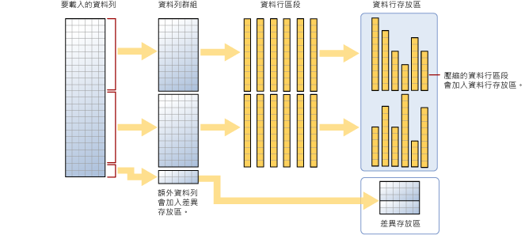

# <a name="columnstore-indexes---data-loading-guidance"></a>資料行存放區索引 - 資料載入指導
[!INCLUDE[appliesto-ss-asdb-asdw-pdw-md](../../includes/appliesto-ss-asdb-asdw-pdw-md.md)]

這些選項和建議可透過使用標準 SQL 大量載入與緩慢插入方法，將資料載入資料行存放區索引。 將資料載入至資料行存放區索引是任何資料倉儲程序中不可或缺的一部分，因為它會將資料移至索引，以準備進行分析。
  
 資料行存放區索引的新手嗎？ 請參閱[資料行存放區索引 - 概觀](../../relational-databases/indexes/columnstore-indexes-overview.md)和[資料行存放區索引架構](../../relational-databases/sql-server-index-design-guide.md#columnstore_index)。
  
## <a name="what-is-bulk-loading"></a>什麼是大量載入？
「大量載入」指的是在資料存放區中新增大量資料列的方式。 這是將資料移至資料行存放區索引的最有效方式，因為它是以資料列批次的方式操作。 大量載入會填滿資料列群組的最大容量，並將它們直接壓縮到資料行存放區。 只有載入尾端未達每個資料列群組至少 102,400 個資料列的資料列才會移至差異存放區。  

若要執行大量載入，您可以使用 [bcp 公用程式](../../tools/bcp-utility.md)、[Integration Services](../../integration-services/sql-server-integration-services.md)，或從暫存資料表中選取資料列。

  
  
 如圖所示，大量載入︰  
  
* 不會預先排序資料。 資料會以收到的順序插入資料列群組。
* 如果批次大小 > = 102400，資料列會直接進入壓縮的資料列群組。 建議選擇批次大小 >=102400 進行有效率的大量匯入，因為在由背景執行緒、Tuple Mover (TM) 最終將資料列移至壓縮的資料列群組之前，可避免資料移到差異資料列群組中。
* 如果批次大小 < 102,400 或剩餘的資料列 < 102,400，資料列就會載入差異資料列群組。

> [!NOTE]
> 在具有非叢集資料行存放區索引資料的資料列存放區資料表上， [!INCLUDE[ssNoVersion](../../includes/ssnoversion-md.md)] 會一律將資料插入基底資料表。 資料絶對不會直接插入資料行存放區索引。  

大量載入具有下列內建的效能最佳化方式：
-   **平行載入：**您可以執行多個並行大量載入 (bcp 或大量插入)，其中每個載入作業都會載入不同的資料檔案。 與資料列存放區大量載入 [!INCLUDE[ssNoVersion](../../includes/ssnoversion-md.md)] 不同的是，您不需要指定 `TABLOCK`，這是因為每個大量匯入執行緒都會專門將資料載入不同的資料列群組 (壓縮或差異資料列群組)，且對其具有獨占鎖定。 使用 `TABLOCK` 會在資料表上強制進行獨佔鎖定，而您無法以平行方式匯入資料。  
-   **最低限度記錄：**大量載入會對直接進入壓縮資料列群組的資料使用最低限度記錄。 進入差異資料列群組的所有資料則會完整記錄。 這包括任何少於 102,400 個資料列的批次大小。 不過，大量載入的目標是要讓大部分的資料略過差異資料列群組。  
-   **鎖定最佳化︰**載入壓縮資料列群組時，會取得 資料列群組的 X 鎖定。 然而，當大量載入差異資料列群組時，已取得資料列群組的 X 鎖定，但 [!INCLUDE[ssNoVersion](../../includes/ssnoversion-md.md)] 仍會鎖定「頁/範圍」的鎖定，這是因為 X 資料列群組鎖定不是鎖定階層的一部分。  
  
如果您在資料行存放區索引上有一個非叢集 B 型樹狀結構索引，對於索引本身而言，沒有任何鎖定或記錄最佳化，但仍然會有如上所述的叢集資料行存放區索引最佳化。  
  
## <a name="plan-bulk-load-sizes-to-minimize-delta-rowgroups"></a>計畫大量載入大小使差異資料列群組降到最少
當大部分的資料列壓縮成資料行存放區而不是位於差異資料列群組時，資料行存放區索引的執行效果最好。 最好調整載入的大小，盡量讓資料列直接進入資料行存放區，而略過差異存放區。

下列案例說明載入的資料列何時會直接進入資料行存放區，或何時會進入差異存放區。 在範例中，每個資料列群組可以有 102,400-1,048,576 個資料列。 實際上，在記憶體不足的情況下，資料列群組的大小上限可能會小於 1,048,576 個資料列。  
  
|大量載入的資料列|已新增至壓縮資料列群組的資料列|已加入差異資料列群組的資料列數|  
|-----------------------|-------------------------------------------|--------------------------------------|  
|102,000|0|102,000|  
|145,000|145,000<br /><br /> 資料列群組大小：145,000|0|  
|1,048,577|1,048,576<br /><br /> 資料列群組大小：1,048,576。|@shouldalert|  
|2,252,152|2,252,152<br /><br /> 資料列群組大小：1,048,576、1,048,576、155,000|0|  
  
 下列範例顯示將 1,048,577 個資料列載入資料表的結果。 結果顯示，資料行存放區中有一個 COMPRESSED 資料列群組 (壓縮的資料行區段)，而差異存放區中有 1 個資料列。  
  
```sql  
SELECT object_id, index_id, partition_number, row_group_id, delta_store_hobt_id, 
  state state_desc, total_rows, deleted_rows, size_in_bytes   
FROM sys.dm_db_column_store_row_group_physical_stats  
```  
  
   
  
## <a name="use-a-staging-table-to-improve-performance"></a>使用暫存資料表來改善效能
如果您只要在執行其他轉換之前暫存載入的資料，則將資料表載入堆積資料表遠快於將資料載入叢集資料行存放區資料表。 此外，將資料載入 [暫存資料表] [暫存] 也會比將資料表載入永久儲存體還要快的多。  

 資料載入的一個常見模式，是將資料先載入暫存表格再進行一些轉換後，使用下列命令將其載入目標資料表  
  
```sql  
INSERT INTO <columnstore index>  
SELECT <list of columns> FROM <Staging Table>  
```  
  
 此命令會以 BCP 或大量插入等類似方式，將資料載入資料行存放區索引，但是為單一批次。 如果在暫存表格中的資料列數目 < 102400，資料列會載入差異資料列群組，否則資料列會直接載入壓縮的資料列群組中。 有一項很重要的限制是，這項 `INSERT` 作業為單一執行緒。 若要平行載入資料，可以建立多個暫存表格，或發出 `INSERT`/`SELECT` 同時設定暫存表格不重疊的資料列範圍。 [!INCLUDE[ssSQL15](../../includes/sssql15-md.md)] 時已無這項限制。 下列命令會從暫存表格以平行方式載入資料，但您必須指定 `TABLOCK`。  
  
```sql  
INSERT INTO <columnstore index> WITH (TABLOCK) 
SELECT <list of columns> FROM <Staging Table>  
```  
  
 從暫存表格載入叢集資料行存放區索引時，提供下列最佳化方式：
-   **記錄最佳化︰**將資料載入壓縮的資料列群組時，會記錄最少的內容。 當資料載入差異資料列群組時，沒有記錄的最低限制。  
-   **鎖定最佳化︰**載入壓縮資料列群組時，會取得 資料列群組的 X 鎖定。 然而，有了差異資料列群組時，會取得資料列群組的 X 鎖定，但 [!INCLUDE[ssNoVersion](../../includes/ssnoversion-md.md)] 仍會鎖定 PAGE/EXTENT 的鎖定，這是因為 X 資料列群組鎖定不是鎖定階層的一部分。  
  
 如果您有一或多個非叢集索引，對於索引本身而言，沒有任何鎖定或記錄最佳化，但仍然會有如上所述的叢集資料行存放區索引最佳化。  
  
## <a name="what-is-trickle-insert"></a>什麼是緩慢插入？

「緩慢插入」指的是個別資料列移至資料行存放區索引的方式。 緩慢插入會使用 [INSERT INTO](../../t-sql/statements/insert-transact-sql.md) 陳述式。 透過緩慢插入，所有資料列都會進入差異存放區。 此功能對於少量資料列很有用，但不適用於大量載入。
  
```sql  
INSERT INTO <table-name> VALUES (<set of values>)  
```  
  
 > [!NOTE]
 > 使用 INSERT INTO 將值插入叢集資料行存放區索引的並行執行緒，可以將資料列插入相同的差異存放區資料列群組。  
  
 資料列群組包含 1,048,576 個資料列之後，差異資料列群組會標示為已關閉，但仍可供查詢、更新/刪除作業之用，但新插入的資料列會進入現有或新建立的差異存放區資料列群組。 有一個背景執行緒 *Tuple Mover (TM)* 會每隔 5 分鐘左右定期壓縮已關閉的差異資料列群組。 您可以明確叫用下列命令來壓縮已關閉的差異資料列群組  
  
```sql  
ALTER INDEX <index-name> on <table-name> REORGANIZE  
```  
  
 如果想要強制關閉差異資料列群組並進行壓縮，可以執行下列命令。 如果已完成載入資料列，而且預期不會再有任何新的資料列，可以執行此命令。 明確地關閉並壓縮差異資料列群組，可以進一步保留儲存體，並改善分析查詢效能。 不想要插入新資料列的最佳做法是叫用此命令。  
  
```sql  
ALTER INDEX <index-name> on <table-name> REORGANIZE with (COMPRESS_ALL_ROW_GROUPS = ON)  
```  
  
## <a name="how-loading-into-a-partitioned-table-works"></a>載入至資料分割資料表的運作方式  
 對於分割資料， [!INCLUDE[ssNoVersion](../../includes/ssnoversion-md.md)] 會先將每個資料列指派至一個分割區，然後在分割區內對資料執行資料行存放區作業。 每個分割區都有自己的資料列群組以及至少一個差異資料列群組。  
  
 ## <a name="next-steps"></a>後續步驟
 如需載入的進一步討論，請參閱此[部落格文章](http://blogs.msdn.com/b/sqlcat/archive/2015/03/11/data-loading-performance-considerations-on-tables-with-clustered-columnstore-index.aspx)。  
