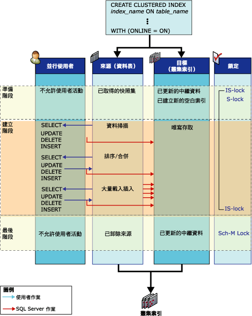

# 線上索引作業如何運作
[!INCLUDE[tsql-appliesto-ss2016-asdb-xxxx-xxx_md](../../includes/tsql-appliesto-ss2016-asdb-xxxx-xxx-md.md)]

  此主題定義線上索引作業期間存在的結構，以及顯示有關這些結構的活動。  
  
## 線上索引結構  
 為了在索引資料定義語言 (DDL) 的作業期間允許並行的使用者活動，線上索引作業期間會使用下列結構：來源和預先存在的索引、目標，以及用於在線上重建堆積或卸除叢集索引的暫存對應索引。  
  
-   **來源和預先存在的索引**  
  
     來源是原始的資料表或叢集索引資料。 預先存在的索引則是與來源結構有關的任何非叢集索引。 例如，如果線上索引作業要重建具有四個相關非叢集索引的叢集索引，來源就是現有的叢集索引，而預先存在的索引就是非叢集索引。  
  
     預先存在的索引可供並行的使用者進行選取、插入、更新和刪除作業。 包括大量插入 (支援，但不建議) 以及由觸發程序和參考完整性條件約束進行的隱含更新。 所有預先存在的索引都可供查詢和搜尋。 這表示可以由查詢最佳化工具選取這些索引，以及必要時在索引提示中指定這些索引。  
  
-   **Target**  
  
     目標是新的索引 (堆積) 或是一組要建立或重建的新索引。 使用者對來源所進行的插入、更新和刪除作業，會由 [!INCLUDE[ssDEnoversion](../../includes/ssdenoversion-md.md)] 在索引作業期間套用到目標。 例如，如果線上索引作業要重建叢集索引，目標就是重建的叢集索引； [!INCLUDE[ssDE](../../includes/ssde-md.md)] 重建叢集索引時，不會重建非叢集索引。  
  
     處理 SELECT 陳述式時，要到索引作業認可之後才會搜尋目標索引。 索引在內部是標示為唯寫。  
  
-   **暫存對應索引**  
  
     建立、卸除或重新叢集索引的線上索引作業，也需要暫存對應索引。 此暫存索引是由並行的交易所使用，以判斷基礎資料表中的資料列被更新或刪除時，要在重建的新索引中刪除哪一筆記錄。 此非叢集索引會以和新叢集索引 (或堆積) 相同的步驟建立，不需要個別的排序作業。 並行交易也可在所有的插入、更新和刪除作業中維護暫存對應索引。  
  
## 線上索引活動  
 在簡單的線上索引作業期間，例如在沒有索引的資料表 (堆積) 上建立叢集索引，來源和目標會經歷三個階段：準備、建立和完成。  
  
 下圖顯示在線上建立初始叢集索引的過程。 來源物件 (堆積) 沒有其他的索引。 每一個階段都會顯示來源和目標結構活動；也會顯示並行使用者選取、插入、更新和刪除作業。 準備、建立和完成階段會以每個階段使用的鎖定模式一起指示。  
  
   
  
## 來源結構活動  
 下表列出索引作業每個階段中，與來源結構有關的活動，以及對應的鎖定策略。  
  
|階段|來源活動|來源鎖定|  
|-----------|---------------------|------------------|  
|準備   非常短的階段|準備建立新的空索引結構的系統中繼資料。   定義資料表的快照集。 亦即，會使用資料列版本設定來提供交易層級的讀取一致性。   並行使用者對來源的寫入作業會被鎖定一段非常短的時間。   除了建立多個非叢集索引，不允許並行的 DDL 作業。|資料表上是 S (共用)*   IS (意圖共用)   INDEX_BUILD_INTERNAL_RESOURCE\*\*|  
|建置   主要階段|在大量載入作業中，資料會被掃描、排序、合併且插入目標。   並行使用者的選取、插入、更新或刪除作業，會同時套用到預先存在的索引和任何建立的新索引。|IS   INDEX_BUILD_INTERNAL_RESOURCE**|  
|完成   非常短的階段|所有無法認可的更新交易必須在此階段開始之前完成。 根據獲得的鎖定不同，所有新的使用者讀取或寫入交易會被鎖定一段非常短的時間，直到此階段完成為止。   系統中繼資料會更新，以目標取代來源。   如果需要來源，會卸除來源。 例如，在重建或卸除叢集索引之後。|INDEX_BUILD_INTERNAL_RESOURCE**   如果正在建立非叢集索引，資料表上是 S。\*   如果卸除任何來源結構 (索引或資料表)，則是 SCH-M (結構描述修改)。\*|  
  
 \* 索引作業會等待任何未認可的更新交易先完成，然後才取得資料表的 S 鎖定或 SCH-M 鎖定。  
  
 ** 當索引作業正在處理時，資源鎖定 INDEX_BUILD_INTERNAL_RESOURCE 可預防執行來源上的並行資料定義語言 (DDL) 作業和預先存在的結構。 例如，此鎖定可預防在相同資料表上同時重建兩個索引。 雖然此種資源鎖定與 SCH-M 鎖定相關，但無法預防資料管理陳述式。  
  
 上表顯示在牽涉單一索引的線上索引作業建立階段期間所獲得的單一共用 (S) 鎖定。 建立或重建叢集和非叢集索引時，在單一線上索引作業中 (例如在包含一個或多個非叢集索引的資料表上建立初始叢集索引期間)，建立階段期間會先獲得兩個短時間的 S 鎖定，然後是長時間的意圖共用 (IS) 鎖定。 建立叢集索引會先獲得一個 S 鎖定，然後建立叢集索引完成時，就會獲得第二個短時間的 S 鎖定，以建立非叢集索引。 建立非叢集索引之後，S 鎖定就會降級為 IS 鎖定，直到線上索引作業的完成階段為止。  
  
### 目標結構活動  
 下表列出索引作業每個階段中，與目標結構有關的活動，以及對應的鎖定策略。  
  
|階段|目標活動|目標鎖定|  
|-----------|---------------------|------------------|  
|準備|已建立新索引，並且設為唯寫。|IS|  
|建置|從來源插入資料。   套用要套用到來源的使用者修改 (插入、更新、刪除)。   此活動對使用者而言不需要做任何變更。|IS|  
|完成|更新索引中繼資料。   將索引設為讀取/寫入狀態。|S   或   SCH-M|  
  
 直到索引作業完成，使用者發出的 SELECT 陳述式才能存取目標。  
  
 準備和完成階段完成之後，儲存在程序快取中的查詢和更新計畫就會無效。 接下來的查詢會使用新的索引。  
  
 與線上索引作業有關的資料表，其宣告的資料指標存留時間會受到線上索引階段的限制。 在每一個階段中，更新資料指標都是無效的。 而只有在完成階段之後，唯讀資料指標才會無效。  
  
## 相關內容  
 [線上執行索引作業](../../relational-databases/indexes/perform-index-operations-online.md)  
  
 [線上索引作業的指導方針](../../relational-databases/indexes/guidelines-for-online-index-operations.md)  
  
  

