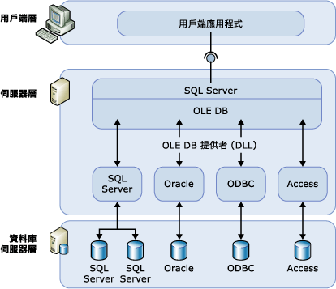

# 連結的伺服器 (Database Engine)
  設定連結的伺服器，可讓 [!INCLUDE[ssDEnoversion](../../includes/ssdenoversion-md.md)] 對 [!INCLUDE[ssNoVersion](../../includes/ssnoversion-md.md)]執行個體外部的 OLE DB 資料來源執行命令。 一般會將連結的伺服器設定為可讓 [!INCLUDE[ssDE](../../includes/ssde-md.md)] 執行 [!INCLUDE[tsql](../../includes/tsql-md.md)] 陳述式，而此陳述式包含另一個 [!INCLUDE[ssNoVersion](../../includes/ssnoversion-md.md)]執行個體中的資料表或另一個資料庫產品 (例如 Oracle) 中的資料表。 多種 OLE DB 資料來源類型可設定為連結的伺服器，包含 [!INCLUDE[msCoName](../../includes/msconame-md.md)] Access 和 Excel。 連結伺服器可提供以下優點：  
  
-   從 [!INCLUDE[ssNoVersion](../../includes/ssnoversion-md.md)]外部存取資料的能力。  
  
-   在企業間的異質資料來源上發出分散式查詢、更新、命令與交易的能力。  
  
-   以類似方式處理不同資料來源的能力。  
  
 您可以使用 [!INCLUDE[ssManStudioFull](../../includes/ssmanstudiofull-md.md)] 或使用 [sp_addlinkedserver &#40;Transact-SQL&#41;](../../relational-databases/system-stored-procedures/sp-addlinkedserver-transact-sql.md) 陳述式，來設定連結的伺服器。 OLE DB 提供者的必要參數類型和數目有極大的不同。 例如，部分提供者需要您使用 [sp_addlinkedsrvlogin &#40;Transact-SQL&#41;](../../relational-databases/system-stored-procedures/sp-addlinkedsrvlogin-transact-sql.md)執行個體外部的 OLE DB 資料來源執行命令。 部分 OLE DB 提供者允許 [!INCLUDE[ssNoVersion](../../includes/ssnoversion-md.md)] 更新 OLE DB 來源上的資料。 其他提供者則只提供唯讀資料存取。 如需有關每個 OLE DB 提供者的詳細資訊，請參閱該 OLE DB 提供者的文件。  
  
## 連結伺服器元件  
 連結伺服器定義會指定下列物件：  
  
-   OLE DB 提供者  
  
-   OLE DB 資料來源  
  
 「OLE DB 提供者」是一種 DLL，可管理特定資料來源並與其互動。 「OLE DB 資料來源」則識別可透過 OLE DB 存取的特定資料庫。 雖然透過連結伺服器定義來查詢的資料來源通常都是資料庫，不過，各種檔案及檔案格式都有 OLE DB 提供者的存在。 其中包括文字檔、工作表資料，以及全文檢索內容搜尋的結果。  
  
 [!INCLUDE[msCoName](../../includes/msconame-md.md)] [!INCLUDE[ssNoVersion](../../includes/ssnoversion-md.md)] Native Client OLE DB 提供者 (PROGID：SQLNCLI11) 是 [!INCLUDE[ssNoVersion](../../includes/ssnoversion-md.md)]的正式 OLE DB 提供者。  
  
> [!NOTE]  
>  [!INCLUDE[ssNoVersion](../../includes/ssnoversion-md.md)] 分散式查詢是專為處理任何實作必要 OLE DB 介面的 OLE DB 提供者而設計； 不過， [!INCLUDE[ssNoVersion](../../includes/ssnoversion-md.md)] 只有針對 [!INCLUDE[ssNoVersion](../../includes/ssnoversion-md.md)] Native OLE DB 提供者以及某些其他提供者測試過。  
  
## 連結伺服器詳細資料  
 下圖說明連結伺服器組態的基本設定。  
  
   
  
 連結伺服器通常用於處理分散式查詢。 當用戶端應用程式透過連結伺服器來執行分散式查詢時， [!INCLUDE[ssNoVersion](../../includes/ssnoversion-md.md)] 會剖析命令，並將要求傳送至 OLE DB。 資料列集要求可能是採用對提供者執行查詢的形式，也可能是開啟提供者的基底資料表 (Base Table)。  
  
 若要讓資料來源透過連結伺服器來傳回資料，該資料來源的 OLE DB 提供者 (DLL) 必須與 [!INCLUDE[ssNoVersion](../../includes/ssnoversion-md.md)]的執行個體位在同一部伺服器上。  
  
 若是使用協力廠商的 OLE DB 提供者，則用來執行 [!INCLUDE[ssNoVersion](../../includes/ssnoversion-md.md)] 服務的帳戶，必須要有該提供者安裝位置之目錄及其所有子目錄的讀取和執行權限。  
  
## 管理提供者  
 有一組選項可用來控制 [!INCLUDE[ssNoVersion](../../includes/ssnoversion-md.md)] 如何載入及使用登錄中所指定的 OLE DB 提供者。  
  
## 管理連結伺服器定義  
 當您設定連結伺服器時，請使用 [!INCLUDE[ssNoVersion](../../includes/ssnoversion-md.md)]來註冊連接資訊與資料來源資訊。 註冊完成之後，就可以使用單一邏輯名稱來參考這個資料來源。  
  
 您可以使用預存程序及目錄檢視來管理連結伺服器定義：  
  
-   執行 **sp_addlinkedserver**來建立連結伺服器定義。  
  
-   針對 [!INCLUDE[ssNoVersion](../../includes/ssnoversion-md.md)] sys.servers **系統目錄檢視來執行查詢，以檢視在特定** 執行個體中定義的連結伺服器相關資訊。  
  
-   藉由執行 **sp_dropserver**來刪除連結伺服器的定義。 您也可以使用這個預存程序來移除遠端伺服器。  
  
 您也可以使用 [!INCLUDE[ssManStudioFull](../../includes/ssmanstudiofull-md.md)] 來定義連結伺服器。 在物件總管中，以滑鼠右鍵按一下 [伺服器物件]，選取 [新增]，然後選取 [連結伺服器]。 您可以用滑鼠右鍵按一下連結伺服器名稱，並選取 [刪除]，以刪除連結伺服器定義。  
  
 當您對連結伺服器執行分散式查詢時，所要查詢的每個資料來源均需包含完整的四部分資料表名稱。 這個四部分名稱格式應該為 <連結伺服器名稱>.<目錄>**.**<結構描述>**.**<物件名稱>。  
  
> [!NOTE]  
>  連結的伺服器可以定義為指回 (回送，Loopback) 到定義它們的伺服器上。 回送伺服器最適合用於測試針對單一伺服器網路使用分散式查詢的應用程式。 回送連結的伺服器主要用於測試，而且不支援許多作業，例如分散式交易。  
  
## 相關工作  
 [建立連結的伺服器 &#40;SQL Server Database Engine&#41;](../../relational-databases/linked-servers/create-linked-servers-sql-server-database-engine.md)  
  
 [sp_addlinkedserver &#40;Transact-SQL&#41;](../../relational-databases/system-stored-procedures/sp-addlinkedserver-transact-sql.md)  
  
 [sp_addlinkedsrvlogin &#40;Transact-SQL&#41;](../../relational-databases/system-stored-procedures/sp-addlinkedsrvlogin-transact-sql.md)  
  
 [sp_dropserver &#40;Transact-SQL&#41;](../../relational-databases/system-stored-procedures/sp-dropserver-transact-sql.md)  
  
## 相關內容  
 [sys.servers &#40;Transact-SQL&#41;](../../relational-databases/system-catalog-views/sys-servers-transact-sql.md)  
  
 [sp_linkedservers &#40;Transact-SQL&#41;](../../relational-databases/system-stored-procedures/sp-linkedservers-transact-sql.md)  
  
  
