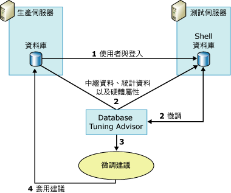

# <a name="reduce-the-production-server-tuning-load"></a>降低生產伺服器的微調負載
[!INCLUDE [SQL Server Azure SQL Database](../../includes/applies-to-version/sql-asdb.md)]
  [!INCLUDE[ssDE](../../includes/ssde-md.md)] Tuning Advisor 會仰賴查詢最佳化工具來分析工作負載以及提出微調建議。 針對實際伺服器執行這項分析會增加伺服器負載，而且可能會在微調工作階段期間減損伺服器效能。 除了實際伺服器以外，您可以使用測試伺服器來減少微調工作階段期間對伺服器負載造成的影響。  
  
## <a name="how-database-engine-tuning-advisor-uses-a-test-server"></a>Database Engine Tuning Advisor 使用測試伺服器的方式  
 測試伺服器的傳統使用方式是，將生產伺服器上所有的資料都複製到測試伺服器上，然後微調測試伺服器，再於生產伺服器上實作建議項目。 這項程序可避免對生產伺服器造成效能上的影響，但卻不是最好的解決方案。 例如，從生產伺服器複製大量資料到測試伺服器，會耗用大量的時間與資源。 此外，測試伺服器硬體不太可能和生產伺服器所部署的硬體一樣強大。 微調處理所依賴的是查詢最佳化工具，而它所產生的建議有部份卻是依據基礎硬體。 如果測試與實際伺服器的硬體不同， [!INCLUDE[ssDE](../../includes/ssde-md.md)] Tuning Advisor 建議的品質就會受到影響。  
  
 為避免這些問題， [!INCLUDE[ssDE](../../includes/ssde-md.md)] Tuning Advisor 在對實際伺服器的資料庫進行微調時，會將大部分的微調負載卸載到測試伺服器上。 它的作法是使用生產伺服器硬體組態資訊，而不實際將生產伺服器的資料複製到測試伺服器。 [!INCLUDE[ssDE](../../includes/ssde-md.md)] Tuning Advisor 不會從實際伺服器將實際資料複製到測試伺服器。 它只會複製中繼資料與必要的統計資料。  
  
 下列步驟將概略說明在測試伺服器上微調生產資料庫的程序：  
  
1.  確定要使用測試伺服器的使用者，同時存在於兩部伺服器上。  
  
     開始之前，請先確定要使用測試伺服器來微調生產伺服器資料庫的使用者，同時存在於兩部伺服器上。 為此，您必須建立使用者及其在測試伺服器上的登入。 若您在兩部電腦上都是 **系統管理員** 固定伺服器角色的成員，即可略過此步驟。  
  
2.  在測試伺服器上微調工作負載。  
  
     若要在測試伺服器上微調工作負載，您必須透過 **dta** 命令列公用程式使用 XML 輸入檔。 在 XML 輸入檔中，使用 **TestServer** 子元素指定測試伺服器的名稱，並指定 **TuningOptions** 父元素底下其他子元素的值。  
  
     在微調的過程中，Database Engine Tuning Advisor 會在測試伺服器上建立 Shell 資料庫。 為建立此 Shell 資料庫並加以微調，Database Engine Tuning Advisor 會針對下列項目，對生產伺服器發出呼叫：  
  
    1.  [!INCLUDE[ssDE](../../includes/ssde-md.md)] Tuning Advisor 會將生產環境資料庫的中繼資料匯入測試伺服器的 Shell 資料庫。 此中繼資料中包含了空白資料表、索引、檢視、預存程序、觸發程序等， 如此即可對測試伺服器的 Shell 資料庫執行工作負載查詢。  
  
    2.  [!INCLUDE[ssDE](../../includes/ssde-md.md)] Tuning Advisor 會從實際伺服器匯入統計資料，讓查詢最佳化工具能夠準確地將測試伺服器上的查詢最佳化。  
  
    3.  [!INCLUDE[ssDE](../../includes/ssde-md.md)] Tuning Advisor 會匯入硬體參數，以指定實際伺服器的處理器與可用記憶體數量，進而為查詢最佳化工具提供在產生查詢計劃時所需的資訊。  
  
3.  [!INCLUDE[ssDE](../../includes/ssde-md.md)] Tuning Advisor 完成測試伺服器 Shell 資料庫的微調之後，它會產生微調建議。  
  
4.  將微調測試伺服器之後所得到的建議，套用到生產伺服器上。  
  
 下圖說明測試伺服器與生產伺服器的案例：  
  
   
  
> [!NOTE]  
>  [!INCLUDE[ssDE](../../includes/ssde-md.md)] Tuning Advisor 圖形化使用者介面 (GUI) 不支援測試伺服器微調功能。  
  
## <a name="example"></a>範例  
 首先，請確定要執行微調的使用者，同時存在於測試伺服器與生產伺服器上。  
  
 將使用者資訊複製到測試伺服器之後，您可以在 [!INCLUDE[ssDE](../../includes/ssde-md.md)] Tuning Advisor XML 輸入檔中定義測試伺服器微調工作階段。 下列 XML 輸入檔範例將示範如何以 [!INCLUDE[ssDE](../../includes/ssde-md.md)] Tuning Advisor 指定測試伺服器的資料庫微調作業。  
  
 在此範例中， `MyDatabaseName` 資料庫會在 `MyServerName`上進行微調。 並使用 [!INCLUDE[tsql](../../includes/tsql-md.md)] 指令碼 `MyWorkloadScript.sql`做為工作負載。 此工作負載中包含了針對 `MyDatabaseName`而執行的事件。 在微調過程中，查詢最佳化工具對此資料庫所產生的大多數呼叫，都由位於 `MyTestServerName`中的 Shell 資料庫處理。 Shell 資料庫中含有中繼資料與統計資料， 此程序會將微調負擔卸載到測試伺服器上。 當 [!INCLUDE[ssDE](../../includes/ssde-md.md)] Tuning Advisor 使用此 XML 輸入檔產生微調建議時，它應該只會考量索引 (`<FeatureSet>IDX</FeatureSet>`)，而不考量資料分割，也不需在 `MyDatabaseName`中保存任何現有的實體設計結構。  
  
```  
<?xml version="1.0" encoding="utf-16" ?>  
<DTAXML xmlns:xsi="http://www.w3.org/2001/XMLSchema-instance" xmlns="https://schemas.microsoft.com/sqlserver/2004/07/dta">  
  <DTAInput>  
    <Server>  
      <Name>MyServerName</Name>  
      <Database>  
        <Name>MyDatabaseName</Name>  
      </Database>  
    </Server>  
    <Workload>  
      <File>MyWorkloadScript.sql</File>  
    </Workload>  
    <TuningOptions>  
      <TestServer>MyTestServerName</TestServer>  
      <FeatureSet>IDX</FeatureSet>  
      <Partitioning>NONE</Partitioning>  
      <KeepExisting>NONE</KeepExisting>  
    </TuningOptions>  
  </DTAInput>  
</DTAXML>  
```  
  
## <a name="see-also"></a>另請參閱  
 [使用測試伺服器的考量](../../relational-databases/performance/considerations-for-using-test-servers.md)   
 [XML 輸入檔參考XML Input File ReferenceDatabase Engine Tuning Advisor&#41;](../../tools/dta/xml-input-file-reference-database-engine-tuning-advisor.md)  
  
  
