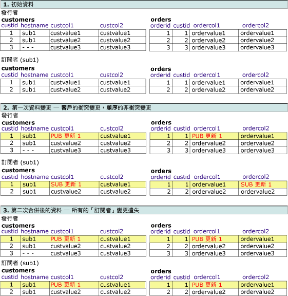
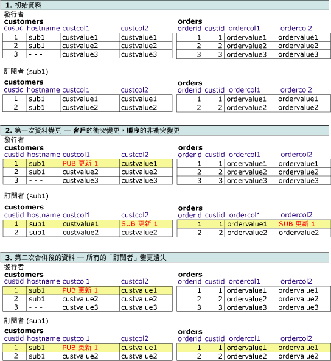
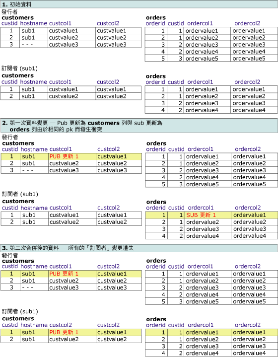

# 進階合併式複寫衝突 - 在邏輯記錄解決
[!INCLUDE[appliesto-ss-xxxx-xxxx-xxx-md](../../../includes/appliesto-ss-xxxx-xxxx-xxx-md.md)]
  本主題涵蓋使用邏輯記錄時，可能會用到的衝突偵測和衝突解決方法之不同組合。 如果多個節點變更了相同的資料，或合併式複寫在複寫變更時遇到某種類型的錯誤 (例如，條件約束違規)，則合併式複寫中就會發生衝突。 如需衝突偵測和解決的詳細資訊，請參閱＜ [Advanced Merge Replication Conflict Detection and Resolution](../../../relational-databases/replication/merge/advanced-merge-replication-conflict-detection-and-resolution.md)＞。  
  
 若要為發行項指定衝突追蹤與解決層級，請參閱[指定合併式複寫選項](../../../relational-databases/replication/merge/specify-merge-replication-properties.md)。  
  
## 衝突偵測  
 偵測邏輯記錄衝突的方法是由兩個發行項屬性所決定： **column_tracking** 和 **logical_record_level_conflict_detection**。 [!INCLUDE[ssVersion2005](../../../includes/ssversion2005-md.md)] 及更新版本也支援邏輯記錄層級的偵測。  
  
 **logical_record_level_conflict_detection** 發行項屬性可設定為 TRUE 或 FALSE。 只應為最上層父發行項設定此值，子發行項會忽略此值。 如果該值為 FALSE，則合併式複寫會如舊版 [!INCLUDE[ssNoVersion](../../../includes/ssnoversion-md.md)]中一樣，僅依據發行項之 **column_tracking** 屬性的值來偵測衝突。 如果該值為 TRUE，則合併式複寫將忽略發行項的 **column_tracking** 屬性，並且如果在邏輯記錄中任意處進行變更，它便會偵測衝突。 例如，請考慮以下的狀況：  
  
   
  
 如果兩個使用者變更 **Customers**、 **Orders**或 **OrderItems** 資料表中 Customer2 邏輯記錄的任何值，則會偵測到衝突。 此範例涉及透過 UPDATE 陳述式進行變更，但是也可透過 INSERT 或 DELETE 陳述式所作的變更偵測衝突。  
  
## 衝突解決  
 依預設，合併式複寫使用以優先權為基礎的邏輯來解決衝突。 如果在兩個「訂閱者」資料庫中進行衝突變更，則具有較高訂閱優先權的「訂閱者」變更獲勝，或者如果優先權相同，則第一個到達「發行者」的變更獲勝。 使用資料列層級和資料行層級的偵測，整個獲勝資料列會永遠覆寫失敗資料列。  
  
 **logical_record_level_conflict_resolution** 發行項屬性可設定為 TRUE 或 FALSE。 只應為最上層父發行項設定此值，子發行項會忽略此值。 如果該值為 TRUE，則整個獲勝邏輯記錄會覆寫失敗邏輯記錄。 如果它為 FALSE，則個別獲勝資料列可來自於不同的「訂閱者」或「發行者」。 例如，訂閱者 A 可以在 **Orders** 資料表的資料列之衝突中獲勝，而訂閱者 B 則可在 **OrderItems** 資料表的相關資料列之衝突中獲勝。 結果是訂閱者 A 的 **Orders** 資料列和訂閱者 B 的 **OrderItems** 資料列之邏輯記錄。  
  
## 衝突解決和偵測設定的互動  
 衝突的結果取決於衝突偵測和解決設定之間的互動。 下列範例假設使用以優先權為基礎的衝突解決方式。 使用邏輯記錄時，有下列幾種可能性：  
  
-   資料列或資料行層級偵測與資料列層級解決  
  
-   資料行層級偵測與邏輯記錄解決  
  
-   資料列層級偵測與邏輯記錄解決  
  
-   邏輯記錄偵測與邏輯記錄解決  
  
### 資料列或資料行層級偵測與資料列層級解決  
 在這個範例中，發行集是以下列資料設定：  
  
-   **column_tracking** 為 TRUE 或 FALSE  
  
-   **logical_record_level_conflict_detection** 為 FALSE  
  
-   **logical_record_level_conflict_resolution** 為 FALSE  
  
 在此情況下，偵測位於資料列或資料行層級，解決則位於資料列層級。 使用這些設定以便利用下列方法：將邏輯記錄的所有變更複寫為一個單位，但在邏輯記錄層級中沒有衝突偵測或解決。  
  
### 資料行層級偵測與邏輯記錄解決  
 在這個範例中，發行集是以下列資料設定：  
  
-   **column_tracking** 為 TRUE  
  
-   **logical_record_level_conflict_detection** 為 FALSE  
  
-   **logical_record_level_conflict_resolution** 為 TRUE  
  
 「發行者」和「訂閱者」以相同的資料集開始，且邏輯記錄在 **orders** 和 **customers** 資料表之間定義。 「發行者」變更 **customers** 資料表中的 **custcol1** 資料行和 **orders** 資料表中的 **ordercol1** 。 「訂閱者」變更 **customers** 資料表中相同資料列的 **custcol1** 和 **orders** 資料表中相同資料列的 **ordercol2** 資料行。 對 **customer** 資料表中相同資料行進行變更會導致衝突，但是對 **orders** 資料表進行變更則不會。  
  
 由於衝突在邏輯記錄層級解決，因此「發行者」上所作的獲勝變更，會取代複寫處理期間在「訂閱者」資料表中所作的變更。  
  
   
  
### 資料列層級偵測與邏輯記錄解決  
 在這個範例中，發行集是以下列資料設定：  
  
-   **column_tracking** 為 FALSE  
  
-   **logical_record_level_conflict_detection** 為 FALSE  
  
-   **logical_record_level_conflict_resolution** 為 TRUE  
  
 發行者與訂閱者以相同的資料集開始。 發行者變更 **customers** 資料表中的 **custcol1** 資料行。 「訂閱者」變更 **customers** 資料表中的 **custcol2** 和 **orders** 資料表中的 **ordercol2** 資料行。 對 **customers** 資料表中相同資料列所作的變更會導致衝突，但是對 **orders** 資料表所作的「訂閱者」變更則不會衝突。  
  
 由於衝突在邏輯記錄層級解決，因此同步處理期間，在「發行者」上的獲勝變更會取代「訂閱者」資料表中所作的變更。  
  
   
  
### 邏輯記錄偵測與邏輯記錄解決  
 在這個範例中，發行集是以下列資料設定：  
  
-   **logical_record_level_conflict_detection** 為 TRUE  
  
-   **logical_record_level_conflict_resolution** 為 TRUE  
  
 發行者與訂閱者以相同的資料集開始。 發行者變更 **customers** 資料表中的 **custcol1** 資料行。 「訂閱者」變更 **orders** 資料表中的 **ordercol1** 資料行。 相同資料列或資料行無變更，但是由於在 **custid**=1 的相同邏輯記錄中進行了變更，因此在邏輯記錄層級變更會被偵測為衝突。  
  
 由於衝突也在邏輯記錄層級解決，因此同步處理期間，在「發行者」上所作的獲勝變更會取代「訂閱者」資料表中所作的變更。  
  
   
  
## 另請參閱  
 [使用邏輯記錄分組相關資料列的變更](../../../relational-databases/replication/merge/group-changes-to-related-rows-with-logical-records.md)  
  
  
