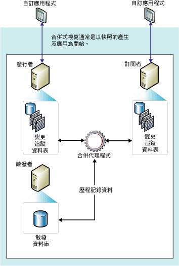

# 合併式複寫
[!INCLUDE[appliesto-ss-xxxx-xxxx-xxx-md](../../../includes/appliesto-ss-xxxx-xxxx-xxx-md.md)]
  合併式複寫與異動複寫類似，通常以發行集資料庫物件和資料的快照集啟動。 在「發行者」和「訂閱者」端所作的後續資料變更和結構描述修改可使用觸發程序進行追蹤。 該「訂閱者」在連接到網路時會與「發行者」同步，並且在「發行者」與「訂閱者」之間交換自上次同步處理後進行過變更的所有資料列。  
  
 合併式複寫通常會在伺服器至用戶端環境中使用。 合併式複寫適合於下列任何情況：  
  
-   多個訂閱者可能會在不同時間更新相同的資料，並將這些變更傳播到發行者與其他訂閱者。  
  
-   「訂閱者」需要接收資料、離線變更資料，稍後同步變更「發行者」和其他「訂閱者」。  
  
-   每個訂閱者需要一個不同的資料分割。  
  
-   可能會發生衝突，而在發生衝突時，您需要偵測與解決衝突的能力。  
  
-   應用程式需要淨資料變更，而非對中繼資料狀態的存取。 例如，如果資料列在「訂閱者」與「發行者」同步之前，於「訂閱者」端變更了五次，則該資料列只需在「發行者」端變更一次，以反映最終資料變更 (即第五次的值)。  
  
 合併式複寫允許各站台自發地工作，然後將更新合併到單一的統一結果。 因為是在多個節點更新，所以相同的資料可能已由發行者和多個訂閱者更新。 因此，合併更新時可能會發生衝突，而合併式複寫提供數個處理衝突的方法。  
  
 合併式複寫是由「 [!INCLUDE[ssNoVersion](../../../includes/ssnoversion-md.md)] 快照集代理程式」與「合併代理程式」所實作。 如果發行集未經篩選或使用靜態篩選，則「快照集代理程式」會建立單一快照集。 如果發行集使用參數化篩選，則「快照集代理程式」會為資料的各資料分割建立快照集。 「合併代理程式」會將初始快照集套用至「訂閱者」。 另外這會合併建立初始快照集之後在「發行者」或「訂閱者」端發生的累加資料變更，並且偵測是否發生任何衝突，並根據您設定的規則加以解決。  
  
 若要追蹤變更，合併式複寫 (和具有佇列更新訂閱的異動複寫) 必須可以唯一地識別每個已發行資料表中的每個資料列。 若要完整此操作，合併式複寫會將資料行 **rowguid** 加入至每個資料表 (除非資料表已經擁有的資料行是包含 **uniqueidentifier** 屬性集的 **ROWGUIDCOL** 資料類型 (在此情況下將使用此資料行))。 如果從發行集卸除資料表， **rowguid** 資料行會遭到移除；如果現有資料行是用來進行追蹤，則不會移除資料行。 篩選不得包含複寫識別資料列所使用的 **rowguidcol** 。 **newid()** 函數的提供是為了當做 **rowguid** 資料行的預設值，不過客戶可以提供每個資料列的 GUID (如有需要)。 但是，請勿提供值 00000000-0000-0000-0000-000000000000。  
  
 下圖顯示合併複寫中使用的元件。  
  
   
  
  
