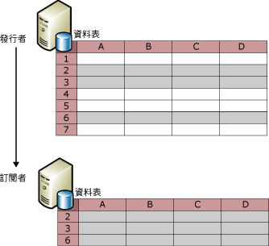
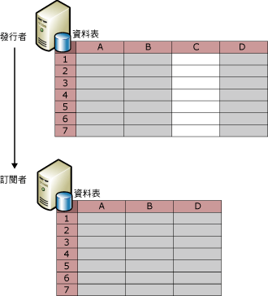
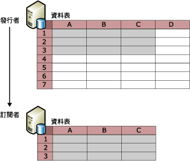

# 篩選發行的資料
  篩選資料表發行項可讓您建立即將發行的資料分割。 利用篩選發行的資料，您可以：  
  
-   將透過網路傳送的資料總量縮減到最少。  
  
-   降低訂閱者端所需的儲存空間量。  
  
-   依照個別的訂閱者需求，自訂發行集和應用程式。  
  
-   可以避免或減少訂閱者更新資料時的衝突，因為不同資料分割可以傳送給不同的訂閱者 (不會有兩個訂閱者同時更新相同的資料值)。  
  
-   避免傳送機密資料。 資料列篩選與資料行篩選可用於限制訂閱者對資料的存取。 對於合併式複寫，如果使用含有 HOST_NAME() 的參數化篩選，則有安全性考量。 如需詳細資訊，請參閱 「 使用 host_name （） 篩選 」 一節中 [參數化資料列篩選](../../../relational-databases/replication/merge/parameterized-row-filters.md)。  
  
 複寫提供四種類型的篩選：  
  
-   靜態資料列篩選，適用於所有類型的複寫。  
  
     靜態資料列篩選可用於選擇要發行的資料列子集。 所有已篩選發行集的「訂閱者」會收到篩選資料表的相同資料列子集。 如需詳細資訊，請參閱本主題中的「靜態資料列篩選」一節。  
  
-   資料行篩選，適用於所有類型的複寫。  
  
     資料行篩選可用於選擇要發行的資料行子集。 如需詳細資訊，請參閱本主題中的「資料行篩選」一節。  
  
-   參數化資料列篩選器，僅適用於合併式複寫。  
  
     參數化資料列篩選器可用於選擇要發行的資料列子集。 靜態篩選是將相同的資料列子集傳送給每位「訂閱者」，參數化資料列篩選器則不同，它使用「訂閱者」提供的資料值，將不同的資料列子集傳送給「訂閱者」。 如需詳細資訊，請參閱 [Parameterized Row Filters](../../../relational-databases/replication/merge/parameterized-row-filters.md)。  
  
-   聯結篩選，僅適用於合併式複寫。  
  
     聯結篩選可用於將一個發行資料表的資料列篩選擴充到另一個資料表。 如需相關資訊，請參閱 [Join Filters](../../../relational-databases/replication/merge/join-filters.md)。  
  
## 靜態資料列篩選  
 下圖顯示篩選後發行集中僅包含資料列 2、3、6 的發行資料表。  
  
   
  
 靜態資料列篩選使用 WHERE 子句選取要發行的適當資料；您可以指定 WHERE 子句的最後部份。 請考慮 **Product 資料表** Adventure Works 範例資料庫中，其中包含資料行 **ProductLine**。 若要只發行包含山地自行車相關產品之資料的資料列，請指定 `ProductLine = 'M'`。  
  
 靜態資料列篩選會導致每個發行集只有一個資料集。 在上例中，所有「訂閱者」只會收到包含山地自行車相關產品之資料的資料列。 如果有另一「訂閱者」需要只包含公路自行車相關產品之資料的資料列：  
  
-   您可以使用快照式或異動複寫建立另一個發行集，將資料表包含在兩個發行集中 (在該發行集中發行項的篩選子句中，指定 `ProductLine = 'R')`。  
  
    > [!NOTE]  
    >  交易式發行集的資料列篩選可能會顯著增加負擔，因為已發行資料表的所有寫入記錄資料列都要進行發行項篩選子句評估，以決定是否應複寫資料列。 如果每個複寫節點均可支援完全資料載入，且整個資料集非常小，則應避免交易式發行集中的資料列篩選。  
  
-   對於合併式複寫，請使用參數化資料列篩選器，不要使用靜態資料列篩選建立多個發行集。 如需詳細資訊，請參閱 [Parameterized Row Filters](../../../relational-databases/replication/merge/parameterized-row-filters.md)。  
  
 若要定義或修改靜態資料列篩選，請參閱 [定義及修改靜態資料列篩選](../../../relational-databases/replication/publish/define-and-modify-a-static-row-filter.md)。  
  
## 資料行篩選  
 下圖顯示篩選掉資料行 C 的發行集。  
  
   
  
 您也可以同時使用資料列及資料行篩選，如下圖所示。  
  
   
  
 建立發行集之後，您可以使用資料行篩選從現有發行集中卸除資料行，但在「發行者」端的資料表中保留該資料行，亦可在發行集中包括現有資料行。 對於其他變更，例如將新的資料行新增至資料表，然後新增至已發行的發行項，請使用結構描述變更複寫。 如需詳細資訊，請參閱主題的 「 新增資料行 」 與 「 卸除資料行 」 章節 [對發行集資料庫進行結構描述變更](../../../relational-databases/replication/publish/make-schema-changes-on-publication-databases.md)。  
  
 下表中列出的資料行類型無法篩選出特定類型的發行集。  
  
|資料行類型|發行集類型及選項|  
|-----------------|-------------------------------------|  
|主索引鍵資料行|交易式發行集中的所有資料表均需要主索引鍵資料行。 合併式發行集中的資料表不需要主索引鍵，但如果主索引鍵資料行存在，則無法被篩選。|  
|外部索引鍵資料行|所有使用「新增發行集精靈」建立的發行集。 您可以使用 Transact-SQL 預存程序篩選外部索引鍵資料行。 如需詳細資訊， [定義及修改資料行篩選](../../../relational-databases/replication/publish/define-and-modify-a-column-filter.md)。|  
| **Rowguid** 資料行|合併式發行集*|  
| **Msrepl_tran_version** 資料行|允許可更新訂閱的快照式及交易式發行集|  
|不允許 NULL 以及未設定預設值或 IDENTITY 屬性的資料行。|允許可更新訂閱的快照式及交易式發行集|  
|具有唯一條件約束或索引的資料行|允許可更新訂閱的快照式及交易式發行集|  
|SQL Server 7.0 合併式發行集中的所有資料行|無法在 SQL Server 7.0 合併式發行集篩選資料行。|  
|時間戳記|SQL Server 7.0 快照式或交易式發行集允許可更新訂閱|  
  
 \*如果您要合併式發行集中發行資料表，且該資料表已包含資料類型的資料行 **uniqueidentifier** 與 **ROWGUIDCOL** 屬性集複寫可以使用此資料行而不是建立額外的資料行名為 **rowguid**。 在此情況下，必須發行現有資料行。  
  
 若要定義或修改資料行篩選，請參閱 [定義及修改資料行篩選](../../../relational-databases/replication/publish/define-and-modify-a-column-filter.md)。  
  
## 篩選考量  
 篩選資料時請考慮以下事項：  
  
-   資料列篩選中參考的所有資料行必須包括在發行集中。 換句話說，您必須使用資料行篩選以排除資料列篩選中使用的資料行。  
  
-   如果在訂閱初始化之後新增或變更篩選，則該訂閱必須重新初始化。  
  
-   篩選中使用的資料行所允許的最大位元組數，對於合併式發行集中的發行項為 1024，對於交易式發行集中的發行項則為 8000。  
  
-   包含以下資料類型的資料行無法在資料列篩選或聯結篩選中參考：  
  
    -   **varchar(max) 和 nvarchar(max)**  
  
    -   **varbinary(max)**  
  
    -   **text 和 ntext**  
  
    -   **image**  
  
    -   **XML**  
  
    -   **UDT**  
  
-   異動複寫可讓您將索引檢視複寫為檢視或資料表。 如果將檢視複寫為資料表，則無法從資料表篩選資料行。  
  
 資料列篩選並非設計為跨資料庫運作。 [!INCLUDE[ssNoVersion](../../../includes/ssnoversion-md.md)] 刻意會限制執行 **sp_replcmds** （底下執行的篩選） 資料庫的擁有者 (**dbo**)。  **Dbo** 沒有跨資料庫權限。 加上 CDC （異動資料擷取） 中的 [!INCLUDE[ssKatmai](../../../includes/sskatmai-md.md)]  **sp_replcmds** 邏輯會填入變更追蹤資訊的使用者可以傳回及查詢的資料表。 基於安全性理由， [!INCLUDE[ssNoVersion](../../../includes/ssnoversion-md.md)] 會限制這個邏輯的執行，讓惡意 **dbo** 無法劫持這個執行路徑。 例如，惡意 **dbo** 無法再取得使用者呼叫的內容下執行的 CDC 資料表上加入觸發程序 **sp_replcmds**, ，在此情況下，記錄讀取器代理程式。  如果執行代理程式的帳戶具有較高的權限，惡意 **dbo** 無法提高其權限。  
  
## 另請參閱  
 [發行資料和資料庫物件](../../../relational-databases/replication/publish/publish-data-and-database-objects.md)  
  
  