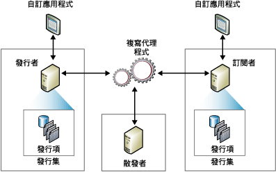

# 複寫發行模型概觀
[!INCLUDE[appliesto-ss-xxxx-xxxx-xxx-md](../../../includes/appliesto-ss-xxxx-xxxx-xxx-md.md)]
  複寫使用出版業比喻來表示複寫拓撲中的元件，包括發行者、散發者、訂閱者、發行集、發行項和訂閱。 從雜誌的角度設想一下 [!INCLUDE[msCoName](../../../includes/msconame-md.md)] [!INCLUDE[ssNoVersion](../../../includes/ssnoversion-md.md)] 複寫非常有幫助：  
  
-   雜誌發行者可產生一個或多個發行集  
  
-   發行集包含發行項  
  
-   發行者直接或使用散發者散發雜誌  
  
-   訂閱者接收他們已訂閱的發行集  
  
 儘管雜誌比喻對於理解複寫非常有用，但須注意， [!INCLUDE[ssNoVersion](../../../includes/ssnoversion-md.md)] 複寫還包含此比喻中未表示的功能，特別是「訂閱者」進行更新以及「發行者」將累加變更傳送至發行集中發行項的能力。  
  
 *「複寫拓撲」* 定義伺服器與資料副本間的關聯性，並且用以明定伺服器之間資料流動方式的邏輯。 還有數項複寫處理 (稱為 *「代理程式」*) 負責「發行者」與「訂閱者」之間的資料複製及移動。 下圖提供了複寫所涉及之元件與處理的概觀。  
  
   
  
## 發行者  
 「發行者」是一個可透過複寫使資料可用於其他位置的資料庫執行個體。 發行者可以有一個或多個發行集，每個發行集各定義一組邏輯相關的物件及要複寫的資料。  
  
## 散發者  
 「散發者」是一個作為儲存器的資料庫執行個體，用於儲存與一個或多個「發行者」相關聯的複寫特定資料。 每個發行者都會關聯於散發者端的單一資料庫 (稱為散發資料庫)。 散發資料庫儲存複寫狀態資料和有關發行集的中繼資料，有時它還作為從「發行者」移動至「訂閱者」之資料的佇列。 在許多情況下，單一資料庫伺服器執行個體可同時作為「發行者」和「散發者」， 稱之為 *「本機散發者」*。 當在單獨的資料庫伺服器執行個體上設定「發行者」與「散發者」時，「散發者」稱為 *「遠端散發者」*。  
  
## 訂閱者  
 「訂閱者」是接收已複寫資料的資料庫執行個體。 訂閱者可以接收多個發行者和發行集的資料。 依所選的複寫類型而定，訂閱者也可以將資料變更傳回發行者，或將資料重新發行到其他訂閱者。  
  
## 發行項  
 用以識別包含在發行集中資料庫物件的發行項。 發行集可包含不同類型的發行項，其中包括資料表、檢視、預存程序和其他物件。 當您將資料表當作發行項來發行時，您可以利用篩選來限制傳送給訂閱者之資料的資料行和資料列。  
  
## 發行集  
 發行集是單一資料庫之一個或多個發行項的集合。 將多個發行項分組到單一發行集，會比較容易指定一組當作一個單元來複寫的邏輯相關之資料庫物件和資料。  
  
## 訂閱  
 訂閱是對要傳遞給「訂閱者」之發行集副本的要求。 訂閱會定義將在何時、何處收到什麼發行集。 訂閱的類型有兩種：發送和提取。 如需發送和提取訂閱的詳細資訊，請參閱[訂閱發行集](../../../relational-databases/replication/subscribe-to-publications.md)。  
  
## 另請參閱  
 [複寫代理程式概觀](../../../relational-databases/replication/agents/replication-agents-overview.md)   
 [複寫類型](../../../relational-databases/replication/types-of-replication.md)   
 [設定 AlwaysOn 可用性群組的複寫 (SQL Server)](../../../database-engine/availability-groups/windows/configure-replication-for-always-on-availability-groups-sql-server.md)   
 [維護 AlwaysOn 發行集資料庫 (SQL Server)](../../../database-engine/availability-groups/windows/maintaining-an-always-on-publication-database-sql-server.md)  
  
  
