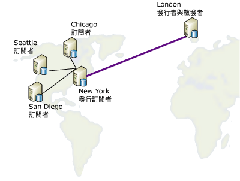

# 重新發行資料
[!INCLUDE[appliesto-ss-asdbmi-xxxx-xxx-md](../../includes/appliesto-ss-asdbmi-xxxx-xxx-md.md)]
  在重新發行模式中，「發行者」傳送資料到「訂閱者」，「訂閱者」再將資料重新發行給任何數量的「訂閱者」。 當「發行者」必須透過緩慢或昂貴的通訊連結傳送資料到「訂閱者」時，這就很有用。 如果在該連結的遠端有許多「訂閱者」，可使用發行「訂閱者」來將大量散發負載移位到連結的那一端。  
  
 重新發行資料包括以下步驟：  
  
1.  在「發行者」端建立發行集。  
  
2.  為要重新發行的「訂閱者」建立發行集的訂閱。  
  
3.  初始化訂閱。 必須先初始化訂閱，然後才能在重新發行「訂閱者」時建立發行集，否則複寫將會失敗。  
  
4.  在要重新發行的「訂閱者」端的訂閱資料庫中建立發行集。  
  
5.  在要重新發行的「訂閱者」端為其他「訂閱者」建立發行集的訂閱。  
  
6.  初始化訂閱。  

[!INCLUDE[freshInclude](../../includes/paragraph-content/fresh-note-steps-feedback.md)]

> [!NOTE]  
>  如果在重新發行的拓撲中使用合併式複寫，則所有重新發行「訂閱者」均必須使用伺服器訂閱。 如需訂閱類型的詳細資訊，請參閱[訂閱發行集](../../relational-databases/replication/subscribe-to-publications.md)。  
  
 在下圖中，「發行者」與重新發行者都扮演其各自的本機「散發者」角色。 如果都設定為使用遠端「散發者」，每個「散發者」就必須如自己的「發行者」一樣，全部都在緩慢或昂貴通訊連結的同一邊。 「發行者」必須透過可靠、高速的通訊連結以連接到遠端「散發者」。  
  
   
  
 任何伺服器都可以同時扮演「發行者」與「訂閱者」的角色。 例如，假設下圖中的資料表發行集位於英國倫敦，且必須散發到美國四個不同城市：芝加哥、紐約、聖地牙哥和西雅圖。 位於紐約的伺服器將被選來訂閱在倫敦產生的發行資料表，因為紐約網站符合這些條件：  
  
-   到倫敦的網路連結相當可靠。  
  
-   倫敦到紐約的通訊成本是可以接受的。  
  
-   從紐約到所有其他美國訂閱者網站有相當好的網路通訊線路。  
  
       
  
 複寫支援下表所示的重新發行案例。  
  
|發行者|發行訂閱者|訂閱者|  
|---------------|---------------------------|----------------|  
|交易式發行集|交易式訂閱/交易式發行集|交易式訂閱|  
|交易式發行集|交易式訂閱/合併式發行集*|合併訂閱|  
|合併式發行集|合併訂閱/合併式發行集|合併訂閱|  
|合併式發行集|合併訂閱/交易式發行集|交易式訂閱|  
  
 \*您應該設定合併式發行集的 **@published_in_tran_pub** 屬性。 依預設，異動複寫預期於訂閱者端的資料表會被視為唯讀資料表。 如果合併式複寫變更交易式訂閱中資料表的資料，就可能導致資料無法聚合。 若要避免此風險，建議合併式發行集中的任何此類資料表應指定為僅限下載。 這會防止合併式訂閱者將資料變更上傳至資料表。 如需詳細資訊，請參閱[使用僅限下載的發行項最佳化合併式複寫效能](../../relational-databases/replication/merge/optimize-merge-replication-performance-with-download-only-articles.md)。  
  
## 另請參閱  
 [[設定散發]](../../relational-databases/replication/configure-distribution.md)   
 [發行資料和資料庫物件](../../relational-databases/replication/publish/publish-data-and-database-objects.md)   
 [Subscribe to Publications](../../relational-databases/replication/subscribe-to-publications.md)   
 [初始化訂閱](../../relational-databases/replication/initialize-a-subscription.md)   
 [同步處理資料](../../relational-databases/replication/synchronize-data.md)  
  
  
