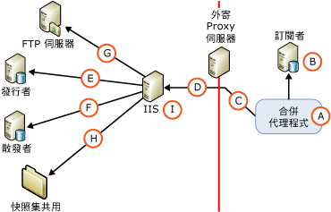

# Web 同步處理的安全性架構
[!INCLUDE[appliesto-ss-xxxx-xxxx-xxx-md](../../../includes/appliesto-ss-xxxx-xxxx-xxx-md.md)]
  [!INCLUDE[msCoName](../../../includes/msconame-md.md)] [!INCLUDE[ssNoVersion](../../../includes/ssnoversion-md.md)] 可讓您精確控制 Web 同步處理安全性的設定。 本主題提供一份完整清單，其中列有可併入 Web 同步處理組態中的所有元件，並提供有關元件之間所建立的連接資訊。 [!INCLUDE[ssNoteWinAuthentication](../../../includes/ssnotewinauthentication-md.md)]  
  
 下圖顯示所有可能的連接，但特定拓撲中可能不需要某些連接。 例如，只有在利用 FTP 傳遞快照集時，才需要連接 FTP 伺服器。  
  
   
  
 下表描述圖解中顯示的元件和連接。  
  
## A. 合併代理程式執行時所用的 Windows 使用者  
 同步處理期間，合併代理程式 (A) 會在訂閱者端啟動。 您可以從 [!INCLUDE[ssNoVersion](../../../includes/ssnoversion-md.md)] Agent 作業步驟或從獨立的自訂應用程式啟動合併代理程式。 如果是從 [!INCLUDE[ssNoVersion](../../../includes/ssnoversion-md.md)] Agent 作業步驟啟動合併代理程式，則合併代理程式必須在您指定之 Windows 使用者的內容下執行。 如果您未指定 Windows 使用者，合併代理程式會在 [!INCLUDE[ssNoVersion](../../../includes/ssnoversion-md.md)] Agent 之 Windows 服務帳戶的內容下執行。  
  
|帳戶類型|指定帳戶的位置|  
|---------------------|------------------------------------|  
|Windows 使用者|[!INCLUDE[tsql](../../../includes/tsql-md.md)]：[sp_addmergepullsubscription_agent](../../../relational-databases/system-stored-procedures/sp-addmergepullsubscription-agent-transact-sql.md) 的 `@job_login` 和 `@job_password` 參數。   RMO (Replication Management Objects)： <xref:Microsoft.SqlServer.Replication.IProcessSecurityContext.Login%2A> 的 <xref:Microsoft.SqlServer.Replication.IProcessSecurityContext.Password%2A> 和 <xref:Microsoft.SqlServer.Replication.PullSubscription.SynchronizationAgentProcessSecurity%2A>屬性。|  
|[!INCLUDE[ssNoVersion](../../../includes/ssnoversion-md.md)] Agent 的 Windows 服務帳戶|[!INCLUDE[ssNoVersion](../../../includes/ssnoversion-md.md)] 組態管理員|  
|獨立應用程式|合併代理程式在執行應用程式之 Windows 使用者的內容下執行。|  
  
## B. 連接訂閱者  
 合併代理程式利用 Windows 驗證或 [!INCLUDE[ssNoVersion](../../../includes/ssnoversion-md.md)] 驗證來連接訂閱者。 您指定的 Windows 使用者或 [!INCLUDE[ssNoVersion](../../../includes/ssnoversion-md.md)] 登入，必須與特定資料庫使用者相關聯，該資料庫使用者必須是訂閱資料庫中 **dbowner** 固定資料庫角色的成員。  
  
> [!NOTE]  
>  從 [!INCLUDE[ssNoVersion](../../../includes/ssnoversion-md.md)] Agent 作業啟動「合併代理程式」時，一定會使用 Windows 驗證。 除非已明確指定 [!INCLUDE[ssNoVersion](../../../includes/ssnoversion-md.md)] 驗證，否則當以程式設計方式啟動「合併代理程式」時，也會使用 Windows 驗證。  
  
|驗證類型|指定驗證的位置|  
|----------------------------|-------------------------------------------|  
|-   Windows 驗證。|合併代理程式會在針對合併代理程式 (A) 指定之 Windows 使用者的內容下建立連接。|  
|只有在指定下列項目時，才會使用[!INCLUDE[ssNoVersion](../../../includes/ssnoversion-md.md)] 驗證：   -   RMO：<xref:Microsoft.SqlServer.Replication.MergeSynchronizationAgent.SubscriberSecurityMode%2A> 的 <xref:Microsoft.SqlServer.Replication.SecurityMode.Standard> 值。 -   「合併代理程式」命令列：**SubscriberSecurityMode** 的 **0** 值。|RMO： <xref:Microsoft.SqlServer.Replication.MergeSynchronizationAgent.SubscriberLogin%2A> 和 <xref:Microsoft.SqlServer.Replication.MergeSynchronizationAgent.SubscriberPassword%2A>。   「合併代理程式」命令列： **-SubscriberLogin** 和 **-SubscriberLogin**。|  
  
## C. 連接外寄 Proxy 伺服器  
 只有在具有限制存取訂閱者內部網路的外寄 Proxy 伺服器時，才需要指定此連接的 Windows 使用者。  
  
|驗證類型|指定驗證的位置|  
|----------------------------|-------------------------------------------|  
|Windows 驗證|RMO：具有 <xref:Microsoft.SqlServer.Replication.MergeSynchronizationAgent.InternetProxyLogin%2A> 的 <xref:Microsoft.SqlServer.Replication.MergeSynchronizationAgent.InternetProxyPassword%2A> 和 <xref:Microsoft.SqlServer.Replication.MergeSynchronizationAgent.InternetProxyServer%2A>。   「合併代理程式」命令列：具有 **-InternetProxyServer** 的 **-InternetProxyLogin** 和 **-InternetProxyPassword**。|  
  
## D. 連接 IIS  
 連接訂閱者並從訂閱資料庫擷取任何變更之後，合併代理程式會對 [!INCLUDE[msCoName](../../../includes/msconame-md.md)] Internet Information Services (IIS) 進行 HTTPS 要求，並以 XML 訊息來上傳資料變更。 合併代理程式必須擁有 IIS 登入權限。  
  
|驗證類型|指定驗證的位置|  
|----------------------------|-------------------------------------------|  
|如果指定下列其中一項，則會使用「基本驗證」：   -   [!INCLUDE[tsql](../../../includes/tsql-md.md)]：[sp_addmergepullsubscription_agent](../../../relational-databases/system-stored-procedures/sp-addmergepullsubscription-agent-transact-sql.md) 之 `@internet_security_mode` 參數的 **0** 值。 -   RMO：<xref:Microsoft.SqlServer.Replication.MergeSynchronizationAgent.InternetSecurityMode%2A> 的 <xref:Microsoft.SqlServer.Replication.SecurityMode.Standard> 值。 -   「合併代理程式」命令列： **-InternetSecurityMode** 的 **0** 值。|[!INCLUDE[tsql](../../../includes/tsql-md.md)]：[sp_addmergepullsubscription_agent](../../../relational-databases/system-stored-procedures/sp-addmergepullsubscription-agent-transact-sql.md) 的 `@internet_login` 和 `@internet_password` 參數。   RMO： <xref:Microsoft.SqlServer.Replication.MergeSynchronizationAgent.InternetLogin%2A> 和 <xref:Microsoft.SqlServer.Replication.MergeSynchronizationAgent.InternetPassword%2A>。   「合併代理程式」命令列： **-InternetLogin** 和 **-InternetPassword**。|  
|如果指定下列其中一項，則會使用「整合式驗證」1 ：   -   [!INCLUDE[tsql](../../../includes/tsql-md.md)]：[sp_addmergepullsubscription_agent](../../../relational-databases/system-stored-procedures/sp-addmergepullsubscription-agent-transact-sql.md) 之 `@internet_security_mode` 參數的 **1** 值。 -   RMO：<xref:Microsoft.SqlServer.Replication.MergeSynchronizationAgent.InternetSecurityMode%2A> 的 <xref:Microsoft.SqlServer.Replication.SecurityMode.Integrated> 值。 -   「合併代理程式」命令列： **-InternetSecurityMode** 的 **1** 值。|合併代理程式會在針對合併代理程式 (A) 指定之 Windows 使用者的內容下建立連接。|  
  
 1 只有在所有電腦都在相同網域或在彼此具有信任關聯性的多個網域中時，才可以使用整合式驗證。  
  
> [!NOTE]  
>  如果使用「整合式驗證」，則需要委派。 如果是從「訂閱者」到 IIS 之間的連線，建議您使用「基本驗證」和 TLS。  
  
## E. 連接發行者  
 您可以在執行 IIS 的電腦上主控 [!INCLUDE[ssNoVersion](../../../includes/ssnoversion-md.md)] Replication Listener 和合併式複寫重新調整器元件。 這些元件會執行下列動作：  
  
-   挑選＜D. 連接 IIS＞一節中 描述的 HTTPS 要求。  
  
-   建立發行集資料庫的 SQL 連接，並將上傳的變更套用到發行集資料庫。  
  
-   擷取下載的變更，並將 HTTPS 回應傳回給合併代理程式。  
  
 合併式複寫重新調整器會利用 Windows 驗證或 [!INCLUDE[ssNoVersion](../../../includes/ssnoversion-md.md)] 驗證來連接發行者。 您指定的 Windows 使用者或 [!INCLUDE[ssNoVersion](../../../includes/ssnoversion-md.md)] 登入必須符合下列條件：  
  
-   在發行集存取清單 (PAL) 中。 如需詳細資訊，請參閱[保護發行者](../../../relational-databases/replication/security/secure-the-publisher.md)。  
  
-   與發行集資料庫中的使用者相關聯。  
  
|驗證類型|指定驗證的位置|  
|----------------------------|-------------------------------------------|  
|如果指定下列其中一項，則使用 Windows 驗證：   -   [!INCLUDE[tsql](../../../includes/tsql-md.md)]：[sp_addmergepullsubscription_agent](../../../relational-databases/system-stored-procedures/sp-addmergepullsubscription-agent-transact-sql.md) 之 `@publisher_security_mode` 參數的 **1** 值。 -   RMO：<xref:Microsoft.SqlServer.Replication.MergeSynchronizationAgent.PublisherSecurityMode%2A> 的 <xref:Microsoft.SqlServer.Replication.SecurityMode.Integrated> 值。 -   「合併代理程式」命令列： **-PublisherSecurityMode** 的 **1** 值。|合併代理程式會在針對 IIS 連接 (D) 指定之 Windows 使用者的內容下建立發行者連接。 如果發行者和 IIS 在不同的電腦上，且整合式驗證是用於連接 (D)，則必須在執行 IIS 的電腦上啟用 Kerberos 委派。 如需詳細資訊，請參閱 Windows 文件集。|  
|如果指定下列其中一項，則使用[!INCLUDE[ssNoVersion](../../../includes/ssnoversion-md.md)] 驗證：   -   [!INCLUDE[tsql](../../../includes/tsql-md.md)]：[sp_addmergepullsubscription_agent](../../../relational-databases/system-stored-procedures/sp-addmergepullsubscription-agent-transact-sql.md) 之 `@publisher_security_mode` 參數的 **0** 值。 -   RMO：<xref:Microsoft.SqlServer.Replication.MergeSynchronizationAgent.PublisherSecurityMode%2A> 的 <xref:Microsoft.SqlServer.Replication.SecurityMode.Standard> 值。 -   「合併代理程式」命令列： **-PublisherSecurityMode** 的 **0** 值。|[!INCLUDE[tsql](../../../includes/tsql-md.md)]：[sp_addmergepullsubscription_agent](../../../relational-databases/system-stored-procedures/sp-addmergepullsubscription-agent-transact-sql.md) 的 `@publisher_login` 和 `@publisher_password` 參數。   RMO： <xref:Microsoft.SqlServer.Replication.MergeSynchronizationAgent.PublisherLogin%2A> 和 <xref:Microsoft.SqlServer.Replication.MergeSynchronizationAgent.PublisherPassword%2A>。   「合併代理程式」命令列： **-PublisherLogin** 和 **-PublisherPassword**。|  
  
## F. 連接散發者  
 在執行 IIS 的電腦上主控的合併式複寫重新調整器，也會建立散發者連接。 合併式複寫重新調整器會利用 Windows 驗證或 [!INCLUDE[ssNoVersion](../../../includes/ssnoversion-md.md)] 驗證來連接散發者。 您指定的 Windows 使用者或 [!INCLUDE[ssNoVersion](../../../includes/ssnoversion-md.md)] 登入必須符合下列條件：  
  
-   在發行集存取清單 (PAL) 中。 如需詳細資訊，請參閱[保護發行者](../../../relational-databases/replication/security/secure-the-publisher.md)。  
  
-   與散發資料庫中的資料庫使用者相關聯。 使用者可以是 **Guest** 使用者。  
  
 快照集共用通常是在散發者上。 如需有關快照集共用的詳細資訊，請參閱本主題後段的 ＜H. 存取快照集共用＞一節。  
  
|-   驗證類型|指定驗證的位置|  
|-------------------------------|-------------------------------------------|  
|如果指定下列其中一項，則使用 Windows 驗證：   -   [!INCLUDE[tsql](../../../includes/tsql-md.md)]：[sp_addmergepullsubscription_agent](../../../relational-databases/system-stored-procedures/sp-addmergepullsubscription-agent-transact-sql.md) 之 `@distributor_security_mode` 參數的 **1** 值。 -   RMO：<xref:Microsoft.SqlServer.Replication.MergeSynchronizationAgent.DistributorSecurityMode%2A> 的 <xref:Microsoft.SqlServer.Replication.SecurityMode.Integrated> 值。 -   「合併代理程式」命令列： **-DistributorSecurityMode** 的 **1** 值。|合併代理程式會在針對 IIS 連接 (D) 指定之 Windows 使用者的內容下建立散發者連接。 如果散發者和 IIS 在不同的電腦上，且整合式驗證是用於連接 (D)，則必須在執行 IIS 的電腦上啟用 Kerberos 委派。 如需詳細資訊，請參閱 Windows 文件集。|  
|如果指定下列其中一項，則使用[!INCLUDE[ssNoVersion](../../../includes/ssnoversion-md.md)] 驗證：   -   [!INCLUDE[tsql](../../../includes/tsql-md.md)]：[sp_addmergepullsubscription_agent](../../../relational-databases/system-stored-procedures/sp-addmergepullsubscription-agent-transact-sql.md) 之 `@distributor_security_mode` 參數的 **0** 值。 -   RMO：<xref:Microsoft.SqlServer.Replication.MergeSynchronizationAgent.DistributorSecurityMode%2A> 的 <xref:Microsoft.SqlServer.Replication.SecurityMode.Standard> 值。 -   「合併代理程式」命令列： **-DistributorSecurityMode** 的 **0** 值。|[!INCLUDE[tsql](../../../includes/tsql-md.md)]：[sp_addmergepullsubscription_agent](../../../relational-databases/system-stored-procedures/sp-addmergepullsubscription-agent-transact-sql.md) 的 `@distributor_login` 和 `@distributor_password` 參數。   RMO： <xref:Microsoft.SqlServer.Replication.MergeSynchronizationAgent.DistributorLogin%2A> 和 <xref:Microsoft.SqlServer.Replication.MergeSynchronizationAgent.DistributorPassword%2A>。   「合併代理程式」命令列： **-DistributorLogin** 和 **-DistributorPassword**。|  
  
## G. 連接 FTP 伺服器  
 只有在您要將快照集檔案從 FTP 伺服器 (而不是從 UNC 位置) 下載到執行 IIS 的電腦，然後將快照集套用到訂閱者時，才需要指定此連接的 Windows 使用者。 如需詳細資訊，請參閱[透過 FTP 傳送快照集](../../../relational-databases/replication//publish/deliver-a-snapshot-through-ftp.md)。  
  
|驗證類型|指定驗證的位置|  
|----------------------------|-------------------------------------------|  
|Windows 驗證|[!INCLUDE[tsql](../../../includes/tsql-md.md)]：[sp_addmergepublication](../../../relational-databases/system-stored-procedures/sp-addmergepublication-transact-sql.md) 的 `@ftp_login` 和 `@ftp_password` 參數。   RMO： <xref:Microsoft.SqlServer.Replication.Publication.FtpLogin%2A> 和 <xref:Microsoft.SqlServer.Replication.Publication.FtpPassword%2A>。|  
  
## H. 存取快照集共用  
 快照集共用是由在執行 IIS 的電腦上主控的合併式複寫重新調整器存取。  
  
|驗證類型|指定驗證的位置|  
|----------------------------|-------------------------------------------|  
|Windows 驗證|合併代理程式會在針對 IIS 連接 (D) 指定之 Windows 使用者的內容下存取快照集共用。 如果快照集共用和 IIS 在不同的電腦上，且整合式驗證是用於連接 (D)，則必須在執行 IIS 的電腦上啟用 Kerberos 委派。 如需詳細資訊，請參閱 Windows 文件集。|  
  
## I. IIS 的應用程式集區帳戶  
 此帳戶是用來啟動執行 IIS for [!INCLUDE[winxpsvr](../../../includes/winxpsvr-md.md)] 之電腦上的 W3wp.exe 處理序，或啟動 [!INCLUDE[win2kfamily](../../../includes/win2kfamily-md.md)]上的 Dllhost.exe 處理序。 這些處理序主控執行 IIS 之電腦上的應用程式，例如： [!INCLUDE[ssNoVersion](../../../includes/ssnoversion-md.md)] Replication Listener 和合併式複寫重新調整器。 此帳戶應該擁有對執行 IIS 之電腦上對於下列複寫 DLL 的讀取和執行權限：  
  
-   Replisapi  
  
-   Replrec  
  
-   Replprov  
  
-   Msgprox  
  
-   Xmlsub  
  
 此帳戶也應該是 IIS_WPG 群組的一部分。 如需詳細資訊，請參閱[針對 Web 同步處理設定 IIS](../../../relational-databases/replication/configure-iis-for-web-synchronization.md)中的＜設定 [!INCLUDE[ssNoVersion](../../../includes/ssnoversion-md.md)] Replication Listener 的權限＞一節。  
  
|帳戶類型|指定帳戶的位置|  
|---------------------|------------------------------------|  
|任何擁有所需權限的 Windows 使用者。|Internet Information Services (IIS) 管理員。 |  
  
## 另請參閱  
 [Configure Web Synchronization](../../../relational-databases/replication/configure-web-synchronization.md)   
 [Replication Merge Agent](../../../relational-databases/replication/agents/replication-merge-agent.md)  
  
  
