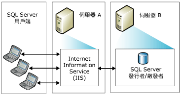
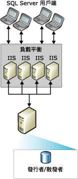
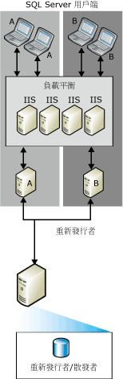

# Web 同步處理的拓撲
  您可以選擇各式各樣的 [!INCLUDE[msCoName](../../includes/msconame-md.md)] [!INCLUDE[ssNoVersion](../../includes/ssnoversion-md.md)] Web 同步處理複寫拓撲。 設定 Web 同步處理的一般方式包括：  
  
-   單一伺服器  
  
-   兩個伺服器  
  
-   多個 [!INCLUDE[msCoName](../../includes/msconame-md.md)] Internet Information Services (IIS) 系統和 [!INCLUDE[ssNoVersion](../../includes/ssnoversion-md.md)] 重新發行  
  
 設定 Web 同步處理的相關資訊，請參閱 [設定 Web 同步處理](../../relational-databases/replication/configure-web-synchronization.md)。  
  
## 單一伺服器  
 在最簡單的拓撲中，IIS、[!INCLUDE[ssNoVersion](../../includes/ssnoversion-md.md)] 發行者和 [!INCLUDE[ssNoVersion](../../includes/ssnoversion-md.md)] 散發者均位於單一伺服器中。 訂閱者透過連接到發行者端的 IIS 進行同步處理。 發行者可以位於防火牆之後。  
  
> [!NOTE]  
>  此組態建議僅在內部網路環境中使用。 對於其他狀況，建議讓 IIS 伺服器與 [!INCLUDE[ssNoVersion](../../includes/ssnoversion-md.md)] 發行者/散發者位於不同的電腦中。  
  
   
  
## 兩個伺服器  
 您可以將 IIS 置於一個伺服器，並在另一個伺服器上設定 [!INCLUDE[ssNoVersion](../../includes/ssnoversion-md.md)] 發行者和散發者。 透過防火牆可以將執行 IIS 的伺服器與網際網路隔離。 「訂閱者」則透過連接到 IIS 進行同步處理。  
  
   
  
## 多個 IIS 系統與 SQL Server 重新發行  
 如果您需要支援大量「訂閱者」的同時同步處理，可以在執行 IIS 的多台電腦間分割工作。  
  
   
  
 如果執行 [!INCLUDE[ssNoVersion](../../includes/ssnoversion-md.md)] 的電腦上需要進一步的負載平衡，您可以在多台電腦上建立重新發行階層。 最上層發行者將資料發行到訂閱者，訂閱者再重新發行資料及其負載平衡要求。  
  
> [!NOTE]  
>  訂閱者只能與特定發行者同步處理。 例如，訂閱者若訂閱重新發行者 A，則在無法使用 A 時不能改為與重新發行者 B 同步處理。  
  
   
  
## 另請參閱  
 [設定 Web 同步處理](../../relational-databases/replication/configure-web-synchronization.md)   
 [合併式複寫的 Web 同步處理](../../relational-databases/replication/web-synchronization-for-merge-replication.md)  
  
  