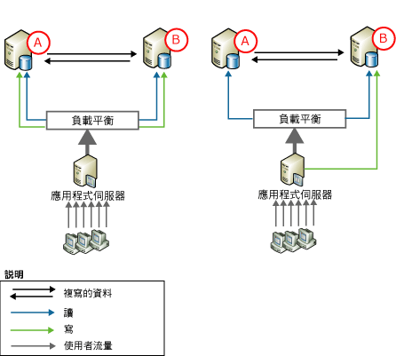
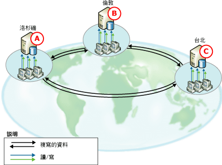
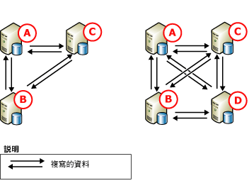

# 點對點 - 異動複寫
[!INCLUDE[appliesto-ss-xxxx-xxxx-xxx-md](../../../includes/appliesto-ss-xxxx-xxxx-xxx-md.md)]

  點對點複寫藉由維護多個伺服器執行個體之間的資料複本 (也稱為 *「節點」*) 來提供向外延展和高可用性解決方案。 點對點複寫是以異動複寫為基礎，會以接近即時、交易式的方式傳播一致的變更。 如此可讓需要向外延展讀取作業的應用程式將來自用戶端的讀取散發到多個節點之間。 由於會以接近即時的方式在節點之間維護資料，所以點對點複寫會提供資料備援性，這樣可提高資料的可用性。  
  
 請考慮 Web 應用程式。 這樣會在以下方面因為點對點複寫而獲益：  
  
-   目錄查詢和其他讀取會在多個節點之間散發。 如此可在讀取數目增加時，讓效能維持一致。  
  
-   如果系統中的其中一個節點失敗，應用程式層就可以將該節點的寫入重新導向另一個節點， 這樣會維護可用性。  
  
-   如果節點需要維護或是整個系統需要升級，可以讓每一個節點離線工作，然後再加回系統中，而不會影響應用程式的可用性。  
  
 雖然點對點複寫可向外延展讀取作業，但是拓撲的效能會類似於單一節點的效能。 這是因為在最後，所有的插入、更新和刪除都會傳播到所有節點。 當有變更套用到給定節點時，複寫可加以辨識，並防止變更在各節點間循環多次。 基於以下原因，我們強烈建議您最好只在節點上執行每一個資料列的寫入作業：  
  
-   如果在一個以上的節點上修改資料列，它可能會在此資料列傳播到其他節點時，造成衝突或甚至是遺失更新。  
  
-   在複寫變更時，一定會牽涉到某些延遲。 如果是需要立即看到最近變更的應用程式，在多個節點之間對應用程式動態進行負載平衡可能會發生問題。  
  
 點對點複寫包含了可在點對點拓撲之間啟用衝突偵測的選項， 這個選項可避免因為未偵測到的衝突所導致的問題，包括不一致的應用程式行為和遺失更新。 啟用這個選項時，預設會將衝突的變更視為造成散發代理程式失敗的嚴重錯誤。 在發生衝突時，此拓撲會維持不一致的狀態，直到以手動方式解決衝突並讓拓撲之間的資料變成一致為止。 如需相關資訊，請參閱 [Conflict Detection in Peer-to-Peer Replication](../../../relational-databases/replication/transactional/peer-to-peer-conflict-detection-in-peer-to-peer-replication.md)。  
  
> [!NOTE]  
>  若要避免潛在的資料不一致問題，請務必要避免發生點對點拓撲中的衝突，即使是啟用了衝突偵測也一樣。 若要確定只在一個節點上執行特定資料列的寫入作業，存取和變更資料的應用程式必須分割插入、更新和刪除作業。 這樣的分割可確保，從一個節點對給定資料列的修改會在其他節點修改該資料列之前，與拓撲中的所有其他節點同步處理。 如果應用程式需要複雜的衝突偵測與解決功能，請使用合併式複寫。 如需詳細資訊，請參閱[合併式複寫](../../../relational-databases/replication/merge/merge-replication.md)和[偵測及解決合併式複寫衝突](../../../relational-databases/replication/merge/advanced-merge-replication-resolve-merge-replication-conflicts.md)。  
  
## 點對點拓撲  
 以下案例說明點對點複寫的一般用法。  
  
### 有兩個參與資料庫的拓撲  
   
  
 上面的兩個圖都顯示兩個參與資料庫，而且使用者傳輸量會透過應用程式伺服器導向資料庫。 這種組態可用於從網站到工作群組應用程式的各種應用程式，且具有下列優點：  
  
-   提升讀取效能，因為讀取會在兩台伺服器間展開。  
  
-   在需要維護或一個節點失敗時具有更高的可用性。  
  
 在兩個圖例中，讀取活動在參與的資料庫間均負載平衡，但對更新的處理方式有所不同：  
  
-   在左側，會在兩個伺服器之間分割更新。 舉例來說，如果資料庫包含產品目錄，您可以讓一個自訂應用程式將名稱以 A 到 M 開頭之產品的更新導向節點 **A** ，將名稱以 N 到 Z 開頭之產品的更新導向節點 **B** 。隨後，更新會再複寫到其他節點。  
  
-   在右側，所有的更新都會導向節點 **B**。更新會從這裡複寫到節點 **A**。如果 **B** 離線 (例如，為了進行維護)，應用程式伺服器就可以將所有活動導向 **A**。當 **B** 再次連線時，更新可以流向它，而且應用程式伺服器可將所有更新移回 **B**，或是繼續將更新導向 **A**。  
  
 點對點複寫對以上兩種方法均支援，但是右側的中央更新範例也經常與標準異動複寫一起使用。  
  
### 有三個或更多參與資料庫的拓撲  
   
  
 上圖顯示為一家全球軟體支援公司提供資料的三個參與資料庫，其分公司分別設在洛杉磯、倫敦和台北。 每個辦事處的支援工程師都會接聽客戶來電，同時輸入並更新每一個客戶來電的資訊。 這三個分公司的時差為八小時，這樣工作日就不會有重疊。 當台北分公司下班時，倫敦分公司就開始一天的工作。 如果當一個辦事處即將下班時仍有來電，則來電將轉到將開始工作的下一個辦事處的代表那裡。  
  
 每一處都有資料庫和應用程式伺服器，供支援工程師輸入並更新有關客戶來電的資訊。 此拓撲是依時間分割， 因此更新就只會發生在目前正在營業的節點，隨後更新會流向其他參與資料庫。 此拓撲具有下列優點：  
  
-   獨立而不隔離：每一個分公司都可以獨立插入、更新或刪除資料，而且還可以共用資料，因為資料會複寫到所有其他的參與資料庫。  
  
-   在發生失敗或要允許對一或多個參與資料庫進行維護時，具有更高的可用性。  
  
       
  
 上圖顯示如何將節點加入到三個節點的拓撲。 基於以下原因，可以在此案例中加入節點：  
  
-   因為另一個辦事處已開始上班。  
  
-   在發生磁碟錯誤或其他重大失敗時，提供更高的可用性來支援維護或增加容錯功能。  
  
 請注意在具有三個或四個節點的拓撲中，所有的資料庫都會發行及訂閱所有其他資料庫。 這樣會在有維護需求或是其中一或多個節點失敗時，提供最大的可用性。 新增節點後，您必須針對效能以及部署與管理的複雜度來平衡可用性和延展性。  
  
## 設定點對點異動複寫  
 設定點對點複寫拓撲與設定一系列標準交易式發行集和訂閱類似。 以下主題中的步驟顯示三節點系統的組態，與顯示點對點拓撲的上圖左側組態類似。  
  
## 使用點對點複寫的考量  
 本章節提供在您使用點對點複寫時，所要考量的資訊與指導方針。  
  
### 一般考量  
  
-   點對點複寫只適用於 [!INCLUDE[ssNoVersion](../../../includes/ssnoversion-md.md)]的 Enterprise 版本。  
  
-   參與點對點複寫的所有資料庫都應該包含相同的結構描述和資料：  
  
    -   物件名稱、物件結構描述和發行集名稱都應相同。  
  
    -   發行集必須允許複寫結構描述變更 (這是發行集屬性 **replicate_ddl** 的 **1** 設定值，這是預設值)。如需詳細資訊，請參閱[對發行集資料庫進行結構描述變更](../../../relational-databases/replication/publish/make-schema-changes-on-publication-databases.md)。  
  
    -   不支援資料列和資料行篩選。  
  
-   我們建議您最好讓每一個節點都使用它自己的散發資料庫。 避免潛在的單一失敗點。  
  
-   資料表與其他物件不能包含在單一發行集資料庫的多個點對點發行集中。  
  
-   在建立任何訂閱前，必須先啟用點對點複寫的發行集。  
  
-   訂閱必須使用備份或藉由 [僅支援複寫]  選項進行初始化。 如需詳細資訊，請參閱 [不使用快照集初始化交易式訂閱](../../../relational-databases/replication/initialize-a-transactional-subscription-without-a-snapshot.md)中手動初始化訂閱。  
  
-   我們不建議您使用識別欄位。 使用識別時，您必須手動管理指派給每個參與資料庫中資料表的範圍。 如需詳細資訊，請參閱[複寫識別資料行](../../../relational-databases/replication/publish/replicate-identity-columns.md)中的＜為手動識別範圍管理指派範圍＞一節。  
  
### 功能限制  
 點對點複寫支援異動複寫的核心功能，但是不支援以下選項：  
  
-   使用快照集進行初始化和重新初始化。  
  
-   資料列和資料行篩選。  
  
-   時間戳記資料行。  
  
-   非[!INCLUDE[ssNoVersion](../../../includes/ssnoversion-md.md)] 發行者或訂閱者。  
  
-   立即更新和佇列更新訂閱。  
  
-   匿名訂閱。  
  
-   部分訂閱。  
  
-   可附加訂閱與可轉換訂閱 (這兩個選項在 [!INCLUDE[ssVersion2005](../../../includes/ssversion2005-md.md)]中都已被取代)。  
  
-   共用的散發代理程式。  
  
-   散發代理程式參數 **-SubscriptionStreams** 和記錄讀取器代理程式參數 **-MaxCmdsInTran**。  
  
-   發行項屬性 **@destination_owner** 及 **@destination_table**) 來提供向外延展和高可用性解決方案。

-   點對點異動複寫不支援建立點對點發行集的單向交易式訂閱   
  
 下列屬性有特殊考量：  
  
-   發行集屬性 **@allow_initialize_from_backup** 需要 **true**) 來提供向外延展和高可用性解決方案。  
  
-   發行項屬性 **@replicate_ddl** 需要 **true**值， **@identityrangemanagementoption** 需要 **manual**值，而 **@status** 則必須設定選項 **24** 。  
  
-   發行項屬性 **@ins_cmd**、 **@del_cmd**和 **@upd_cmd** 的值不能設定為 **SQL**) 來提供向外延展和高可用性解決方案。  
  
-   訂閱屬性 **@sync_type** 需要 **none** 或 **automatic**) 來提供向外延展和高可用性解決方案。  
  
### 維護考量  
 某些動作需要停止系統。 這表示停止所有節點上已發行之資料表的活動，並確定每個節點都已收到來自其他所有節點的所有變更。  
  
||僅限 SQL Server 2005 對等，或 SQL Server 2005 對等與 SQL Server 2008 對等及更新版本的混合|僅限 SQL Server 2005 對等，或 SQL Server 2005 對等與 SQL Server 2008 對等及更新版本的混合|SQL2008 對等及更新版本|SQL2008 對等及更新版本|  
|-|------------------------------------------------------------------------------------------------------|------------------------------------------------------------------------------------------------------|------------------------------|------------------------------|  
|將節點加入拓撲中|完整拓撲中的 2 個節點︰不需要停止。 使用 `sync_type = 'initialize with backup'`。|2 個以上的節點︰需要停止。|`sync_type = 'replication support only'`：需要停止。|`sync_type = 'initialize with backup'` 和 `'initialize from lsn'`：不需要停止。|  
  
 拓撲結構描述變更 (新增或卸除發行項) 需要停止。 如需詳細資訊，請參閱[管理點對點拓撲 &#40;複寫 Transact-SQL 程式設計&#41;](../../../relational-databases/replication/administration/administer-a-peer-to-peer-topology-replication-transact-sql-programming.md)。  
  
 從拓撲中移除節點永遠不需要停止。  
  
 使用  [sp_changearticle](../../../relational-databases/system-stored-procedures/sp-changearticle-transact-sql.md) 變更發行項屬性永遠不需要停止。 允許的變更 (適用於 P2P) 包括 `description`、 `ins_cmd`、 `upd_cmd`和 `del_cmd` 屬性。  
  
 發行項結構描述變更 (新增/卸除資料行) 永遠不需要停止。  
  
-   新增發行項︰為了將發行項加入現有的組態，我們必須停止系統、執行 CREATE TABLE 陳述式並載入拓撲中每個節點的初始資料，然後再將新的發行項加入拓撲中的每個節點。  
  
-   卸除發行項︰如果我們想要讓所有節點保持一致的狀態，則必須停止拓撲  
  
 如需詳細資訊，請參閱[停止複寫拓撲 &#40;複寫 Transact-SQL 程式設計&#41;](../../../relational-databases/replication/administration/quiesce-a-replication-topology-replication-transact-sql-programming.md) 和[管理點對點拓撲 &#40;複寫 Transact-SQL 程式設計&#41;](../../../relational-databases/replication/administration/administer-a-peer-to-peer-topology-replication-transact-sql-programming.md)。  
  
-   如果您將新的節點加入至點對點拓撲，則應該只從新節點加入之後所建立的備份進行還原。  
  
-   您無法重新初始化點對點拓撲中的訂閱。 如果您必須確定節點有資料的新副本，請在節點還原備份。  
  
## 另請參閱  
 [管理點對點拓撲 &#40;複寫 Transact-SQL 程式設計&#41;](../../../relational-databases/replication/administration/administer-a-peer-to-peer-topology-replication-transact-sql-programming.md)   
 [備份與還原快照式和異動複寫的策略](../../../relational-databases/replication/administration/strategies-for-backing-up-and-restoring-snapshot-and-transactional-replication.md)   
 [異動複寫的發行集類型](../../../relational-databases/replication/transactional/publication-types-for-transactional-replication.md)  
  
  
