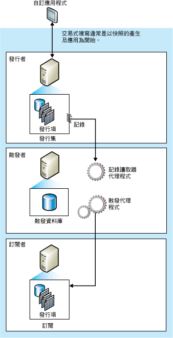

# 異動複寫
[!INCLUDE[appliesto-ss-asdb-xxxx-xxx-md.md](../../../includes/applies-to-version/sql-asdb.md)]
  通常以發行集資料庫物件和資料的快照集啟動異動複寫。 使用初始快照集後，在「發行者」端進行的後續資料變更和結構描述修改，通常會立即 (近乎即時) 傳遞到「訂閱者」。 資料變更會以相同的順序，並且在相同於「發行者」端發生之變更的交易界限內套用到「訂閱者」；因此，在發行集內會保證交易的一致性。  
  
 異動複寫一般用於伺服器對伺服器環境，並適用於下列各案例：  
  
-   您希望發生累加式更新時，能立即傳播給「訂閱者」。  
  
-   應用程式在發行者進行變更的時間與變更到達訂閱者的時間需要有低度延遲。  
  
-   應用程式需要中繼資料狀態的存取權。 例如，若資料列變更五次，異動複寫允許應用程式回應至每個變更 (如引發觸發程序)，而非只有回應至資料列的資料變更。  
  
-   發行者有極大量的插入、更新和刪除活動。  
  
-   發行者或訂閱者為非[!INCLUDE[ssNoVersion](../../../includes/ssnoversion-md.md)] 資料庫，如 Oracle。  
  
 依預設，交易式發行集的訂閱者應當成唯讀處理，因為變更並不會傳播回發行者。 不過，異動複寫的確有提供選項讓訂閱者更新。  

[!INCLUDE[azure-sql-db-replication-supportability-note](../../../includes/azure-sql-db-replication-supportability-note.md)]
  
##   異動複寫的運作方式  
 異動複寫是由「 [!INCLUDE[ssNoVersion](../../../includes/ssnoversion-md.md)] 快照集代理程式」、「記錄讀取器代理程式」及「散發代理程式」實作。 「快照集代理程式」會準備快照集檔案，內含結構描述及已發行資料表與資料庫物件的資料、將檔案儲存在快照集資料夾內，然後將同步作業記錄至散發者的散發資料庫中。  
  
 「記錄讀取器代理程式」會監視針對異動複寫設定的各資料庫交易記錄檔，並將標示為複寫的交易從交易記錄檔複製到充當可靠的儲存及轉送佇列之散發資料庫中。 「散發代理程式」會將快照集資料夾中的初始快照集檔案，以及存放在散發資料庫資料表中的交易複製到訂閱者。  
  
 根據「散發代理程式」(該代理程式能以最小延遲或排程的間隔連續執行) 的排程，在發行者端所作的累加變更會流至訂閱者。 由於必須在發行者端進行資料變更 (在無即時更新或佇列更新選項的情況下使用異動複寫)，如此一來可避免更新衝突。 最後所有訂閱者都會達到與發行者相同的值。 若異動複寫包括有即時更新或佇列更新選項，則也可在訂閱者端進行更新，但使用佇列更新時就可能會發生衝突。  
  
 下圖顯示了異動複寫的主要元件。  
  
   
  
##   初始資料集  
 新的異動複寫訂閱者所包含的資料表，必須與發行者端的資料表具有相同的結構描述與資料，才能從發行者端接收累加的變更。 初始資料集通常為由「快照集代理程式」建立，並由「散發代理程式」散發和套用的快照集。 初始資料集也可透過備份或其他方式 (如 [!INCLUDE[ssNoVersion](../../../includes/ssnoversion-md.md)] Integration Services) 來提供。  
  
 當快照集散發並套用至訂閱者時，只有等待初始快照集的訂閱者會受到影響。 該發行集的其他訂閱者 (已初始化的訂閱者) 則不會受影響。  
  
## 並行快照集處理(Concurrent Snapshot Processing)  
 快照式複寫將共用鎖定放置於快照集產生期間，作為部份複寫發行的所有資料表中。 這可避免在發行資料表中進行更新。 並行快照集處理 (異動複寫的預設行為) 在整個快照集產生期間不會設定共用鎖定，這讓使用者可在複寫建立初始快照集檔案期間繼續工作而不受中斷。  
  
##   快照集代理程式  
 「快照集代理程式」在異動複寫中實作初始快照集的程序，與在快照式複寫中使用的程序相同 (上述並行快照集處理的部份除外)。  
  
 快照集檔案產生之後，您可以使用 [!INCLUDE[msCoName](../../../includes/msconame-md.md)] Windows Explorer 在快照集資料夾中檢視它們。  
  
##   修改資料與記錄讀取器代理程式  
 「記錄讀取器代理程式」在散發者端執行；它通常會連續執行，但也可根據您建立的排程執行。 「記錄讀取器代理程式」執行時，會先讀取發行集的交易記錄檔 (與一般 [!INCLUDE[ssNoVersion](../../../includes/ssnoversion-md.md)] Database Engine 作業時，交易追蹤和復原使用的資料庫記錄相同)，然後識別任何 INSERT、UPDATE 及 DELETE 陳述式，或對已標示為複寫之交易資料所作的其他修改。 接下來，此代理程式會將這些交易按批次複製到散發者端的散發資料庫中。 「記錄讀取器代理程式」使用內部預存程序 **sp_replcmds** 從記錄檔中取得標示為要複寫的下一組命令。 之後散發資料庫即成為儲存及轉送的佇列，變更會從這裡被送至訂閱者端。 只有經過認可的交易才會被送至散發資料庫。  
  
 在整個批次的交易順利地寫入散發資料庫之後，就表示它已經通過認可了。 在每一批次的命令均通過散發者認可之後，「記錄讀取器代理程式」便會呼叫 **sp_repldone** ，以標示最後一次複寫完成之處。 最後，代理程式會標示出交易記錄檔中有哪些資料列已經備妥可以清除。 仍在等待複寫的資料列不會被清除。  
  
 交易命令在傳播到所有訂閱者之前或達到最長散發保留期限之前，會儲存於散發資料庫中。 訂閱者接收交易的順序，與這些交易套用在發行者端時的順序相同。  
  
##   散發代理程式  
 若為發送訂閱，散發代理程式會在散發者端執行；若為提取訂閱，則散發代理程式會在訂閱者端執行。 該代理程式會將交易從散發資料庫移至訂閱者。 如果訂閱標示為驗證，則「散發代理程式」還會檢查發行者端和訂閱者端的資料是否相符。  

## 發行集類型 
異動複寫提供四種發行集類型：  
  
|發行集類型|描述|  
|----------------------|-----------------|  
|標準交易式發行集|適合於「訂閱者」端的所有資料均為唯讀狀態 (異動複寫並不在「訂閱者」端強制這個屬性) 的拓撲。   當使用 Transact-SQL 或 Replication Management Objects (RMO) 時，依預設，會建立標準交易式發行集。 當使用「新增發行集精靈」時，它們會透過選取 **[發行集類型]** 頁面上的 **[交易式發行集]** 來建立。   如需建立發行集的詳細資訊，請參閱 [發行資料和資料庫物件](../../../relational-databases/replication/publish/publish-data-and-database-objects.md)。|  
|具有可更新訂閱的交易式發行集|這個發行集類型的特性為：   -每個位置都有相同的資料，含有一個「發行者」和一個「訂閱者」。   -您可以更新「訂閱者」端的資料列  -此拓撲最適合於需要高可用性和讀取延展性的伺服器環境。  如需詳細資訊，請參閱[可更新訂閱](../../../relational-databases/replication/transactional/updatable-subscriptions-for-transactional-replication.md)。|  
|點對點拓撲|這個發行集類型的特性為：  -每個位置都有相同的資料，並同時充當「發行者」與「訂閱者」。  -若要變更同一資料行，一次只能在一個位置變更。  -支援[衝突偵測](../../../relational-databases/replication/transactional/peer-to-peer-conflict-detection-in-peer-to-peer-replication.md)   -此拓撲最適合需要高可用性和讀取延展性的伺服器環境。  如需相關資訊，請參閱 [Peer-to-Peer Transactional Replication](../../../relational-databases/replication/transactional/peer-to-peer-transactional-replication.md)。|  
|雙向異動複寫|這個發行集類型的特性為： 雙向複寫類似於點對點複寫，不過，它並不提供衝突解決。 此外，雙向複寫僅限於 2 部伺服器。    如需詳細資訊，請參閱[雙向異動複寫](../../../relational-databases/replication/transactional/bidirectional-transactional-replication.md) |  
  
  
