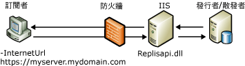

# 合併式複寫的 Web 同步處理
[!INCLUDE[appliesto-ss-xxxx-xxxx-xxx-md](../../includes/appliesto-ss-xxxx-xxxx-xxx-md.md)]
  合併式複寫的 Web 同步處理可讓您利用 HTTPS 通訊協定來複寫資料，而且對下列案例很有用：  
  
-   透過網際網路同步處理來自行動使用者的資料。  
  
-   跨越公司防火牆在 [!INCLUDE[msCoName](../../includes/msconame-md.md)] [!INCLUDE[ssNoVersion](../../includes/ssnoversion-md.md)] 資料庫之間同步處理資料。  
  
 例如，旅行途中的銷售代表可以使用 Web 同步處理。 [!INCLUDE[ssSampleDBCoFull](../../includes/sssampledbcofull-md.md)]公司有許多銷售代表需要訪問他們所在地區的各店鋪及供應商。 長途旅行時，這些銷售代表會在旅館中停宿，他們需要一個便利的方式可以讓他們在每日結束時上傳銷售資料並下載產品更新。  
  
 [!INCLUDE[ssSampleDBCoShort](../../includes/sssampledbcoshort-md.md)] 的 IT 部門用 [!INCLUDE[ssNoVersion](../../includes/ssnoversion-md.md)] 對每台可攜式電腦進行了設定，可以讓合併式複寫使用 Web 同步處理。 每台可攜式電腦上的合併代理程式都有一個指向複寫元件的網際網路 URL，這些複寫元件安裝在執行 [!INCLUDE[msCoName](../../includes/msconame-md.md)] Internet Information Services (IIS) 的電腦上。 這些元件會利用發行者來同步處理訂閱者。 現在每個銷售代表都可以透過任何可用的網際網路連接進行連線，而不需要使用遠端撥號連接，並能夠上傳及下載適當的資料。 網際網路連接使用了「安全通訊端層」(SSL)，因此不需要使用虛擬私人網路 (VPN)。  
  
 如需設定 Web 同步處理所需元件的資訊，請參閱[設定 Web 同步處理](../../relational-databases/replication/configure-web-synchronization.md)、[針對 Web 同步處理設定 IIS](../../relational-databases/replication/configure-iis-for-web-synchronization.md) 和[針對 Web 同步處理設定 IIS 7](../../relational-databases/replication/configure-iis-7-for-web-synchronization.md)。  
  
> [!NOTE]  
>  Web 同步處理專為同步處理可攜式電腦、手持式裝置及其他用戶端的資料而設計。 Web 同步處理並非用於高容量伺服器至伺服器應用程式。  
  
## Web 同步處理運作方式概觀  
 當使用 Web 同步處理時，訂閱者端的更新會封裝並當作 XML 訊息用 HTTPS 通訊協定傳送到執行 IIS 的電腦。 然後執行 IIS 的電腦會以二進位格式 (通常使用 TCP/IP) 將命令傳送到發行者。 發行者端的更新會傳送到執行 IIS 的電腦，然後封裝為 XML 訊息傳遞到訂閱者。  
  
 下圖顯示了合併式複寫之 Web 同步處理所涉及的部分元件。  
  
   
  
 Web 同步處理是僅用於提取訂閱的選項；因此「合併代理程式」永遠是在訂閱者端執行。 此合併代理程式可以是標準合併代理程式、合併代理程式 ActiveX 控制項，或透過 Replication Management Objects (RMO) 提供同步處理的應用程式。 若要指定執行 IIS 之電腦的位置，請將 **–InternetUrl** 參數用於合併代理程式。  
  
 [!INCLUDE[ssNoVersion](../../includes/ssnoversion-md.md)] Replication Listener (Replisapi.dll) 在執行 IIS 的電腦上設定，負責處理從發行者和訂閱者傳送到伺服器的訊息。 拓撲中的每個節點都利用「合併式複寫重新調整器」(Replrec.dll) 來處理 XML 資料流。  
  
 參與 Web 同步處理的所有電腦都需要[!INCLUDE[ssVersion2005](../../includes/ssversion2005-md.md)] 或更新版本。  
  
### 同步處理程序  
 同步處理期間會發生下列步驟：  
  
1.  合併代理程式會在訂閱者端啟動。 此代理程式會執行下列動作：  
  
    1.  建立到訂閱資料庫的 SQL 連接。  
  
    2.  從資料庫擷取任何變更。  
  
    3.  對執行 IIS 的電腦進行 HTTPS 要求。  
  
    4.  上傳資料變更來做為 XML 訊息。  
  
2.  執行 IIS 的電腦上主控的 [!INCLUDE[ssNoVersion](../../includes/ssnoversion-md.md)] Replication Listener 和合併式複寫重新調整器會執行下列動作：  
  
    1.  回應 HTTPS 要求。  
  
    2.  建立到發行集資料庫的 SQL 連接。  
  
    3.  將上傳變更套用到發行集資料庫。  
  
    4.  擷取訂閱者的下載變更。  
  
    5.  將 HTTPS 回應傳回合併代理程式。  
  
3.  接著，訂閱者端的合併代理程式會接受 HTTPS 回應，並將下載變更套用到訂閱資料庫。  
  
## 另請參閱  
 [Configure Web Synchronization](../../relational-databases/replication/configure-web-synchronization.md)   
 [Web 同步處理的拓撲](../../relational-databases/replication/topologies-for-web-synchronization.md)  
  
  
