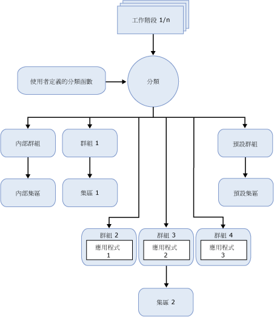

# 資源管理員
[!INCLUDE[appliesto-ss-asdbmi-xxxx-xxx-md](../../includes/appliesto-ss-asdbmi-xxxx-xxx-md.md)]
  [!INCLUDE[ssNoVersion](../../includes/ssnoversion-md.md)] 資源管理員是一項功能，可讓您用於管理 [!INCLUDE[ssNoVersion](../../includes/ssnoversion-md.md)] 工作負載和系統資源耗用量。 Resource Governor 可讓您指定內送應用程式要求所能使用的 CPU、實體 IO 和記憶體數量限制。  
  
## 資源管理員的優點  
 資源管理員可讓您藉由指定內送要求的資源耗用量限制來管理 [!INCLUDE[ssNoVersion](../../includes/ssnoversion-md.md)] 工作負載和資源。 在「資源管理員」環境中，工作負載是一組大小類似的查詢或要求，可以也應該將其視為單一實體。 這不是一項規定，但是當工作負載的資源使用模式越一致時，您就可以從「資源管理員」得到更多的好處。 可以即時重新設定資源限制，對正在執行的工作負載造成最低的影響。  
  
 在相同伺服器上有多個相異工作負載的環境中，資源管理員可讓您區分這些工作負載，並根據您指定的限制在要求的情況下配置共用資源。 這些資源是 CPU、實體 IO 和記憶體。  
  
 使用資源管理員，您可以：  
  
-   在服務多個用戶端工作負載的 SQL Server 單一執行個體上，提供多組織用戶管理和資源隔離。 也就是說，您可以將伺服器上的可用資源分割給各工作負載，將工作負載競爭資源時所發生的問題減到最少。  
  
-   為多工作負載和多使用者環境中的工作負載租用戶提供可預測的效能及支援 SLA。  
  
-   針對 DBCC CHECKDB 等會使 IO 子系統飽和以及對其他工作負載產生負面影響的作業，隔離並限制失控查詢或對 IO 資源進行節流。  
  
-   針對資源使用量交易糾紛，加入細部鎖定資源追蹤，並且為伺服器資源的取用者提供預測帳單。  
  
## 資源管理員條件約束  
 這一版的資源管理員有以下條件約束：  
  
-   資源管理受限於 [!INCLUDE[ssDEnoversion](../../includes/ssdenoversion-md.md)]。 「資源管理員」無法用於 [!INCLUDE[ssASnoversion](../../includes/ssasnoversion-md.md)]、 [!INCLUDE[ssISnoversion](../../includes/ssisnoversion-md.md)]和 [!INCLUDE[ssRSnoversion](../../includes/ssrsnoversion-md.md)]。  
  
-   在 SQL Server 執行個體之間，沒有任何工作負載監視或工作負載管理。  
  
-   資源管理員可以管理 OLTP 工作負載，但是這些類型的查詢 (通常持續時間會很短) 在 CPU 上的時間不一定都夠長而足以套用頻寬控制。 這樣可能會扭曲針對 CPU 使用量百分比傳回的統計資料。  
  
-   管理實體 IO 的能力只適用於使用者作業，而非系統工作。 系統工作包含交易記錄的寫入作業及延遲寫入器 IO 作業。 由於大部分寫入作業通常是由系統工作來執行，因此資源管理員主要適用於使用者讀取作業。  
  
-   您無法設定內部資源集區的 IO 臨界值。  
  
## 資源概念  
 下列三個概念是了解和使用資源管理員的基礎：  
  
-   **資源集區。** 資源集區代表伺服器的實體資源。 您可以將集區視為 [!INCLUDE[ssNoVersion](../../includes/ssnoversion-md.md)] 執行個體內部的虛擬 [!INCLUDE[ssNoVersion](../../includes/ssnoversion-md.md)] 執行個體。 安裝 [!INCLUDE[ssNoVersion](../../includes/ssnoversion-md.md)] 時，系統會建立兩個資源集區 (內部和預設)。 資源管理員也可支援使用者定義的資源集區。 如需詳細資訊，請參閱 [Resource Governor Resource Pool](../../relational-databases/resource-governor/resource-governor-resource-pool.md)。  
  
-   **工作負載群組。** 工作負載群組可做為有類似分類準則之工作階段要求的容器。 工作負載允許對工作階段進行彙總監視，並定義工作階段的原則。 每個工作負載群組各在一個資源集區中。 安裝 [!INCLUDE[ssNoVersion](../../includes/ssnoversion-md.md)] 時，系統會建立兩個工作負載群組 (內部和預設)，並將其對應至相對應的資源集區。 資源管理員也可支援使用者定義的工作負載群組。 如需相關資訊，請參閱 [Resource Governor Workload Group](../../relational-databases/resource-governor/resource-governor-workload-group.md)。  
  
-   **分類。** 分類程序會根據工作階段的特性，將工作階段指派給工作負載群組。 您可以透過撰寫使用者定義函數 (稱為分類函數) 來自訂分類邏輯。 資源管理員也可支援實作分類規則的使用者定義分類函數。 如需詳細資訊，請參閱 [Resource Governor Classifier Function](../../relational-databases/resource-governor/resource-governor-classifier-function.md)。  
  
> [!NOTE]  
>  資源管理員不會對專用管理員連接 (DAC) 進行任何控制， 因為根本不需要分類在內部工作負載群組和資源集區中執行的 DAC 查詢。  
  
 在資源管理員的內容中，您可以將上述概念視為元件。 下圖將顯示這些元件以及它們在 Database Engine 環境中存在時，彼此的關聯性。 從處理的觀點而言，簡化的流程如下所示：  
  
-   工作階段 (工作階段 1，共 *n*個) 的內送連接已存在。  
  
-   工作階段進行分類 (分類)。  
  
-   工作階段工作負載路由傳送至某個工作負載群組 (例如，群組 4)。  
  
-   工作負載群組使用與它相關聯的資源集區 (例如，集區 2)  
  
-   資源集區提供並限制應用程式 (例如，應用程式 3) 所需的資源。  
  
   
  
## 資源管理員工作  
  
|工作描述|主題|  
|----------------------|-----------|  
|描述如何啟用資源管理員。|[啟用資源管理員](../../relational-databases/resource-governor/enable-resource-governor.md)|  
|描述如何停用資源管理員。|[停用資源管理員](../../relational-databases/resource-governor/disable-resource-governor.md)|  
|描述如何建立、改變和卸除資源集區。|[資源管理員資源集區](../../relational-databases/resource-governor/resource-governor-resource-pool.md)|  
|描述如何建立、改變、移動及卸除工作負載群組。|[資源管理員工作負載群組](../../relational-databases/resource-governor/resource-governor-workload-group.md)|  
|描述如何建立和測試分類使用者定義函數。|[資源管理員分類函數](../../relational-databases/resource-governor/resource-governor-classifier-function.md)|  
|描述如何使用範本設定資源管理員。|[使用範本設定資源管理員](../../relational-databases/resource-governor/configure-resource-governor-using-a-template.md)|  
|描述如何檢視資源管理員的屬性。|[檢視資源管理員屬性](../../relational-databases/resource-governor/view-resource-governor-properties.md)|  
  
## 另請參閱  
 [Database Engine 執行個體 &#40;SQL Server&#41;](../../database-engine/configure-windows/database-engine-instances-sql-server.md)  
  
  
