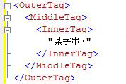
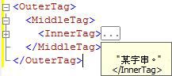

# <a name="code-outlining"></a>程式碼大綱
[!INCLUDE[appliesto-ss-asdb-asdw-pdw-md](../../includes/appliesto-ss-asdb-asdw-pdw-md.md)]
  您可以使用 [!INCLUDE[ssManStudioFull](../../includes/ssmanstudiofull-md.md)] 查詢編輯器中的大綱功能，在您編輯查詢時選擇性地隱藏程式碼。 這可讓您更輕易地檢視正在處理的程式碼，尤其是處理大型查詢檔案的情況。  
  
## <a name="outlining-overview"></a>大綱概觀  
 根據預設，當您開啟查詢編輯器視窗時，所有程式碼都會顯示出來。 您可以摺疊程式碼的區域，以便隱藏這些程式碼。 編輯器視窗左邊緣的垂直線會使用含有減號 (-) 的正方形來識別每個可摺疊程式碼區域的開頭。 當您按一下減號時，程式碼區域的文字就會被取代成包含三個句號 (...) 的方塊，而且減號會變更為加號 (+)。 當您按一下加號時，摺疊的程式碼就會顯示出來，而且加號會變更為減號。 當您將指標移至具有三個句號的方塊上方時，就會出現一個工具提示，其中顯示已摺疊區段中的程式碼。  
  
## <a name="system-outline-regions"></a>系統大綱區域  
 每個 [!INCLUDE[ssManStudioFull](../../includes/ssmanstudiofull-md.md)] 編輯器都會產生一組預設的系統定義大綱區域。  
  
 MDX 和 DMX 程式碼編輯器會針對每個多行陳述式建立大綱區域。 這是這些編輯器唯一支援的大綱層級。  
  
### <a name="analysis-services-xmla-query-editor-regions"></a>Analysis Services XMLA 查詢編輯器區域  
 [!INCLUDE[ssASnoversion](../../includes/ssasnoversion-md.md)] XMLA 查詢編輯器會針對每個多行 XML 屬性產生一個大綱區域。 此編輯器會針對巢狀標記建立大綱區域的巢狀結構。 例如，XMLA 編輯器會針對下列文件建立三個大綱區域。  
  
   
  
 當您按一下 \<InnerTag> 行的減號時，只會摺疊 InnerTag，如下圖所示。  
  
   
  
 當您將指標移至具有三個句號 (...) 的方塊上方時，已摺疊區域中的程式碼就會顯示在工具提示中，如下圖所示。  
  
   
  
 當您按一下 \<MiddleTag> 行的減號時，就會同時摺疊 MiddleTag 和 InnerTag，如下圖所示。  
  
   
  
 當您按一下 \<OuterTag> 行的減號時，就會摺疊這三行，如下圖所示。  
  
   
  
### <a name="database-engine-query-editor-regions"></a>Database Engine 查詢編輯器區域  
 [!INCLUDE[ssDE](../../includes/ssde-md.md)] 查詢編輯器會針對下列階層中的每個元素產生大綱區域：  
  
1.  批次。 第一個批次是從檔案開頭到第一個 GO 命令或檔案結尾 (如果沒有 GO 命令的話) 的程式碼。 在第一個 GO 之後，從每個 GO 命令到下一個 GO 命令或檔案結尾還有一個批次。  
  
2.  以下列關鍵字分隔的區塊：  
  
    -   BEGIN - END  
  
    -   BEGIN TRY - END TRY  
  
    -   BEGIN CATCH - END CATCH  
  
3.  多行陳述式。  
  
 例如， [!INCLUDE[ssDE](../../includes/ssde-md.md)] 查詢編輯器會針對下列查詢建立三個大綱區域：  
  
```  
CREATE PROCEDURE Sales.SampleProc --Outline region 1  
AS  
BEGIN --Outline region 2   
  SELECT GETDATE() AS TimeOfQuery;  
  SELECT * --Outline region 3  
  FROM sys.transmission_queue;  
  SELECT @@VERSION;  
END;  
GO  
```  
  
 您可以按一下 `SELECT *` 行的減號，以便單獨摺疊該 `SELECT` 陳述式。 若要摺疊整個 `BEGIN - END` 區塊，請按一下 `BEGIN` 行的減號。 若要摺疊整個批次至 `GO` 命令，請按一下 `CREATE PROCEDURE` 行的減號。 您無法個別摺疊 `SELECT GETDATE()` 或 `SELECT @@VERSION` 行，因為它們是單行陳述式而且沒有取得大綱區域。  
  
  
