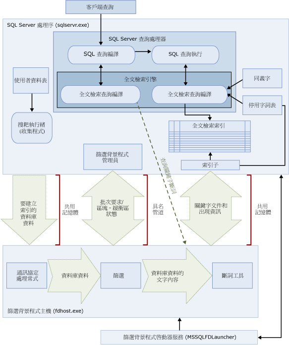

# <a name="full-text-search"></a>全文檢索搜尋
[!INCLUDE[appliesto-ss-asdb-xxxx-xxx-md](../../includes/appliesto-ss-asdb-xxxx-xxx-md.md)]

[!INCLUDE[ssNoVersion](../../includes/ssnoversion-md.md)] 和 [!INCLUDE[ssSDSFull](../../includes/sssdsfull-md.md)] 中的全文檢索搜尋可讓使用者和應用程式針對 [!INCLUDE[ssNoVersion](../../includes/ssnoversion-md.md)] 資料表中以字元為主的資料，執行全文檢索查詢。
  
## <a name="basic-tasks"></a>基本工作
本主題提供全文檢索搜尋的概觀，並描述其元件和其架構。 如果您想要立即開始，則以下是基本工作。
-   [全文檢索搜尋使用者入門](../../relational-databases/search/get-started-with-full-text-search.md)
-   [建立及管理全文檢索目錄](../../relational-databases/search/create-and-manage-full-text-catalogs.md)
-   [建立及管理全文檢索索引](../../relational-databases/search/create-and-manage-full-text-indexes.md)
-   [擴展全文檢索索引](../../relational-databases/search/populate-full-text-indexes.md)
-   [使用全文檢索搜尋查詢](../../relational-databases/search/query-with-full-text-search.md)

> [!NOTE]
> Full-Text Search is an optional component of the [!INCLUDE[ssNoVersion](../../includes/ssnoversion-md.md)] Database Engine 的選擇性元件。 如果您在安裝 SQL Server 時未選取全文檢索搜尋，請重新執行 SQL Server 安裝程式予以新增。

## <a name="overview"></a>概觀
全文檢索索引包括資料表中一或多個以字元為基礎的資料行。 這些資料行可以具有下列任何資料類型：**char**、**varchar**、**nchar**、**nvarchar**、**text**、**ntext**、**image**、**xml** 或 **varbinary(max)** 和 **FILESTREAM**。 每個全文檢索索引都會為資料表中的一個或多個資料行建立索引，而且每個資料行都可以使用特定的語言。  
  
 全文檢索查詢會根據特定語言的規則 (例如英文或日文) 在單字與片語上運作，藉以針對全文檢索索引中的文字資料執行語言搜尋。 全文檢索查詢可以包含簡單的單字和片語，或者單字或片語的多種形式。 全文檢索查詢會傳回至少包含一個符合項目 (也稱為 *「叫用」* (Hit)) 的任何文件。 如果目標文件包含全文檢索查詢中指定的所有詞彙，而且符合其他搜尋條件 (例如相符詞彙之間的距離)，就會出現符合項目。    
  
##  <a name="queries"></a> 全文檢索搜尋查詢  
 將資料行加入至全文檢索索引之後，使用者和應用程式即可針對資料行中的文字執行全文檢索查詢。 這些查詢可以搜尋下列任何項目：  
  
-   一或多個特定的單字或片語 ( *「不可分割的詞彙」* (Simple Term))  
  
-   以指定之文字開頭的單字或片語 ( *「前置詞彙」* (Prefix Term))  
  
-   特定單字的字形變化 ( *「衍生詞彙」* (Generation Term))  
  
-   靠近另一個單字或片語的單字或片語 ( *「相近詞彙」* (Proximity Term))  
  
-   特定單字的同義字變化 ( *「同義字」* (Thesaurus))  
  
-   使用加權值的單字或片語 ( *「加權詞彙」* (Weighted Term))  
  
 全文檢索查詢不區分大小寫。 例如，搜尋 "Aluminum" 或 "aluminum" 都會傳回相同的結果。  
  
 全文檢索查詢會使用一小組 [!INCLUDE[tsql](../../includes/tsql-md.md)] 述詞 (CONTAINS 和 FREETEXT) 與函數 (CONTAINSTABLE 和 FREETEXTTABLE)。 不過，給定商務案例的搜尋目標會影響全文檢索查詢的結構。 例如：  
  
-   電子商務 - 搜尋網站上的產品：  
  
    ```  
    SELECT product_id   
    FROM products   
    WHERE CONTAINS(product_description, "Snap Happy 100EZ" OR FORMSOF(THESAURUS,'Snap Happy') OR '100EZ')   
    AND product_cost < 200 ;  
    ```  
  
-   人員招募案例 - 搜尋具有 [!INCLUDE[ssNoVersion](../../includes/ssnoversion-md.md)] 使用經驗的工作應徵者：  
  
    ```  
    SELECT candidate_name,SSN   
    FROM candidates   
    WHERE CONTAINS(candidate_resume,"SQL Server") AND candidate_division = 'DBA';  
    ```  
  
 如需詳細資訊，請參閱 [使用全文檢索搜尋查詢](../../relational-databases/search/query-with-full-text-search.md)。  
  
##  <a name="like"></a> 比較全文檢索搜尋查詢與 LIKE 述詞
 相較於全文檢索搜尋，[LIKE](../../t-sql/language-elements/like-transact-sql.md) [!INCLUDE[tsql](../../includes/tsql-md.md)] 述詞只能針對字元模式運作。 您也無法使用 LIKE 述詞來查詢格式化的二進位資料。 此外，針對大量非結構化文字資料執行 LIKE 查詢的速度會比針對相同資料執行對等全文檢索查詢的速度要慢很多。 對於數百萬列的資料，使用 LIKE 查詢時可能要好幾分鐘才能傳回搜尋結果，但是使用全文檢索查詢時可能只要幾秒鐘的時間 (視傳回的資料列數目而定)。  
  
##  <a name="architecture"></a> 全文檢索搜尋架構
 全文檢索搜尋架構是由下列處理序所組成：  
  
-   [!INCLUDE[ssNoVersion](../../includes/ssnoversion-md.md)] 處理序 (sqlservr.exe)。  
  
-   篩選背景程式主機處理序 (fdhost.exe)。  
  
     基於安全性理由，篩選是由稱為篩選背景程式主機的個別處理序載入。 FDHOST 啟動器服務 (MSSQLFDLauncher) 會建立 fdhost.exe 處理序，而且這些處理序會在 FDHOST 啟動器服務帳戶的安全性認證底下執行。 因此，您必須執行 FDHOST 啟動器服務，才能讓全文檢索索引和全文檢索查詢運作。 如需設定此服務之服務帳戶的相關資訊，請參閱 [設定全文檢索篩選背景程式啟動器的服務帳戶](../../relational-databases/search/set-the-service-account-for-the-full-text-filter-daemon-launcher.md)。  
  
 這兩個處理序包含全文檢索搜尋架構的元件。 下圖將摘要列出這些元件及其關聯性。 這些元件將在該圖之後描述。  
  
   

###  <a name="sqlprocess"></a> SQL Server 處理序  
 [!INCLUDE[ssNoVersion](../../includes/ssnoversion-md.md)] 處理序會使用全文檢索搜尋的下列元件：  
  
-   **使用者資料表。** 這些資料表包含要進行全文檢索索引的資料。  
  
-   **全文檢索收集程式。** 全文檢索收集程式會使用全文檢索搜耙執行緒。 此元件負責排程和驅動全文檢索索引母體擴展，以及監視全文檢索目錄。  
  
-   **同義字檔案。** 這些檔案包含搜尋詞彙的同義字。 如需詳細資訊，請參閱 [設定及管理全文檢索搜尋的同義字檔案](../../relational-databases/search/configure-and-manage-thesaurus-files-for-full-text-search.md)。  
  
-   **停用字詞表物件。** 停用字詞表物件包含對搜尋沒有任何協助之常見單字的清單。 如需詳細資訊，請參閱 [設定及管理全文檢索搜尋的停用字詞與停用字詞表](../../relational-databases/search/configure-and-manage-stopwords-and-stoplists-for-full-text-search.md)。  
  
-   **[!INCLUDE[ssNoVersion](../../includes/ssnoversion-md.md)] 查詢處理器。** 查詢處理器會編譯並執行 SQL 查詢。 如果某個 SQL 查詢包含全文檢索搜尋查詢，該查詢就會在編譯和執行期間傳送至全文檢索引擎。 系統會針對全文檢索索引比對查詢結果。  
  
-   **全文檢索引擎。** [!INCLUDE[ssNoVersion](../../includes/ssnoversion-md.md)] 中的全文檢索引擎現在已經與查詢處理器完全整合了。 全文檢索引擎會編譯並執行全文檢索查詢。 在查詢執行期間，全文檢索引擎可能會收到來自同義字和停用字詞表的輸入。  

    >[!NOTE]  
    >  在 [!INCLUDE[ssKatmai](../../includes/sskatmai-md.md)] 及更新的版本中，全文檢索引擎位於 [!INCLUDE[ssNoVersion](../../includes/ssnoversion-md.md)] 處理序中，而非個別的服務中。 將全文檢索引擎整合到 Database Engine，已改善全文檢索管理能力、混合式查詢的最佳化，以及整體效能。  

-   **索引寫入器 (索引子)。** 索引寫入器會建立用來儲存索引 Token 的結構。  
  
-   **篩選背景程式管理員。** 篩選背景程式管理員會負責監視全文檢索引擎篩選背景程式主機的狀態。  
  
###  <a name="fdhostprocess"></a> Filter Daemon Host process  
 篩選背景程式主機是全文檢索引擎所啟動的處理序。 它會執行下列全文檢索搜尋元件，而這些元件會負責存取、篩選和斷詞處理資料表的資料，以及斷詞處理和詞幹分析查詢輸入。  
  
 篩選背景程式主機的元件如下所示：  
  
-   **通訊協定處理常式。** 這個元件會從記憶體中提取資料以便進一步處理，而且會從指定之資料庫中的使用者資料表中存取資料。 其中一項責任就是從建立全文檢索索引的資料行中蒐集資料，並將資料傳遞給篩選背景程式主機，然後此處理序將會視需要套用篩選和斷詞工具。  
  
-   **篩選器。** 某些資料類型需要先篩選，然後才能針對文件中的資料建立全文檢索索引，包括 **varbinary**、 **varbinary(max)** 、 **image**或 **xml** 資料行中的資料。 用於給定文件的篩選會因其文件類型而不同。 例如，Microsoft Word (.doc) 文件、Microsoft Excel (.xls) 文件和 XML (.xml) 文件會使用不同的篩選。 然後，篩選會從文件中擷取文字區塊，並且移除內嵌的格式，並保留文字和文字位置的相關資訊。 其結果就是文字資訊的資料流。 如需詳細資訊，請參閱 [設定及管理搜尋的篩選](../../relational-databases/search/configure-and-manage-filters-for-search.md)。  
  
-   **斷詞工具和字幹分析器。** 斷詞工具是一項語言特有的元件，它會根據給定語言的語彙規則來尋找文字分界 ( *「斷詞」* (Word Breaking))。 每個斷詞工具都與語言特有的字幹分析器元件相關聯，而且此元件會進行動詞變化和執行字形擴展。 建立索引時，篩選背景程式主機會使用斷詞工具和字幹分析器，針對來自給定資料表資料行的文字資料執行語言分析。 與全文檢索索引中資料表資料行相關聯的語言會決定哪些斷詞工具和字幹分析器要用於建立該資料行的索引。 如需詳細資訊，請參閱 [設定及管理搜尋的斷詞工具與字幹分析器](../../relational-databases/search/configure-and-manage-word-breakers-and-stemmers-for-search.md)。  
  
##  <a name="processing"></a> 全文檢索搜尋處理  
 全文檢索搜尋是由全文檢索引擎所提供。 此全文檢索引擎扮演兩個角色：索引支援和查詢支援。  
  
###  <a name="indexing"></a> 全文檢索索引處理序  
 全文檢索擴展 (也就是搜耙) 起始時，全文檢索引擎會將大批的資料發送至記憶體中，並通知篩選背景程式主機。 此主機會針對資料進行篩選並斷詞，並且將轉換的資料轉換成反向字詞清單。 然後，全文檢索搜尋會從這些字詞清單中提取轉換的資料、處理資料以便移除停用字詞，並且將批次的字詞清單保存在一或多個反向索引中。  
  
 對 **varbinary(max)** 或 **image** 資料行中儲存的資料編製索引時，實作 **IFilter** 介面的篩選會依據為該資料指定的檔案格式 (例如 [!INCLUDE[msCoName](../../includes/msconame-md.md)] Word 格式) 擷取文字。 在某些情況下，篩選元件必須將 **varbinary(max)** 或 **image** 資料寫出至 filterdata 資料夾，而不是推送至記憶體中。  
  
 做為處理程序的一部分，收集的文字資料在經由文字分隔的處理之後，會分隔成 Token 或關鍵字。 用於 Token 化的語言是在資料行層級指定，也可由篩選元件在 **varbinary(max)** 、 **image**或 **xml** 資料中識別。  
  
 您可以在停用字詞和 Token 儲存至全文檢索索引或索引片段前，進行額外的處理以移除停用字詞並將 Token 正規化。  
  
 完成母體擴展後會觸發最後的合併程序，將索引片段合併成一個主要的全文檢索索引。 如此可提升查詢的效能，因為只需要查詢一個主索引而不需查詢數個索引片段，而且可使用較佳的計分系統來排定關聯順序。  
  
###  <a name="querying"></a> 全文檢索查詢處理序  
 查詢處理器會將查詢的全文檢索部分傳遞至全文檢索引擎，以便進行處理。 全文檢索引擎會執行斷詞並選擇性地執行同義字展開、詞幹分析和停用字詞 (非搜尋字) 處理。 然後，查詢的全文檢索部分會以 SQL 運算子的形式表示，主要表示成資料流資料表值函式 (STVF)。 在查詢執行期間，這些 STVF 會存取反向索引來擷取正確的結果。 接著，這些結果會在此時傳回用戶端，或在傳回用戶端之前進一步處理。  

## <a name="full-text-index-architecture"></a>全文檢索索引架構
  全文檢索引擎會使用全文檢索索引中的資訊來編譯全文檢索查詢，以便快速地在資料表中搜尋特定字詞或字詞組合。 全文檢索索引會儲存重要單字及這些單字在資料庫資料表之一或多個資料行內位置的相關資訊。 全文檢索索引是一種特殊類型的 Token 式功能索引，由 Full-Text Engine for [!INCLUDE[ssNoVersion](../../includes/ssnoversion-md.md)]所建立與維護。 建立全文檢索索引的程序與建立其他索引類型的程序大不相同。 全文檢索引擎會根據個別 Token 從索引中的文字建立反向、堆疊以及壓縮的索引結構，而不是根據特定資料列中所儲存的值來建構 B 型樹狀結構。  全文檢索索引的大小只受限於執行 [!INCLUDE[ssNoVersion](../../includes/ssnoversion-md.md)] 執行個體之電腦的可用記憶體資源。  
  
 從 [!INCLUDE[ssKatmai](../../includes/sskatmai-md.md)]開始，全文檢索索引會與 Database Engine 整合在一起，而非位於檔案系統中，如同舊版 [!INCLUDE[ssNoVersion](../../includes/ssnoversion-md.md)]。 在新的資料庫中，全文檢索目錄現在是不屬於任何檔案群組的虛擬物件。它只是參考一組全文檢索索引的邏輯概念。 不過，請注意，在 [!INCLUDE[ssVersion2005](../../includes/ssversion2005-md.md)] 資料庫 (含有資料檔案的任何全文檢索目錄) 的升級期間，系統會建立新的檔案群組。如需詳細資訊，請參閱 [升級全文檢索搜尋](../../relational-databases/search/upgrade-full-text-search.md)。  
  
每個資料表只允許有一個全文檢索索引。 若要對資料表建立全文檢索索引，該資料表必須有單一的非 Null 唯一資料行。 您可以針對 **char**、 **varchar**、 **nchar**、 **nvarchar**、 **text**、 **ntext**、 **image**、 **xml**、 **varbinary**和 **varbinary(max)** 類型的資料行建立全文檢索索引，並且建立全文檢索搜尋的索引。 針對資料類型為 **varbinary**、**varbinary(max)** 、**image** 或 **xml** 的資料行建立全文檢索索引會要求您指定類型資料行。 「類型資料行」  是一個資料表資料行，您可以在每個資料列中儲存文件的副檔名 (.doc、.pdf 與 .xls 等)。  

###  <a name="structure"></a> 全文檢索索引結構  
 若能充分了解全文檢索索引的結構，將有助於了解全文檢索引擎的運作方式。 本主題會使用下列 **之** Document [!INCLUDE[ssSampleDBCoShort](../../includes/sssampledbcoshort-md.md)] 資料表的摘錄當做範例資料表。 這個摘錄只會顯示該資料表中的兩個資料行 ( **DocumentID** 資料行和 **Title** 資料行) 和三個資料列。  
  
 就本例而言，我們會假設已經在 **Title** 資料行中建立了全文檢索索引。  
  
|DocumentID|Title|  
|----------------|-----------|  
|1|Crank Arm and Tire Maintenance|  
|2|Front Reflector Bracket and Reflector Assembly 3|  
|3|Front Reflector Bracket Installation|  
  
 例如，下表 (顯示片段 1) 會描述針對 **Document** 資料表之 **Title** 資料行所建立的全文檢索索引內容。 全文檢索索引所包含的資訊會比顯示在此資料表中的資訊還要多。 此資料表是全文檢索索引的邏輯表示法，僅針對示範目的提供。 這些資料列會以壓縮的格式儲存，以便最佳化磁碟使用量。  
  
 請注意，資料已經與原始文件相反。 因為關鍵字會對應至文件識別碼，所以會發生相反的情況。 因此，全文檢索索引通常稱為反向索引。  
  
 此外，請注意，關鍵字 "and" 已經從全文檢索索引中移除了。 進行此作業的原因是 "and" 是停用字詞，而且從全文檢索索引中移除停用字詞可能會大幅節省磁碟空間，進而改善查詢效能。 如需停用字詞的詳細資訊，請參閱 [設定及管理全文檢索搜尋的停用字詞與停用字詞表](../../relational-databases/search/configure-and-manage-stopwords-and-stoplists-for-full-text-search.md)。  
  
 **片段 1**  
  
|關鍵字|ColId|DocId|出現次數|  
|-------------|-----------|-----------|----------------|  
|Crank|1|1|1|  
|Arm|1|1|2|  
|Tire|1|1|4|  
|維護|1|1|5|  
|Front|1|2|1|  
|Front|1|3|1|  
|Reflector|1|2|2|  
|Reflector|1|2|5|  
|Reflector|1|3|2|  
|Bracket|1|2|3|  
|Bracket|1|3|3|  
|組件|1|2|6|  
|3|1|2|7|  
|安裝|1|3|4|  
  
 **Keyword** 資料行包含編列索引時所擷取的單一 Token 表示法。 文字分隔會決定 Token 的組成項目。  
  
 **ColId** 資料行所包含的值會對應到已建立全文檢索索引的特定資料行。  
  
 **DocId** 資料行含有八位元組整數的值，此整數會對應到全文檢索索引資料表中的特定全文檢索索引鍵值。 當全文檢索索引鍵不是整數資料類型時，這項對應就是必要的。 在這類情況下，全文檢索索引鍵值與 **DocId** 值之間的對應會保存在稱為 DocId Mapping 資料表的個別資料表中。 若要查詢這些對應，請使用 [sp_fulltext_keymappings](../../relational-databases/system-stored-procedures/sp-fulltext-keymappings-transact-sql.md) 系統預存程序。 為了滿足搜尋條件，上述資料表中的 DocId 值必須與 DocId Mapping 資料表聯結，以便從查詢的基底資料表中擷取資料列。 如果基底資料表的全文檢索索引鍵值是整數類型，此值就會直接當做 DocId 而且不需要任何對應。 因此，使用整數全文檢索索引鍵值有助於最佳化全文檢索查詢。  
  
 **Occurrence** 資料行包含整數值。 針對每個 DocId 值，都會有一個對應到該 DocId 內特定關鍵字之相對單字位移的出現次數值清單。 出現次數值有助於決定詞句或相似的相符項目，例如，具有鄰近發生次數值的片語。 它們也有助於計算相關分數。例如，在 DocId 中的關鍵字出現次數可用來計分。   
  
###  <a name="fragments"></a> 全文檢索索引片段  
 邏輯全文檢索索引通常會在多份內部資料表之間分割。 每份內部資料表會稱為全文檢索索引片段。 其中某些片段可能包含比其他片段更新的資料。 例如，如果使用者更新 DocId 為 3 的下列資料列，而且資料表已進行自動變更追蹤，就會建立新的片段。  
  
|DocumentID|Title|  
|----------------|-----------|  
|3|Rear Reflector|  
  
 在下列範例 (顯示片段 2) 中，此片段包含的 DocId 3 相關資料比片段 1 更新。 因此，當使用者查詢 "Rear Reflector" 時，片段 2 的資料就會用於 DocId 3。 每個片段都會以建立時間戳記標示，而且您可以使用 [sys.fulltext_index_fragments](../../relational-databases/system-catalog-views/sys-fulltext-index-fragments-transact-sql.md) 目錄檢視，查詢此時間戳記。  
  
 **片段 2**  
  
|關鍵字|ColId|DocId|Occ|  
|-------------|-----------|-----------|---------|  
|Rear|1|3|1|  
|Reflector|1|3|2|  
  
 如片段 2 所示，全文檢索查詢必須在內部查詢每個片段並捨棄較舊的項目。 因此，如果全文檢索索引包含過多全文檢索索引片段，可能會導致查詢效能大幅降低。 若要減少片段的數目，請使用 [ALTER FULLTEXT CATALOG](../../t-sql/statements/alter-fulltext-catalog-transact-sql.md)[!INCLUDE[tsql](../../includes/tsql-md.md)] 陳述式的 REORGANIZE 選項來重新組織全文檢索目錄。 這個陳述式會執行「主要合併」  ，將片段合併成較大的單一片段，然後從全文檢索索引中移除所有已過時的項目。  
  
 重新組織之後，範例索引就會包含下列資料列：  
  
|關鍵字|ColId|DocId|Occ|  
|-------------|-----------|-----------|---------|  
|Crank|1|1|1|  
|Arm|1|1|2|  
|Tire|1|1|4|  
|維護|1|1|5|  
|Front|1|2|1|  
|Rear|1|3|1|  
|Reflector|1|2|2|  
|Reflector|1|2|5|  
|Reflector|1|3|2|  
|Bracket|1|2|3|  
|組件|1|2|6|  
|3|1|2|7|  

### <a name="differences-between-full-text-indexes-and-regular-sql-server-indexes"></a>全文檢索索引與一般 SQL Server 索引之間的差異：  
  
|全文檢索索引|一般 SQL Server 索引|  
|------------------------|--------------------------------|  
|每個資料表只允許有一個全文檢索索引。|每個資料表允許有多個一般索引。|  
|將資料加入至全文檢索索引的作業稱為「母體擴展」  (Population)，可透過排程或特定的要求來要求執行，也可在加入新的資料時自動執行。|當依據的資料有插入、更新或刪除時，會自動更新索引內容。|  
|在相同的資料庫中分組為一個或多個全文檢索目錄。|沒有分組。|  

##  <a name="components"></a> 全文檢索搜尋語言元件和語言支援
 全文檢索搜尋幾乎支援 50 種不同的語言，例如英文、西班牙文、中文、日文、阿拉伯文、孟加拉文和印度文。 如需支援之全文檢索語言的完整清單，請參閱 [sys.fulltext_languages &#40;Transact-SQL&#41;](../../relational-databases/system-catalog-views/sys-fulltext-languages-transact-sql.md)。 全文檢索索引所包含的每個資料行都與 Microsoft Windows 地區設定識別碼 (LCID) 相關聯，而這個識別碼就等於全文檢索搜尋所支援的語言。 例如，LCID 1033 等於美式英文，而 LCID 2057 等於英式英文。 [!INCLUDE[ssNoVersion](../../includes/ssnoversion-md.md)] 針對每個支援的全文檢索語言提供了一些語言元件，可支援索引和查詢使用該語言所儲存的全文檢索資料。  
  
 語言特有的元件包含下列：  
  
-   **斷詞工具和字幹分析器。** 斷詞工具會根據給定語言的語彙規則來尋找文字分界 ( *「斷詞」* (Word Breaking))。 每個斷詞工具都與針對相同語言進行動詞變化的字幹分析器相關聯。 如需詳細資訊，請參閱 [設定及管理搜尋的斷詞工具與字幹分析器](../../relational-databases/search/configure-and-manage-word-breakers-and-stemmers-for-search.md)。  
  
-   **停用字詞表。** 提供包含基本停用字詞 (也稱為非搜尋字) 集合的系統停用字詞表。 *「停用字詞」* (Stopword) 是指無助於搜尋而且全文檢索查詢會忽略的單字。 以英文地區設定為例，"a"、"and"、"is" 和 "the" 都會被視為停用字詞。 一般而言，您必須設定一個或多個同義字檔案和停用字詞表。 如需詳細資訊，請參閱 [設定及管理全文檢索搜尋的停用字詞與停用字詞表](../../relational-databases/search/configure-and-manage-stopwords-and-stoplists-for-full-text-search.md)。  
  
-   **同義字檔案。** [!INCLUDE[ssNoVersion](../../includes/ssnoversion-md.md)] 也會針對每個全文檢索語言安裝同義字檔案，以及全域同義字檔案。 已安裝的同義字 (Thesaurus) 檔案基本上是空白的，但是您可以編輯它們，以便定義特定語言或商務狀況的同義字 (Synonym)。 透過開發符合全文檢索資料的同義字，您可以有效地擴大針對該資料進行全文檢索查詢的範圍。 如需詳細資訊，請參閱 [設定及管理全文檢索搜尋的同義字檔案](../../relational-databases/search/configure-and-manage-thesaurus-files-for-full-text-search.md)。  
  
-   **篩選 (iFilters)。**  在 **varbinary(max)** 、 **image**或 **xml** 資料類型資料行中索引文件需要執行額外處理的篩選。 此篩選必須是文件類型 (.doc、.pdf、.xls 和 .xml 等等) 特有的。 如需詳細資訊，請參閱 [設定及管理搜尋的篩選](../../relational-databases/search/configure-and-manage-filters-for-search.md)。  
  
 斷詞工具 (和字幹分析器) 與篩選會在篩選背景程式主機處理序 (fdhost.exe) 中執行。  

[!INCLUDE[tsql-appliesto-ss2008-asdb-xxxx-xxx_md](../../includes/tsql-appliesto-ss2008-asdb-xxxx-xxx-md.md)]

