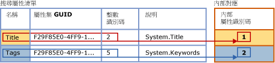
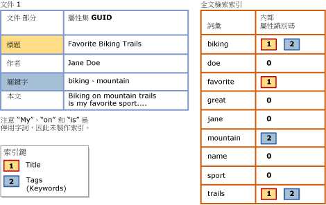

# <a name="search-document-properties-with-search-property-lists"></a>使用搜索屬性清單搜索文件屬性
[!INCLUDE[appliesto-ss-asdb-xxxx-xxx-md](../../includes/appliesto-ss-asdb-xxxx-xxx-md.md)]
  文件屬性的內容與文件本文的內容之間原本無法區別。 這項限制會將全文檢索查詢限制為整個文件的一般搜尋。 不過，現在您可以針對 **varbinary**、**varbinary(max)** (包括 **FILESTREAM**) 或 **image** 二進位資料行中支援的文件類型設定全文檢索索引，以便支援特定屬性 (例如 Author 和 Title) 的屬性範圍搜尋作業。 這種搜尋形式稱為「屬性搜尋」。  
  
 相關聯的[篩選](../../relational-databases/search/configure-and-manage-filters-for-search.md) (IFilter) 會決定是否可對特定文件類型進行屬性搜尋。 對於某些文件類型而言，相關聯的 IFilter 會擷取針對該文件類型定義的部分或全部屬性，以及文件本文的內容。 您可以設定全文檢索索引，以便支援針對 IFilter 在建立全文檢索索引期間所擷取的特定屬性進行屬性搜尋。 適用於 .docx、.xlsx 和 .pptx 等 Microsoft Office 文件類型的 IFilter 就是會擷取許多文件屬性的 IFilter。 另一方面，XML IFilter 不會發出屬性。  
  
##  <a name="How_FTS_Works_with_search_properties"></a> 全文檢索搜尋如何使用搜尋屬性  
  
### <a name="internal-property-ids"></a>內部屬性識別碼  
 全文檢索引擎會為每個註冊的屬性任意指派內部屬性識別碼，這個識別碼可在該特定搜尋清單中唯一識別屬性，而且是該搜尋屬性清單特有的。 因此，如果您將某個屬性加入至多個搜尋屬性清單，不同清單之間的內部屬性識別碼可能會有所不同。  
  
 針對搜尋清單註冊屬性時，全文檢索引擎就會將「內部屬性識別碼」任意指派給屬性。 內部屬性識別碼是一個整數，可在該搜尋屬性清單中唯一識別屬性。  
  
 下圖顯示指定 Title 和 Keywords 這兩個屬性之搜尋屬性清單的邏輯檢視。 [關鍵字] 的屬性清單名稱為 [標籤]。 這些屬性屬於相同的屬性集，其 GUID 為 F29F85E0-4FF9-1068-AB91-08002B27B3D9。 Title 和 Tags (Keywords) 的屬性整數識別碼分別為 2 和 5。 全文檢索引擎會將每個屬性任意對應至搜尋屬性清單獨有的內部屬性識別碼。 Title 屬性的內部屬性識別碼為 1，而 Tags 屬性的內部屬性識別碼為 2。  
  
   
  
 內部屬性識別碼可能會與屬性的屬性整數識別碼不同。 如果給定屬性已在多個搜尋屬性清單中註冊，可能會為每個搜尋屬性清單指定不同的內部屬性識別碼。 例如，內部屬性識別碼在某個搜尋屬性清單中可能是 4、在另一個清單中可能是 1、在另一個清單中可能是 3，依此類推。 反之，屬性整數識別碼是屬性內建的，而且不論該屬性用於何處，它都會維持相同。  
  
### <a name="indexing-of-registered-properties"></a>已註冊屬性的索引  
 將全文檢索索引與搜尋屬性清單產生關聯之後，您必須重新擴展索引，以便建立屬性特有搜尋詞彙的索引。 建立全文檢索索引期間，所有屬性的內容以及其他內容都會儲存在全文檢索索引中。 不過，建立在已註冊屬性中找到之搜尋詞彙的索引時，全文檢索索引子也會儲存具有該詞彙的對應內部屬性識別碼。 反之，如果屬性尚未註冊，它就會儲存在全文檢索索引中，就如同它屬於文件本文的一部分，而且其內部屬性識別碼的值為零。  
  
 下圖顯示搜尋詞彙如何顯示在全文檢索索引中的邏輯檢視，該索引與上圖所顯示的搜尋屬性清單相關聯。 範例文件 Document 1 包含三個屬性 (Title、Author 和 Keywords) 以及文件本文。 對於在搜尋屬性清單中指定的 Title 和 Keywords 屬性而言，搜尋詞彙會與全文檢索索引中其對應的內部屬性識別碼相關聯。 反之，Author 屬性的內容會建立索引，就如同它屬於文件本文的一部分。 這表示，註冊屬性會根據屬性中儲存的內容數量，稍微增加全文檢索索引的大小。  
  
   
  
 Title 屬性中的搜尋詞彙 ("Favorite"、"Biking" 和 "Trails") 會與針對此索引指派給 Title 的內部屬性識別碼 1 相關聯。 Keywords 屬性中的搜尋詞彙 ("biking" 和 "mountain") 會與針對此索引指派給 Tags 的內部屬性識別碼 2 相關聯。 若為 Author 屬性中的搜尋詞彙 ("Jane" 和 "Doe") 以及文件本文中的搜尋詞彙，其內部屬性識別碼為 0。 詞彙 "biking" 出現在 [標題] 屬性、[關鍵字]\(標籤) 屬性和文件本文中。 Title 或 Keywords (Tags) 屬性中 "biking" 的屬性搜尋會在結果中傳回這份文件。 "biking" 的一般全文檢索查詢也會傳回這份文件，就像是沒有對屬性搜尋設定索引一樣。 Author 屬性中 "biking" 的屬性搜尋則不會傳回這份文件。  
  
 屬性範圍的全文檢索查詢會使用針對全文檢索索引之目前搜尋屬性清單註冊的內部屬性識別碼。  
  
##  <a name="impact"></a> 啟用屬性搜索的影響  
 如果您設定全文檢索索引來支援一個或多個屬性的搜尋，就會根據您在搜尋屬性清單中指定的屬性數目以及每個屬性的內容，稍微增加索引的大小。  
  
 在測試 Microsoft Word、Excel 和 PowerPoint 文件的一般主體中，我們設定了全文檢索索引來建立一般搜尋屬性的索引。 建立這些屬性的索引大約增加了 5% 的全文檢索索引大小。 我們預期大部分文件主體的這個近似大小增加量應該相同。 不過，此大小增加量最終將取決於給定文件主體中的屬性資料量相對於整體資料量。  
  
##  <a name="creating"></a> 建立搜尋屬性清單和啟用屬性搜尋  
  
###  <a name="creating_sub"></a> 建立搜尋屬性清單  
 **若要使用 Transact-SQL 建立搜尋屬性清單**  
  
 使用 [CREATE SEARCH PROPERTY LIST &#40;Transact-SQL&#41;](../../t-sql/statements/create-search-property-list-transact-sql.md) 陳述式並提供至少一個清單名稱。  
  
##### <a name="to-create-a-search-property-list-in-management-studio"></a>在 Management Studio 中建立搜尋屬性清單  
  
1.  在 [物件總管] 中，展開伺服器。  
  
2.  展開 [資料庫]，然後展開您想要在其中建立搜尋屬性清單的資料庫。  
  
3.  展開 [儲存體]，然後以滑鼠右鍵按一下 [搜尋屬性清單]。  
  
4.  選取 [新增搜尋屬性清單]。  
  
5.  指定屬性清單名稱。  
  
6.  (選擇性) 將某個其他人指定為屬性清單的擁有者。  
  
7.  選取下列其中一個選項：  
  
    -   **建立空的搜尋屬性清單**  
  
    -   **從現有搜尋屬性清單建立**  
  
     如需詳細資訊，請參閱 [新增搜尋屬性清單](http://msdn.microsoft.com/library/ffca78e9-8608-4b15-bd38-b2d78da4247a)。  
  
8.  [!INCLUDE[clickOK](../../includes/clickok-md.md)]  
  
###  <a name="adding"></a> 將屬性加入至搜尋屬性清單  
 屬性搜尋需要建立「搜尋屬性清單」，並指定一個或多個您想要設為可搜尋的屬性。 當您將某個屬性加入至搜尋屬性清單時，就會針對該特定清單註冊此屬性。 若要將屬性加入至搜尋屬性清單，您需要下列值：  
  
-   屬性集 GUID  
  
     每個搜尋屬性都屬於包含一組相關屬性的單一屬性集。 每個屬性集都由全域唯一識別碼 (GUID) 所識別。  
  
-   屬性整數識別碼  
  
     每個搜尋屬性都會擁有在屬性集中唯一的識別碼。 若為指定的屬性，識別碼可能是整數或字串，但全文檢索搜尋只支援整數識別碼。  
  
-   屬性名稱  
  
     這是使用者將在全文檢索查詢中指定以搜尋屬性的名稱。 屬性名稱可以包含內部空格。 最大長度是 256 個字元。  
  
     屬性名稱可以是下列任何一個值：  
  
    -   Windows 正式的屬性名稱，例如 **System.Author** 或 **System.Contact.HomeAddress**。  
  
    -   使用者易記的名稱，方便使用者記憶。 某些屬性會與已知的使用者易記名稱相關聯 (例如「作者」或「住家地址」)，不過您也可以指定最適合使用者使用的任何名稱。  
  
    > [!NOTE]  
    >  屬性集 GUID 和屬性識別碼的給定組合在給定的搜尋屬性清單中必須是唯一的。 這表示，您無法用不同的名稱或描述多次加入相同的屬性。  
  
-   屬性描述 (選擇性)  
  
     將搜尋屬性加入至搜尋屬性清單時，您可以提供選擇性描述。 例如，您可能會想要提供有關與其名稱不盡相符之屬性的詳細資訊，或者可能想要描述屬性的屬性集。  
  
 **若要取得搜尋屬性清單的值**  
  
 請參閱 [尋找搜尋屬性的屬性集 GUID 與屬性整數識別碼](../../relational-databases/search/find-property-set-guids-and-property-integer-ids-for-search-properties.md)。  
  
 **若要使用 Transact-SQL 將屬性加入至搜尋屬性清單**  
  
 搭配您以[尋找搜尋屬性的屬性集 GUID 與屬性整數識別碼](../../relational-databases/search/find-property-set-guids-and-property-integer-ids-for-search-properties.md)一文中描述的其中一種方法所取得的值，使用 [ALTER SEARCH PROPERTY LIST &#40;Transact-SQL&#41;](../../t-sql/statements/alter-search-property-list-transact-sql.md) 陳述式。  
  
 下列範例會示範將屬性加入至搜尋屬性清單時，這些值的使用方式：  
  
```  
ALTER SEARCH PROPERTY LIST DocumentTablePropertyList  
   ADD 'Title'  
   WITH ( PROPERTY_SET_GUID = 'F29F85E0-4FF9-1068-AB91-08002B27B3D9', PROPERTY_INT_ID = 2,   
      PROPERTY_DESCRIPTION = 'System.Title - Title of the item.' );  
```  
  
 **若要在 Management Studio 中將屬性加入至搜尋屬性清單**  
  
 使用 [搜尋屬性清單屬性] 對話方塊即可加入或移除搜尋屬性。 您可以在 [物件總管] 中相關資料庫的 [儲存體] 節點底下找到 [搜尋屬性清單]。  
  
###  <a name="associating"></a> 將搜尋屬性清單與全文檢索索引產生關聯  
 若要讓全文檢索索引支援針對已在搜尋屬性清單中註冊的屬性進行屬性搜尋，您必須將搜尋屬性清單與索引產生關聯，然後重新擴展索引。 重新擴展全文檢索索引會針對每個註冊屬性中的搜尋詞彙建立屬性特有的索引項目。  
  
 只要全文檢索索引與這個搜尋屬性清單維持相關聯的狀態，全文檢索查詢就可以使用 CONTAINS 述詞的 PROPERTY 選項來搜尋已在該搜尋屬性清單中註冊的屬性。  
  
 如果您變更與全文檢索索引相關聯的搜尋屬性清單，則必須先重建索引，才能讓索引進入一致的狀態。 系統會立即截斷並清空索引，直到完整母體擴展執行為止。 如需有關何時變更搜尋屬性清單會導致重建索引的詳細資訊，請參閱 [ALTER FULLTEXT INDEX &#40;Transact-SQL&#41;](../../t-sql/statements/alter-fulltext-index-transact-sql.md) 中的＜備註＞。  
  
 **若要使用 Transact-SQL 讓搜尋屬性清單與全文檢索索引產生關聯**  
  
 使用 [ALTER FULLTEXT INDEX &#40;Transact-SQL&#41;](../../t-sql/statements/alter-fulltext-index-transact-sql.md) 陳述式搭配 `SET SEARCH PROPERTY LIST = <property_list_name>` 子句。  
  
 **若要使用 Management Studio 讓搜尋屬性清單與全文檢索索引產生關聯**  
  
 在 [全文檢索索引屬性] 對話方塊的 [一般] 頁面上，指定 [搜尋屬性清單] 的值。  
  
##  <a name="Ov_CONTAINS_using_PROPERTY"></a> 使用 CONTAINS 查詢搜索屬性  
 屬性範圍之全文檢索查詢的基本 [CONTAINS](../../t-sql/queries/contains-transact-sql.md) 語法如下：  
  
```sql  
SELECT column_name FROM table_name  
  WHERE CONTAINS ( PROPERTY ( column_name, 'property_name' ), '<contains_search_condition>' )  
```  
  
 例如，下列查詢會在 `Title`資料庫之 `Document` 資料表的 `Production.Document` 資料行中搜尋索引屬性 `AdventureWorks` 。 此查詢只會傳回下列文件：其 `Title` 屬性包含 `Maintenance` 或 `Repair`  
  
```  
USE AdventureWorks  
GO  
SELECT Document FROM Production.Document  
  WHERE CONTAINS ( PROPERTY ( Document, 'Title' ), 'Maintenance OR Repair')  
GO  
```  
  
 此範例假設文件的 IFilter 會擷取其 Title 屬性、Title 屬性會加入至搜尋屬性清單，以及搜尋屬性清單與全文檢索索引相關聯。  
  
##  <a name="managing"></a> 管理搜尋屬性清單  
  
###  <a name="viewing"></a> 檢視和變更搜尋屬性清單  
 **若要使用 Transact-SQL 變更搜尋屬性清單**  
  
 使用 [ALTER SEARCH PROPERTY LIST &#40;Transact-SQL&#41;](../../t-sql/statements/alter-search-property-list-transact-sql.md) 陳述式新增或移除搜尋屬性。  
  
##### <a name="to-view-and-change-a-search-property-list-in-management-studio"></a>在 Management Studio 中檢視和變更搜尋屬性清單  
  
1.  在 [物件總管] 中，展開伺服器。  
  
2.  展開 **[資料庫]**，然後展開此資料庫。  
  
3.  展開 [儲存體]。  
  
4.  展開 [搜尋屬性清單] 顯示搜尋屬性清單。  
  
5.  以滑鼠右鍵按一下屬性清單，然後選取 [屬性]。  
  
6.  在 [搜尋屬性清單編輯器] 對話方塊中，使用 [屬性] 方格來加入或移除搜尋屬性：  
  
    1.  若要移除文件屬性，請按一下屬性左邊的資料列標頭，然後按下 DEL 鍵。  
  
    2.  若要加入文件屬性，請按一下 **\*** 右邊清單底部的空白資料列，然後輸入新屬性的值。  
  
         如需這些值的相關資訊，請參閱 [搜尋屬性清單編輯器](http://msdn.microsoft.com/library/0f3ced6e-0dfd-49fc-b175-82378c3d668e)。 如需如何取得 Microsoft 所定義之屬性值的詳細資訊，請參閱 [尋找搜尋屬性的屬性集 GUID 與屬性整數識別碼](../../relational-databases/search/find-property-set-guids-and-property-integer-ids-for-search-properties.md)。 如需有關獨立軟體廠商 (ISV) 所定義之屬性的詳細資訊，請參閱該廠商的文件集。  
  
7.  [!INCLUDE[clickOK](../../includes/clickok-md.md)]  
  
###  <a name="deleting"></a> 刪除搜尋屬性清單  
 當屬性清單與任何全文檢索索引相關聯時，您無法從資料庫中卸除該清單。  
  
 **若要使用 Transact-SQL 刪除搜尋屬性清單**  
  
 使用 [DROP SEARCH PROPERTY LIST &#40;Transact-SQL&#41;](../../t-sql/statements/drop-search-property-list-transact-sql.md) 陳述式。  
  
##### <a name="to-delete-a-search-property-list-in-management-studio"></a>在 Management Studio 中刪除搜尋屬性清單  
  
1.  在 [物件總管] 中，展開伺服器。  
  
2.  展開 **[資料庫]**，然後展開此資料庫。  
  
3.  展開 [儲存體]，然後展開 [搜尋屬性清單] 節點。  
  
4.  以滑鼠右鍵按一下您想要刪除的屬性清單，然後按一下 [刪除]。  
  
5.  [!INCLUDE[clickOK](../../includes/clickok-md.md)]  
  
## <a name="see-also"></a>另請參閱  
 [尋找搜尋屬性的屬性集 GUID 與屬性整數識別碼](../../relational-databases/search/find-property-set-guids-and-property-integer-ids-for-search-properties.md)   
 [設定及管理搜尋的篩選](../../relational-databases/search/configure-and-manage-filters-for-search.md)  
  
  
