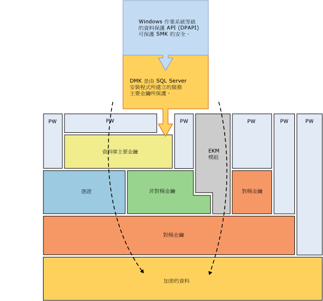

# 加密階層
[!INCLUDE[appliesto-ss-asdb-xxxx-xxx-md](../../../includes/appliesto-ss-asdb-xxxx-xxx-md.md)]
  [!INCLUDE[ssNoVersion](../../../includes/ssnoversion-md.md)] 會使用階層式加密與金鑰管理基礎結構來加密資料。 在某一階層執行加密時，會使用憑證、非對稱金鑰、對稱金鑰的組合來加密該階層下的所有階層。 非對稱金鑰和對稱金鑰可以儲存在可延伸金鑰管理 (EKM) 模組內 [!INCLUDE[ssNoVersion](../../../includes/ssnoversion-md.md)] 的外部。  
  
 下圖顯示每一層的加密階層為該層以下的所有階層進行加密，並顯示最常見的加密組態。 階層開始的存取通常受到密碼保護。  
  
   
  
 請記住以下概念：  
  
-   為了取得最佳效能，請使用對稱金鑰加密資料，而不要使用憑證或非對稱金鑰。  
  
-   資料庫主要金鑰受到服務主要金鑰的保護。 服務主要金鑰是由 [!INCLUDE[ssNoVersion](../../../includes/ssnoversion-md.md)] 安裝程式所建立，而且是以 Windows 資料保護 API (DPAPI) 來加密。  
  
-   堆疊其他層的其他加密階層是可行的。  
  
-   Extensible Key Management (EKM) 模組會將對稱金鑰或非對稱金鑰保存在 SQL Server 的外部。  
  
-   透明資料加密 (TDE) 必須使用稱為資料庫加密金鑰的對稱金鑰，該金鑰受到由 master 資料庫之資料庫主要金鑰所保護之憑證的保護，或是受到 EKM 內儲存之非對稱金鑰的保護。  
  
-   服務主要金鑰和所有資料庫主要金鑰都是對稱金鑰。  
  
 下圖以其他方式顯示相同的資訊。  
  
   
  
 此圖說明下列其他概念：  
  
-   在此圖中，箭號表示常見的加密階層。  
  
-   EKM 中的對稱和非對稱金鑰可以保護 [!INCLUDE[ssNoVersion](../../../includes/ssnoversion-md.md)]內儲存之對稱和非對稱金鑰的存取。 與 EKM 相關的虛線表示 EKM 內的金鑰可以取代 [!INCLUDE[ssNoVersion](../../../includes/ssnoversion-md.md)]內儲存的對稱和非對稱金鑰。  
  
## 加密機制  
 [!INCLUDE[ssNoVersion](../../../includes/ssnoversion-md.md)] 提供下列加密機制：  
  
-   [!INCLUDE[tsql](../../../includes/tsql-md.md)] 函數  
  
-   非對稱金鑰  
  
-   對稱金鑰  
  
-   憑證  
  
-   透明資料加密  
  
### Transact-SQL 函數  
 當使用 [!INCLUDE[tsql](../../../includes/tsql-md.md)] 函數插入或更新個別項目時，可以進行加密。 如需詳細資訊，請參閱 [ENCRYPTBYPASSPHRASE &#40;Transact-SQL&#41;](../../../t-sql/functions/encryptbypassphrase-transact-sql.md) 和 [DECRYPTBYPASSPHRASE &#40;Transact-SQL&#41;](../../../t-sql/functions/decryptbypassphrase-transact-sql.md)。  
  
### 憑證  
 「公開金鑰憑證」(通常只簡稱為「憑證」) 是經過數位簽署的聲明，憑證會將公開金鑰的值繫結到擁有對應私密金鑰之人員、裝置或服務的識別。 憑證是由憑證授權單位 (CA) 所發行與簽署。 收到 CA 發行之憑證的實體稱為憑證的主體。 一般而言，憑證中包含下列資訊。  
  
-   主體的公開金鑰。  
  
-   主體的識別資訊，例如：姓名與電子郵件地址。  
  
-   有效期間。 憑證在這段期間內都會視為有效。  
  
     超過這段期間憑證則無效；每個憑證都包含 [有效期限自]與 [有效期限至]日期。 這些日期會指定有效期間。 當憑證的有效期過期時，憑證的主體應該要求取得新憑證。  
  
-   簽發者識別資訊。  
  
-   簽發者的數位簽章。  
  
     此簽章可證明公開金鑰與主體識別資訊間之繫結關係的有效性。 (為資訊加上數位簽章的過程包括將相關資訊以及寄件者的某些機密資訊寫入稱為「簽章」的標記中。)  
  
 憑證的主要好處是可以減輕主機儲存個別主體密碼的負擔。 使用憑證時，主機只要與憑證簽發者 (憑證簽發者可能會簽署不限數目的憑證) 建立信任關係即可。  
  
 當主機 (例如：安全的 Web 伺服器) 指定某個簽發者做為信任的根授權單位時，該主機即隱含信任該簽發者用來建立其所發行之憑證的繫結關係的原則。 在實務上，主機會信任簽發者已驗證憑證主體的識別。 主機會將簽發者的自行簽署憑證 (其中包含簽發者的公開金鑰) 放到主機電腦信任的根憑證授權單位憑證存放區，指定簽發者做為信任的根授權單位。 除非中繼與從屬憑證授權單位具有有效信任根憑證授權單位路徑，否則不會被信任。  
  
 簽發者可以在憑證到期之前予以撤銷。 撤銷動作會取消公開金鑰與憑證主體識別資訊之間的繫結。 每個簽發者都會維護一份憑證撤銷清單，供程式檢查特定憑證的有效性時使用。  
  
 由 [!INCLUDE[ssNoVersion](../../../includes/ssnoversion-md.md)] 建立的自行簽署憑證遵循 X.509 標準，且支援 X.509 v1 欄位。  
  
### 非對稱金鑰  
 非對稱金鑰是由私密金鑰與對應的公開金鑰所組成。 每個金鑰都可以用來解密由另一個金鑰所加密的資料。 非對稱加密與解密非常耗資源，但能提供比對稱加密更好的安全性層級。 非對稱金鑰可用來加密對稱金鑰以儲存在資料庫中。  
  
### 對稱金鑰  
 對稱金鑰是用來加密與解密的一個金鑰。 使用對稱金鑰來加密與解密非常快速，且適合用來針對資料庫中的機密資料進行日常加密。  
  
### 透明資料加密  
 透明資料加密 (TDE) 是使用對稱金鑰的特殊加密案例。 TDE 會使用稱為資料庫加密金鑰的對稱金鑰加密整個資料庫。 資料庫加密金鑰受到其他金鑰或憑證的保護，這些金鑰或憑證則受到資料庫主要金鑰或是儲存於 EKM 模組內的非對稱金鑰的保護。 如需詳細資訊，請參閱[透明資料加密 &#40;TDE&#41;](../../../relational-databases/security/encryption/transparent-data-encryption.md)。  
  
## 相關內容  
 [保護 SQL Server 的安全](../../../relational-databases/security/securing-sql-server.md)  
  
 [安全性函數 &#40;Transact-SQL&#41;](../../../t-sql/functions/security-functions-transact-sql.md)  
  
## 另請參閱  
 [權限階層 &#40;Database Engine&#41;](../../../relational-databases/security/permissions-hierarchy-database-engine.md)   
 [安全性實體](../../../relational-databases/security/securables.md)  
  
  
