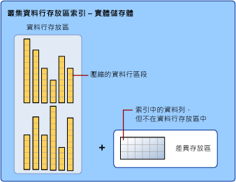
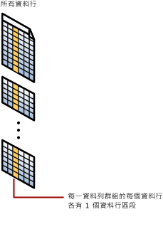

# <a name="sql-server-index-architecture-and-design-guide"></a>SQL Server 索引架構和設計指南
[!INCLUDE[appliesto-ss-asdb-asdw-pdw-md](../includes/appliesto-ss-asdb-asdw-pdw-md.md)]

設計不良的索引與不足的索引是資料庫應用程式瓶頸的主要原因。 設計有效的索引是達到良好資料庫和應用程式效能最重要的一點。 本 [!INCLUDE[ssNoVersion](../includes/ssnoversion-md.md)] 索引設計指南包含索引架構的資訊和最佳做法，可協助您設計符合應用程式需求的有效索引。  
    
本指南假設讀者對 [!INCLUDE[ssNoVersion](../includes/ssnoversion-md.md)]中提供的索引類型有概略的認識。 如需索引類型的一般描述，請參閱 [Index Types](../relational-databases/indexes/indexes.md)(索引類型)。  

本指南涵蓋以下類型的索引：

-   叢集
-   非叢集
-   唯一
-   已篩選
-   columnstore
-   雜湊
-   記憶體最佳化的非叢集

如需 XML 索引的資訊，請參閱 [XML 索引概觀](../relational-databases/xml/xml-indexes-sql-server.md)。

如需空間索引的資訊，請參閱[空間索引概觀](../relational-databases/spatial/spatial-indexes-overview.md)。

如需全文檢索索引的資訊，請參閱[擴展全文檢索索引](../relational-databases/search/populate-full-text-indexes.md)。
  
##  <a name="Basics"></a> 索引設計基本概念  
 索引是一種與資料表或檢視有關的磁碟內存或記憶體內部結構，它會加快從該資料表或檢視中擷取資料列的速度。 索引中包含從資料表或檢視中一或多個資料行建出的索引鍵。 若為磁碟內存索引，這些索引鍵儲存在結構 (B 型樹狀結構) 中，讓 SQL Server 可以快速有效地尋找與索引鍵值相關的一或多個資料列。  

 索引會將資料儲存為以資料列和資料行按邏輯組織的資料表，實際儲存為*資料列存放區* <sup>1</sup>　的資料列取向資料格式，或*[資料行存放區](#columnstore_index)* 的資料行取向資料格式。  
    
 為資料庫選擇正確的索引及工作負載時，往往很難在查詢速度與更新成本之間取得平衡。 範圍較小的索引，或是索引的索引鍵中包含較少的資料行，所需的磁碟空間與維護負擔相對較小。 相反的，如果索引範圍較大，能涵蓋的查詢就更多。 在找到最有效率的索引之前，可能需要先試過數種不同的設計。 索引可以新增、修改和卸除，不會影響資料庫結構描述或應用程式的設計。 所以，不要吝於嘗試各種不同的索引。  
  
 [!INCLUDE[ssNoVersion](../includes/ssnoversion-md.md)] 中的查詢最佳化工具可以確實地選擇在大多數情況中最有效率的索引。 整體的索引設計策略應該為查詢最佳化工具提供多樣化的索引，然後信任它會做最恰當的決定。 這可降低分析時間，且會在各種不同狀況下得到相當好的效能。 若要查看查詢最佳化工具用於特定查詢的索引，請在 [!INCLUDE[ssManStudioFull](../includes/ssmanstudiofull-md.md)] 的 [查詢] 功能表中，選取 [包括實際執行計畫]。  
  
 使用索引不一定就會有良好的效能，良好的效能和有效率地使用索引也不能劃上等號。 如果使用索引對產生最佳效能一定有幫助，查詢最佳化工具的作業就很單純。 但事實上，選擇不正確的索引可能得不到最佳效能。 因此，查詢最佳化工具的工作是只有在提升效能時才選擇索引或索引組合，如果會妨礙效能，就要避免索引式擷取。  

 <sup>1</sup> 資料列存放區一直是傳統儲存關聯式資料表資料的方式。 在 [!INCLUDE[ssNoVersion](../includes/ssnoversion-md.md)] 中，資料列存放區是指其基礎資料格式為堆積、B 型樹狀結構 ([叢集索引](#Clustered)) 或記憶體最佳化資料表的資料表。

### <a name="index-design-tasks"></a>索引設計工作  
 下列工作是針對設計索引所建議的策略：  
  
1.  了解資料庫本身的特性。 
    * 例如，是否為必須維持高輸送量，經常修改資料的線上交易處理 (OLTP) 資料庫。 自 [!INCLUDE[ssSQL14](../includes/sssql14-md.md)] 開始，記憶體最佳化資料表和索引因為提供不需閂鎖的設計，就特別適合此案例。 如需詳細資訊，請參閱本指南中的[記憶體最佳化資料表的索引](../relational-databases/in-memory-oltp/indexes-for-memory-optimized-tables.md)，或[記憶體最佳化資料表設計指導的非叢集索引](#inmem_nonclustered_index)和[記憶體最佳化資料表設計指導的雜湊索引](#hash_index)。
    * 或決策支援系統 (DSS) 或必須快速處理超大型資料集的資料倉儲 (OLAP) 資料庫範例。 自 [!INCLUDE[ssSQL11](../includes/sssql11-md.md)] 開始，資料行存放區索引特別適合一般的資料集資料倉儲。 資料行存放區索引可以加快常用資料倉儲查詢 (如篩選、彙總、群組及星型聯結查詢等) 的速度，大幅改善使用者的資料倉儲經驗。 如需詳細資訊，請參閱本指南的[資料行存放區索引概觀](../relational-databases/indexes/columnstore-indexes-overview.md)或[資料行存放區索引設計指南](#columnstore_index)。  

2.  了解最常使用的查詢特性。 例如，知道最常使用的查詢會聯結兩個以上的資料表，將有助於判斷要使用的最佳類型索引。  
  
3.  了解用於查詢的資料行特性。 例如，對於具有整數資料類型的資料行且也是唯一或非 Null 的資料行來說，索引是最理想的方式。 對於完善定義其資料子集的資料行，您可以在 [!INCLUDE[ssKatmai](../includes/sskatmai-md.md)] 與更新版本中使用篩選索引。 如需詳細資訊，請參閱本指南中的 [篩選索引設計指導方針](#Filtered) 。  
  
4.  建立或維護索引時，決定可能會提升效能的索引選項。 例如，`ONLINE` 索引選項對於在現有的大型資料表上建立叢集索引就有幫助。 ONLINE 選項會在建立或重建索引的同時，允許繼續進行基礎資料上的並行活動。 如需詳細資訊，請參閱 [設定索引選項](../relational-databases/indexes/set-index-options.md)。  
  
5.  決定最理想的索引儲存位置。 非叢集索引可以作為基礎資料表儲存在相同的檔案群組中，或儲存在不同的檔案群組中。 藉由增加磁碟 I/O 效能，索引的儲存位置可提升查詢效能。 例如，將非叢集索引儲存在不同磁碟機上 (與資料表檔案群組不同的磁碟機) 的檔案群組中，可以同時讀取多部磁碟機，所以可提升效能。  
     此外，叢集和非叢集索引可跨多個檔案群組使用資料分割結構描述。 資料分割使大型資料表或索引的管理更為容易，這是因為您可以快速有效地存取或管理資料的子集，同時維持整體集合的完整性。 如需相關資訊，請參閱 [Partitioned Tables and Indexes](../relational-databases/partitions/partitioned-tables-and-indexes.md)。 當您考慮使用分割時，請決定是否應該校準索引，也就是說，使用分割資料表相同的方法進行分割，或獨立進行分割。   

##  <a name="General_Design"></a> 一般索引設計指導方針  
 經驗豐富的資料庫管理員可以設計出一組數量適中的索引，但即使是普通複雜的資料庫與工作量，這都是一件非常複雜、費時，且容易出錯的工作。 了解資料庫、查詢和資料行的特性可以協助您設計最佳化的索引。  
  
### <a name="database-considerations"></a>資料庫考量  
 當您設計索引時，請考慮下列資料庫指導方針：  
  
-   資料表中的索引數量過多會影響到 `INSERT`、`UPDATE`、`DELETE` 和 `MERGE` 陳述式的效能，因為只要資料表中的資料一變更，所有的索引也都必須隨之適當調整。 例如，如果資料行會在數個索引中用到，而您執行了修改此資料行資料的 `UPDATE` 陳述式，則除了基礎基底資料表 (堆積或叢集的索引) 中的資料行之外，還必須更新每個含有該資料行的索引。  
  
    -   請避免對時常更新的資料表過度索引，保持索引窄小，愈少資料行愈好。  
  
    -   對不常更新、但有大量資料的資料表使用多個索引可增進查詢效能。 大量索引可以協助不修改資料之查詢的效能，例如 SELECT 陳述式，因為查詢最佳化工具有較多的索引可供選擇，以判斷最快的存取方法。  
  
-   為小型資料表建立索引並不是最佳的方式，因為查詢最佳化工具透過查閱索引來搜尋資料，會比執行簡單的資料表掃描更費時。 因此，小型資料表上的索引不僅很少使用，而且還必須在資料表中的資料變更時進行維護。  
  
-   當檢視包含彙總、資料表聯結或彙總與聯結的組合時，在檢視上建立索引可以提供重要的效能增進。 查詢中不必明確參考檢視，查詢最佳化工具會使用它。  
  
-   使用 Database Engine Tuning Advisor 可分析資料庫，並提供索引建議。 如需詳細資訊，請參閱 [Database Engine Tuning Advisor](../relational-databases/performance/database-engine-tuning-advisor.md)。  
  
### <a name="query-considerations"></a>查詢注意事項  
 當您設計索引時，請考慮下列查詢指導方針：  
  
-   在查詢之述詞及聯結條件經常使用的資料行上，建立非叢集索引。 但應該避免加入不必要的資料行。 加入太多索引資料行可能會對磁碟空間和索引維護效能產生不利的影響。  
  
-   涵蓋索引可以增進查詢效能，因為查詢就存在於索引本身裡面，所有需要的資料都符合查詢的需求。 也就是說，擷取要求的資料時只需要索引頁，非資料表或叢集索引的資料頁；因此，可以減少整體的磁碟 I/O。 例如，某個資料表在 **a** 、 **b** 和 **c**資料行上已建立複合的索引，則 **a**和 **b** 資料行的查詢可以單獨從索引擷取指定的資料。  
  
-   撰寫的查詢應盡可能在一個陳述式中插入或修改最多資料列，而不是使用多個查詢來更新同樣的資料列。 只使用一個陳述式，才能利用到最佳化的索引維護方式。  
  
-   評估查詢類型，以及查詢中如何使用資料行。 例如，在完全相符查詢類型中使用的資料行，就很適合當作非叢集或叢集索引。
  
### <a name="column-considerations"></a>資料行注意事項  
 當您設計索引時，請考慮下列資料行指導方針：  
  
-   讓叢集索引保持短小的索引鍵。 此外，對唯一或非 Null 資料行建立叢集索引，會有幫助。  
  
-   **ntext**、 **text**、 **image**、 **varchar(max)**、 **nvarchar(max)** 或 **varbinary(max)** 資料類型的資料行無法指定為索引鍵資料行。 但是， **varchar(max)**、 **nvarchar(max)**、 **varbinary(max)** 和 **xml** 資料類型則可參與非叢集索引，作為非索引鍵之索引資料行。 如需詳細資訊，請參閱本指南中的 [內含資料行的索引](#Included_Columns)一節。  
  
-   **xml** 資料類型只可以是 XML 索引的索引鍵資料行。 如需詳細資訊，請參閱 [XML 索引 &#40;SQL Server&#41;](../relational-databases/xml/xml-indexes-sql-server.md)。 SQL Server 2012 SP1 導入了新的 XML 索引類型，稱為「選擇性 XML 索引」。 這個新索引可改善 SQL Server 中儲存為 XML 之資料的查詢效能，讓大型 XML 資料工作負載的索引編製更快速，並透過降低索引本身的儲存成本，改善延展性。 如需詳細資訊，請參閱[選擇性 XML 索引 &#40;SXI&#41;](../relational-databases/xml/selective-xml-indexes-sxi.md)。  
  
-   檢驗資料行唯一性。 在相同組合的資料行上，唯一索引可提供額外的資訊給查詢最佳化工具，讓索引變得更有用。 如需詳細資訊，請參閱本指南中的 [唯一索引設計指導方針](#Unique) 。  
  
-   檢驗資料行中的資料分散情形。 執行時間長的查詢往往是因為對唯一值少的資料行製作索引所造成，或對這樣的資料行執行聯結所造成。 這是資料與查詢本身的問題，若不找出問題，通常是無法解決的。 例如，如果城市裡每個人的名字都是 Smith 或 Jones，那麼依姓氏排序的實體電話簿就無法使尋找某人的速度加快。 如需有關資料分散的詳細資訊，請參閱 [統計資料](../relational-databases/statistics/statistics.md)。  
  
-   請考慮在具有定義良好之子集的資料行 (如疏鬆資料行)、大部分的值都是 NULL 的資料行、具有值類別的資料行以及具有相異值範圍的資料行上使用篩選的索引。 設計良好的已篩選索引可以提升查詢效能、降低索引維護成本，並減少儲存成本。  
  
-   如果索引將包含多個資料行，可考慮資料行的順序。 用於 WHERE 子句等於 (=)、大於 (>)、小於 (<) 或 BETWEEN 搜尋條件中的資料行，或是參與聯結的資料行，應該要放在前面。 其他資料行應該按照它們的區分程度排序，亦即，從最能區分的排到最不能區分的。  
  
     例如，如果索引定義為 `LastName`、 `FirstName` ，當搜尋條件是 `WHERE LastName = 'Smith'` 或 `WHERE LastName = Smith AND FirstName LIKE 'J%'`時索引就會很有用。 但是，查詢最佳化工具不會為只搜尋 `FirstName (WHERE FirstName = 'Jane')`的查詢使用索引。  
  
-   考慮為計算的資料行建立索引。 如需詳細資訊，請參閱 [計算資料行的索引](../relational-databases/indexes/indexes-on-computed-columns.md)。  
  
### <a name="index-characteristics"></a>索引特性  
 當您決定好適合某一查詢的索引之後，便可選取最符合您需要的索引類型。 索引的特性包括下列項目：  
  
-   叢集或非叢集  
-   唯一或非唯一  
-   單一資料行或多重資料行  
-   索引中的資料行遞增或遞減順序  
-   完整資料表與非叢集索引的篩選  
-   資料行存放區與資料列存放區
-   雜湊與非叢集的記憶體最佳化資料表
  
 您也可以自訂索引的初始儲存特性，設定如 FILLFACTOR 的選項來最佳化其效能或維護。 您也可以使用檔案群組或資料分割配置的方式決定索引儲存位置，以最佳化效能。  
  
###  <a name="Index_placement"></a> 檔案群組或資料分割配置上的索引位置  
 在您開發索引設計策略時，您應該考慮在資料庫關聯的檔案群組上之索引位置。 小心地選取檔案群組或資料分割配置將可改善查詢效能。  
  
 依預設，索引會與建立索引的基底資料表儲存在同一個檔案群組中。 非資料分割的叢集索引與基底資料表永遠都在相同的檔案群組中。 然而，您仍可執行下列工作：  
  
-   在基底資料表或叢集索引之檔案群組以外的檔案群組上，建立非叢集索引。  
-   將叢集與非叢集索引分割以跨越多個檔案群組。  
-   在檔案群組之間移動資料表，方法為卸除叢集索引，並在 DROP INDEX 陳述式的 MOVE TO 子句中指定新檔案群組或資料分割配置，或使用 CREATE INDEX 陳述式加上 DROP_EXISTING 子句。  
  
 在別的檔案群組中建立非叢集索引後，如果檔案群組是使用不同的實體磁碟機，而且這些磁碟機各有它們自己的控制器，就可以獲得效能提升。 然後可以由多個磁碟讀寫頭平行讀取資料與索引資訊。 例如，如果 `Table_A` 在檔案群組 `f1` 上， `Index_A` 在檔案群組 `f2` 上，而這兩者都用於同一個查詢時，由於可以充分利用兩個檔案群組，不會出現競爭，因此可以改善效能。 不過，如果查詢掃描 `Table_A` ，但不參考 `Index_A` ，就只會使用檔案群組 `f1` 。 這並不會創造效能的提升。  
  
 由於您無法預測何時會發生哪種存取方式，所以比較好的作法是將資料表與索引分散到所有的檔案群組。 這樣就可以保證會存取到所有的磁碟，因為不論資料的存取方式如何，所有的資料與索引都平均分散在所有的磁碟上。 這也是系統管理員較單純的作法。  
  
#### <a name="partitions-across-multiple-filegroups"></a>多個檔案群組間的資料分割  
 您也可以考慮將叢集與非叢集索引分割於多個檔案群組之間。 資料分割索引是以水平方式分割，或根據資料分割函數依資料列來分割。 資料分割函數是用以定義每個資料列是否對應到一組資料分割，這些資料分割是根據一些稱為資料分割資料行之值。 資料分割配置指定資料分割與一組檔案群組的對應。  
  
 分割索引將可提供下列優點：  
  
-   提供可擴充的系統，使大型索引更易於管理。 例如 OLTP 系統可實作資料分割感知的應用程式，以處理大型索引。  
  
-   使查詢執行更快和更具效率。 當查詢存取索引的一些資料分割時，查詢最佳化工具可以同時處理個別的資料分割並排除未受查詢影響的資料分割。  
  
 如需相關資訊，請參閱 [Partitioned Tables and Indexes](../relational-databases/partitions/partitioned-tables-and-indexes.md)。  
  
###  <a name="Sort_Order"></a> 索引排序順序設計指導方針  
 定義索引時，您應該考慮要以遞增還是遞減的順序，來儲存索引鍵資料行的資料。 遞增是預設值，且可繼續與舊版 [!INCLUDE[ssNoVersion](../includes/ssnoversion-md.md)]相容。 CREATE INDEX、CREATE TABLE 與 ALTER TABLE 陳述式的語法，可在索引及條件約束的個別資料行上支援關鍵字 ASC (遞增) 與 DESC (遞減)。  
  
 指定在索引中將以何種順序儲存索引鍵值，在遇到下列情況時會很有用：參考資料表的查詢具有 ORDER BY 子句，且此子句指定的排序方向與該索引中索引鍵資料行的方向不同。 這種時候，查詢計畫就不需要對索引使用 SORT 運算子；因此可使得查詢更有效率。 例如， [!INCLUDE[ssSampleDBCoFull](../includes/sssampledbcofull-md.md)] 採購部門中的採購員必須評估他們向供應商購買的產品品質。 採購員想先找出這些供應商送來的產品中，哪些產品的退貨率較高。 如同下列查詢所示，要擷取符合這項條件的資料，需將 `RejectedQty` 資料表中的 `Purchasing.PurchaseOrderDetail` 資料行依遞減順序 (由大到小) 儲存，而 `ProductID` 資料行則依遞增順序 (由小到大) 儲存。  
  
```sql  
SELECT RejectedQty, ((RejectedQty/OrderQty)*100) AS RejectionRate,  
    ProductID, DueDate  
FROM Purchasing.PurchaseOrderDetail  
ORDER BY RejectedQty DESC, ProductID ASC;  
```  
  
 此查詢的下列執行計畫，顯示查詢最佳化工具使用了 SORT 運算子，按 ORDER BY 子句所指定的順序傳回結果集。  
  
 
  
 如果利用符合查詢中 ORDER BY 子句的索引鍵資料行來建立索引，就不需要在查詢計畫中使用 SORT 運算子，因此查詢計畫可以更有效率。  
  
```sql  
CREATE NONCLUSTERED INDEX IX_PurchaseOrderDetail_RejectedQty  
ON Purchasing.PurchaseOrderDetail  
    (RejectedQty DESC, ProductID ASC, DueDate, OrderQty);  
```  
  
 再次執行查詢後，下列執行計畫會顯示已刪除 SORT 運算子，並使用了剛建立的非叢集索引。  
  
 
  
 [!INCLUDE[ssDE](../includes/ssde-md.md)] 往遞增或遞減方向移動的效率一樣高。 定義為 `(RejectedQty DESC, ProductID ASC)` 的索引，仍可用在 ORDER BY 子句中的資料行排序方向與其相反的查詢中。 例如，具有 ORDER BY 子句 `ORDER BY RejectedQty ASC, ProductID DESC` 的查詢就可以使用此索引。  
  
 排序順序只能針對索引鍵資料行指定。 [sys.index_columns](../relational-databases/system-catalog-views/sys-index-columns-transact-sql.md) 目錄檢視及 INDEXKEY_PROPERTY 函數可回報索引資料行是按遞增還是遞減的順序排序。  

## <a name="metadata"></a>中繼資料  
您可以使用這些中繼資料檢視來查看索引的屬性。 其中一些檢視內含其他架構資訊。

> [!NOTE]
> 若為資料行存放區索引，所有資料行都會儲存於中繼資料內成為內含資料行。 資料行存放區索引沒有索引鍵資料行。  

||| 
|-|-|
|[sys.indexes &#40;Transact-SQL&#41;](../relational-databases/system-catalog-views/sys-indexes-transact-sql.md)|[sys.index_columns &#40;Transact-SQL&#41;](../relational-databases/system-catalog-views/sys-index-columns-transact-sql.md)|  
|[sys.partitions &#40;Transact-SQL&#41;](../relational-databases/system-catalog-views/sys-partitions-transact-sql.md)|[sys.internal_partitions &#40;Transact-SQL&#41;](../relational-databases/system-catalog-views/sys-internal-partitions-transact-sql.md)|
[sys.dm_db_index_operational_stats &#40;Transact-SQL&#41;](../relational-databases/system-dynamic-management-views/sys-dm-db-index-operational-stats-transact-sql.md)|[sys.dm_db_index_physical_stats &#40;Transact-SQL&#41;](../relational-databases/system-dynamic-management-views/sys-dm-db-index-physical-stats-transact-sql.md)|  
|[sys.column_store_segments &#40;Transact-SQL&#41;](../relational-databases/system-catalog-views/sys-column-store-segments-transact-sql.md)|[sys.column_store_dictionaries &#40;Transact-SQL&#41;](../relational-databases/system-catalog-views/sys-column-store-dictionaries-transact-sql.md)|  
|[sys.column_store_row_groups &#40;Transact-SQL&#41;](../relational-databases/system-catalog-views/sys-column-store-row-groups-transact-sql.md)|[sys.dm_db_column_store_row_group_operational_stats &#40;Transact-SQL&#41;](../relational-databases/system-dynamic-management-views/sys-dm-db-column-store-row-group-operational-stats-transact-sql.md)|
|[sys.dm_db_column_store_row_group_physical_stats &#40;Transact-SQL&#41;](../relational-databases/system-dynamic-management-views/sys-dm-db-column-store-row-group-physical-stats-transact-sql.md)|[sys.dm_column_store_object_pool &#40;Transact-SQL&#41;](../relational-databases/system-dynamic-management-views/sys-dm-column-store-object-pool-transact-sql.md)|  
|[sys.dm_db_column_store_row_group_operational_stats &#40;Transact-SQL&#41;](../relational-databases/system-dynamic-management-views/sys-dm-db-column-store-row-group-operational-stats-transact-sql.md)|[sys.dm_db_xtp_hash_index_stats &#40;Transact-SQL&#41;](../relational-databases/system-dynamic-management-views/sys-dm-db-xtp-hash-index-stats-transact-sql.md)| 
|[sys.dm_db_xtp_index_stats &#40;Transact-SQL&#41;](../relational-databases/system-dynamic-management-views/sys-dm-db-xtp-index-stats-transact-sql.md)|[sys.dm_db_xtp_object_stats &#40;Transact-SQL&#41;](../relational-databases/system-dynamic-management-views/sys-dm-db-xtp-object-stats-transact-sql.md)|
|[sys.dm_db_xtp_nonclustered_index_stats &#40;Transact-SQL&#41;](../relational-databases/system-dynamic-management-views/sys-dm-db-xtp-nonclustered-index-stats-transact-sql.md)|[sys.dm_db_xtp_table_memory_stats &#40;Transact-SQL&#41;](../relational-databases/system-dynamic-management-views/sys-dm-db-xtp-table-memory-stats-transact-sql.md)|
|[sys.hash_indexes &#40;Transact-SQL&#41;](../relational-databases/system-catalog-views/sys-hash-indexes-transact-sql.md)|[sys.memory_optimized_tables_internal_attributes &#40;Transact-SQL&#41;](../relational-databases/system-catalog-views/sys-memory-optimized-tables-internal-attributes-transact-sql.md)|  

##  <a name="Clustered"></a> 叢集索引設計指導方針  
 叢集索引將資料表中的資料列依其索引鍵值排序與儲存。 因為資料列本身只能以一種順序排序，所以每個資料表只能有一個叢集索引。 除了一些例外之外，每個資料表都應該在資料行上定義叢集索引，以提供下列功能：  
  
-   可用於經常使用的查詢。  
  
-   提供高度的唯一性。  
  
    > [!NOTE]  
    > 在建立 PRIMARY KEY 條件約束時，會在資料行上自動建立唯一索引。 依預設，此索引已叢集化；不過，您可以在建立條件約束時指定非叢集索引。  
  
-   可用於範圍查詢。  
  
 如果叢集索引不是以 `UNIQUE` 屬性建立，則 [!INCLUDE[ssDE](../includes/ssde-md.md)] 會自動將 4 位元組的 uniqueifier 資料行新增至資料表。 當有需要時， [!INCLUDE[ssDE](../includes/ssde-md.md)] 會自動將 uniqueifier 值加入資料行，使每個索引鍵都是唯一的。 這個資料行及其值是供內部使用的，使用者看不到也無法存取它。  
  
### <a name="clustered-index-architecture"></a>叢集索引架構  
 在 [!INCLUDE[ssNoVersion](../includes/ssnoversion-md.md)] 中，索引的結構為 B 型樹狀結構。 索引 B 型樹狀目錄中的每個分頁稱為索引節點。 B 型樹狀目錄的頂部節點稱為根節點。 索引中的最下層節點稱為分葉節點。 根與分葉節點之間的任何索引層級通稱為中繼層級。 在叢集索引中，分葉節點包含基礎資料表的資料頁。 根和中繼層級節點包含保存索引資料列的索引頁。 每個索引資料列都包含索引鍵值，以及指向 B 型樹狀目錄之中繼層級分頁或索引分葉層級之資料列的指標。 索引每個層級中的分頁都以雙向連結串列方式連結。  
  
 對於索引所使用的每個資料分割，叢集索引在 [sys.partitions](../relational-databases/system-catalog-views/sys-partitions-transact-sql.md)中都有一個 **index_id** = 1 的資料列。 根據預設，叢集索引只有一個資料分割。 當叢集索引有多個資料分割時，每個資料分割都有一個 B 型樹狀目錄結構來包含該特定資料分割的資料。 例如，如果叢集索引有四個資料分割，則共有四個 B 型樹狀目錄結構，每個資料分割中各一個。  
  
 視叢集索引中的資料類型而定，每個叢集索引結構會有一個或多個配置單位來儲存並管理特定資料分割的資料。 在每個叢集索引中，每個資料分割至少會有一個 IN_ROW_DATA 配置單位。 如果叢集索引包含大型物件 (LOB) 資料行，則在每個叢集索引中，每個資料分割也會有一個 *LOB_DATA* 配置單位。 如果叢集索引包含可變長度資料行，而該資料行又超過 8,060 個位元組的資料列大小限制，則每個資料分割也會有一個 *ROW_OVERFLOW_DATA* 配置單位。  
  
 資料鏈結中的分頁，以及它們裡面的資料列將以叢集索引鍵的值來排列。 所有插入動作都會等到插入之資料列的索引鍵值符合它在現有資料列的排列順序時才發生。  
  
 下圖顯示單一資料分割中的叢集索引結構。  
 
   
  
### <a name="query-considerations"></a>查詢注意事項  
 在建立叢集索引之前，必須先了解資料的存取方式。 執行下列情況的查詢請考慮使用叢集索引：  
  
-   使用如 `BETWEEN`、>、>=、< 和 <= 等運算子來傳回值的範圍。  
  
     在使用叢集索引找到第一個值的資料列後，就可保證具有後續索引值的資料列是實體相鄰的。 例如，如果查詢會擷取介於某個銷售訂單編號範圍的記錄， `SalesOrderNumber` 資料行上的叢集索引就可以快速地找到包含起始銷售訂單編號的資料列，然後擷取資料表中所有連續資料列，直到達到最後一個銷售訂單編號為止。  
  
-   傳回大型結果集。  
  
-   使用 `JOIN` 子句，通常這些都是外部索引鍵資料行。  
  
-   使用 `ORDER BY` 或 `GROUP BY` 子句。  
  
     在 ORDER BY 或 GROUP BY 子句中指定的資料行之索引，可讓 [!INCLUDE[ssDE](../includes/ssde-md.md)] 不需排序資料，因為資料列已經排序過了。 這種方式可以提高查詢的執行效能。  
  
### <a name="column-considerations"></a>資料行注意事項  
 一般而言，您應該盡可能以較少的資料行來定義叢集索引鍵。 考慮具有下列一或多個屬性的資料行：  
  
-   是唯一或包含許多不同的值  
  
     例如，員工識別碼可唯一識別員工。 在 `EmployeeID` 資料行上的叢集索引或 [PRIMARY KEY](../relational-databases/tables/create-primary-keys.md) 條件約束，將改善查詢的效能，可根據員工識別碼來搜尋員工資訊。 此外，也可以在 `LastName`、 `FirstName`、 `MiddleName` 上面建立叢集索引，因為員工記錄經常以此方式來群組和查詢，而這些資料行的組合仍可提供高度的差異性。 

     > [!TIP]
     > 如未特別指定，建立[主索引鍵](../relational-databases/tables/create-primary-keys.md)條件約束時，[!INCLUDE[ssNoVersion](../includes/ssnoversion-md.md)] 會建立[叢集索引](#clustered_index)以支援該條件約束。
     > 雖然 *[uniqueidentifier](../t-sql/data-types/uniqueidentifier-transact-sql.md)* 可以用來將唯一性強制執行為主索引鍵，但它不是有效的叢集索引鍵。
     > 如果使用 *uniqueidentifier* 作為主索引鍵，建議您將其建立為非叢集索引，並使用另一個資料行，例如 `IDENTITY` 來建立叢集索引。   
  
-   循序存取  
  
     例如，產品識別碼可唯一識別在 `Production.Product` 資料庫中的 [!INCLUDE[ssSampleDBobject](../includes/sssampledbobject-md.md)] 資料表。 指定循序搜尋的查詢 (例如 `WHERE ProductID BETWEEN 980 and 999`) 將會從 `ProductID`上的叢集索引獲得好處。 這是因為資料列將根據該索引鍵資料行排序過。  
  
-   定義為 `IDENTITY`。  
  
-   經常使用以排序從資料表擷取的資料。  
  
     最好能夠根據該資料行來叢集化 (即實際上的排序) 資料表，以省下每次在查詢資料行時都需進行排序的成本。  
  
 對下列屬性來說，叢集索引並不是理想的選擇：  
  
-   變更頻繁的資料行  
  
     這使得整個資料列移動 (因為 [!INCLUDE[ssDE](../includes/ssde-md.md)] 必須以實際的順序保存資料列中的資料值)。 對於資料經常變動的龐大交易處理系統來說，這是一項很重要的考量。  
  
-   寬索引鍵  
  
     寬索引鍵是由數個資料行或是數個大型資料行所組成。 所有的非叢集索引都使用叢集索引的索引鍵值做為查閱索引鍵。 任何在相同資料表上所定義的非叢集索引將會非常大，因為非叢集索引項目包含叢集索引鍵，同時也包含在該非叢集索引上所定義的索引鍵資料行。  
  
##  <a name="Nonclustered"></a> 非叢集索引設計指導方針  
 非叢集索引包含了索引鍵值和可指向資料表資料的儲存位置之資料列定位器。 您可以在資料表或索引檢視表上建立多個非叢集索引。 一般而言，應該將非叢集索引設計成可增進常用查詢 (叢集索引未涵蓋的查詢) 的效能。  
  
 如同您使用書中索引的方式一樣，查詢最佳化工具會先搜尋非叢集索引以找出資料值在資料表中的位置，然後再直接從該位置擷取資料，即可搜尋資料值。 這讓非叢集索引成為執行完全符合的查詢之最佳選擇，因為此種索引所包含的項目會描述查詢中所要搜尋的資料值在資料表中的確定位置。 例如，若要針對直屬特定經理的所有員工查詢 `HumanResources. Employee` 資料表，查詢最佳化工具可能使用非叢集索引 `IX_Employee_ManagerID`，而這個索引以 `ManagerID` 做為索引鍵資料行。 查詢最佳化工具可以在索引中快速尋找符合指定之 `ManagerID`的所有項目。 每個索引項目會指向資料表中正確的頁面和資料列，或指向可以找到對應資料的叢集索引。 查詢最佳化工具在索引中找到所有項目之後，即可直接跳至正確的頁面和資料列以擷取資料。  
  
### <a name="nonclustered-index-architecture"></a>非叢集索引架構  
 非叢集索引擁有與叢集索引相同的 B 型樹狀目錄結構，不過有下列顯著的差異：  
  
-   基礎資料表的資料列並未根據其非叢集索引鍵的順序，進行排序與儲存。  
  
-   非叢集索引的分葉層是由索引頁 (而不是資料頁) 所組成。  
  
 非叢集索引資料列中的資料列定位器是資料列的指標，或資料列的叢集索引鍵，如下所述：  
  
-   如果資料表為堆積 (表示沒有叢集索引)，則資料列定位器為資料列的指標。 該指標將以檔案識別碼 (識別碼)、頁碼與分頁中的資料列編號來建立。 整個指標也稱為資料列識別碼 (RID)。  
  
-   如果資料表有叢集索引，或索引位於索引檢視中，則資料列定位器為資料列的叢集索引鍵。  
  
 對於索引所使用的每個資料分割，非叢集索引在 [sys.partitions](../relational-databases/system-catalog-views/sys-partitions-transact-sql.md) 中都有一個 **index_id** > 1 的資料列。 根據預設，非叢集索引只有一個資料分割。 當非叢集索引有多個資料分割時，每個資料分割都有一個 B 型樹狀目錄結構來包含該特定資料分割的索引資料列。 例如，如果非叢集索引有四個資料分割，則共有四個 B 型樹狀目錄結構，每個資料分割中各一個。  
  
 視非叢集索引中的資料類型而定，每個非叢集索引結構會有一個或多個配置單位來儲存並管理特定資料分割的資料。 在每個非叢集索引中，每個資料分割至少會有一個 *IN_ROW_DATA* 配置單位來儲存索引 B 型樹狀結構頁面。 如果非叢集索引包含大型物件 (LOB) 資料行，則在該非叢集索引中，每個資料分割也會有一個 *LOB_DATA* 配置單位。 此外，如果非叢集索引包含可變長度資料行，而該資料行又超過 8,060 個位元組的資料列大小限制，則每個資料分割也會有一個 *ROW_OVERFLOW_DATA* 配置單位。  
  
 下圖顯示單一資料分割中非叢集索引的結構。  

  
  
### <a name="database-considerations"></a>資料庫考量  
 設計非叢集索引時，請考慮資料庫的特性。  
  
-   更新需求較低但資料容量較大的資料庫或資料表，可以從許多非叢集索引中得到好處以增進查詢效能。 請考慮針對定義完善的資料子集建立篩選的索引來提升查詢效能、降低索引儲存成本，並降低與完整資料表非叢集索引比較的索引維護成本。  
  
     包含主要唯讀資料的決策支援系統 (DSS) 應用程式和資料庫，可以從許多非叢集索引中得到好處。 查詢最佳化工具有較多可供選擇的索引，因此可判斷最快的存取方法，而資料庫的低更新特性則表示索引維護不會降低效能。  
  
-   包含大量已更新資料表的線上交易處理應用程式和資料庫應避免重複進行索引作業。 此外，應該縮小索引的範圍，這表示應盡可能包含較少的資料行。  
  
     資料表中的索引數量過多會影響到 INSERT、UPDATE、DELETE 和 MERGE 陳述式的效能，因為只要資料表中的資料一變更，所有的索引也都必須隨著調整。  
  
### <a name="query-considerations"></a>查詢注意事項  
 建立非叢集索引之前，應該先了解資料的存取方式。 請考慮針對具有下列屬性的查詢使用非叢集索引：  
  
-   使用 `JOIN` 或 `GROUP BY` 子句。  
  
     依據聯結和群組操作中用到的資料行，建立多個非叢集索引，並依據外部索引鍵資料行建立一個叢集索引。  
  
-   不會傳回大量結果集的查詢。  
  
     建立篩選的索引，以涵蓋從大型資料表傳回定義完善之資料列子集的查詢。  
  
-   包含會傳回完全相符項目的查詢 (例如 WHERE 子句) 中，所設定的搜尋條件常會用到的資料行。  
  
### <a name="column-considerations"></a>資料行注意事項  
 考慮具有一或多個下列屬性的資料行：  
  
-   涵蓋查詢。  
  
     當索引包含查詢中的所有資料行時，將可改善效能。 查詢最佳化工具可以在索引中尋找所有資料行值；未被存取的資料表或叢集索引資料會導致磁碟 I/O 作業減少。 使用內含資料行索引來新增涵蓋的資料行，而非建立廣泛的索引鍵。  
  
     如果資料表中具有叢集索引，則在叢集索引中定義的資料行會自動附加到資料表上每個非叢集索引的結尾。 這樣會產生涵蓋的查詢，而不需要在非叢集索引的定義中指定叢集索引資料行。 例如，如果資料表在資料行 `C`上具有叢集索引，而在資料行 `B` 和 `A` 上具有非叢集索引，則其索引鍵值資料行為 `B`、 `A`和 `C`。  
  
-   許多不同值的資料行，例如姓氏與名字的組合 (如果其他資料行使用叢集索引的話)。  
  
     如果只有很少量的不同值 (例如只有 1 和 0)，則大多數的查詢都不會使用索引，因為資料表掃描通常會更有效率。 如果是這種資料類型，請考慮針對只發生於少量資料列的相異值建立篩選的索引。 例如，如果大多數的值為 0，則查詢最佳化工具可能會將篩選的索引用於包含 1 的資料列。  
  
####  <a name="Included_Columns"></a> 使用內含資料行擴充非叢集索引  
 您可以加入非索引鍵資料行至非叢集索引的分葉層級，以擴充非叢集索引的功能。 藉由加入非索引鍵資料行，您可以建立涵蓋更多查詢的非叢集索引。 這是因為非索引鍵之索引資料行有下列好處：  
  
-   與索引鍵資料行一樣，它們可以是不允許的資料類型。  
  
-   計算索引鍵資料行數或索引鍵大小時， [!INCLUDE[ssDE](../includes/ssde-md.md)] 不會考慮它們。  
  
 查詢中所有的資料行在索引中當做索引鍵或非索引鍵之索引資料行時，內含非索引鍵之索引資料行索引可以大幅改進查詢效能。 因為查詢最佳化工具可以在索引中找到所有資料行值，所以可以提高效能；不存取資料表或叢集索引資料，導致磁碟 I/O 作業變少。  
  
> [!NOTE]  
> 索引包含查詢參考的所有資料行時，通常就是指涵蓋查詢。  
  
 索引鍵資料行儲存在索引的所有分葉層級上，而非索引鍵之索引資料行僅儲存在分葉層級上。  
  
##### <a name="using-included-columns-to-avoid-size-limits"></a>使用內含資料行避開大小限制  
 您可以在非叢集索引中包含非索引鍵之索引資料行，以避免超出目前索引大小限制 (最大 16 個索引鍵資料行，最大 900 個位元組索引鍵大小) 計算索引鍵資料行數或索引鍵大小時， [!INCLUDE[ssDE](../includes/ssde-md.md)] 不會考慮非索引鍵之索引資料行。   
 例如，假設您想要在 `Document` 資料表中建立下列資料行的索引：  
 *  `Title nvarchar(50)`  
 *  `Revision nchar(5)`  
 *  `FileName nvarchar(400)`  
  
 由於 **nchar** 和 **nvarchar** 資料類型的每個字元都需要 2 個位元組，因此包含這三個資料行的索引可能會比 900 個位元組的大小限制多出 10 個位元組 (455 * 2)。 使用 `INCLUDE` 陳述式的 `CREATE INDEX` 子句，索引鍵可定義為 (`Title, Revision`)，而 `FileName` 則定義為非索引鍵之索引資料行。 這樣，索引鍵大小會是 110 個位元組 (55 \* 2)，且索引仍能包含所有必須的資料行。 下列陳述式會建立這類索引。  
  
```sql  
CREATE INDEX IX_Document_Title   
ON Production.Document (Title, Revision)   
INCLUDE (FileName);   
```  
  
##### <a name="index-with-included-columns-guidelines"></a>內含資料行索引指導方針  
 設計具有內含資料行的非叢集索引時，請考慮下列指導方針：  
  
-   非索引鍵之索引資料行是定義於 CREATE INDEX 陳述式的 INCLUDE 子句。  
  
-   非索引鍵之索引資料行僅能定義於資料表或索引檢視的非叢集索引上。  
  
-   允許所有的資料類型，除了 **text**、 **ntext**和 **image**以外。  
  
-   具決定性之精確或非精確的計算資料行都可以當做內含資料行。 如需詳細資訊，請參閱 [計算資料行的索引](../relational-databases/indexes/indexes-on-computed-columns.md)。  
  
-   如同索引鍵資料行，只要計算資料行資料類型可以作為無索引鍵索引資料行，則從 **image**、 **ntext**與 **text** 衍生的計算資料行即可以是非索引鍵之索引資料行。  
  
-   資料行名稱無法同時指定於 INCLUDE 清單與索引鍵資料行清單兩者中。  
  
-   資料行名稱在 INCLUDE 清單中不得重複。  
  
##### <a name="column-size-guidelines"></a>資料行大小指導方針  
  
-   至少必須定義一個索引鍵資料行。 非索引鍵之索引資料行數目的上限為 1023 個資料行。 這是資料表資料行數目的上限減 1。  
  
-   索引鍵資料行 (不包含非索引鍵之索引資料行) 必須遵守現有索引大小的限制 (上限為 16 個索引鍵資料行)，且索引鍵總大小為 900 個位元組。  
  
-   所有非索引鍵之索引資料行大小總計僅由 INCLUDE 子句中指定的資料行大小限定；例如， **varchar(max)** 資料行是限定為 2 GB。  
  
##### <a name="column-modification-guidelines"></a>資料行修改指導方針  
 當您修改定義為內含資料行的資料表資料行時，則下列限制適用：  
  
-   必須先卸除索引，才能從資料表卸除非索引鍵之索引資料行。  
  
-   除非執行下列動作，否則無法變更非索引鍵之索引資料行：  
  
    -   將資料行的 Null 屬性從 NOT NULL 變更為 NULL。  
  
    -   增加 **varchar**、 **nvarchar**或 **varbinary** 資料行的長度。  
  
        > [!NOTE]  
        >  這些資料行修改限制也適用索引鍵資料行。  
  
##### <a name="design-recommendations"></a>設計建議  
 重新設計具有大型索引鍵大小的非叢集索引，如此僅有用於搜尋與查閱的資料行才會是索引鍵資料行。 讓涵蓋查詢的所有其他資料行都作為內含非索引鍵之索引資料行。 如此一來，您將擁有涵蓋查詢所需的所有資料行，但是索引鍵本身會變得很小而且很有效率。  
  
 例如，假設您要設計能夠涵蓋下列查詢的索引。  
  
```sql  
SELECT AddressLine1, AddressLine2, City, StateProvinceID, PostalCode  
FROM Person.Address  
WHERE PostalCode BETWEEN N'98000' and N'99999';  
```  
  
 若要涵蓋查詢，必須在索引中定義每個資料行。 雖然您可以將所有資料行定義為索引鍵資料行，但是索引鍵大小應是 334 個位元組。 由於只有實際作為搜尋條件的資料行才是 `PostalCode` 資料行，且長度為 30 個位元組，所以較佳的索引設計方式應該是將 `PostalCode` 定義為索引鍵資料行，並將所有其他的資料行作為非索引鍵之索引資料行包含在內。  
  
 下列陳述式會建立具有內含資料行的索引，可以涵蓋查詢。  
  
```sql  
CREATE INDEX IX_Address_PostalCode  
ON Person.Address (PostalCode)  
INCLUDE (AddressLine1, AddressLine2, City, StateProvinceID);  
```  
  
##### <a name="performance-considerations"></a>效能考量  
 避免加入不必要的資料行。 加入過多的索引資料行、索引鍵或無索引鍵，可能會發生以下的效能問題：  
  
-   頁面上可以放入的索引資料列變少。 這將使得 I/O 的作業增加而降低快取的效率。  
  
-   必須有更多磁碟空間才能儲存索引。 尤其是，新增 **varchar(max)**、 **nvarchar(max)**、 **varbinary(max)** 或 **xml** 資料類型作為非索引鍵之索引資料行，將大幅增加磁碟空間的需求。 這是因為資料行的值複製到索引的分葉層級。 因此，它們會同時存在於索引與基底資料表中。  
  
-   維護索引時，會增加修改、插入、更新或刪除基礎資料表或索引檢視的時間。  
  
 您必須決定，提高查詢效能，與修改資料時對效能的影響和需要額外磁碟空間，兩者熟輕熟重。  
  
##  <a name="Unique"></a> 唯一索引設計指導方針  
 唯一索引可保證索引鍵不包含重複值，因此資料表中的每一個資料列在某方面來說是唯一的。 只有當資料具有唯一的特性時，指定唯一索引才有意義。 例如，若要確定 `NationalIDNumber` 資料表中 `HumanResources.Employee` 資料行的值是唯一的，則當主索引鍵是 `EmployeeID`時，請在 `NationalIDNumber` 資料行上建立 UNIQUE 條件約束。 如果使用者試著在該資料行上為不止一位員工輸入相同值，便會顯示錯誤訊息，而且無法輸入重複值。  
  
 利用多重資料行唯一索引，此索引可保證索引鍵的每一個值組合都是唯一的。 例如，若在 `LastName`、 `FirstName`和 `MiddleName` 資料行的組合上建立唯一索引，則該資料表中不得有兩個資料列具有這些資料行的相同值組合。  
  
 叢集與非叢集索引都可以是唯一的。 假設資料行中的資料是唯一的，您就可以在同一個資料表上建立一個唯一的叢集索引和多個唯一的非叢集索引。  
  
 唯一索引的好處包括：  
  
-   確保所定義之資料行的資料完整性。  
  
-   提供對查詢最佳化工具有幫助的其他資訊。  
  
 建立 PRIMARY KEY 或 UNIQUE 條件約束時，會自動在指定的資料行上建立唯一索引。 建立 UNIQUE 條件約束和不使用條件約束而建立唯一索引，兩者之間並沒有顯著的差異。 資料驗證的方式相同，且查詢最佳化工具不會區分唯一索引是由條件約束所建立還是手動建立的。 不過，當您的目標是資料完整性時，就應該在資料行上建立 UNIQUE 或 PRIMARY KEY 條件約束。 如此一來，索引的目標就很明確。  
  
### <a name="considerations"></a>考量  
  
-   如果資料中已存在重複的索引鍵值，則無法建立唯一索引、UNIQUE 條件約束或 PRIMARY KEY 條件約束。  
  
-   如果資料是唯一的，而且您想要強制唯一性，則在相同資料行組合上建立唯一索引而不是非唯一索引，可提供其他資訊給查詢最佳化工具，來產生更有效率的執行計畫。 在這種情況下，建議您建立唯一索引 (而且最好先經由建立 UNIQUE 條件約束)。  
  
-   唯一非叢集索引可有內含的非索引鍵之索引資料行。 如需詳細資訊，請參閱 [內含資料行的索引](#Included_Columns)。  
  
  
##  <a name="Filtered"></a> 篩選索引設計指導方針  
 篩選索引是最佳化的非叢集索引，特別適合用來處理會從定義完善之資料子集進行選取的查詢。 篩選索引會使用篩選述詞對資料表中的部分資料列進行索引。 與完整資料表索引相較，設計良好的篩選索引可以提升查詢效能、降低索引維護成本，並降低索引儲存成本。  
  
**適用於**： [!INCLUDE[ssKatmai](../includes/sskatmai-md.md)] 至 [!INCLUDE[ssCurrent](../includes/sscurrent-md.md)]。  
  
 篩選索引可以提供全資料表索引所不及的下列優勢：  
  
-   **提升的查詢效能和計畫品質**  
  
     設計良好的篩選索引可以提升查詢效能和執行計畫品質，因為它比全資料表的非叢集索引來得小，且具有篩選統計資料。 篩選統計資料比全資料表統計資料更為正確，因為僅涵蓋篩選索引中的資料列。  
  
-   **降低的索引維護成本**  
  
     只有在資料操作語言 (DML) 陳述式影響到索引中的資料時，才會對索引進行維護。 與全資料表的非叢集索引相較，篩選索引可以降低維護成本，因為後者較小且僅會在索引中的資料受到影響時才會進行維護。 篩選索引的數量可能很多，特別是當其包含不常受到影響的資料時。 同樣地，如果篩選索引僅包含經常受到影響的資料，則因為索引的大小較小，更新統計資料的成本就會下降。  
  
-   **降低的索引儲存成本**  
  
     在不需要全資料表索引時，建立篩選索引可以縮減非叢集索引的磁碟儲存量。 您可以使用多個篩選索引來取代全資料表的非叢集索引，而不會大幅增加儲存需求。  
  
 當資料行包含定義良好的資料子集且查詢在 SELECT 陳述式中會參考這些資料時，篩選索引很有用。 範例如下：  
  
-   僅包含一些非 NULL 值的疏鬆資料行。  
  
-   包含資料類別的異質資料行。  
  
-   包含金額、時間和日期等值範圍的資料行。  
  
-   由資料行值的簡單比較邏輯所定義的資料表資料分割。  
  
 當索引中的資料列數與全資料表索引相較比較小時，篩選索引降低的維護成本最明顯。 如果篩選索引包含資料表中大部分的資料列，則其維護成本可能要比全資料表索引高。 在此種情況下應該使用全資料表索引，而不是篩選索引。  
  
 篩選索引定義於單一資料表，僅支援簡單比較運算子。 如果需要參考多個資料表或具有複雜邏輯的篩選運算式，則應該建立檢視。  
  
### <a name="design-considerations"></a>設計考量  
 為了設計有效的篩選索引，必須了解應用程式所使用的查詢以及這些查詢與資料子集的關聯。 具有定義良好之子集的資料範例包括大部分的值都是 NULL 的資料行、具有異質值類別的資料行，以及具有相異值範圍的資料行。 下列的設計考量提供多種案例，說明何時篩選索引的優點多於全資料表索引。  
 
> [!TIP] 
> 非叢集[資料行存放區索引](#columnstore_index)定義支援使用篩選的條件。 若要將 OLTP 資料表新增資料行存放區索引對效能的影響降到最低，請只對您作業的工作負載冷資料，使用篩選的條件建立非叢集資料行存放區索引。 
  
#### <a name="filtered-indexes-for-subsets-of-data"></a>資料子集的篩選索引  
當資料行僅具有少數的查詢相關值時，可以在值的子集上建立篩選索引。 例如，當資料行中的值大部分都是 NULL 且查詢只會從非 NULL 值進行選取時，您可以針對非 NULL 的資料列建立篩選索引。 所產生的索引比在相同的索引鍵資料行上定義的全資料表非叢集索引還小，維護成本也比較低。  
  
例如， `AdventureWorks2012` 資料庫具有 2679 個資料列的 `Production.BillOfMaterials` 資料表。 `EndDate` 資料行只有 199 個包含非 NULL 值的資料列，其他的 2480 個資料列都是包含 NULL。 下列篩選索引所包含的查詢會傳回在索引中定義的資料行，並僅會選取 `EndDate`使用非 NULL 值的資料列。  
  
```sql  
CREATE NONCLUSTERED INDEX FIBillOfMaterialsWithEndDate  
    ON Production.BillOfMaterials (ComponentID, StartDate)  
    WHERE EndDate IS NOT NULL ;  
GO  
```  
  
篩選索引 `FIBillOfMaterialsWithEndDate` 對下列查詢有效。 您可以顯示查詢執行計畫，以判斷查詢最佳化工具是否使用了篩選索引。  
  
```sql  
SELECT ProductAssemblyID, ComponentID, StartDate   
FROM Production.BillOfMaterials  
WHERE EndDate IS NOT NULL   
    AND ComponentID = 5   
    AND StartDate > '20080101' ;  
```  
  
如需有關如何建立篩選索引以及如何定義篩選索引述詞運算式的詳細資訊，請參閱 [建立篩選的索引](../relational-databases/indexes/create-filtered-indexes.md)。  
  
#### <a name="filtered-indexes-for-heterogeneous-data"></a>異質資料的篩選索引  
 當資料表具有異質資料列時，您可以針對一或多個資料類別建立篩選索引。  
  
 例如，列於 `Production.Product` 資料表中的每個產品都會被指派 `ProductSubcategoryID`，此 ID 又會與產品類別 Bikes、Components、Clothing 或 Accessories 等產生關聯。 這些類別都是異質性的，因為它們在 `Production.Product` 資料表中的資料行值並沒有緊密關聯。 例如，對個別產品類別來說， `Color`、 `ReorderPoint`、 `ListPrice`、 `Weight`、 `Class`和 `Style` 等資料行都有其唯一的特性。 假設經常對具有介於 27 到 36 (含) 之子類別的配件進行查詢。 您只要在配件子類別上建立篩選索引，就可以改善查詢該配件的效能，如下列範例所示。  
  
```sql  
CREATE NONCLUSTERED INDEX FIProductAccessories  
    ON Production.Product (ProductSubcategoryID, ListPrice)   
        Include (Name)  
WHERE ProductSubcategoryID >= 27 AND ProductSubcategoryID <= 36;  
```  
  
 篩選索引 `FIProductAccessories` 適用於下列查詢，因為查詢  
  
 結果會包含在索引中，而且查詢計畫不包含基底資料表查閱。 例如，查詢述詞運算式 `ProductSubcategoryID = 33` 是篩選之索引述詞 `ProductSubcategoryID >= 27` 的子集，而且查詢述詞中的 `ProductSubcategoryID <= 36`、 `ProductSubcategoryID` 與 `ListPrice` 資料行都是索引中的索引鍵資料行，因此會將名稱當做包含的資料行，儲存在索引的分葉層級中。  
  
```sql  
SELECT Name, ProductSubcategoryID, ListPrice  
FROM Production.Product  
WHERE ProductSubcategoryID = 33 AND ListPrice > 25.00 ;  
```  
  
#### <a name="key-columns"></a>索引鍵資料行  
 最佳作法是在篩選索引定義中包含少數的索引鍵或內含資料行，並僅併入查詢最佳化工具在選擇查詢執行計畫的篩選索引時必要的資料行。 查詢最佳化工具可以選擇查詢的篩選索引，不論它是否涵蓋該查詢。 然而，查詢最佳化工具如果涵蓋該查詢，則更可能選擇篩選索引。  
  
 在某些情況下，篩選索引會涵蓋查詢，而不需將資料行以篩選索引定義中的索引鍵或內含資料行方式包含在篩選索引運算式中。 下列指導方針說明篩選索引運算式中的資料行何時應該是篩選索引定義中的索引鍵或內含資料行。 其中的範例會參考先前所建立的篩選索引 `FIBillOfMaterialsWithEndDate` 。  
  
 如果篩選索引運算式相等於查詢述詞，且查詢並未以篩選索引運算式中的資料行傳回查詢結果，則篩選索引運算式中的資料行不需要是篩選索引定義中的索引鍵或內含資料行。 例如， `FIBillOfMaterialsWithEndDate` 包含下列查詢，因為查詢述詞相當於篩選運算式，且查詢結果未傳回 `EndDate` 。 `FIBillOfMaterialsWithEndDate` 不需要在篩選的索引定義中以 `EndDate` 作為索引鍵或內含資料行。  
  
```sql  
SELECT ComponentID, StartDate FROM Production.BillOfMaterials  
WHERE EndDate IS NOT NULL;   
```  
  
 如果查詢述詞在不等於篩選索引運算式的比較中使用篩選索引運算式中的資料行，則該資料行應該是篩選索引定義中的索引鍵或內含資料行。 例如， `FIBillOfMaterialsWithEndDate` 對下列查詢有效，因為它會從篩選索引選取資料列子集。 不過，它並不會涵蓋下列查詢，因為 `EndDate` 會用於比較 `EndDate > '20040101'`中，而後者並不相等於篩選索引運算式。 在未先查閱 `EndDate`的值之前，查詢處理器無法執行此查詢。 因此， `EndDate` 應該是篩選索引定義中的索引鍵或內含資料行。  
  
```sql  
SELECT ComponentID, StartDate FROM Production.BillOfMaterials  
WHERE EndDate > '20040101';   
```  
  
 如果篩選索引運算式中的資料行在查詢結果集中，則該資料行應該是篩選索引定義中的索引鍵或內含資料行。 例如， `FIBillOfMaterialsWithEndDate` 並不涵蓋下列查詢，因為它會在查詢結果中傳回 `EndDate` 資料行。 因此， `EndDate` 應該是篩選索引定義中的索引鍵或內含資料行。  
  
```sql  
SELECT ComponentID, StartDate, EndDate FROM Production.BillOfMaterials  
WHERE EndDate IS NOT NULL;  
```  
  
 資料表的叢集索引鍵並不需要是篩選索引定義中的索引鍵或內含資料行。 叢集索引鍵會自動包含在所有非叢集的索引中 (包含篩選索引在內)。  
  
#### <a name="data-conversion-operators-in-the-filter-predicate"></a>篩選述詞中的資料轉換運算子  
 如果在篩選索引的篩選索引運算式中指定的比較運算子產生隱含或明確的資料轉換，則如果該轉換是發生在比較運算子的左側，就會發生錯誤。 解決方案是以資料轉換運算子 (CAST 或 CONVERT) 在比較運算子的右側寫下篩選索引運算式。  
  
 下列範例會建立具有多種資料類型的資料表。  
  
```sql  
USE AdventureWorks2012;  
GO  
CREATE TABLE dbo.TestTable (a int, b varbinary(4));  
```  
  
 在下列篩選索引定義中，資料行 `b` 會隱含地轉換成整數資料類型，以與常數 1 進行比較。 這麼做會產生錯誤訊息 10611，因為轉換發生在篩選述詞中運算子的左側。  
  
```sql  
CREATE NONCLUSTERED INDEX TestTabIndex ON dbo.TestTable(a,b)  
WHERE b = 1;  
```  
  
 解決方案是將右側的常數轉譯為與資料行 `b`相同的類型，如下列範例中所示：  
  
```sql  
CREATE INDEX TestTabIndex ON dbo.TestTable(a,b)  
WHERE b = CONVERT(Varbinary(4), 1);  
```  
  
 將資料轉換從比較運算子的左側移至右側可能會變更轉換的意義。 在上述範例中，當 CONVERT 運算子新增至右側時，比較作業會從整數比較變更為 **varbinary** 比較。  
  
## <a name="columnstore_index"></a> 資料行存放區索引設計指導

*columnstore index* 是使用單欄式資料格式 (稱為「資料行存放區」) 來儲存、擷取及管理資料的一項技術。 如需詳細資訊，請參閱[資料行存放區索引概觀](../relational-databases/indexes/columnstore-indexes-overview.md)。 

如需版本資訊，請參閱[資料行存放區索引 - 新增功能](/sql/relational-databases/indexes/columnstore-indexes-what-s-new)。

### <a name="columnstore-index-architecture"></a>資料行存放區索引架構

了解這些基本知識，可讓您更容易理解其他說明有效使用方式的資料行存放區文章。

#### <a name="data-storage-uses-columnstore-and-rowstore-compression"></a>使用資料行存放區和資料列存放區壓縮的資料儲存
討論資料行存放區索引時，我們使用「資料列存放區」和「資料行存放區」等字詞強調資料儲存格式。 資料行存放區索引會使用這兩種儲存類型。

 

- 「資料行存放區」是以邏輯方式組織成資料表的資料，其中包含資料列和資料行，並且會以資料行取向的資料格式實際儲存。
  
資料行存放區索引是以資料行存放區格式實際儲存大部分的資料。 在資料行存放區格式中，資料會以資料行的方式進行壓縮和解壓縮。 這樣就不需要解壓縮每個資料列中查詢未要求的其他值。 如此一來，便可快速掃描大型資料表的整個資料行。 

- 「資料列存放區」是以邏輯方式組織成資料表的資料，其中包含資料列和資料行，並且會以資料列取向的資料格式實際儲存。 這是傳統儲存關聯式資料表資料的方式，例如堆積或叢集 B 型樹狀結構索引。

資料行存放區索引也會以資料列存放區格式實際儲存某些資料列，其稱為差異存放區。 差異存放區 (也稱為差異資料列群組) 是一種保存空間，用來保存數量太少而沒有資格壓縮到資料行存放區的資料列。 每個差異資料列群組都會實作為叢集 B 型樹狀結構索引。 

- **差異存放區**是一種保存空間，用來保存數量太少而無法壓縮到資料行存放區的資料列。 差異存放區會以資料列存放區格式儲存資料列。 
  
#### <a name="operations-are-performed-on-rowgroups-and-column-segments"></a>作業是在資料列群組和資料行區段上執行

資料行存放區索引會將資料列分組成可管理的單位。 每個單位稱為資料列群組。 為了達到最佳效能，資料列群組中的資料列數量必須多到足以改善壓縮率，並且少到足以獲益於記憶體內部作業。

* 「資料列群組」是一組資料列，資料行存放區索引將對其執行管理和壓縮作業。 

例如，資料行存放區索引會對資料列群組執行下列作業：

* 將資料列群組壓縮到資料行存放區。 對資料列群組內的每個資料行區段執行壓縮。
* 在 ALTER INDEX REORGANIZE 作業期間合併資料列群組。
* 在 ALTER INDEX REBUILD 作業期間建立新的資料列群組。
* 在動態管理檢視 (DMV) 中報告資料列群組健全狀況和片段。

差異存放區是由一個或多個資料列群組所組成，稱為差異資料列群組。 每個差異資料列群組都是叢集 B 型樹狀結構索引，用來在資料列數量太少而不足以壓縮到資料行存放區時儲存資料列。  

* 「差異資料列群組」是叢集 B 型樹狀結構索引，用來儲存少量載入和插入，直到資料列群組包含 1,048,576 個資料列或重建索引為止。  當差異資料列群組包含 1,048,576 個資料列時，它會標示為已關閉，並等候稱為 tuple-mover 的處理序將其壓縮到資料行存放區。 

在每個資料列群組中，每個資料行都有一些資料行值。 這些值稱為資料行區段。 當資料行存放區索引壓縮資料列群組時，它會個別壓縮每一個資料行區段。 若要解壓縮整個資料行，資料行存放區索引只需要解壓縮每個資料列群組中的一個資料行區段。

* 「資料行區段」是資料列群組中的資料行值部分。 每一個資料列群組會針對資料表中的每一個資料行包含一個資料行區段。 在每個資料列群組中，每個資料行都有一個資料行區段。| 
  
   
 
#### <a name="small-loads-and-inserts-go-to-the-deltastore"></a>少量載入和插入會進入差異存放區
藉由一次至少將 102,400 個資料列壓縮到資料行存放區索引，資料行存放區索引可改善資料行存放區壓縮和效能。 為了大量壓縮資料列，資料行存放區索引會在差異存放區中累積少量載入和插入。 差異存放區作業將由幕後處理。 為了能傳回正確的查詢結果，叢集資料行存放區索引會結合資料行存放區和差異存放區兩方面的查詢結果。 

資料列會進入差異存放區的情況：
* 和 `INSERT INTO ... VALUES` 陳述式一起插入。
* 位於大量載入結尾，而且數量小於 102,400。
* 已更新。 每項更新的實作方式為刪除和插入。

差異存放區也會儲存已刪除資料列的識別碼清單，已刪除資料列是標示為已刪除，但尚未從資料行存放區中實際刪除的資料列。 

#### <a name="when-delta-rowgroups-are-full-they-get-compressed-into-the-columnstore"></a>當差異資料列群組已滿時，即會壓縮到資料行存放區

叢集資料行存放區索引在將資料列群組壓縮到資料行存放區之前，在每個差異資料列群組中最多可收集 1,048,576 個資料列。 如此可改善資料行存放區索引的壓縮。 當差異資料列群組包含 1,048,576 個資料列時，資料行存放區索引會將資料列群組標示為已關閉。 稱為 *tuple-mover* 的背景處理序，會找到每個已關閉的資料列群組，並將其壓縮到資料行存放區中。 

您可以使用 [ALTER INDEX](../t-sql/statements/alter-index-transact-sql.md) 強制將差異資料列群組壓縮到資料行存放區，以重建或重新組織索引。  請注意，如果在壓縮期間有記憶體不足的壓力，資料行存放區索引可能會減少已壓縮資料列群組中的資料列數量。

#### <a name="each-table-partition-has-its-own-rowgroups-and-delta-rowgroups"></a>每個資料表資料分割都有自己的資料列群組和差異資料列群組

叢集索引、堆積和資料行存放區索引中的資料分割概念都相同。 分割資料表作業會根據一系列的資料行值，將資料表分割成較小的資料列群組。 這通常用於管理資料。 例如，您可以針對每一年的資料建立一個資料分割，然後使用資料分割切換將封存資料移至較便宜的儲存體。 資料分割切換適用於資料行存放區，可輕鬆地將資料的資料分割移至另一個位置。

資料列群組一律定義在資料表資料分割內。 當分割資料行存放區索引時，每個資料分割都有自己的壓縮資料列群組和差異資料列群組。

##### <a name="each-partition-can-have-multiple-delta-rowgroups"></a>每個資料分割可以有多個差異資料列群組
每個資料分割可以有多個差異資料列群組。 當資料行存放區索引需要在差異資料列群組中新增資料，而差異資料列群組已鎖定時，資料行存放區索引會嘗試取得不同差異資料列群組的鎖定。 如果沒有任何可用的差異資料列群組，資料行存放區索引就會建立新的差異資料列群組。  例如，具有 10 個資料分割的資料表可以輕鬆擁有 20 多個差異資料列群組。 

#### <a name="you-can-combine-columnstore-and-rowstore-indexes-on-the-same-table"></a>您可以合併相同資料表上的資料行存放區索引和資料列存放區索引
非叢集索引包含基礎資料表中部分或所有資料列和資料行的複本。 此索引會定義為資料表的一或多個資料行，並具有篩選資料列的選用條件。 

從 [!INCLUDE[ssSQL15](../includes/sssql15-md.md)] 開始，您可以**在資料列存放區資料表上建立可更新的非叢集資料行存放區索引**。 資料行存放區索引會儲存資料的複本，因此您需要額外的儲存空間。 不過，資料行存放區索引中資料的壓縮大小比資料列存放區資料表所需大小還要小。  如此一來，您就可以同時在資料行存放區索引上執行分析，並在資料列存放區索引上執行交易。 當資料列存放區資料表中的資料變更時，會更新資料行存放區，讓兩個索引會針對相同的資料執行。  
  
從 [!INCLUDE[ssSQL15](../includes/sssql15-md.md)] 開始，您可以**在資料行存放區索引上有一或多個非叢集資料列存放區索引**。 如此一來，您就可以對基礎資料行存放區執行有效率的資料表搜尋。 其他選項現在也可以使用。 例如，您可以在資料列存放區資料表上使用 UNIQUE 條件約束，強制執行主索引鍵條件約束。 由於非唯一的值將無法插入資料列存放區資料表中，因此 SQL Server 無法將值插入資料行存放區中。  
 
### <a name="performance-considerations"></a>效能考量 

-   非叢集資料行存放區索引定義支援使用篩選的條件。 若要將 OLTP 資料表新增資料行存放區索引對效能的影響降到最低，請只對您作業的工作負載冷資料，使用篩選的條件建立非叢集資料行存放區索引。 
  
-   記憶體中的資料表可以有一個資料行存放區索引。 您可以在建立資料表時予以建立，或稍後使用 [ALTER TABLE &#40;Transact-SQL&#41;](../t-sql/statements/alter-table-transact-sql.md) 將其加入。 在 [!INCLUDE[ssSQL15](../includes/sssql15-md.md)] 之前，只有磁碟資料表可以有資料行存放區索引。 

如需詳細資訊，請參閱[資料行存放區索引 - 查詢效能](../relational-databases/indexes/columnstore-indexes-query-performance.md)。

### <a name="design-guidance"></a>設計指導 

-   資料列存放區資料表可以有一個可更新的非叢集資料行存放區索引。 在 [!INCLUDE[ssSQL14](../includes/sssql14-md.md)] 之前，非叢集資料行存放區索引是唯讀的。  
 
如需詳細資訊，請參閱[資料行存放區索引 - 設計指導](../relational-databases/indexes/columnstore-indexes-design-guidance.md)。

##  <a name="hash_index"></a> 雜湊索引設計指導 

所有記憶體最佳化資料表都必須至少有一個索引，因為它是將資料列連線在一起的索引。 在記憶體最佳化資料表上，每個索引也會進行記憶體最佳化。 雜湊索引是記憶體最佳化資料表中可能有的索引類型之一。 如需詳細資訊，請參閱[記憶體最佳化資料表的索引](../relational-databases/in-memory-oltp/indexes-for-memory-optimized-tables.md)。

**適用於**： [!INCLUDE[ssSQL14](../includes/sssql14-md.md)] 至 [!INCLUDE[ssCurrent](../includes/sscurrent-md.md)]。  

### <a name="hash-index-architecture"></a>雜湊索引架構
雜湊索引由指標陣列組成，而陣列的每個項目稱為雜湊值區。
- 每個值區是 8 位元組，可用來儲存索引鍵項目連結清單的記憶體位址。  
- 每個項目都是一個索引鍵的值，加上其基礎記憶體最佳化資料表中對應資料列的位址。  
- 每個項目指向項目連結清單中的下一個項目，全都連結到目前的值區。  

定義索引時必須指定值區的數目：
- 值區與資料表資料列或相異值的比率越低，平均值區連結清單就越長。  
- 短連結清單的執行速度比長連結清單還快。
- 雜湊索引的值區數目上限是 1,073,741,824。

> [!TIP]
> 若要判斷您資料的正確 `BUCKET_COUNT` ，請參閱 [設定雜湊索引值區計數](#configuring_bucket_count)。

索引鍵資料行要套用雜湊函式，且函式的結果會決定索引鍵落入哪些值區。 每個值區都有一個資料列指標，這些資料列的雜湊索引鍵值會對應到該值區。

用於雜湊索引的雜湊函數具有下列特性：
- [!INCLUDE[ssNoVersion](../includes/ssnoversion-md.md)] 有一個雜湊函數可用於所有雜湊索引。
- 該雜湊函數具決定性。 相同的輸入索引鍵值一律對應到雜湊索引中的相同值區。
- 多個索引鍵可能對應至相同的雜湊值區。
- 平衡雜湊函數，表示索引鍵值在雜湊值區上的分配通常會遵循波氏或常態分佈，不是線性分佈。
- 波氏分配不是平均分配。 索引鍵值不會平均分佈在雜湊值區中。
- 如果兩個索引鍵對應到相同雜湊值區，就會發生*雜湊衝突*。 大量的雜湊衝突可能會對讀取作業產生效能影響。 實際目標是包含兩個不同索引鍵值之值區的 30%。
  
下圖摘要說明雜湊索引和值區的相互作用。  
  
  

### <a name="configuring_bucket_count"></a> 設定雜湊索引值區計數
雜湊索引值區計數是在索引建立時間指定，並可使用 `ALTER TABLE...ALTER INDEX REBUILD` 語法來變更。  
  
在大部分情況下，值區計數理想情況會介於索引鍵中相異值數目的 1 到 2 倍之間。   
您不一定能夠預測某個特定索引鍵可能擁有或將會擁有多少個值。 如果 **BUCKET_COUNT** 值在實際索引鍵值數目的 10 倍內，效能通常仍然不錯，高估一般而言會比低估好。  
  
值區太「少」會有下列缺點︰  
  
- 有更多相異索引鍵值的雜湊衝突。  
- 每個相異值都會強制與不同的相異值共用相同的值區。  
- 每個值區的平均鏈結長度都會增加。  
- 值區鏈結越長，索引中的等號比較查閱的速度就越慢。  
  
值區太「多」會有下列缺點︰  
  
- 值區計數過高可能會導致更多的空值區。  
- 空值區會影響完整索引掃描的效能。 如果是定期執行，請考慮挑選接近相異索引鍵值數目的值區計數。  
- 空值區會使用記憶體，但每個值區只使用 8 個位元組。  
  
> [!NOTE]
> 新增更多值區，對於減少將共用重複值的項目鏈結在一起的情況，沒有任何助益。 您可以使用值重複的比率來決定雜湊是否為適當的索引類型，而不是計算值區計數。  

### <a name="performance-considerations"></a>效能考量  
  
雜湊索引的效能如下︰  
  
- 當 `WHERE` 子句的述詞為雜湊索引鍵中的每個資料行指定**確切**的值時極佳。 若是不相等的述詞，雜湊索引會還原至掃描。 
- 當 `WHERE` 子句的述詞在索引鍵中尋找某個值**範圍**時效能不佳。  
- 當 `WHERE` 子句的述詞為有兩個資料行的雜湊索引鍵的**第一個**資料行指定一個特定值，但未針對該索引鍵的**其他**資料行指定值時，效能不佳。  

> [!TIP]
> 述詞必須包含雜湊索引鍵中的所有資料行。 雜湊索引需要索引鍵 (進行雜湊) 以在索引中尋找。 如果索引鍵包含兩個資料行，而 `WHERE` 子句只提供了第一個資料行，[!INCLUDE[ssNoVersion](../includes/ssnoversion-md.md)] 不會有完整的索引鍵可進行雜湊。 如此會導致索引掃描查詢計劃。

如果使用雜湊索引，且唯一索引鍵的數目是資料列計數的 100 倍 (含) 以上，請考慮加大值區計數，以避免資料列鏈結過長，或者改用[非叢集索引](#inmem_nonclustered_index)。

### <a name="h3-b2-declaration-limitations"></a> 宣告考量  
雜湊索引只能存在於記憶體最佳化資料表上。 它無法存在於以磁碟為基礎的資料表上。  
  
雜湊索引可以宣告為︰  
  
- UNIQUE，或者可以預設為非唯一。  
- NONCLUSTERED，這是預設值。   
  
以下是在 CREATE TABLE 陳述式之外建立雜湊索引的語法範例︰  
  
    ```sql
    ALTER TABLE MyTable_memop  
    ADD INDEX ix_hash_Column2 UNIQUE  
    HASH (Column2) WITH (BUCKET_COUNT = 64);
    ``` 

### <a name="row-versions-and-garbage-collection"></a>資料列版本和記憶體回收  
在記憶體最佳化資料表中，當資料列受到 `UPDATE` 影響時，資料表會建立資料列的更新版本。 在更新交易期間，其他工作階段或許能夠讀取舊版資料列，藉此避免發生與資料列鎖定相關聯的效能低落。  
  
雜湊索引可能也有不同版本的項目來容納更新。  
  
不再需要較舊的版本之後，記憶體回收 (GC) 執行緒會周遊值區及其連結清單來清除舊項目。 如果連結清單鏈結長度很短，GC 執行緒的執行效能更好。 如需詳細資訊，請參閱[記憶體內部 OLTP 記憶體回收](../relational-databases/in-memory-oltp/in-memory-oltp-garbage-collection.md)。 

##  <a name="inmem_nonclustered_index"></a> 記憶體最佳化非叢集索引設計指導 

非叢集索引是記憶體最佳化資料表中可能有的索引類型之一。 如需詳細資訊，請參閱[記憶體最佳化資料表的索引](../relational-databases/in-memory-oltp/indexes-for-memory-optimized-tables.md)。

**適用於**： [!INCLUDE[ssSQL14](../includes/sssql14-md.md)] 至 [!INCLUDE[ssCurrent](../includes/sscurrent-md.md)]。  

### <a name="in-memory-nonclustered-index-architecture"></a>記憶體內部非叢集索引架構

記憶體內部非叢集索引是使用原本由 Microsoft Research 2011 規畫說明的 Bw 型樹狀結構的資料結構來實作。 Bw 型樹狀結構是鎖定且不需閂鎖的 B 型樹狀結構變化。 如需詳細資料，請參閱 [The Bw-Tree: A B-tree for New Hardware Platforms](http://www.microsoft.com/research/publication/the-bw-tree-a-b-tree-for-new-hardware/) (Bw 型樹狀結構：新硬體平台的 B 型樹狀結構)。 

在極高層面，Bw 型樹狀結構可以視為依頁面識別碼 (PidMap) 組織的頁面地圖，方便配置並重複使用頁面識別碼 (PidAlloc) 和在頁面地圖中互相連結的頁面集。 這三個高層級的子元件構成 Bw 型樹狀結構的基本內部結構。

結構類似於一般的 B 型樹狀結構，即每個頁面都有一組排序的索引鍵值，而且每個指向較低層級及分葉層級的索引都有指向資料列的層級。 但是，有數個相異之處。

就像雜湊索引，多個資料列可以連結在一起 (版本)。 層級之間的分頁指標是邏輯頁面識別碼，也就是頁面對應表中的位移，依次具有每個頁面的實體位址。

索引頁沒有就地更新。 為此推出新的差異頁面。
-  頁面更新不需要閂鎖或鎖定。
-  索引頁沒有固定的大小。

每個非分葉層級頁面中所述的索引鍵值是它所指向子系包含的最大值，而且每個資料列也會包含該頁面的邏輯頁識別碼。 在分葉層級頁面以及索引鍵值中，包含資料列的實體位址。

點查閱類似 B 型樹狀結構，但因為頁面僅為單向連結，所以 [!INCLUDE[ssDEnoversion](../includes/ssdenoversion-md.md)] 會遵循正確的分頁指標，每個非分葉頁面都有其子系最高值，而不是像 B 型樹狀結構的最小值。

如果分葉層級頁面必須變更，[!INCLUDE[ssDEnoversion](../includes/ssdenoversion-md.md)] 不會修改頁面本身。 而是 [!INCLUDE[ssDEnoversion](../includes/ssdenoversion-md.md)] 會建立描述變更的差異記錄，並將它附加至前一頁。 然後也會將前一頁的頁面對應表位址更新成現在已成為此頁面實體位址的差異記錄位址。

管理 Bw 型樹狀結構需要執行三項不同的作業：彙總、分割及合併。

#### <a name="delta-consolidation"></a>差異彙總
因為差異記錄的長鏈結可能表示搜尋過索引時要周遊很長的鏈結，所以它最後可能會降低搜尋效能。 如果新的差異記錄新增到已有 16 個項目的鏈結，則差異記錄中的變更會彙總至所參考的索引頁，並重建該頁面，包括觸發彙總之新差異記錄指出的變更。 最近重建的頁面上會有相同的頁面識別碼，但有新的記憶體位址。 


#### <a name="split-page"></a>分割頁面
Bw 型樹狀結構中的索引頁可視需要從儲存單一資料列成長，最多儲存 8 KB。 一旦索引頁成長至 8 KB，新插入單一資料列就會分割索引頁。 若為內部分頁，這表示沒有可以新增其他索引鍵值的空間，若為分葉頁面，這表示資料列可能太大，頁面無法容納所有的差異記錄。 分葉頁面頁面標頭中的統計資料資訊會追蹤需要多少空間才能合併差異記錄，並會在新增每個新的差異記錄時調整該資訊。 

分割作業是在兩個不可部分完成的步驟中完成。 下圖中，假設分葉頁面會強制分割，因為插入值為 5 的索引鍵，而且有非分葉頁面指向目前分葉層級頁 (索引鍵值 4) 的結尾。


**步驟 1：** 配置兩個新的頁面 P1 和 P2，並將資料列從舊的 P1 頁面分割到這些新的頁面，包括新插入的資料列。 頁面對應表中新的位置是用來儲存頁面 P2 的實體位址。 P1 和 P2 這些頁面目前還無法存取任何並行作業。 此外，已設定從 P1 到 P2 的邏輯指標。 接著，在一個不可部分完成的步驟中更新頁面對應表，將指標從舊的 P1 變更為新的 P1。 

**步驟 2：** 非分葉頁面指向 P1，但是沒有從非分葉頁面指向 P2 的直接指標。 只能透過 P1 連線到 P2。 若要從非分葉頁面建立 P2 的指標，請配置新的非分葉頁面 (內部索引頁)、複製所有舊的非分葉頁面的資料列，再新增新的資料列指向 P2。 完成後，在一個不可部分完成的步驟中更新頁面對應表，將指標從舊的非分葉頁面變更為新的非分葉頁面。

#### <a name="merge-page"></a>合併頁面
當 `DELETE` 作業產生的頁面小於頁面大小上限 (目前為 8 KB) 的 10%，或只有單一資料列時，該頁面就會合併到接續的頁面中。

從頁面刪除一個資料列時，會新增此項刪除的差異記錄。 此外，進行檢查，以判斷索引頁 (非分葉頁面) 是否可合併。 這項檢查會確認刪除資料列後的剩餘空間，是否小於頁面大小上限的 10%。 如果不符合條件，就會在三個不可部分完成的步驟中執行合併。

下圖中，假設 `DELETE` 作業會刪除索引鍵值 10。 


**步驟 1：** 建立代表索引鍵值 10 (藍色三角形) 的差異頁面，它在非分葉頁面 Pp1 中的指標設定為新的差異頁面。 另建立特殊的合併差異頁面 (綠色三角形)，連結指向差異頁面。 在這個階段，任何並行交易都看不到這兩種頁面 (差異頁面和合併差異頁面)。 在某個不可部分完成的步驟中，頁面對應表中的分葉層級頁 P1 的指標會更新指向合併差異頁面。 這個步驟之後，Pp1 中的索引鍵值 10 項目現在會指向合併差異頁面。 

**步驟 2：** 必須移除非分葉頁面 Pp1 中代表索引鍵值 7 的資料列，並更新索引鍵值 10 項目指向 P1。 若要這樣做，要配置新的非分葉頁面 Pp2，並複製 Pp1 中除代表索引鍵值 7 以外的所有資料列，然後更新索引鍵值 10 的資料列指向頁面 P1。 完成之後，在一個不可部分完成的步驟中，更新指向 Pp1 的頁面對應表項目指向 Pp2。 無法再連線到 Pp1。 

**步驟 3：** 合併分葉層級頁面 P2 和 P1，並移除差異頁面。 若要這樣做，要配置新的頁面 P3，合併 P1 和 P2 的資料列，在新的 P3 中包含差異頁面變更。 然後，在一個不可部分完成的步驟中，更新指向 P1 頁面的頁面對應表項目指向頁面 P3。 

### <a name="performance-considerations"></a>效能考量

利用不相等述詞查詢記憶體最佳化資料表時，非叢集索引的效能比非叢集雜湊索引的效能好。

> [!NOTE]
> 記憶體最佳化資料表中的資料行，可以是雜湊索引和非叢集索引的一部分。

> [!TIP]
> 當非叢集索引索引鍵資料行中的某個資料行有許多重複的值時，效能會因為更新、插入及刪除而降低。 在此情況下，改善效能的其中一種方法就是在非叢集索引中加入其他資料行。

##  <a name="Additional_Reading"></a> 其他閱讀資料  
[CREATE INDEX &#40;Transact-SQL&#41;](../t-sql/statements/create-index-transact-sql.md)    
[ALTER INDEX &#40;Transact-SQL&#41;](../t-sql/statements/alter-index-transact-sql.md)   
[CREATE XML INDEX &#40;Transact-SQL&#41;](../t-sql/statements/create-xml-index-transact-sql.md)  
[CREATE SPATIAL INDEX &#40;Transact-SQL&#41;](../t-sql/statements/create-spatial-index-transact-sql.md)     
[重新組織與重建索引](../relational-databases/indexes/reorganize-and-rebuild-indexes.md)         
[＜使用 SQL Server 2008 索引檢視提升效能＞](http://msdn.microsoft.com/library/dd171921(v=sql.100).aspx)  
[Partitioned Tables and Indexes](../relational-databases/partitions/partitioned-tables-and-indexes.md)  
[建立主索引鍵](../relational-databases/tables/create-primary-keys.md)    
[記憶體最佳化資料表的索引](../relational-databases/in-memory-oltp/indexes-for-memory-optimized-tables.md)  
[資料行存放區索引概觀](../relational-databases/indexes/columnstore-indexes-overview.md)  
[為記憶體最佳化資料表的雜湊索引進行疑難排解](../relational-databases/in-memory-oltp/hash-indexes-for-memory-optimized-tables.md)    
[記憶體最佳化的資料表動態管理檢視 &#40;Transact-SQL&#41;](../relational-databases/system-dynamic-management-views/memory-optimized-table-dynamic-management-views-transact-sql.md)   
[索引相關的動態管理檢視和函式 &#40;Transact-SQL&#41;](../relational-databases/system-dynamic-management-views/index-related-dynamic-management-views-and-functions-transact-sql.md)       
[計算資料行的索引](../relational-databases/indexes/indexes-on-computed-columns.md)   
[索引和 ALTER TABLE](../t-sql/statements/alter-table-transact-sql.md#indexes-and-alter-table)      
[自適性索引重組](http://github.com/Microsoft/tigertoolbox/tree/master/AdaptiveIndexDefrag)      
