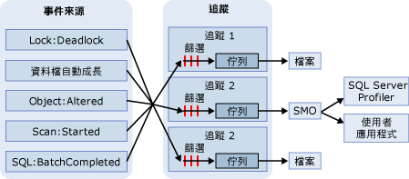

# SQL 追蹤
[!INCLUDE[appliesto-ss-xxxx-xxxx-xxx-md](../../includes/appliesto-ss-xxxx-xxxx-xxx-md.md)]
  在 SQL 追蹤中，如果事件是列在追蹤定義中之事件類別的執行個體，這些事件就會被蒐集起來。 您可將這些事件篩選掉，也可以放入分配目的地的佇列中。 目的地可以是檔案或 [!INCLUDE[ssNoVersion](../../includes/ssnoversion-md.md)] 管理物件 (SMO)，後者會在用於管理 [!INCLUDE[ssNoVersion](../../includes/ssnoversion-md.md)]的應用程式中使用這些追蹤資訊。  
  
> [!IMPORTANT]  
>  [!INCLUDE[ssNoteDepFutureAvoid](../../includes/ssnotedepfutureavoid-md.md)] 請改用擴充事件。  
  
## SQL 追蹤的優點  
 Microsoft [!INCLUDE[ssNoVersion](../../includes/ssnoversion-md.md)] 所提供的 [!INCLUDE[tsql](../../includes/tsql-md.md)] 系統預存程序可建立 [!INCLUDE[ssDEnoversion](../../includes/ssdenoversion-md.md)]執行個體的追蹤。 您可以從自己的應用程式中使用這些系統預存程序以手動建立追蹤，而不是使用 [!INCLUDE[ssSqlProfiler](../../includes/sssqlprofiler-md.md)]建立追蹤。 如此一來，就可以依照您的企業需求撰寫自訂的應用程式。  
  
## SQL 追蹤架構  
 「事件來源」可以是任何產生追蹤事件的來源，例如 [!INCLUDE[tsql](../../includes/tsql-md.md)] 批次，或類似死結的 [!INCLUDE[ssNoVersion](../../includes/ssnoversion-md.md)] 事件。 如需事件的詳細資訊，請參閱 [SQL Server 事件類別參考](../../relational-databases/event-classes/sql-server-event-class-reference.md)。 發生事件之後，如果其事件類別已納入追蹤定義內，追蹤就會蒐集事件資訊。 如果追蹤定義內已針對該事件類別定義了篩選，便會套用篩選並將追蹤事件資訊傳遞給佇列。 佇列中的追蹤資訊會寫入檔案，或由 SMO 在應用程式 (例如 [!INCLUDE[ssSqlProfiler](../../includes/sssqlprofiler-md.md)]) 中使用該資訊。 下列圖表顯示 SQL 追蹤如何在追蹤期間蒐集事件。  
  
   
  
## SQL 追蹤詞彙  
 下列詞彙說明 SQL 追蹤的主要概念。  
  
 **事件**  
 [!INCLUDE[msCoName](../../includes/msconame-md.md)] [!INCLUDE[ssDEnoversion](../../includes/ssdenoversion-md.md)]執行個體內所發生的動作。  
  
 **資料行**  
 事件的屬性。  
  
 **事件類別**  
 可追蹤的事件類型。 事件類別包含所有可由事件報告的資料行。  
  
 **事件類別目錄**  
 相關事件類別的群組。  
  
 **追蹤** (名詞)  
 [!INCLUDE[ssDE](../../includes/ssde-md.md)]所傳回之事件與資料的集合。  
  
 **追蹤** (動詞)  
 收集及監視 [!INCLUDE[ssNoVersion](../../includes/ssnoversion-md.md)]執行個體中的事件。  
  
 **追蹤定義**  
 事件類別、資料行與篩選 (可識別追蹤期間所要收集的事件類型) 的集合。  
  
 **篩選**  
 限制追蹤所收集之事件的條件。  
  
 **追蹤檔案**  
 在儲存追蹤時所建立的檔案。  
  
 **範本**  
 在 [!INCLUDE[ssSqlProfiler](../../includes/sssqlprofiler-md.md)]中，用以定義追蹤所要收集之事件類別與資料行的檔案。  
  
 **追蹤資料表**  
 在 [!INCLUDE[ssSqlProfiler](../../includes/sssqlprofiler-md.md)]中，當追蹤儲存至資料表時所建立的資料表。  
  
## 使用資料行描述傳回的事件  
 SQL 追蹤使用追蹤輸出的資料行來描述追蹤執行時傳回的事件。 下表描述的是 [!INCLUDE[ssSqlProfiler](../../includes/sssqlprofiler-md.md)] 資料行，這些資料行與 SQL 追蹤使用的資料行相同，同時也會指出預設會選取的資料行。  
  
|資料行|資料行編號|描述|  
|-----------------|-------------------|-----------------|  
|**ApplicationName***|10|建立 [!INCLUDE[ssNoVersion](../../includes/ssnoversion-md.md)]執行個體之連接的用戶端應用程式名稱。 這個資料行會填入應用程式所傳送的值，而非程式的名稱。|  
|**BigintData1**|52|值 (**bigint** 資料類型)，會視追蹤指定的事件類別而定。|  
|**BigintData2**|53|值 (**bigint** 資料類型)，會視追蹤指定的事件類別而定。|  
|**Binary Data**|2|二進位值，依據在追蹤中所擷取的事件類別而定。|  
|**ClientProcessID***|9|主機電腦指派給用戶端應用程式執行中處理序的識別碼。 如果用戶端提供處理序識別碼，這個資料行就會擴展。|  
|**ColumnPermissions**|44|指出是否設定資料行權限。 您可以剖析陳述式文字，以判斷資料行所套用的權限。|  
|**CPU**|18|事件所使用的 CPU 時間量 (以毫秒為單位)。|  
|**資料庫識別碼***|3|由 USE <資料庫名稱> 陳述式所指定的資料庫識別碼，或者如果沒有針對指定執行個體發出 USE <資料庫名稱> 陳述式，則是預設資料庫的識別碼。 [!INCLUDE[ssSqlProfiler](../../includes/sssqlprofiler-md.md)] 資料行，則 **ServerName** 會顯示資料庫的名稱。 請使用 DB_ID 函數判斷資料庫的值。|  
|**DatabaseName**|35|正在其中執行使用者陳述式的資料庫名稱。|  
|**DBUserName***|40|用戶端的 [!INCLUDE[ssNoVersion](../../includes/ssnoversion-md.md)] 使用者名稱。|  
|**有效期間**|13|事件的持續期間 (以百萬分之一秒為單位)。   伺服器會以百萬分之一秒為單位 (百萬分之一秒，或 10-6秒) 報告事件的持續時間，並以毫秒為單位 (千分之一秒，或 10-3秒) 報告事件使用的 CPU 時間量。 [!INCLUDE[ssSqlProfiler](../../includes/sssqlprofiler-md.md)] 圖形化使用者介面預設會以毫秒為單位來顯示 **Duration** 資料行，但是當追蹤儲存到檔案或資料庫資料表時，會以百萬分之一秒為單位來寫入 **Duration** 資料行值。|  
|**EndTime**|15|事件結束的時間。 參考到啟動事件的事件類別，例如 **SQL:BatchStarting** 或 **SP:Starting**，不會填入這個欄位。|  
|**錯誤**|31|給定事件的錯誤代碼。 通常這是儲存在 **sysmessages**中的錯誤代碼。|  
|**EventClass***|27|所擷取的事件類別的類型。|  
|**EventSequence**|51|此事件的序號。|  
|**EventSubClass***|21|事件子類別的類型，可為每個事件類別提供更詳細的資訊。 例如， **Execution Warning** 事件類別的事件子類別值代表執行警告的類型：   **1** = 查詢等候。 查詢必須等候資源 (例如記憶體) 才得以執行。   **2** = 查詢逾時。等候執行所需的資源時查詢逾時。 所有事件類別的這個資料行都不會擴展。|  
|**GUID**|54|GUID 值，依據在追蹤內指定的事件類別而定。|  
|**FileName**|36|所修改之檔案的邏輯名稱。|  
|**Handle**|33|ODBC、OLE DB 或 DB-Library 用來協調伺服器執行的整數。|  
|**HostName***|8|執行用戶端的電腦名稱。 這個資料行會在用戶端提供主機名稱時填入。 若要判斷主機名稱，請使用 HOST_NAME 函數。|  
|**IndexID**|24|受事件所影響的物件上的索引識別碼。 若要確定物件的索引識別碼，請使用 **sysindexes** 系統資料表的 **indid** 資料行。|  
|**IntegerData**|25|相依於追蹤所擷取之事件類別的整數值。|  
|**IntegerData2**|55|相依於追蹤所擷取之事件類別的整數值。|  
|**IsSystem**|60|指出事件是發生於系統處理序或使用者處理序：   **1** = 系統   **0** = 使用者|  
|**LineNumber**|5|包含錯誤行號。 如果事件與 [!INCLUDE[tsql](../../includes/tsql-md.md)] 陳述式 (例如 **SP:StmtStarting**) 有關， **LineNumber** 便會將陳述式的行數包含在預存程序或批次中。|  
|**LinkedServerName**|45|連結伺服器的名稱。|  
|**LoginName**|11|使用者的登入名稱 (SQL Server 安全性登入或 DOMAIN\Username 格式的 Windows 登入認證)。|  
|**LoginSid***|41|已登入之使用者的安全性識別碼 (SID)。 您可以在 **master** 資料庫的 **sys.server_principals** 檢視中找到此資訊。 每個資料庫登入都有唯一的 ID。|  
|**MethodName**|47|OLEDB 方法的名稱。|  
|**模式**|32|各種事件用來描述事件所要求或已接收的狀態之整數。|  
|**NestLevel**|29|代表 @@NESTLEVEL 所傳回資料的整數。|  
|**NTDomainName***|7|使用者所隸屬的 Microsoft Windows 網域。|  
|**NTUserName***|6|Windows 使用者名稱。|  
|**Exchange Spill**|22|系統指派的物件識別碼。|  
|**ObjectID2**|56|相關物件或實體的識別碼 (如果有的話)。|  
|**ObjectName**|34|所參考之物件名稱。|  
|**ObjectType***\*|28|代表事件涉及的物件類型之值。 此值對應到 **sysobjects** 中的 **type**資料行。|  
|**Offset**|61|預存程序或批次內之陳述式的起始位移。|  
|**OwnerID**|58|只適用於鎖定事件。 擁有鎖定的物件類型。|  
|**OwnerName**|37|物件擁有者的資料庫使用者名稱。|  
|**ParentName**|59|物件所在的結構描述名稱。|  
|**Permissions**|19|代表核取的權限類型的整數值。 值為：   **1** = SELECT ALL   **2** = UPDATE ALL   **4** = REFERENCES ALL   **8** = INSERT   **16** = DELETE   **32** = EXECUTE (僅限程序)   **4096** = SELECT ANY (至少一個資料行)   **8192** = UPDATE ANY   **16384** = REFERENCES ANY|  
|**ProviderName**|46|OLEDB 提供者的名稱。|  
|**Reads**|16|伺服器代表事件所執行的邏輯磁碟讀取作業次數。 這些讀取作業包括陳述式執行期間，從表格和緩衝區執行的讀取。|  
|**RequestID**|49|包含陳述式之要求的識別碼。|  
|**RoleName**|38|所啟用的應用程式角色名稱。|  
|**RowCounts**|48|批次中的資料列數目。|  
|**ServerName***|26|所追蹤的 [!INCLUDE[ssNoVersion](../../includes/ssnoversion-md.md)] 執行個體名稱。|  
|**SessionLoginName**|64|引發工作階段的使用者登入名稱。 例如，如果您使用 [!INCLUDE[ssNoVersion](../../includes/ssnoversion-md.md)] Login1 **連接到** ，卻以 **Login2**執行陳述式，則 **SessionLoginName** 會顯示 **Login1**，而 **LoginName** 會顯示 **Login2**。 此資料行會同時顯示 [!INCLUDE[ssNoVersion](../../includes/ssnoversion-md.md)] 和 Windows 登入。|  
|**Severity**|20|例外事件的嚴重性層級。|  
|**SourceDatabaseID**|62|其中存在著物件來源的資料庫之識別碼。|  
|**SPID**|12|[!INCLUDE[ssNoVersion](../../includes/ssnoversion-md.md)] 指派給用戶端相關聯之處理序的伺服器處理序識別碼 (SPID)。|  
|**SqlHandle**|63|這是一個 64 位元雜湊，以隨選查詢的文字或 SQL 物件的資料庫和物件識別碼為基礎。 這個值可以傳給 **sys.dm_exec_sql_text()** ，以擷取相關聯的 SQL 文字。|  
|**StartTime***|14|事件啟動的時間 (如果有的話)。|  
|**State**|30|錯誤狀態碼。|  
|**成功**|23|代表事件成功與否。 數值包括：   **1** = 成功   **0** = 失敗   例如， **1** 表示權限檢查成功， **0** 表示檢查失敗。|  
|**TargetLoginName**|42|對於目標為登入的動作，這是目標登入的名稱；例如，要加入新登入。|  
|**TargetLoginSid**|43|對於目標為登入的動作，這是目標登入的 SID；例如，要加入新登入。|  
|**TargetUserName**|39|對於目標為資料庫使用者的動作，這是該使用者的名稱；例如，要授與使用者權限。|  
|**TextData**|@shouldalert|文字值，依據在追蹤中所擷取的事件類別而定。 但是，如果是追蹤參數化查詢， **TextData** 資料行就不會顯示變數與資料值。|  
|**Transaction ID**|4|系統指派的交易識別碼。|  
|**型別**|57|相依於追蹤所擷取之事件類別的整數值。|  
|**Writes**|17|伺服器代表事件所執行的實體磁碟寫入作業次數。|  
|**XactSequence**|50|用來描述目前交易的 Token。|  
  
 * 依預設，所有事件都會擴展這些資料行。  
  
 \*\*如需 **ObjectType** 資料行的詳細資訊，請參閱 [ObjectType 追蹤事件資料行](../../relational-databases/event-classes/objecttype-trace-event-column.md)。  
  
## SQL 追蹤工作  
  
|工作描述|主題|  
|----------------------|-----------|  
|描述如何使用 Transact-SQL 預存程序來建立和執行追蹤。|[使用 Transact-SQL 預存程序來建立和執行追蹤](../../relational-databases/sql-trace/create-and-run-traces-using-transact-sql-stored-procedures.md)|  
|描述在 [!INCLUDE[ssDEnoversion](../../includes/ssdenoversion-md.md)]執行個體上如何使用預存程序來建立手動追蹤。|[使用預存程序建立手動追蹤](../../relational-databases/sql-trace/create-manual-traces-using-stored-procedures.md)|  
|描述如何將追蹤結果儲存至可寫入追蹤結果的檔案。|[將追蹤結果儲存至檔案](../../relational-databases/sql-trace/save-trace-results-to-a-file.md)|  
|描述如何使用 **temp** 目錄中的空間，來改進追蹤資料的存取。|[改善追蹤資料的存取](../../relational-databases/sql-trace/improve-access-to-trace-data.md)|  
|描述如何使用預存程序來建立追蹤。|[建立追蹤 &#40;Transact-SQL&#41;](../../relational-databases/sql-trace/create-a-trace-transact-sql.md)|  
|描述如何使用預存程序來建立篩選，只針對所追蹤的事件擷取需要的資訊。|[設定追蹤篩選 &#40;Transact-SQL&#41;](../../relational-databases/sql-trace/set-a-trace-filter-transact-sql.md)|  
|描述如何使用預存程序來修改現有的追蹤。|[修改現有的追蹤 &#40;Transact-SQL&#41;](../../relational-databases/sql-trace/modify-an-existing-trace-transact-sql.md)|  
|描述如何使用內建函數來檢視已儲存的追蹤。|[檢視已儲存的追蹤 &#40;Transact-SQL&#41;](../../relational-databases/sql-trace/view-a-saved-trace-transact-sql.md)|  
|描述如何使用內建函數來檢視追蹤篩選資訊。|[檢視篩選資訊 &#40;Transact-SQL&#41;](../../relational-databases/sql-trace/view-filter-information-transact-sql.md)|  
|描述如何使用預存程序來刪除追蹤。|[刪除追蹤 &#40;Transact-SQL&#41;](../../relational-databases/sql-trace/delete-a-trace-transact-sql.md)|  
|描述如何讓追蹤造成的效能成本降至最少。|[最佳化 SQL 追蹤](../../relational-databases/sql-trace/optimize-sql-trace.md)|  
|描述如何篩選追蹤，讓追蹤期間造成的負擔降到最低。|[篩選追蹤](../../relational-databases/sql-trace/filter-a-trace.md)|  
|描述如何將追蹤所收集的資料量降至最低。|[限制追蹤檔案和資料表的大小](../../relational-databases/sql-trace/limit-trace-file-and-table-sizes.md)|  
|描述在 Microsoft [!INCLUDE[ssNoVersion](../../includes/ssnoversion-md.md)]中排程追蹤的兩種方法。|[排程追蹤](../../relational-databases/sql-trace/schedule-traces.md)|  
  
## 另請參閱  
 [SQL Server Profiler 範本和權限](../../tools/sql-server-profiler/sql-server-profiler-templates-and-permissions.md)   
 [SQL Server 管理物件 &#40;SMO&#41; 程式設計指南](../../relational-databases/server-management-objects-smo/sql-server-management-objects-smo-programming-guide.md)  
  
  
