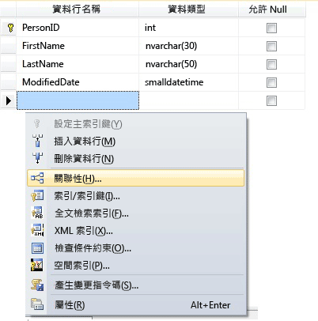
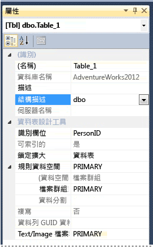

# <a name="create-tables-database-engine"></a>建立資料表 (Database Engine)
[!INCLUDE[tsql-appliesto-ss2016-all-md](../../includes/tsql-appliesto-ss2016-all-md.md)]

  您可以使用 [!INCLUDE[ssManStudioFull](../../includes/ssmanstudiofull-md.md)] 或 [!INCLUDE[tsql](../../includes/tsql-md.md)]，建立新資料表、為資料表命名，並將它新增至現有資料庫。  
  

  
##  <a name="Permissions"></a> 請先檢查您的權限！  
這項工作需要資料庫的 CREATE TABLE 權限以及用以建立資料表結構描述的 ALTER 權限。  
  
 如果將 CREATE TABLE 陳述式中的任何資料行定義成 CLR 使用者定義型別，就需要類型的擁有權或其 REFERENCES 權限。  
  
 如果 CREATE TABLE 陳述式中的任何資料行有相關聯的 XML 結構描述集合，就需要 XML 結構描述集合的擁有權或它的 REFERENCES 權限。  
  
 
## <a name="using-table-designer"></a>使用資料表設計工具  
  
1.  在 SSMS 的 **物件總管**中，連接至包含要修改的資料庫的 [!INCLUDE[ssDE](../../includes/ssde-md.md)] 執行個體。  
  
2.  在 **[物件總管]** 中，展開 **[資料庫]** 節點，然後展開將包含新資料表的資料庫。  
  
3.  在物件總管中，以滑鼠右鍵按一下資料庫的 [資料表] 節點，然後按一下 [新增資料表]。  
  
4.  鍵入資料行名稱，選擇資料類型，然後選擇是否允許讓每個資料行都是 null，如下圖所示：  
  
       
  
5.  若要指定資料行的其他屬性，例如識別或計算資料行值，請按一下資料行，然後在資料行屬性索引標籤中選擇適當的屬性。 如需資料行屬性的詳細資訊，請參閱[資料表資料行屬性 &#40;SQL Server Management Studio&#41;](../../relational-databases/tables/table-column-properties-sql-server-management-studio.md)。  
  
6.  若要指定資料行做為主索引鍵，請以滑鼠右鍵按一下資料行並選取 [設定主索引鍵]。 如需詳細資訊，請參閱 [Create Primary Keys](../../relational-databases/tables/create-primary-keys.md)。  
  
7.  若要建立外部索引鍵關聯性、檢查條件約束或索引，請在 [資料表設計工具] 窗格中按一下滑鼠右鍵並選取清單中的物件，如下圖所示：  
  
       
  
     如需有關這些物件的詳細資訊，請參閱＜ [Create Foreign Key Relationships](../../relational-databases/tables/create-foreign-key-relationships.md)＞、＜ [Create Check Constraints](../../relational-databases/tables/create-check-constraints.md) ＞和＜ [Indexes](../../relational-databases/indexes/indexes.md)＞。  
  
8.  依預設，此資料表包含在 **dbo** 結構描述中。 若要為資料表指定不同的結構描述，請在 [資料表設計工具] 窗格中按一下滑鼠右鍵並選取 [屬性]，如下圖所示。 從 [結構描述] 下拉式清單中選取適當的結構描述。  
  
       
  
     如需有關結構描述的詳細資訊，請參閱＜ [Create a Database Schema](../../relational-databases/security/authentication-access/create-a-database-schema.md)＞。  
  
9. 從 [檔案]  功能表中，選擇 [儲存]  *table name*。  
  
10. 在 **[選擇名稱]** 對話方塊中，輸入資料表的名稱，然後按一下 **[確定]**。  
  
11. 若要檢視新的資料表，在 **[物件總管]**，展開 **[資料表]** 節點並按 **F5** 重新整理物件清單。 新的資料表就會在資料表清單中顯示。  
  
##  <a name="TsqlProcedure"></a> 使用 Transact-SQL  
  
## <a name="using-query-editor"></a>使用查詢編輯器  
  
1.  在 **[物件總管]** 中，連接到 [!INCLUDE[ssDE](../../includes/ssde-md.md)]的執行個體。  
  
2.  在標準列上，按一下 **[新增查詢]**。  
  
3.  複製下列範例並將其貼到查詢視窗中，然後按一下 **[執行]**。  
  
    ```  
    CREATE TABLE dbo.PurchaseOrderDetail  
    (  
        PurchaseOrderID int NOT NULL  
        ,LineNumber smallint NOT NULL  
        ,ProductID int NULL  
        ,UnitPrice money NULL  
        ,OrderQty smallint NULL  
        ,ReceivedQty float NULL  
        ,RejectedQty float NULL  
        ,DueDate datetime NULL  
    );  
    ```  
  
 如需更多範例，請參閱 [ALTER TABLE &#40;Transact-SQL&#41;](../../t-sql/statements/create-table-transact-sql.md)。  
  
  
