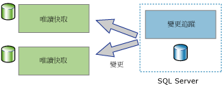
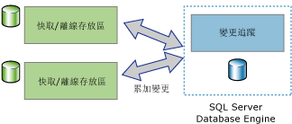

# 關於變更追蹤 (SQL Server)
[!INCLUDE[tsql-appliesto-ss2008-asdb-xxxx-xxx_md](../../includes/tsql-appliesto-ss2008-asdb-xxxx-xxx-md.md)]

  變更追蹤是為應用程式提供高效率變更追蹤機制的輕量型方案。 一般而言，若要讓應用程式查詢對資料庫中之資料所做的變更並且存取與這些變更有關的資訊，應用程式開發人員就必須實作自訂變更追蹤機制。 建立這些機制通常需要進行大量工作而且經常涉及使用觸發程序、 **時間戳記** 資料行、儲存追蹤資訊的新資料表和自訂清除程序的組合。  
  
 對於有關變更的所需資訊量，不同的應用程式類型具有不同的需求。 應用程式可以使用變更追蹤來回答下列有關已經對使用者資料表所做變更的問題：  
  
-   使用者資料表的哪些資料列已經變更？  
  
    -   只需要某個資料列已經變更的事實，而不需要該資料列變更多少次或任何中繼變更的值。  
  
    -   您可以直接從追蹤的資料表中取得最新的資料。  
  
-   某個資料列是否已經變更？  
  
    -   在相同的交易中進行變更時，某個資料列已經變更的事實以及變更的相關資訊必須可用而且已記錄。  
  
> [!NOTE]  
>  如果應用程式需要所做之所有變更的相關資訊以及變更之資料的中繼值，則使用異動資料擷取來取代變更追蹤可能會很適合。 如需詳細資訊，請參閱[關於異動資料擷取 &#40;SQL Server&#41;](../../relational-databases/track-changes/about-change-data-capture-sql-server.md)。  
  
## 單向和雙向同步處理應用程式  
 必須與 [!INCLUDE[ssDEnoversion](../../includes/ssdenoversion-md.md)] 執行個體同步處理資料的應用程式必須能夠查詢變更。 變更追蹤可當做單向和雙向同步處理應用程式的基礎。  
  
### 單向同步處理應用程式  
 您可以建立使用變更追蹤的單向同步處理應用程式 (例如用戶端或中層快取應用程式)。 如下圖所示，快取應用程式會要求資料在 [!INCLUDE[ssDE](../../includes/ssde-md.md)] 中儲存以及在其他資料存放區中快取。 此應用程式必須能夠使用已經對資料庫資料表所做的任何變更，讓快取保持在最新狀態。 沒有任何變更要傳回 [!INCLUDE[ssDE](../../includes/ssde-md.md)]。  
  
   
  
### 雙向同步處理應用程式  
 您也可以建立使用變更追蹤的雙向同步處理應用程式。 在這個狀況中， [!INCLUDE[ssDE](../../includes/ssde-md.md)] 執行個體中的資料會與一或多個資料存放區同步處理。 這些存放區中的資料可以更新，而且這些變更必須同步處理回 [!INCLUDE[ssDE](../../includes/ssde-md.md)]。  
  
   
  
 雙向同步處理應用程式有個很好的範例，那就是偶爾連接的應用程式。 在這種應用程式中，用戶端應用程式會查詢並更新本機存放區。 當用戶端與伺服器之間的連接可用時，應用程式就會與伺服器同步處理，而且變更的資料會雙向流動。  
  
 雙向同步處理應用程式必須能夠偵測衝突。 如果在同步處理期間，兩個資料存放區中的相同資料已變更，就會發生衝突。 透過偵測衝突的功能，應用程式就可以確保變更不會遺失。  
  
## 變更追蹤的運作方式  
 若要設定變更追蹤，您可以使用 DDL 陳述式或 [!INCLUDE[ssManStudioFull](../../includes/ssmanstudiofull-md.md)]。 如需詳細資訊，請參閱 [啟用和停用變更追蹤 &#40;SQL Server&#41;](../../relational-databases/track-changes/enable-and-disable-change-tracking-sql-server.md)。 若要追蹤變更，您必須先針對資料庫啟用變更追蹤，然後再針對該資料庫內要追蹤的資料表啟用變更追蹤。 您不需要變更任何資料表定義，而且不會建立任何觸發程序。  
  
 對資料表設定變更追蹤之後，任何會影響資料表內資料列的 DML 陳述式都會讓每一個修改之資料列的變更追蹤資訊得以記錄下來。 若要查詢已經變更的資料列以及取得有關變更的資訊，您可以使用 [變更追蹤函數](../../relational-databases/system-functions/change-tracking-functions-transact-sql.md)。  
  
 主索引鍵資料行的值就是追蹤資料表內與變更資訊一起記錄的唯一資訊。 這些值會識別已經變更的資料列。 若要取得這些資料列的最新資料，應用程式可以使用主索引鍵資料行的值來聯結來源資料表與追蹤資料表。  
  
 您也可以使用變更追蹤來取得對每個資料列所做變更的相關資訊。 例如，導致變更 (插入、更新或刪除) 的 DML 作業類型，或在更新作業中變更的資料行。 
 
## 變更追蹤清除
所有資料表的變更追蹤資訊 (已針對變更追蹤啟用) 會儲存在記憶體內部資料列存放區。 與針對變更追蹤啟用的每個資料表建立關聯的變更追蹤資料，會在每個檢查點從記憶體內部資料列存放區排清到對應的磁碟上內部資料表。 在檢查點，記憶體內部資料列存放區也會在資料列移到磁碟上資料表之後清除。

針對變更追蹤啟用的每個資料表都有內部的磁碟資料表，變更追蹤函式用來判斷變更版本以及在特定版本之後變更的資料列。 每次喚醒**自動清除**執行緒時，它會掃描 SQL Server 執行個體上的所有使用者資料庫，識別已啟用變更追蹤的資料庫。 根據資料庫的保留期限設定，會將每個內部磁碟資料表的過期記錄清除。

在 [!INCLUDE[ssSQL14](../../includes/sssql14-md.md)] 和 [!INCLUDE[ssSQL15](../../includes/sssql15-md.md)] 的 Service Pack 中新增了預存程序，以便為內部變更追蹤內部資料表執行手動清除。 此預存程序的詳細資訊位於 [KB173157](https://support.microsoft.com/help/3173157/adds-a-stored-procedure-for-the-manual-cleanup-of-the-change-tracking-side-table-in-sql-server-2014-sp2-or-2016-sp1)。 
  
## 另請參閱  
 [啟用和停用變更追蹤 &#40;SQL Server&#41;](../../relational-databases/track-changes/enable-and-disable-change-tracking-sql-server.md)   
 [使用變更追蹤 &#40;SQL Server&#41;](../../relational-databases/track-changes/work-with-change-tracking-sql-server.md)   
 [管理變更追蹤 &#40;SQL Server&#41;](../../relational-databases/track-changes/manage-change-tracking-sql-server.md)   
 [追蹤資料變更 &#40;SQL Server&#41;](../../relational-databases/track-changes/track-data-changes-sql-server.md)  
  
  

