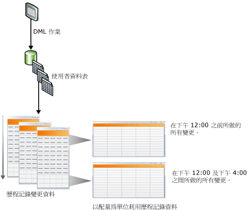
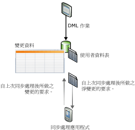

# 追蹤資料變更 (SQL Server)
[!INCLUDE[tsql-appliesto-ss2008-asdb-xxxx-xxx-md](../../includes/tsql-appliesto-ss2008-asdb-xxxx-xxx-md.md)]
  [!INCLUDE[ssCurrent](../../includes/sscurrent-md.md)] 提供兩個追蹤資料庫資料變更的功能： [異動資料擷取](#Capture) 和 [變更追蹤](#Tracking)。 這些功能可協助應用程式判斷對資料庫中使用者資料表所做的 DML 變更 (插入、更新和刪除作業)。 可在同一個資料庫上啟用異動資料擷取和變更追蹤；無需特殊考量。 如需支援異動資料擷取和變更追蹤的 [!INCLUDE[ssNoVersion](../../includes/ssnoversion-md.md)] 版本，請參閱 [SQL Server 2016 版本支援的功能](~/sql-server/editions-and-supported-features-for-sql-server-2016.md)。 [!INCLUDE[ssSDS_md](../../includes/sssds-md.md)]支援變更追蹤。
  
## 使用異動資料擷取或變更追蹤的優點  
 在資料庫中查詢已經變更之資料的能力，是讓某些應用程式具有效率的重要需求。 一般而言，若要判斷資料變更，應用程式開發人員必須使用觸發程序、時間戳記資料行和其他資料表的組合，在其應用程式中實作自訂追蹤方法。 不過，建立這些應用程式通常需要實作大量工作、導致結構描述更新，而且經常會產生很高的效能負擔。  
  
 在應用程式中使用異動資料擷取或變更追蹤來追蹤資料庫的變更 (以取代開發自訂方案) 有下列優點：  
  
-   開發時間縮短。 由於 [!INCLUDE[ssCurrent](../../includes/sscurrent-md.md)]提供了功能，因此您不需要開發自訂方案。  
  
-   不需要結構描述變更。 如果資料行無法加入至使用者資料表，您不必加入資料行、加入觸發程序或建立側邊資料表，以追蹤已刪除的資料列或儲存變更追蹤資訊。  
  
-   有內建的清除機制。 變更追蹤的清除作業會自動在背景執行。 不需要針對儲存在側邊資料表中的資料進行自訂清除作業。  
  
-   系統提供了函數，可取得變更資訊。  
  
-   DML 作業的負擔降低。 同步的變更追蹤一定會產生一些負擔。 不過，使用變更追蹤有助於將負擔降到最低。 這項負擔通常會比使用替代方案的負擔更低，尤其是需要使用觸發程序的方案。  
  
-   變更追蹤是以認可的交易為基礎。 變更的順序是根據交易認可時間而定。 當長時間執行而且重疊的交易存在時，這點將確保能夠取得可靠的結果。 使用 **timestamp** 值的自訂方案則必須經過特別設計，才能處理這些狀況。  
  
-   提供可用於設定和管理的標準工具。 [!INCLUDE[ssCurrent](../../includes/sscurrent-md.md)] 提供標準 DDL 陳述式、 [!INCLUDE[ssManStudioFull](../../includes/ssmanstudiofull-md.md)]、目錄檢視和安全性權限。  
  
## 異動資料擷取與變更追蹤之間的功能差異  
 下表將列出異動資料擷取與變更追蹤之間的功能差異。 異動資料擷取中的追蹤機制包含從交易記錄中以非同步方式擷取變更，以便在 DML 作業之後可以使用變更。 但是，在變更追蹤中，其追蹤機制包含以同步方式追蹤變更而且與 DML 並列執行，以便可以立即使用變更資訊。  
  
|功能|異動資料擷取|變更追蹤|  
|-------------|-------------------------|---------------------|  
|**追蹤的變更**|||  
|DML 變更|是|是|  
|**追蹤的資訊**|||  
|歷程記錄資料|是|否|  
|資料行是否已變更|是|是|  
|DML 類型|是|是|  
  
##   Change Data Capture  
 異動資料擷取會透過擷取進行 DML 變更的事實以及變更的實際資料，提供使用者資料表的歷程記錄變更資訊。 這些變更是使用讀取交易記錄而且對系統影響很小的非同步處理序擷取的。  
  
 如下圖所示，對使用者資料表所做的變更會擷取在對應的變更資料表中。 這些變更資料表會提供一段時間內變更的歷程記錄檢視。 [所提供的](../../relational-databases/system-functions/change-data-capture-functions-transact-sql.md)異動資料擷取 [!INCLUDE[ssNoVersion](../../includes/ssnoversion-md.md)] 函數可讓您方便且有系統地取用變更資料。  
  
   
  
### 安全性模型  
 本節描述異動資料擷取安全性模型。  
  
 **組態和管理**  
 若要針對資料庫啟用或停用異動資料擷取，[sys.sp_cdc_enable_db &#40;Transact-SQL&#41;](../../relational-databases/system-stored-procedures/sys-sp-cdc-enable-db-transact-sql.md) 或 [sys.sp_cdc_disable_db &#40;Transact-SQL&#41;](../../relational-databases/system-stored-procedures/sys-sp-cdc-disable-db-transact-sql.md) 的呼叫端必須是固定伺服器 **sysadmin** 角色的成員。 在資料表層級啟用和停用異動資料擷取會要求 [sys.sp_cdc_enable_table &#40;Transact-SQL&#41;](../../relational-databases/system-stored-procedures/sys-sp-cdc-enable-table-transact-sql.md) 和 [sys.sp_cdc_disable_table &#40;Transact-SQL&#41;](../../relational-databases/system-stored-procedures/sys-sp-cdc-disable-table-transact-sql.md) 的呼叫端必須是 sysadmin 角色的成員或 **database db_owner** 角色的成員。  
  
 只有伺服器 **sysadmin** 角色的成員和 **database db_owner** 角色的成員才能使用這些預存程序來支援異動資料擷取作業的管理。  
  
 **變更列舉和中繼資料查詢**  
 若要存取與擷取執行個體相關聯的變更資料，使用者必須被授與相關聯來源資料表之所有擷取資料行的選取存取權。 此外，如果建立擷取執行個體時指定了控制角色，呼叫端也必須是指定之控制角色的成員。 雖然傳回中繼資料的存取權通常也會使用基礎來源資料表的選取存取權控制，以及任何已定義之控制角色的成員資格控制，但是所有資料庫使用者都可以透過 Public 角色存取用以存取中繼資料的其他一般異動資料擷取函數。  
  
 **啟用異動資料擷取之來源資料表的 DDL 作業**  
 當某份資料表啟用異動資料擷取時，只有固定伺服器角色 **sysadmin**的成員、 **database role db_owner**的成員或 **database role db_ddladmin**的成員能夠將 DDL 作業套用至此資料表。 如果擁有針對資料表執行 DDL 作業之明確授與權限的使用者嘗試執行這些作業，就會收到錯誤 22914。  
  
### 異動資料擷取的資料類型考量  
 異動資料擷取支援所有基礎資料行類型。 下表將列出許多資料行類型的行為與限制。  
  
|資料行的類型|在變更資料表中擷取的變更|限制|  
|--------------------|---------------------------------------|-----------------|  
|疏鬆資料行|是|使用資料行集時，不支援擷取變更。|  
|計算資料行|否|不會追蹤對計算資料行所做的變更。 此資料行將以適當的類型顯示在變更資料表中，但是將具有 NULL 值。|  
|XML|是|不會追蹤對個別 XML 元素所做的變更。|  
|timestamp|是|變更資料表中的資料類型會轉換成二進位。|  
|BLOB 資料類型|是|只有當資料行本身變更時，才會儲存 BLOB 資料行的先前影像。|  
  
### 異動資料擷取和其他 SQL Server 功能  
 本節描述下列功能如何與異動資料擷取互動：  
  
-   資料庫鏡像  
  
-   異動複寫  
  
-   資料庫還原或附加  
  
#### 資料庫鏡像  
 啟用變更資料擷取的資料庫可以進行鏡像。 若要確保擷取和清除會自動在鏡像上進行，請遵循下列步驟：  
  
1.  確定 [!INCLUDE[ssNoVersion](../../includes/ssnoversion-md.md)] Agent 正在鏡像上執行。  
  
2.  當主體已經容錯移轉至鏡像之後，在鏡像上建立擷取作業和清除作業。 若要建立這些作業，請使用 [sys.sp_cdc_add_job &#40;Transact-SQL&#41;](../../relational-databases/system-stored-procedures/sys-sp-cdc-add-job-transact-sql.md) 預存程序。  
  
 如需資料庫鏡像的詳細資訊，請參閱[資料庫鏡像 &#40;SQL Server&#41;](../../database-engine/database-mirroring/database-mirroring-sql-server.md)。  
  
#### 異動複寫  
 雖然變更資料擷取和異動複寫可以同時存在同一個資料庫中，但是同時啟用這兩項功能時，系統會以不同的方式處理變更資料表的擴展。 變更資料擷取和異動複寫一定會使用相同的程序 [sp_replcmds](../../relational-databases/system-stored-procedures/sp-replcmds-transact-sql.md)，從交易記錄中讀取變更。 單獨啟用變更資料擷取時， [!INCLUDE[ssNoVersion](../../includes/ssnoversion-md.md)] Agent 作業就會呼叫 **sp_replcmds**。 在同一個資料庫上同時啟用這兩項功能時，記錄讀取器代理程式就會呼叫 **sp_replcmds**。 這個代理程式會同時擴展變更資料表和散發資料庫資料表。 如需詳細資訊，請參閱 [Replication Log Reader Agent](../../relational-databases/replication/agents/replication-log-reader-agent.md)。  
  
 假設您在 [!INCLUDE[ssSampleDBobject](../../includes/sssampledbobject-md.md)] 資料庫上啟用了變更資料擷取，而且有兩份資料表啟用了擷取。 為了擴展變更資料表，擷取作業會呼叫 **sp_replcmds**。 資料庫啟用了異動複寫，而且建立了發行集。 此時，會針對資料庫建立記錄讀取器代理程式，並且刪除擷取作業。 記錄讀取器代理程式會繼續掃描記錄，從變更資料表所認可的最後一個記錄序號開始。 如此可確保變更資料表中的資料保持一致。 如果這個資料庫停用了異動複寫，系統就會移除記錄讀取器代理程式並且重新建立擷取作業。  
  
> [!NOTE]  
>  當記錄讀取器代理程式同時用於變更資料擷取和異動複寫時，複寫的變更會先寫入散發資料庫。 然後，擷取的變更才會寫入變更資料表。 這兩項作業會一起認可。 如果寫入散發資料庫時發生延遲，系統會建立對應的延遲，然後變更才會出現在變更資料表中。  
  
#### 還原或附加啟用變更資料擷取的資料庫  
 [!INCLUDE[ssNoVersion](../../includes/ssnoversion-md.md)] 會使用下列邏輯來判斷在還原或附加資料庫之後，變更資料擷取是否會維持啟用狀態：  
  
-   如果資料庫還原至具有相同資料庫名稱的相同伺服器，變更資料擷取就會維持啟用狀態。  
  
-   如果資料庫還原至其他伺服器，預設會停用變更資料擷取並且刪除所有相關的中繼資料。  
  
     若要保留變更資料擷取，請在還原資料庫時使用 **KEEP_CDC** 選項。 如需有關這個選項的詳細資訊，請參閱＜ [RESTORE](../../t-sql/statements/restore-statements-transact-sql.md)＞。  
  
-   如果資料庫卸離並附加至相同伺服器或其他伺服器，變更資料擷取就會維持啟用狀態。  
  
-   如果您使用 **KEEP_CDC** 選項，將資料庫附加或還原至 Enterprise 以外的任何版本，此作業就會遭封鎖，因為變更資料擷取需要 [!INCLUDE[ssNoVersion](../../includes/ssnoversion-md.md)] Enterprise。 此時會顯示錯誤訊息 932：  
  
     `SQL Server cannot load database '%.*ls' because change data capture is enabled. The currently installed edition of SQL Server does not support change data capture. Either disable change data capture in the database by using a supported edition of SQL Server, or upgrade the instance to one that supports change data capture.`  
  
 您可以使用 [sys.sp_cdc_disable_db](../../relational-databases/system-stored-procedures/sys-sp-cdc-disable-db-transact-sql.md) ，從還原或附加的資料庫中移除變更資料擷取。  
  
##   Change Tracking  
 變更追蹤會擷取資料表中資料列變更的事實，但是不會擷取變更的資料。 這項功能可讓應用程式使用直接從使用者資料表中取得的最新資料列資料，判斷已經變更的資料列。 因此，與異動資料擷取相較之下，變更追蹤在它可回答的歷程記錄問題方面具有較多限制。 不過，對於不需要歷程記錄資訊的應用程式而言，由於不會擷取變更的資料，因此儲存負擔會非常低。 這項功能會使用同步追蹤機制來追蹤變更。 其設計目的是要對 DML 作業產生最低負擔。  
  
 下圖將顯示使用變更追蹤所獲益的同步處理狀況。 在此狀況中，應用程式需要下列資訊：自從資料表上次同步處理以來已經變更的所有資料表資料列，以及只有目前的資料列資料。 由於使用了同步機制來追蹤變更，因此應用程式可以執行雙向同步處理，而且能夠可靠地偵測出可能已經發生的任何衝突。  
  
   
  
### 變更追蹤和 Sync Services for ADO.NET  
 [!INCLUDE[sql_sync_long](../../includes/sql-sync-long-md.md)] 可以在資料庫之間同步處理，並提供一套直覺式和具彈性的 API，可讓您用來建立針對離線和共同作業案例的應用程式。 [!INCLUDE[sql_sync_long](../../includes/sql-sync-long-md.md)] 提供了可同步處理變更的 API，但是它實際上不會追蹤伺服器或對等 (Peer) 資料庫中的變更。 您可以建立自訂變更追蹤系統，但是這樣做通常會大幅增加複雜度和效能負擔。 若要追蹤伺服器或對等資料庫中的變更，我們建議您使用 [!INCLUDE[ssCurrent](../../includes/sscurrent-md.md)] 中的變更追蹤，因為這項功能容易設定而且可提供高效能追蹤。  
  
 如需有關變更追蹤和 [!INCLUDE[sql_sync_long](../../includes/sql-sync-long-md.md)]的詳細資訊，請使用下列連結：  
  
-   [關於變更追蹤 &#40;SQL Server&#41;](../../relational-databases/track-changes/about-change-tracking-sql-server.md)  
  
     描述變更追蹤、提供變更追蹤之運作方式的高層級概觀，以及描述變更追蹤要如何與其他 [!INCLUDE[ssDEnoversion](../../includes/ssdenoversion-md.md)] 功能互動。  
  
-   [Microsoft Sync Framework 開發人員中心](http://go.microsoft.com/fwlink/?LinkId=108054)  
  
     提供 [!INCLUDE[ssSyncFrameLong](../../includes/sssyncframelong-md.md)] 和 [!INCLUDE[sql_sync_short](../../includes/sql-sync-short-md.md)]的完整文件集。 在 [!INCLUDE[sql_sync_short](../../includes/sql-sync-short-md.md)]的文件集中，＜如何：使用 SQL Server 變更追蹤＞主題包含了詳細資訊和程式碼範例。  
  
## 相關工作 (必要)  
  
|||  
|-|-|  
|**工作**|**主題**|  
|提供異動資料擷取的概觀。|[關於異動資料擷取 &#40;SQL Server&#41;](../../relational-databases/track-changes/about-change-data-capture-sql-server.md)|  
|描述如何在資料庫或資料表上啟用及停用異動資料擷取。|[啟用和停用異動資料擷取 &#40;SQL Server&#41;](../../relational-databases/track-changes/enable-and-disable-change-data-capture-sql-server.md)|  
|描述如何管理及監視異動資料擷取。|[管理和監視異動資料擷取 &#40;SQL Server&#41;](../../relational-databases/track-changes/administer-and-monitor-change-data-capture-sql-server.md)|  
|描述如何處理可用於異動資料擷取取用者的變更資料。 此主題涵蓋驗證 LSN 界限、查詢函數和查詢函數案例。|[使用變更資料 &#40;SQL Server&#41;](../../relational-databases/track-changes/work-with-change-data-sql-server.md)|  
|提供變更追蹤的概觀。|[關於變更追蹤 &#40;SQL Server&#41;](../../relational-databases/track-changes/about-change-tracking-sql-server.md)|  
|描述如何在資料庫或資料表上啟用及停用變更追蹤。|[啟用和停用變更追蹤 &#40;SQL Server&#41;](../../relational-databases/track-changes/enable-and-disable-change-tracking-sql-server.md)|  
|描述如何管理變更追蹤、設定安全性，以及判斷使用變更追蹤對儲存和效能產生的影響。|[管理變更追蹤 &#40;SQL Server&#41;](../../relational-databases/track-changes/manage-change-tracking-sql-server.md)|  
|描述使用變更追蹤的應用程式如何取得追蹤變更、將這些變更套用至另一個資料存放區，以及更新來源資料庫。 此主題也描述在進行容錯移轉而且必須從備份還原資料庫時，變更追蹤所扮演的角色。|[使用變更追蹤 &#40;SQL Server&#41;](../../relational-databases/track-changes/work-with-change-tracking-sql-server.md)|  
  
## 另請參閱  
 [異動資料擷取函數 &#40;Transact-SQL&#41;](../../relational-databases/system-functions/change-data-capture-functions-transact-sql.md)   
 [變更追蹤函數 &#40;Transact-SQL&#41;](../../relational-databases/system-functions/change-tracking-functions-transact-sql.md)   
 [異動資料擷取預存程序 &#40;Transact-SQL&#41;](../../relational-databases/system-stored-procedures/change-data-capture-stored-procedures-transact-sql.md)   
 [異動資料擷取資料表 &#40;Transact-SQL&#41;](../../relational-databases/system-tables/change-data-capture-tables-transact-sql.md)   
 [異動資料擷取相關的動態管理檢視 &#40;Transact-SQL&#41;](http://msdn.microsoft.com/library/2a771d7d-693a-4f56-9227-02cd00e0e200)  
  
  

