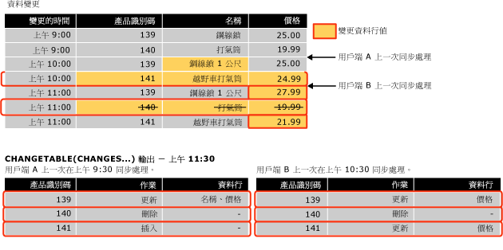

# <a name="work-with-change-tracking-sql-server"></a>使用變更追蹤 (SQL Server)
[!INCLUDE[tsql-appliesto-ss2008-asdb-xxxx-xxx-md](../../includes/tsql-appliesto-ss2008-asdb-xxxx-xxx-md.md)]

  使用變更追蹤的應用程式必須能夠取得追蹤變更、將這些變更套用至另一個資料存放區，以及更新來源資料庫。 此主題描述如何執行這些工作，以及在進行容錯移轉而且必須從備份還原資料庫時，變更追蹤所扮演的角色。  
  
##  <a name="Obtain"></a> 使用變更追蹤函數來取得變更  
 描述如何使用變更追蹤函數來取得變更以及對資料庫所做變更的相關資訊。  
  
### <a name="about-the-change-tracking-functions"></a>關於變更追蹤函數  
 應用程式可以使用下列函數來取得在資料庫中所做的變更和這些變更的相關資訊：  
  
 CHANGETABLE(CHANGES ...) 函式  
 這個資料列集函數是用於查詢是否有變更資訊。 此函數會查詢儲存在內部變更追蹤資料表中的資料。 此函數會傳回結果集，其中包含已變更之資料列的主索引鍵，以及其他變更資訊，例如作業、更新的資料行及此資料列的版本。  
  
 CHANGETABLE(CHANGES ...) 會將上一次同步處理版本當做引數。 上一次同步處理版本是使用 `@last_synchronization_version` 變數來取得。 上一次同步處理版本的語意如下：  
  
-   呼叫的用戶端已取得變更並了解到上一次同步處理版本為止的所有變更 (包括此版本)。  
  
-   CHANGETABLE(CHANGES ...) 因此會傳回上一次同步處理版本之後發生的所有變更。  
  
     下圖將說明 CHANGETABLE(CHANGES ...) 如何用於取得變更。  
  
       
  
 CHANGE_TRACKING_CURRENT_VERSION() 函數  
 這是用於取得下一次查詢變更時將使用的目前版本。 此版本代表上一次認可的交易版本。  
  
 CHANGE_TRACKING_MIN_VALID_VERSION() 函式  
 這是用於取得用戶端可以擁有，並仍然可從 CHANGETABLE() 取得有效結果的最小有效版本。 用戶端應該針對此函數所傳回的值，檢查上一次同步處理版本。 如果上一次同步處理版本小於此函數所傳回的版本，用戶端將無法從 CHANGETABLE() 取得有效結果，而且必須重新初始化。  
  
### <a name="obtaining-initial-data"></a>取得初始資料  
 在應用程式首次取得變更之前，應用程式必須先傳送查詢，以便取得初始資料和同步處理版本。 應用程式必須直接從資料表中取得適當的資料，然後使用 CHANGE_TRACKING_CURRENT_VERSION() 來取得初始版本。 這個版本將在首次取得變更時傳遞給 CHANGETABLE(CHANGES ...)。  
  
 下列範例將說明如何取得初始同步處理版本和初始資料集。  
  
```sql  
    -- Obtain the current synchronization version. This will be used next time that changes are obtained.  
    SET @synchronization_version = CHANGE_TRACKING_CURRENT_VERSION();  
  
    -- Obtain initial data set.  
    SELECT  
        P.ProductID, P.Name, P.ListPrice  
    FROM  
        SalesLT.Product AS P  
```  
  
### <a name="using-the-change-tracking-functions-to-obtain-changes"></a>使用變更追蹤函數來取得變更  
 若要取得資料表的變更資料列和這些變更的相關資訊，請使用 CHANGETABLE(CHANGES...)。例如，下列查詢會取得 `SalesLT.Product` 資料表的變更。  
  
```sql  
SELECT  
    CT.ProductID, CT.SYS_CHANGE_OPERATION,  
    CT.SYS_CHANGE_COLUMNS, CT.SYS_CHANGE_CONTEXT  
FROM  
    CHANGETABLE(CHANGES SalesLT.Product, @last_synchronization_version) AS CT  
  
```  
  
 一般而言，用戶端會想要取得資料列的最新資料，而非只有該資料列的主索引鍵。 因此，應用程式會讓 CHANGETABLE(CHANGES ...) 的結果與使用者資料表中的資料聯結。 例如，下列查詢會與 `SalesLT.Product` 資料表聯結，以便取得 `Name` 和 `ListPrice` 資料行的值。 請注意 `OUTER JOIN`的用法。 這是確保系統會針對已經從使用者資料表中刪除的這些資料列傳回變更資訊的必要條件。  
  
```sql  
SELECT  
    CT.ProductID, P.Name, P.ListPrice,  
    CT.SYS_CHANGE_OPERATION, CT.SYS_CHANGE_COLUMNS,  
    CT.SYS_CHANGE_CONTEXT  
FROM  
    SalesLT.Product AS P  
RIGHT OUTER JOIN  
    CHANGETABLE(CHANGES SalesLT.Product, @last_synchronization_version) AS CT  
ON  
    P.ProductID = CT.ProductID  
```  
  
 若要取得可在下一次變更列舉中使用的版本，請使用 CHANGE_TRACKING_CURRENT_VERSION()，如下列範例所示。  
  
```sql  
SET @synchronization_version = CHANGE_TRACKING_CURRENT_VERSION()  
```  
  
 當應用程式取得變更時，它必須同時使用 CHANGETABLE(CHANGES...) 和 CHANGE_TRACKING_CURRENT_VERSION()，如下列範例所示。  
  
```sql  
-- Obtain the current synchronization version. This will be used the next time CHANGETABLE(CHANGES...) is called.  
SET @synchronization_version = CHANGE_TRACKING_CURRENT_VERSION();  
  
-- Obtain incremental changes by using the synchronization version obtained the last time the data was synchronized.  
SELECT  
    CT.ProductID, P.Name, P.ListPrice,  
    CT.SYS_CHANGE_OPERATION, CT.SYS_CHANGE_COLUMNS,  
    CT.SYS_CHANGE_CONTEXT  
FROM  
    SalesLT.Product AS P  
RIGHT OUTER JOIN  
    CHANGETABLE(CHANGES SalesLT.Product, @last_synchronization_version) AS CT  
ON  
    P.ProductID = CT.ProductID  
```  
  
### <a name="version-numbers"></a>版本號碼  
 啟用變更追蹤的資料庫所具有的版本計數器，會隨著變更追蹤資料表所做的變更而增加。 每一個變更的資料列都有與它相關聯的版本號碼。 當某個要求傳送至應用程式，以便查詢是否有變更時，系統就會呼叫提供版本號碼的函數。 此函數會傳回自從該版本以來已經進行之所有變更的相關資訊。 變更追蹤版本在某些方面與 **rowversion** 資料類型的概念很相似。  
  
### <a name="validating-the-last-synchronized-version"></a>驗證上一次同步處理的版本  
 變更的相關資訊會保留一段有限的時間。 此時間長度是由可指定為 ALTER DATABASE 一部分的 CHANGE_RETENTION 參數所控制。  
  
 請注意，針對 CHANGE_RETENTION 所指定的時間會決定所有應用程式必須向資料庫要求變更的頻率。 如果某個應用程式的 *last_synchronization_version* 值早於資料表的最小有效同步處理版本，該應用程式就無法執行有效的變更列舉。 這是因為某些變更資訊可能已經清除了。 在應用程式使用 CHANGETABLE(CHANGES ...) 來取得變更之前，此應用程式必須先驗證它計劃傳遞給 CHANGETABLE(CHANGES ...) 的 *last_synchronization_version* 值。如果 *last_synchronization_version* 的值無效，該應用程式就必須重新初始化所有資料。  
  
 下列範例將說明如何針對每份資料表驗證 `last_synchronization_version` 的值是否有效。  
  
```sql  
-- Check individual table.  
IF (@last_synchronization_version < CHANGE_TRACKING_MIN_VALID_VERSION(  
                                   OBJECT_ID('SalesLT.Product')))  
BEGIN  
  -- Handle invalid version and do not enumerate changes.  
  -- Client must be reinitialized.  
END  
```  
  
 如下列範例所示，您可以針對資料庫中的所有資料表，驗證 `last_synchronization_version` 的值是否有效。  
  
```sql  
-- Check all tables with change tracking enabled  
IF EXISTS (  
  SELECT COUNT(*) FROM sys.change_tracking_tables  
  WHERE min_valid_version > @last_synchronization_version )  
BEGIN  
  -- Handle invalid version & do not enumerate changes  
  -- Client must be reinitialized  
END  
```  
  
### <a name="using-column-tracking"></a>使用資料行追蹤  
 資料行追蹤可讓應用程式僅針對已經變更的資料行 (而非整個資料列) 取得資料。 例如，假設某份資料表具有一個或多個龐大但很少變更的資料行，而且具有其他經常變更的資料行。 如果沒有使用資料行追蹤，應用程式只能判斷出某個資料列已經變更，而且必須同步處理所有資料，包括大型資料行的資料。 不過，透過資料行追蹤，應用程式就可以判斷出大型資料行的資料是否已變更，而且僅同步處理該項資料 (如果已經變更的話)。  
  
 資料行追蹤資訊會顯示在 CHANGETABLE(CHANGES ...) 函式所傳回的 SYS_CHANGE_COLUMNS 資料行中。  
  
 您可以使用資料行追蹤，以便針對尚未變更的資料行傳回 NULL。 如果資料行可以變更為 NULL，就必須傳回個別的資料行，以便指出資料行是否變更。  
  
 在下列範例中，如果 `CT_ThumbnailPhoto` 資料行並未變更，該資料行將成為 `NULL` 。 此資料行也可能是 `NULL` ，因為它已變更為 `NULL` 。應用程式可以使用 `CT_ThumbNailPhoto_Changed` 資料行來判斷此資料行是否變更。  
  
```sql  
DECLARE @PhotoColumnId int = COLUMNPROPERTY(  
    OBJECT_ID('SalesLT.Product'),'ThumbNailPhoto', 'ColumnId')  
  
SELECT  
    CT.ProductID, P.Name, P.ListPrice, -- Always obtain values.  
    CASE  
           WHEN CHANGE_TRACKING_IS_COLUMN_IN_MASK(  
                     @PhotoColumnId, CT.SYS_CHANGE_COLUMNS) = 1  
            THEN ThumbNailPhoto  
            ELSE NULL  
      END AS CT_ThumbNailPhoto,  
      CHANGE_TRACKING_IS_COLUMN_IN_MASK(  
                     @PhotoColumnId, CT.SYS_CHANGE_COLUMNS) AS  
                                   CT_ThumbNailPhoto_Changed,  
     CT.SYS_CHANGE_OPERATION, CT.SYS_CHANGE_COLUMNS,  
     CT.SYS_CHANGE_CONTEXT  
FROM  
     SalesLT.Product AS P  
INNER JOIN  
     CHANGETABLE(CHANGES SalesLT.Product, @last_synchronization_version) AS CT  
ON  
     P.ProductID = CT.ProductID AND  
     CT.SYS_CHANGE_OPERATION = 'U'  
```  
  
### <a name="obtaining-consistent-and-correct-results"></a>取得一致且正確的結果  
 取得資料表的變更資料需要進行多項步驟。 請注意，如果您沒有考慮並處理特定問題，就可能會傳回不一致或不正確的結果。  
  
 例如，若要取得已經對 Sales 資料表和 SalesOrders 資料表所做的變更，應用程式會執行下列步驟：  
  
1.  使用 CHANGE_TRACKING_MIN_VALID_VERSION() 來驗證上一次同步處理的版本。  
  
2.  使用 CHANGE_TRACKING_CURRENT_VERSION() 來取得下一次可用於取得變更的版本。  
  
3.  使用 CHANGETABLE(CHANGES ...) 來取得 Sales 資料表的變更。  
  
4.  使用 CHANGETABLE(CHANGES ...) 來取得 Salesorders 資料表的變更。  

 在資料庫中進行的兩個處理序可能會影響先前步驟所傳回的結果：  
  
-   清除處理序會在背景執行而且會移除早於指定之保留週期的變更追蹤資訊。  
  
     清除處理序是個別的背景處理序，它會使用您針對資料庫設定變更追蹤時指定的保留週期。 其問題在於，此清除處理序可能會在驗證上一次同步處理版本與呼叫 CHANGETABLE(CHANGES...) 之間的時間內進行。 原本有效的上一次同步處理版本可能會在取得變更時不再有效。 因此，可能會傳回不正確的結果。  
  
-   持續進行的 DML 作業會在 Sales 和 SalesOrders 資料表中進行，例如下列作業：  
  
    -   已經使用 CHANGE_TRACKING_CURRENT_VERSION() 取得下一次的版本之後，可能會對資料表進行變更。 因此，可能會傳回比預期更多的變更。  
  
    -   交易可能會在從 Sales 資料表中取得變更的呼叫與從 SalesOrders 資料表中取得變更的呼叫之間的時間內認可。 因此，SalesOrder 資料表的結果可能會具有不存在 Sales 資料表中的外部索引鍵值。  
  
 若要克服先前列出的挑戰，我們建議您使用快照集隔離。 這樣做有助於確保變更資訊的一致性，並且避免發生與背景清除工作有關的競爭情形。 如果您沒有使用快照集交易，則開發使用變更追蹤的應用程式時，可能需要投入相當多的心力。  
  
#### <a name="using-snapshot-isolation"></a>使用快照集隔離  
 變更追蹤已經設計成可搭配快照集隔離順利運作。 您必須針對資料庫啟用快照集隔離。 取得變更所需的所有步驟都必須包含在快照集交易內部。 這樣做可確保取得變更時，快照集交易內部的查詢看不到對資料所做的所有變更。  
  
 若要取得快照集交易內部的資料，請執行下列步驟：  
  
1.  將交易隔離等級設定為快照集並開始交易。  
  
2.  使用 CHANGE_TRACKING_MIN_VALID_VERSION() 來驗證上一次同步處理版本。  
  
3.  使用 CHANGE_TRACKING_CURRENT_VERSION() 來取得下一次使用的版本。  
  
4.  使用 CHANGETABLE(CHANGES ...) 來取得 Sales 資料表的變更  
  
5.  使用 CHANGETABLE(CHANGES ...) 來取得 Salesorders 資料表的變更  
  
6.  認可交易。  
  
 請記住一些重點，因為取得變更的所有步驟都在快照集交易內部：  
  
-   如果清除在驗證上一次同步處理版本之後進行，CHANGETABLE(CHANGES ...) 的結果仍然有效，因為在交易內部看不到清除所執行的刪除作業。  
  
-   取得下一次同步處理版本之後，看不到對 Sales 資料表或 SalesOrders 資料表所做的任何變更，而且對 CHANGETABLE(CHANGES ...) 的呼叫永遠不會傳回版本晚於 CHANGE_TRACKING_CURRENT_VERSION() 所傳回的變更。 此外，Sales 資料表與 SalesOrders 資料表之間的一致性也會保留下來，因為看不到在呼叫 CHANGETABLE(CHANGES ...) 之間的時間內認可的交易。  
  
 下列範例將說明如何針對資料庫啟用快照集隔離。  
  
```sql  
-- The database must be configured to enable snapshot isolation.  
ALTER DATABASE AdventureWorksLT  
    SET ALLOW_SNAPSHOT_ISOLATION ON;  
```  
  
 快照集交易的使用方式如下所示：  
  
```sql  
SET TRANSACTION ISOLATION LEVEL SNAPSHOT;  
BEGIN TRAN  
  -- Verify that version of the previous synchronization is valid.  
  -- Obtain the version to use next time.  
  -- Obtain changes.  
COMMIT TRAN  
```  
  
 如需快照集交易的詳細資訊，請參閱 [SET TRANSACTION ISOLATION LEVEL &#40;Transact-SQL&#41;](../../t-sql/statements/set-transaction-isolation-level-transact-sql.md)。  
  
#### <a name="cleanup-and-snapshot-isolation"></a>清除及快照集隔離   
在相同資料庫或相同執行個體中兩個不同的資料庫上同時啟用快照集隔離及變更追蹤，可能會導致清除處理序在具有快照集隔離的資料庫中仍有已開啟交易時，將過期的資料列留在 sys.syscommittab 中。 發生這種情況的可能原因是變更追蹤清除處理序會在執行清除時，將全執行個體的低水位標記納入考量範圍 (此為安全的清除版本)。 這樣做的目的是確保變更追蹤自動清除處理序不會移除任何資料列，因為已啟用快照集隔離的資料庫中已開啟交易可能需要這些資料列。 盡可能地縮短讀取已認可快照集隔離的時間及快照集隔離交易，以確保及時清除 sys.syscommittab 中的過期資料列。 


#### <a name="alternatives-to-using-snapshot-isolation"></a>使用快照集隔離的替代方案  
 雖然我們提供了使用快照集隔離的替代方案，但是這些替代方案需要進行更多工作，才能確保符合所有應用程式需求。 若要確保 *last_synchronization_version* 有效，而且清除處理序不會在取得變更之前移除資料，請執行下列步驟：  
  
1.  在呼叫 CHANGETABLE() 之後檢查 *last_synchronization_version* 。  
  
2.  在使用 CHANGETABLE() 來取得變更的每個查詢中檢查 *last_synchronization_version* 。  
  
 已經取得下一次列舉的同步處理版本之後，可能會發生變更。 有兩種方式可以處理此情況。 所使用的選項會因應用程式以及它如何處理每個方法的副作用而定：  
  
-   忽略版本大於新同步處理版本的變更。  
  
     這種方法的副作用是，如果全新或更新的資料列是在新同步處理版本之前建立或更新，但是之後再更新，系統就會略過此資料列。 如果有一個全新的資料列，而且在另一份資料表中建立了參考已略過資料列的資料列，可能會發生參考完整性問題。 如果有一個更新的現有資料列，系統就會略過此資料列，而且下一次之前不會進行同步處理。  
  
-   包含所有變更，即使版本大於新同步處理版本的變更也一樣。  
  
     下一次同步處理時，將再次取得版本大於新同步處理版本的資料列。 應用程式必須預期並處理這點。  
  
 除了上述兩個選項以外，您可以根據作業，設計出結合這兩個選項的方法。 例如，您可能會想要最好能忽略比下一個同步處理版本 (其中有資料列建立或刪除) 更新的變更，但是不忽略更新的應用程式。  
  
> [!NOTE]  
>  當您使用變更追蹤 (或任何自訂追蹤機制) 時，選擇適用於應用程式的方法需要進行大量分析。 因此，使用快照集隔離就簡單多了。  
  
##  <a name="Handles"></a> 變更追蹤如何處理資料庫的變更  
 某些使用變更追蹤的應用程式會使用另一個資料存放區來執行雙向同步處理。 也就是說，在 [!INCLUDE[ssNoVersion](../../includes/ssnoversion-md.md)] 資料庫中進行的變更會在其他資料存放區中更新，而在其他存放區中進行的變更則會在 [!INCLUDE[ssNoVersion](../../includes/ssnoversion-md.md)] 資料庫中更新。  
  
 當某個應用程式使用另一個資料存放區的更新來更新本機資料庫時，此應用程式就必須執行下列作業：  
  
-   檢查是否有衝突。  
  
     如果兩個資料存放區中的相同資料同時變更，就會發生衝突。 應用程式必須能夠檢查是否有衝突，而且取得足夠的資訊來解決衝突。  
  
-   儲存應用程式內容資訊。  
  
     應用程式會儲存具有變更追蹤資訊的資料。 從本機資料庫中取得變更時，就可以使用這項資訊以及其他變更追蹤資訊。 這個內容資訊的常見範例是屬於變更來源之資料存放區的識別碼。  
  
 若要執行上述作業，同步處理應用程式可以使用下列函數：  
  
-   CHANGETABLE(VERSION...)  
  
     當應用程式正在進行變更時，它可以使用此函數來檢查是否有衝突。 這個函數會針對變更追蹤資料表中的指定資料列，取得最新變更追蹤資訊。 此變更追蹤資訊包括上一次變更的資料列版本。 這項資訊可讓應用程式判斷，此資料列在上一次應用程式同步處理之後是否已變更。  
  
-   WITH CHANGE_TRACKING_CONTEXT  
  
     應用程式可以使用這個子句來儲存內容資料。  
  
### <a name="checking-for-conflicts"></a>檢查是否有衝突  
 在雙向同步處理狀況中，用戶端應用程式必須判斷自從應用程式上一次取得變更以來，某個資料列是否尚未更新。  
  
 下列範例將示範如何使用 CHANGETABLE(VERSION ...) 函式，以最有效率的方式 (不需要個別查詢) 檢查是否有衝突。 在此範例中， `CHANGETABLE(VERSION ...)` 會針對 `SYS_CHANGE_VERSION` 所指定的資料列，判斷 `@product id`。 `CHANGETABLE(CHANGES ...)` 可以取得相同的資訊，但是這樣做比較沒有效率。 如果資料列的 `SYS_CHANGE_VERSION` 值大於 `@last_sync_version`的值，就表示發生衝突。 如果發生衝突，系統將不會更新此資料列。 `ISNULL()` 檢查是必要的，因為資料列可能沒有任何變更資訊可用。 如果自從啟用變更追蹤或清除變更資訊以來，此資料列尚未更新，就不會有任何變更資訊存在。  
  
```sql  
-- Assumption: @last_sync_version has been validated.  
  
UPDATE  
    SalesLT.Product  
SET  
    ListPrice = @new_listprice  
FROM  
    SalesLT.Product AS P  
WHERE  
    ProductID = @product_id AND  
    @last_sync_version >= ISNULL (  
        SELECT CT.SYS_CHANGE_VERSION  
        FROM CHANGETABLE(VERSION SalesLT.Product,  
                        (ProductID), (P.ProductID)) AS CT),  
        0)  
```  
  
 下列程式碼可以檢查更新的資料列計數，而且可以識別衝突的更多相關資訊。  
  
```sql  
-- If the change cannot be made, find out more information.  
IF (@@ROWCOUNT = 0)  
BEGIN  
    -- Obtain the complete change information for the row.  
    SELECT  
        CT.SYS_CHANGE_VERSION, CT.SYS_CHANGE_CREATION_VERSION,  
        CT.SYS_CHANGE_OPERATION, CT.SYS_CHANGE_COLUMNS  
    FROM  
        CHANGETABLE(CHANGES SalesLT.Product, @last_sync_version) AS CT  
    WHERE  
        CT.ProductID = @product_id;  
  
    -- Check CT.SYS_CHANGE_VERSION to verify that it really was a conflict.  
    -- Check CT.SYS_CHANGE_OPERATION to determine the type of conflict:  
    -- update-update or update-delete.  
    -- The row that is specified by @product_id might no longer exist   
    -- if it has been deleted.  
END  
```  
  
### <a name="setting-context-information"></a>設定內容資訊  
 應用程式可以使用 WITH CHANGE_TRACKING_CONTEXT 子句，將內容資訊與變更資訊儲存在一起。 然後，您就可以從 CHANGETABLE(CHANGES ...) 傳回的 SYS_CHANGE_CONTEXT 資料行中取得這項資訊。  
  
 內容資訊通常是用來識別變更的來源。 如果能夠識別變更的來源，再度同步處理時，資料存放區就可以使用該項資訊來避免取得變更。  
  
```sql  
  -- Try to update the row and check for a conflict.  
  WITH CHANGE_TRACKING_CONTEXT (@source_id)  
  UPDATE  
     SalesLT.Product  
  SET  
      ListPrice = @new_listprice  
  FROM  
      SalesLT.Product AS P  
  WHERE  
     ProductID = @product_id AND  
     @last_sync_version >= ISNULL (  
         (SELECT CT.SYS_CHANGE_VERSION FROM CHANGETABLE(VERSION SalesLT.Product,  
         (ProductID), (P.ProductID)) AS CT),  
         0)  
```  
  
### <a name="ensuring-consistent-and-correct-results"></a>確保一致且正確的結果  
 當應用程式驗證 @last_sync_version 的值時，必須考慮清除處理序。 這是因為在呼叫 CHANGE_TRACKING_MIN_VALID_VERSION() 之後，但在進行更新之前，可能已經移除資料了。  
  
> [!IMPORTANT]  
>  我們建議您使用快照集隔離並在快照集交易內部進行變更。  
  
```sql  
-- Prerequisite is to ensure ALLOW_SNAPSHOT_ISOLATION is ON for the database.  
  
SET TRANSACTION ISOLATION LEVEL SNAPSHOT;  
BEGIN TRAN  
    -- Verify that last_sync_version is valid.  
    IF (@last_sync_version <  
CHANGE_TRACKING_MIN_VALID_VERSION(OBJECT_ID('SalesLT.Product')))  
    BEGIN  
       RAISERROR (N'Last_sync_version too old', 16, -1);  
    END  
    ELSE  
    BEGIN  
        -- Try to update the row.  
        -- Check @@ROWCOUNT and check for a conflict.  
    END  
COMMIT TRAN  
```  
  
> [!NOTE]  
>  當快照集交易啟動之後，快照集交易內所更新的資料列有可能已經在另一個交易內更新。 在此情況下，將會發生快照集隔離更新衝突，而且會導致交易結束。 如果發生這種情況，請重試更新。 然後，這會讓變更追蹤衝突得以偵測到，而且不會變更任何資料列。  
  
##  <a name="DataRestore"></a> 變更追蹤和資料還原  
 需要同步處理的應用程式必須考慮已啟用變更追蹤的資料庫還原成舊版資料的情況。 當容錯移轉到非同步資料庫鏡像，或是當使用記錄傳送而發生失敗時，從備份還原資料庫之後可能會發生此情況。 下列案例說明這個問題：  
  
1.  資料表 T1 有進行變更追蹤，此資料表的最小有效版本為 50。  
  
2.  用戶端應用程式會同步處理版本 100 上的資料，並取得版本 50 與 100 之間所有變更的相關資訊。  
  
3.  版本 100 之後會對資料表 T1 進行其他變更。  
  
4.  在版本 120 上發生失敗情況，而且資料庫管理員會還原有遺失資料的資料庫。 在還原作業之後，資料表會包含直到版本 70 的資料，而最小的同步處理版本仍然是 50。  
  
     這表示同步處理的資料存放區包含了不復存在於主要資料存放區內的資料。  
  
5.  T1 會更新許多次。 這會將目前的版本帶到 130。  
  
6.  用戶端應用程式會再次同步處理，並提供上一次同步處理的版本 100。 用戶端將會成功驗證這個號碼，因為 100 大於 50。  
  
     用戶端會取得版本 100 與 130 之間的變更。 此時，用戶端不會意識到 70 與 100 之間的變更與之前不同。 用戶端與伺服器上的資料不會同步處理。  
  
 請注意，如果資料庫復原到版本 100 之後的某一點，同步處理就不會有任何問題。 用戶端和伺服器會在下一次同步處理間隔期間正確同步處理資料。  
  
 變更追蹤不支援從遺失資料進行復原。 但是，有兩個選擇可用來偵測這些類型的同步處理問題：  
  
-   將資料庫版本識別碼儲存在伺服器上，並在每次復原資料庫或是遺失資料時更新這個值。 每一個用戶端應用程式都將儲存這個識別碼，而且每一個用戶端在同步處理資料時，都必須驗證此識別碼。 如果發生資料遺失，識別碼將不會相符，而用戶端也將重新初始化。 但是有一項缺點，就是當資料遺失未跨越上一次同步處理的界限時，用戶端可能會執行不必要的重新初始化。  
  
-   當用戶端查詢變更時，請在伺服器上記錄每一個用戶端上一次同步處理的版本號碼。 如果資料有問題，上一次同步處理的版本號碼將不會相符。 這表示必須重新初始化。  
  
## <a name="see-also"></a>另請參閱  
 [追蹤資料變更 &#40;SQL Server&#41;](../../relational-databases/track-changes/track-data-changes-sql-server.md)   
 [關於變更追蹤 &#40;SQL Server&#41;](../../relational-databases/track-changes/about-change-tracking-sql-server.md)   
 [管理變更追蹤 &#40;SQL Server&#41;](../../relational-databases/track-changes/manage-change-tracking-sql-server.md)   
 [啟用和停用變更追蹤 &#40;SQL Server&#41;](../../relational-databases/track-changes/enable-and-disable-change-tracking-sql-server.md)   
 [CHANGETABLE &#40;Transact-SQL&#41;](../../relational-databases/system-functions/changetable-transact-sql.md)   
 [CHANGE_TRACKING_MIN_VALID_VERSION &#40;Transact-SQL&#41;](../../relational-databases/system-functions/change-tracking-min-valid-version-transact-sql.md)   
 [CHANGE_TRACKING_CURRENT_VERSION &#40;Transact-SQL&#41;](../../relational-databases/system-functions/change-tracking-current-version-transact-sql.md)   
 [WITH CHANGE_TRACKING_CONTEXT &#40;Transact-SQL&#41;](../../relational-databases/system-functions/with-change-tracking-context-transact-sql.md)  
  
  
