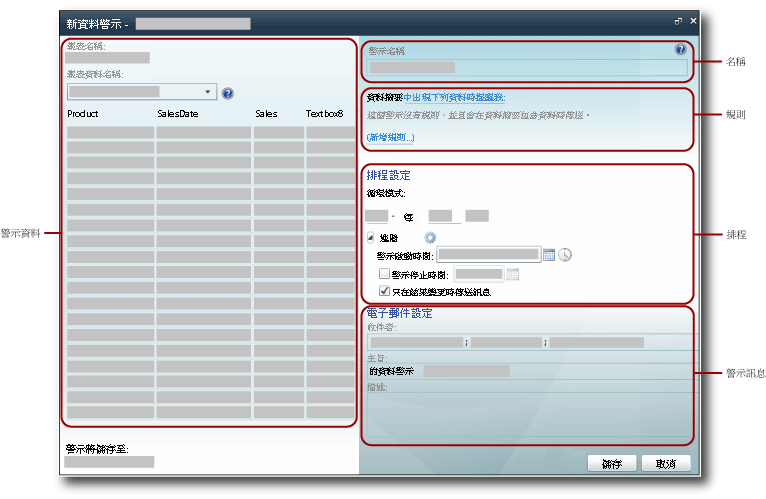

# 資料警示設計工具

[!INCLUDE [ssrs-appliesto](../includes/ssrs-appliesto.md)] [!INCLUDE [ssrs-appliesto-2016](../includes/ssrs-appliesto-2016.md)] [!INCLUDE [ssrs-appliesto-not-2017](../includes/ssrs-appliesto-not-2017.md)] [!INCLUDE[ssrs-appliesto-sharepoint-2013-2016i](../includes/ssrs-appliesto-sharepoint-2013-2016.md)] [!INCLUDE [ssrs-appliesto-not-pbirs](../includes/ssrs-appliesto-not-pbirs.md)]

[!INCLUDE [ssrs-previous-versions](../includes/ssrs-previous-versions.md)]

您可在 [資料警示設計工具] 中建立和編輯資料警示定義。 警示定義是中繼資料的集合，包括您感興趣的報表資料、報表資料必須符合才能建立資料警示執行個體和傳送資料警示訊息的規則、警示訊息的收件者等。  

> [!NOTE]
> SQL Server 2016 後即不再提供 Reporting Services 與 SharePoint 的整合。

 若要建立警示定義，您需要執行一些相關工作：  
  
-   選取包括您要使用之資料的報表和報表資料摘要。  
  
-   定義導致傳送警示的規則和子句。 使用藉由 AND 運算子組合的多個子句時，規則可簡單也可複雜。  
  
-   定義警示訊息傳送的頻率，以及警示開始和停止的日期和時間。 警示訊息可以只在結果變更時傳送。  
  
-   指定警示訊息收件者的電子郵件地址。  
  
-   自訂警示訊息的 [主旨] 行。  
  
-   提供要包含在警示訊息中的警示描述。  
  
> [!NOTE]  
>  由於 [!INCLUDE[ssRSnoversion](../includes/ssrsnoversion-md.md)] 資料警示功能只有在您安裝 SharePoint 模式的 [!INCLUDE[ssRSnoversion](../includes/ssrsnoversion-md.md)] 時才可使用，因此要建立其警示的報表必須儲存、部署或上傳到 SharePoint 文件庫。  
>   
>  資料警示不能在使用 Windows 整合式驗證或提示輸入認證的報表上建立。 報表必須使用預存認證。 如需詳細資訊，請參閱 [指定報表資料來源的認證及連接資訊](../reporting-services/report-data/specify-credential-and-connection-information-for-report-data-sources.md)。  
  
 若要開啟 [資料警示設計工具]，請在報表工具列上按一下 [動作] 功能表上的 [新資料警示] 選項。 如果您看不見 [新資料警示] 選項，表示報表未設定為使用預存認證。 您可以藉由從 SharePoint 文件庫更新報表資料來源的方式更新認證類型。  
  
##   資料警示設計工具使用者介面  
 [資料警示設計工具] 分成下列幾個區域。 選取報表資料摘要的區域、將規則加入條件中以建立簡單或複雜條件的區域等。 下圖顯示 [資料警示設計工具] 中的區域。  
  
   
  
  
### 警示資料  
 當您開啟 [資料警示設計工具] 時，該工具會從報表產生並提供所有資料摘要，而 [報表資料名稱] 下拉式清單中會包含摘要的名稱。 資料摘要是在您建立警示定義時於記憶體中快取，而顯示資料摘要資料的資料表會在您於資料摘要之間切換以探索報表資料時迅速填入。  
  
 建立資料警示定義的第一個步驟，就是選取包含您要讓警示監視之資料的報表資料摘要。 報表可以不包含任何資料摘要，或是包含多個資料摘要。 如果報表沒有任何資料摘要，則無法為其建立警示。 資料摘要可以由任何資料區產生，包括所有類型的圖表、量測計、指標，以及資料表、矩陣和清單。  
  
 如果報表已參數化，而您未在報表資料摘要中看見預期的資料和資料行，請使用適當的參數值重新執行報表。 資料行和值必須出現在報表內，才會包含在資料摘要中。  
  
 根據報表的配置而定，可能不容易了解報表擁有的資料摘要數目，或者哪一個資料摘要中包括哪些資料。 [!INCLUDE[ssRSnoversion](../includes/ssrsnoversion-md.md)]Atom 轉譯延伸模組會產生您搭配警示使用的資料摘要。 Atom 轉譯延伸模組會將報表資料提供為扁平化資料列集，也就是採用所有資料行擁有相同資料列數的表格格式提供。 這些資料列集就是資料摘要的內容。 由於報表配置時常相當複雜，且包含多個對等或巢狀資料區，因此需要多個資料摘要才能提供所有報表資料。 如需如何從報表產生資料摘要的詳細資訊，請參閱[從多個報表產生資料摘要 &#40;報表產生器及 SSRS&#41;](../reporting-services/report-builder/generating-data-feeds-from-reports-report-builder-and-ssrs.md)，並參閱[從報表產生資料摘要 &#40;報表產生器及 SSRS&#41;](../reporting-services/report-builder/generate-data-feeds-from-a-report-report-builder-and-ssrs.md)。  
  
 當您選擇資料摘要時，摘要中的資料會在 [資料警示設計工具] 的 [警示資料] 窗格中，顯示為具有資料列和資料行的資料表。 來自報表所使用資料來源或報表本身所指定資料行名稱和資料摘要的中繼資料，會填入您在資料條件中用來定義規則的欄位清單。 資料摘要還會提供中繼資料，像是限制值的資料表資料行之資料類型，以及您建立規則時在欄位中使用的比較運算子。  
  
 某些報表會有數百萬個資料列的資料。 資料表只會顯示摘要中前 100 個資料列的資料。  
  
### 警示名稱  
 根據預設，警示定義與報表的名稱相同。 您可以將警示名稱變更為更有意義的名稱。 這樣更方便您管理警示，判斷哪些警示需要更新、刪除等。  
  
 您可以在報表上建立多個警示。 雖然您可以擁有多個相同名稱的警示定義，不過建議您使用唯一的警示名稱。 這樣更方便您區分及管理警示定義。 您可以在 [資料警示管理員] 中檢視您建立之所有警示的清單。 如需詳細資訊，請參閱 [警示系統管理員的資料警示管理員](../reporting-services/data-alert-manager-for-alerting-administrators.md) 和 [在資料警示管理員中管理我的資料警示](../reporting-services/manage-my-data-alerts-in-data-alert-manager.md)。  
  
### 規則和子句  
 資料變更的範圍和警示規則會定義觸發警示的資料變更。 資料變更的範圍如下：  
  
-   **任何資料** - 至少有一個資料值符合條件所指定的規則。  
  
-   **沒有任何資料** - 沒有任何資料值符合條件所指定的規則。  
  
 規則可包含零個、一個或多個子句。 多項規則會藉由 AND 邏輯運算子結合。 如果資料行為字串資料類型，則規則可以包含藉由 OR 運算子組合的多個子句。 以下說明僅使用一個子句的基本規則，使用 AND 運算子組合的多項規則，以及擁有一個或多個 OR 子句的多項規則。  
  
 **簡單的規則**  
  
-   Net sales **大於** 100000  
  
-   Sales date **晚於** 6/1/2010  
  
-   Company Name **不是** Contoso  
  
 **藉由 AND 運算子組合的規則**  
  
-   Sales **大於** 1500.00  
  
     **且** Units Sold **小於** 500  
  
     Return date **早於** 1/1/2010  
  
-   Sales **大於或等於** 1500.00  
  
     **且** Return date **晚於** 1/1/2010  
  
     **且** Units Sold **大於** 500  
  
-   Promotion name **包含** Spring  
  
     **且** Units Sold **大於** 500  
  
     **且** Returns **是**  0  
  
 **使用 OR 子句的規則**  
  
-   Last Name **是** Blythe  
  
     **或**  Petulescu  
  
     **或**  Martin  
  
-   Return date **晚於** 1/1/2010  
  
     **且** Sales Territory **是**  Central  
  
     **或**  South  
  
     **或**  North  
  
 根據欄位的資料類型而定，[資料警示設計工具] 會提供不同的比較。 [資料警示設計工具] 會為要比較其值之欄位的資料類型提供專屬的比較。 以下列出不同的資料類型可使用的比較。 規則中不支援 **Boolean** 資料類型。  
  
-   日期時間資料類型比較包括： **是**、 **不是**、 **早於** 和 **晚於**  
  
-   數值資料類型的比較包括： **是**、 **不是**、 **小於**、 **小於或等於**、 **大於** 以及 **大於或等於**  
  
-   字串資料類型的比較包括： **是**、 **不是** 及 **包含**  
  
 在建立規則時，您會透過選擇 [值輸入模式] 或 [欄位選取模式] 的方式指定要在比較中使用值或欄位。 如果您選擇 [值輸入模式]，則提供要比較的值清單。 包含多個 OR 子句的比較與 [!INCLUDE[tsql](../includes/tsql-md.md)]中的 IN 邏輯比較十分相似，後者是用來測試是否有相符項目的值清單。 如需詳細資訊，請參閱 [IN &#40;Transact-SQL&#41;](../t-sql/language-elements/in-transact-sql.md)。  
  
 如果您選擇 [欄位選取模式]，則會在兩個欄位之間逐一比較資料列。 這兩個欄位必須擁有相容的資料類型 (例如，兩個數值欄位)，否則比較無效。 當您選擇 [欄位選取模式] 時，欄位清單會自動顯示。  
  
 沒有規則的資料警示也是有效的。 這類警示可能很實用。 假設您只想要在報表資料摘要中有資料時收到通知。 資料摘要包含出席者資訊，且摘要是空的，直到出席者取消為止。 在此案例中，您會從出現第一個取消開始收到警示。  
  
 您可以刪除個別規則和子句。  
  
 規則和子句包含在資料警示訊息中。  
  
### 排程設定  
 您為資料警示定義的排程會定義傳送資料警示訊息的循環模式，以及何時開始和停止傳送警示訊息。 模式包括：一次、分鐘、每天和每週。 雖然警示只有一項排程，但是您可以使用這些間隔建立符合大部分商務需要的複雜循環模式。 以下範例為排程中常用的循環模式：  
  
-   **每隔 10 天** - 每隔 10 天傳送警示一次。  
  
-   **每隔 2 週的星期一** - 只在每隔兩週的星期一傳送警示。  
  
-   **每隔 12 小時** - 每隔 12 小時傳送警示。  
  
-   **每隔 30 分鐘** - 每隔 30 分鐘傳送警示。  
  
 循環模式會指定警示傳送的時間。 如果在模式指定的間隔期間符合規則，警示在間隔結束之前並不會傳送。  
  
 如果您要在報表資料符合指定的規則時，盡快收到資料警示訊息，可以排程讓警示經常執行。 如果報表資料並未變更，您和其他收件者可能收到許多重複的訊息。 如果您只想要在套用規則後的結果變更時收到訊息，請選取 [只在結果變更時傳送訊息] 選項。  
  
> [!IMPORTANT]  
>  除非業務上有重要的理由，否則建議您不要使用頻率高於每天一次的循環模式。 不支援即時處理資料警示定義。 處理資料警示定義的頻率過高，會影響報表伺服器和整體 [!INCLUDE[ssRSnoversion](../includes/ssrsnoversion-md.md)] 部署的效能。  
  
### 電子郵件設定  
 您可在 [收件者] 選項中指定要接收資料警示訊息電子郵件之收件者的電子郵件地址。 多個電子郵件是以分號分隔，與 Microsoft Office Outlook 電子郵件中的方式相同。 您也可以指定通訊群組做為收件者，如此可讓管理收件者清單的工作更容易且更有效率。 如果建立警示定義時，SharePoint 可以判斷您的電子郵件地址，則您的電子郵件地址會自動加入收件者清單，否則您就必須明確將自己加入為收件者。  
  
 電子郵件預設主旨為 **\<alert name> 的資料警示**。 您可以依需要變更主旨。  
  
 您也可以在 [描述] 選項中提供要包含在資料警示訊息中的描述。 包含描述 (尤其是擁有類似的資料警示時) 有助於迅速區分和了解警示訊息。 除了在報表資料滿足指定的規則時傳送的警示訊息之外，警示訊息還會在發生錯誤時傳送至所有收件者。 如需相關資訊，請參閱 [Data Alert Messages](../reporting-services/data-alert-messages.md)。  
  
 如需如何產生電子郵件的詳細資訊，請參閱 [Reporting Services 資料警示](../reporting-services/reporting-services-data-alerts.md)。  
  
##   建立資料警示定義  
 如果您擁有「SharePoint 檢視項目」和「建立提醒」權限，只要報表使用預存認證或不使用認證，您就可以為任何可以檢視的報表建立資料警示定義。 您會從 SharePoint 文件庫執行報表。 您可在 [資料警示設計工具] 中使用的資料是來自該報表。 如果報表已參數化，您可能需要使用不同的參數值來執行報表，以確保您想要的資料會出現在報表中。 報表開啟之後，在報表工具列上按一下 [動作] 功能表上的 [新資料警示] 選項，開啟 [資料警示設計工具]。 下圖說明如何開啟 [資料警示設計工具]。  
  
   
  
 如需詳細資訊，請參閱 [在資料警示設計工具中建立資料警示](../reporting-services/create-a-data-alert-in-data-alert-designer.md)。  
  
  
##   儲存資料警示定義  
 [資料警示設計工具] 會顯示將儲存資料警示定義的目標網站 URL。 資料警示定義會固定儲存到報表所在的網站。  
  
> [!NOTE]  
>  您選擇執行報表的參數值會儲存在警示定義中，並且在處理警示定義的過程中重新執行報表時使用。 若要使用不同的參數值，您必須建立新的警示定義。  
  
 警示定義儲存之前，會先進行驗證。 您必須先更正所有錯誤，才能成功儲存警示定義。 如需詳細資訊，請參閱 [在資料警示設計工具中建立資料警示](../reporting-services/create-a-data-alert-in-data-alert-designer.md)。  
  
  
##   編輯資料警示定義  
 儲存資料警示定義之後，您就可以在 [資料警示設計工具] 中再次開啟該警示定義並進行編輯。 您可以加入、變更或刪除規則和子句，以及變更排程和電子郵件設定。 如果警示使用的報表資料摘要已變更，而且不再提供警示規則參考的欄位，或是欄位的資料類型或其他中繼資料已變更，則警示定義就不再有效，您必須修正它，才能再次儲存。 如果您想要使用不同的資料摘要，則必須建立新的警示定義。  
  
 若要編輯資料警示定義，請在 [資料警示管理員] 中以滑鼠右鍵按一下該資料警示定義，然後按一下 [編輯]。 下圖說明 [資料警示管理員] 中資料警示的內容功能表。  
  
 ![按一下 [編輯] 來開啟資料警示設計工具](../reporting-services/media/rs-alertmanageriwopendesigner.gif "按一下 [編輯] 來開啟資料警示設計工具")  
  
 如需詳細資訊，請參閱 [在警示設計工具中編輯資料警示](../reporting-services/edit-a-data-alert-in-alert-designer.md)。  
  
  
##   相關工作  
 本節列出如何建立和編輯警示的程序。  
  
-   [在警示設計工具中編輯資料警示](../reporting-services/edit-a-data-alert-in-alert-designer.md)  
  
-   [在資料警示設計工具中建立資料警示](../reporting-services/create-a-data-alert-in-data-alert-designer.md)  

## 另請參閱

[Reporting Services 資料警示](../reporting-services/reporting-services-data-alerts.md)   
[警示系統管理員的資料警示管理員](../reporting-services/data-alert-manager-for-alerting-administrators.md)  

更多問題嗎？ [請嘗試詢問 Reporting Services 論壇](https://go.microsoft.com/fwlink/?LinkId=620231)
