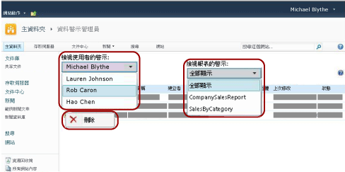

# 警示系統管理員的資料警示管理員

[!INCLUDE [ssrs-appliesto](../includes/ssrs-appliesto.md)] [!INCLUDE [ssrs-appliesto-2016](../includes/ssrs-appliesto-2016.md)] [!INCLUDE [ssrs-appliesto-not-2017](../includes/ssrs-appliesto-not-2017.md)] [!INCLUDE[ssrs-appliesto-sharepoint-2013-2016i](../includes/ssrs-appliesto-sharepoint-2013-2016.md)] [!INCLUDE [ssrs-appliesto-not-pbirs](../includes/ssrs-appliesto-not-pbirs.md)]

[!INCLUDE [ssrs-previous-versions](../includes/ssrs-previous-versions.md)]

SQL Server Reporting Services 提供 [資料警示管理員] 讓 SharePoint 警示系統管理員管理資料警示。 警示系統管理員可以檢視儲存到網站之所有警示的相關資訊，以及刪除警示。 下圖說明 [資料警示管理員] 中可供 SharePoint 警示管理員使用的功能。

> [!NOTE]
> SQL Server 2016 後即不再提供 Reporting Services 與 SharePoint 的整合。

 啟用網站進行資料警示時，會建立 MyDataAlerts.aspx 和 SiteDataAlerts.aspx 這兩個 SharePoint 頁面，並且將其加入 SharePoint 網站中。 SiteDataAlerts.aspx 是警示系統管理員的 [資料警示管理員]。 警示系統管理員可以從 [網站設定] SharePoint 頁面開啟 [資料警示管理員]。 警示系統管理員必須具備「SharePoint 警示管理」權限才能開啟 [資料警示管理員]。  
  
 您也可以使用 URL 直接開啟 [資料警示管理員]。 以下說明 URL 的語法：  
  
 `http: //<site name>/_layouts/ReportServer/ SiteDataAlerts.aspx`  
  
> [!NOTE]  
>  身為警示系統管理員，您可以授與資訊工作者存取 [!INCLUDE[ssRSnoversion](../includes/ssrsnoversion-md.md)] 資料警示功能的權限。 如需所需權限的詳細資訊，請參閱 [Reporting Services 資料警示](../reporting-services/reporting-services-data-alerts.md)。  
  
##   檢視資料警示資訊  
 在 SharePoint 中安裝並設定 Reporting Services 之後，[網站設定] SharePoint 頁面就會包含 **[Reporting Services]** 選項。 警示系統管理員在 Reporting Service 中按一下 **[管理資料警示]** 選項，就可以開啟 [資料警示管理員]。 下圖說明 [網站設定] 頁面上開啟 [資料警示管理員] 的位置。  
  
   
  
 [資料警示管理員] 包含一個資料表，其中列出警示名稱、報表名稱、警示擁有者的名稱、傳送的警示訊息數目、上一次執行警示的時間、上一次修改警示定義的時間，以及警示訊息的狀態。 如果警示無法產生或是傳送，狀態資料行就會包含有關錯誤的資訊並協助您疑難排解警示。 如需詳細資訊，請參閱 [在資料警示管理員中管理 SharePoint 網站上的所有資料警示](../reporting-services/manage-all-data-alerts-on-a-sharepoint-site-in-data-alert-manager.md)。  
  
 下表顯示 [資料警示管理員] 中資料表的範例資料。 當發生錯誤時，資料表的 [狀態] 欄位中會包含錯誤訊息和記錄中項目的識別碼 (GUID)。  
  
|警示名稱|報表名稱|建立者|傳送警示|最後執行|上次修改|[狀態]|  
|----------------|-----------------|----------------|-----------------|--------------|-------------------|------------|  
|SalesQTR|SalesByTerritoryAndQTR|Lauren Johnson|4|6/12/2011|6/1/2011|上次警示執行成功，並且已傳送警示。|  
|UnitsSold|ProductsSalesByQTR|Michael Blythe|2|7/1/2011|6/28/2011|上次警示執行成功，但因為資料未變更所以未傳送警示。|  
|InventoryCount|StockStatusByQTR|Lauren Johnson|7|7/10/2011|7/2/2011|\<錯誤訊息> 記錄檔包含有關錯誤的詳細資訊。 請參閱識別碼為 \<GUID> 的記錄項目。|  
|TopPromotion|PromotionTracking|Cristian Petculescu|0||5/23/2011|已建立警示。|  
  
 如需詳細資訊，請參閱 [在資料警示管理員中管理 SharePoint 網站上的所有資料警示](../reporting-services/manage-all-data-alerts-on-a-sharepoint-site-in-data-alert-manager.md)。  
  
 您可以檢視網站使用者建立的所有警示。 先選擇使用者，然後選擇檢視使用者的所有警示，或是僅檢視特定報表的警示。  
  
  
##   刪除資料警示  
 您可從 [資料警示管理員] 中刪除警示定義。 每一個資料警示定義都有一位擁有者，也就是建立該資料警示定義的 SharePoint 使用者。 擁有者只能刪除自己建立的警示定義。 如需詳細資訊，請參閱 [在資料警示管理員中管理我的資料警示](../reporting-services/manage-my-data-alerts-in-data-alert-manager.md)。  
  
 SharePoint 警示系統管理員可以列出然後刪除網站上所有使用者建立的警示定義。 如需詳細資訊，請參閱 [在資料警示管理員中管理 SharePoint 網站上的所有資料警示](../reporting-services/manage-all-data-alerts-on-a-sharepoint-site-in-data-alert-manager.md)  
  
 您刪除警示定義之後，就不會再傳送任何警示。 不過，如果您查詢警示資料庫，可能會發現警示定義仍然存在。 警示服務會依照排程執行清除，而警示定義會在下一次清除時永久刪除。 預設的清除間隔是 20 分鐘。 此清除間隔和其他清除間隔都可以加以設定。 如需詳細資訊，請參閱 [Reporting Services 資料警示](../reporting-services/reporting-services-data-alerts.md)。  
  
  
##   相關工作  
 本節列出如何管理警示的程序。  
  
-   [在資料警示管理員中管理 SharePoint 網站上的所有資料警示](../reporting-services/manage-all-data-alerts-on-a-sharepoint-site-in-data-alert-manager.md)  

## 另請參閱

[Reporting Services Data Alerts](../reporting-services/reporting-services-data-alerts.md)  

更多問題嗎？ [請嘗試詢問 Reporting Services 論壇](http://go.microsoft.com/fwlink/?LinkId=620231)
