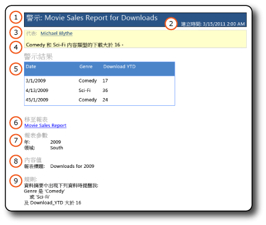
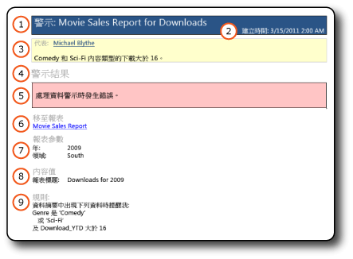

# 資料警示訊息

[!INCLUDE[ssrs-appliesto-sql2016-xpreview](../includes/ssrs-appliesto-sql2016-xpreview.md)][!INCLUDE[ssrs-appliesto-sharepoint-2013-2016i](../includes/ssrs-appliesto-sharepoint-2013-2016.md)]

[!INCLUDE[ssRSnoversion](../includes/ssrsnoversion-md.md)] 資料警示會以電子郵件傳遞兩種類型的資料警示訊息：含有資料警示結果的訊息以及含有錯誤描述的訊息。 包含結果的訊息會通知所有收件者共同感興趣以及對業務決策相當重要的報表資料變更。 如果由於某種原因發生錯誤而無法提供結果，則會改為傳送錯誤訊息。

資料警示定義的擁有者還可以在 [資料警示管理員] 中檢視資料警示執行個體的相關資訊。 如需相關資訊，請參閱 [Data Alert Manager for SharePoint Users](../reporting-services/data-alert-manager-for-sharepoint-users.md)。  

> [!NOTE]
> SQL Server 2016 之後已無法再使用 reporting Services 與 SharePoint 整合。
  
##   資料警示訊息  
 下圖顯示含有結果的資料警示訊息以及含有錯誤描述的警示訊息。  
  
 **結果訊息**  
  
   
  
 **錯誤訊息**  
  
   
  
 這些訊息包含相同類型的資訊。  
  
1.  **代表** 包含建立資料警示定義的建立者名稱。  
  
2.  如果您在警示定義中提供了描述，該描述會顯示於 **代表**下方。  
  
3.  **警示結果** 會以表格格式顯示報表資料摘要中符合警示定義中所指定規則的資料列，或是顯示錯誤描述。 顯示的資料列數並無限制。  
  
4.  **移至報表** 是建立警示定義所在報表的連結。 如果因為報表移動或刪除而導致連結無效，則會顯示錯誤訊息。  
  
5.  [規則] 會列出警示定義中的規則和子句。 這項資訊有助於驗證和了解警示結果，並且識別資料警示定義中您可能想要變更以縮小或擴大結果的規則。  
  
6.  **報表參數** 會列出報表執行時使用的參數和參數值。 參數和參數值有助於了解警示結果。  
  
7.  **內容值** 會列出位於報表資料區域外之報表項目的名稱和值。 這些項目通常是文字方塊。 例如，含有常值的文字方塊 (像是報表的主旨或描述)。  
  
 兩種訊息類型的唯一區別在於項目 5，也就是 **警示結果**。 如果在建立資料警示執行個體或資料警示訊息時發生錯誤， **警示結果** 會顯示描述問題的錯誤訊息。 錯誤訊息會傳送至所有收件者，讓他們知道無法提供預期收到或是做出業務決策所倚賴的警示結果。  
  
  
##   相關工作  
 本節列出的程序說明如何建立和編輯資料警示定義，以提供可在資料警示訊息中看見的大部分資訊。  
  
-   [在資料警示設計工具中建立資料警示](../reporting-services/create-a-data-alert-in-data-alert-designer.md)  
  
-   [在警示設計工具中編輯資料警示](../reporting-services/edit-a-data-alert-in-alert-designer.md)  

## 請參閱＜

[資料警示設計工具](../reporting-services/data-alert-designer.md)   
[Reporting Services Data Alerts](../reporting-services/reporting-services-data-alerts.md)  

更多問題嗎？ [請嘗試詢問 Reporting Services 論壇](http://go.microsoft.com/fwlink/?LinkId=620231)
