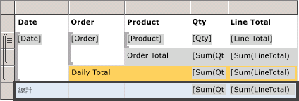
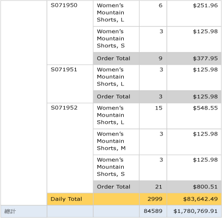

# 第 6 課：加入群組和總計 (Reporting Services)
在本教學課程中，您會將群組和總計新增至 [!INCLUDE[ssRSnoversion](../includes/ssrsnoversion-md.md)] 報表以組織和摘要資料。  
  
  
## 將報表中的資料分組  
  
1.  按一下 **[設計]** 索引標籤。  
  
2.  如果您看不到 [資料列群組] 窗格，請以滑鼠右鍵按一下設計介面，並按一下 [檢視]，然後按一下 [群組]。  
  
3.  將 **Date** 欄位從 [報表資料]  窗格拖曳到 [資料列群組]  窗格。 將它放在稱為 [(詳細資料)] 之資料列的上方。
  
    請注意，資料列控制代碼中現在具有一個用來顯示群組的方括號。 資料表現在也具有兩個 [日期] 資料行 – 垂直虛線兩側各有一個。  
  
      
  
4.  將 **Order** 欄位從 [報表資料]  窗格拖曳到 [資料列群組]  窗格。 將它放在 [日期] 下方和 [(詳細資料)] 上方。

       
  
    請注意，資料列控制代碼中現在具有兩個方括號 ()，用以顯示兩個群組。 資料表現在也有兩個 **[訂單]** 資料行。  
  
5.  刪除雙線**右側**的原始 [日期] 和 [訂單] 資料行。 這樣會移除這個個別記錄值，所以只有群組值會顯示。 選取這兩個資料行的資料行控制代碼，並按一下滑鼠右鍵，然後按一下 [刪除資料行]。  
  
      
  
6.  若要格式化新的日期資料行，請以滑鼠右鍵按一下含有 `[Date]` 欄位運算式的資料格，然後按一下 [文字方塊屬性]。  
  
7.  按一下 [數字]，然後按一下 [類別目錄] 欄位中的 [日期]。  
  
8.  在 **[類型]** 方塊中，選取 **[January 31, 2000]**。  
  
9.  [!INCLUDE[clickOK](../includes/clickok-md.md)]。  
  
10.  切換到 **[預覽]** 索引標籤預覽報表。 報表應看起來類似下圖：  
     
  
## 在報表中加入總計  
  
1.  切換至 [設計] 檢視。  
  
2.  以滑鼠右鍵按一下含有 `[LineTotal]` 欄位的資料區資料格，然後按一下 [新增總計]。  
  
    這樣會加入每筆訂單的總金額資料列。  
  
3.  以滑鼠右鍵按一下含有 `[Qty]` 欄位的資料格，然後按一下 [新增總計]。  
  
    這樣會在總計資料列中加入每筆訂單的總數量。  
  
4.  在 `Sum[Qty]`左側的空白資料格中，輸入**訂單總額**標籤。  
  
5.  您也可以在總計資料列中加入背景色彩。 選取兩個總和資料格以及標籤資料格。  
  
6.  在 **[格式]** 功能表上，依序按一下 **[背景色彩]**、 **[淺灰]** 和 **[確定]**。  
  
      
  
## 在報表中加入每日總計  
  
1.  以滑鼠右鍵按一下 [訂單] 資料格，並指向 [加入總計]，然後按一下 [之後]。  
  
    這樣會新增含有每日數量和金額總和的新資料列，以及 [訂單] 資料行底端的 [總計] 標籤。  
  
2.  在同一資料格的 **總計** 一詞之前，輸入 **每日** 一詞，使其讀為 **[每日總計]**。  
  
3.  選取 **[每日總計]** 資料格、兩個 **[總和]** 資料格以及它們之間的空白資料格。  
  
4.  在 **[格式]** 功能表上，依序按一下 **[背景色彩]**、 **[橙色]** 和 **[確定]**。  
  
      
  
## 在報表中加入總計  
  
1.  以滑鼠右鍵按一下 [日期] 資料格，並指向 [加入總計]，然後按一下 [之後]。  
  
    這樣會加入含有整個報表每日數量和金額總和的新資料列，以及 **[日期]** 資料行中的 **[總計]** 標籤。  
  
2.  在同一資料格的 **總計** 一詞之前，輸入 **全部** 一詞，使其讀為 **[全部總計]**。  
  
3.  選取 **[全部總計]** 資料格、兩個 **[總和]** 資料格以及它們之間的空白資料格。  
  
4.  在 **[格式]** 功能表上，依序按一下 **[背景色彩]**、 **[淺藍]** 和 **[確定]**。  
  
      
  
5.  按一下 **[預覽]**。  
  
    最後一頁應該與下列影像類似。 在工具列中，按一下 [最後一頁] 按鈕，可選取色彩。   
  
      
  
## 若要將報表發行至報表伺服器 (選擇性)  
  
1.  選擇性步驟是將已完成的報表發行至原生模式報表伺服器，讓您能夠在入口網站中檢視報表。  
  
2.  按一下 [專案] 功能表，然後按一下 [Tutorial 屬性...]  
  
3.  在 **TargetServerURL** 中，輸入報表伺服器的名稱，例如   
    - `http:/<servername>/reportserver`  
   
    - `https://localhost/reportserver` 適用於在報表伺服器上設計報表時。  
  
  
4. 請記住，TargetReportFolder 是 tutorial (即專案名稱)。  這是下一步中將在其中部署報表的資料夾名稱。  
5. 按一下 **[確定]**。  
  
6.  在 [建立] 功能表上，按一下 [部署教學課程]。  
  
    如果您在輸出視窗中看見類似下面的訊息，就表示部署成功。  
  
    > ------ 已經開始建立:專案：教學課程，設定：偵錯 ------  
    > 正在略過 'Sales Orders.rdl'。 項目已是最新版本。  
    > 建立已完成 -- 0 個錯誤，0 個警告  
    > ------ 已開始部署：專案：教學課程，設定：偵錯 ------  
    > 正在部署至 https://[伺服器名稱]/reportserver  
    > 正在部署報表 '/tutorial/Sales Orders'。  
    > 部署已完成 -- 0 個錯誤，0 個警告  
    > ========== 建置：1 個成功或已是最新狀態，0 個失敗，0 個略過 ==========  
    > ========== 部署：1 個成功，0 個失敗，0 個略過 ==========  
  
    如果您看見類似下面的錯誤訊息，請確認自己擁有報表伺服器的權限，而且已經以系統管理員權限啟動 [!INCLUDE[ssBIDevStudio](../includes/ssbidevstudio-md.md)] 。  
  
    > 「授與使用者 'XXXXXXXX\\[您的使用者名稱]' 的權限不足，無法執行此作業」  
  
7.  以系統管理員權限瀏覽至入口網站，例如以滑鼠右鍵按一下 Internet Explorer 的圖示，然後按一下 [以系統管理員​​身分執行​​]。  
  
    瀏覽至 [!INCLUDE[ssRSnoversion_md](../includes/ssrsnoversion-md.md)] Web入口網站 URL。   
    **注意：**「入口網站」URL 是 "Reports"，而非報表「伺服器」URL 的 "Reportserver"。  例如：   
    `https://<server name>/reports`(採礦模型內容 &#40;Analysis Services - 資料採礦&#41;)。  
    在報表伺服器上設計報表時可用 `https://localhost/reports`。  
  
8.  瀏覽至包含報表的資料夾。 預設名稱是 *tutorial*，即專案名稱或輸入專案屬性中 TargetReportFolder 欄位的名稱。   
按一下 **Sales Orders** 報表的名稱，以在瀏覽器中檢視轉譯的報表。  
  
      
 
您已成功完成「建立基本資料表報表」教學課程。  
  
## 另請參閱  
[篩選、分組和排序資料 &#40;報表產生器及 SSRS&#41;](../reporting-services/report-design/filter-group-and-sort-data-report-builder-and-ssrs.md)  
  
  
  

