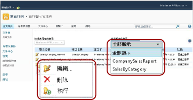
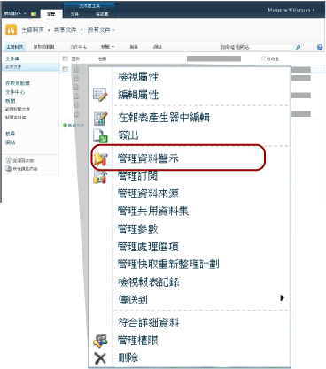

# 在資料警示管理員中管理我的資料警示
  SharePoint 使用者可以檢視自己所建立資料警示的清單，以及警示的相關資訊。 使用者還可以在 [資料警示設計工具] 中刪除自己的警示、開啟警示定義進行編輯，以及執行自己的警示。 下圖說明 [資料警示管理員] 中可供使用者使用的功能。  
  
   
  
### 若要檢視警示清單  
  
1.  移至您儲存已建立資料警示之報表的 SharePoint 文件庫。  
  
2.  按一下報表上展開下拉式功能表的圖示，然後按一下 [管理資料警示]。 下圖顯示下拉式功能表。  
  
       
  
     [資料警示管理員] 隨即開啟。 根據預設，其中會列出您在文件庫中所選取報表的警示。  
  
3.  按一下 [檢視報表的警示] 清單旁邊的向下箭號，然後選取要檢視其警示的報表，或是按一下 [全部顯示] 列出所有警示。  
  
    > [!NOTE]  
    >  如果您選取的報表沒有任何警示，您不必返回 SharePoint 文件庫也能尋找並選取擁有警示的報表。 只要按一下 [全部顯示] 就可以查看所有警示的清單。  
  
     資料表會列出警示名稱、報表名稱、您 (也就是警示建立者) 的名稱、傳送的警示數目、上一次修改警示定義的時間，以及警示的狀態。 如果警示無法產生或是傳送，狀態資料行就會包含有關錯誤的資訊並協助您疑難排解問題。  
  
### 若要編輯警示定義  
  
-   以滑鼠右鍵按一下要編輯其警示定義的資料警示，然後按一下 [編輯]。  
  
     警示定義會在 [資料警示設計工具] 中開啟。 如需詳細資訊，請參閱[在警示設計工具中編輯資料警示](../reporting-services/edit-a-data-alert-in-alert-designer.md)和[資料警示設計工具](../reporting-services/data-alert-designer.md)。  
  
    > [!NOTE]  
    >  只有建立資料警示定義的使用者才能進行編輯。  
  
    > [!NOTE]  
    >  如果報表已變更，而且從報表產生的資料摘要也已變更，則警示定義可能已無效。 當警示參考其規則的資料行已從報表中刪除、變更資料類型，或是包含在不同的資料摘要中或報表已刪除或移動時，就會發生這種情形。 您可以開啟無效的警示定義，但是無法重新儲存它，除非依據建立定義的目前版本報表資料摘要成為有效的警示定義。 若要深入了解如何從多個報表產生資料摘要，請參閱[從多個報表產生資料摘要 &#40;報表產生器及 SSRS&#41;](../reporting-services/report-builder/generating-data-feeds-from-reports-report-builder-and-ssrs.md)。  
  
### 若要刪除警示定義  
  
-   以滑鼠右鍵按一下您想要刪除的資料警示，然後按一下 [刪除]。  
  
     刪除警示時，就不會再傳送任何警示訊息。  
  
### 若要執行警示  
  
-   以滑鼠右鍵按一下您要執行的資料警示，然後按一下 [執行]。  
  
     無論您在 [資料警示設計工具] 中指定的排程選項為何，警示執行個體都會建立，而且資料警示訊息也會立即傳送。 例如，設定為每週且僅在結果變更時傳送的警示便會傳送。  
  
## 請參閱＜  
 [警示系統管理員的資料警示管理員](../reporting-services/data-alert-manager-for-alerting-administrators.md)   
 [Reporting Services Data Alerts](../reporting-services/reporting-services-data-alerts.md)  
  
  