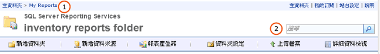

# 在入口網站中尋找和檢視報表 (報表產生器及 SSRS)
  報表管理員是以網路為基礎的工具，其中包含檢視和管理報表的功能。 這是報表伺服器安裝的一部分。 若要開啟「報表管理員」，請在瀏覽器視窗中輸入「報表管理員」的 URL。 如需瀏覽器需求的詳細資訊，請參閱 [Reporting Services 和 Power View 的瀏覽器支援](../../reporting-services/browser-support-for-reporting-services-and-power-view.md)。 如需有關如何在報表伺服器上設定「報表管理員」URL 的詳細資訊，請連絡您的系統管理員。 如需詳細資訊，請參閱[設定報表管理員 &#40;原生模式&#41;](../../reporting-services/report-server/configure-report-manager-native-mode.md)。  
  
 系統管理員在報表伺服器上所設定的權限會決定您在使用「報表管理員」時所看到的項目。 這些權限是透過角色指派授與。 若要尋找並檢視報表，您的角色指派必須包括「檢視報表」工作。 若要在報表伺服器上尋找報表，請依名稱或描述來搜尋報表，或瀏覽報表伺服器資料夾。 您僅能搜尋或瀏覽已經發行或上傳到報表伺服器的報表。  
  
> [!NOTE]  
>  [!INCLUDE[ssRBRDDup](../../includes/ssrbrddup-md.md)]  
  
## 在報表管理員中導覽資料夾階層  
 若要瀏覽您要執行的報表，您可以使用 [首頁]，該頁面會在您啟動「報表管理員」時，以及您在資料夾階層中開啟任何資料夾時自動出現。 [首頁] 僅會顯示您有檢視權限的項目。 在 [首頁] 的上方，資料夾路徑會顯示為一列連結。 資料夾名稱會從根資料夾 (主資料夾) 開始，依照順序列出。 在開啟每一個額外的資料夾時，資料夾名稱就會加入頁面上方的資料夾路徑中。 下圖中的 **(1)** 。 開啟報表時，報表的名稱也會加入資料夾路徑中。  
  
   
報表管理員功能區  
  
 請使用下列技巧來導覽資料夾階層：  
  
-   若要檢視資料夾的內容，請按一下 [首頁] 的資料夾名稱。 資料夾頁面隨即開啟，其中顯示資料夾的內容。  
  
-   若要向下導覽資料夾階層，請開啟目前資料夾的子資料夾。 資料夾包含報表、來源、共用資料來源項目和其他資料夾。 按一下資料夾圖示即可開啟資料夾，並顯示下一階層的內容。  
  
-   若要向上導覽資料夾階層，請在頁面上方的連結列中，按一下要查看其內容的資料夾名稱。 上圖中的 **(1)** 。  
  
## 開啟報表  
 找到報表之後，按一下報表名稱即可開啟報表。 該報表會在 HTML 中轉譯，並出現在「報表管理員」的 [內容] 頁面中。 瀏覽器工作階段一律會快取報表，因此如果您開啟報表，按一下 [上一頁]  按鈕通常可以返回至該報表。 即使需要提供使用者名稱和密碼才可以執行報表也是如此。 在關閉瀏覽器之前，您無法完全關閉已轉譯的報表。  
  
 並非資料夾階層中可見的所有報表都可以立即存取。 有些報表可能會提示您輸入使用者名稱和密碼，以決定您是否可以存取報表的資料來源。 如需在報表管理員開啟報表的詳細資訊，請參閱[開啟及關閉報表 &#40;報表管理員&#41;](../../reporting-services/reports/open-and-close-a-report-report-manager.md)。  
  
 您也可以從報表產生器用瀏覽的方式直接從報表伺服器開啟報表。 
  
## 搜尋項目  
  
-   若要在報表管理員中搜尋項目，請在頁首的 [搜尋]  文字方塊中鍵入搜尋字串。 上圖中的 **(2)** 。 搜尋會由資料夾階層的最上層節點開始，然後沿著每一個分支繼續搜尋。 如果您沒有存取特定分支的權限，則會略過該分支。 這適用於其他使用者專屬的 [我的報表] 資料夾，以及通常無法使用的其他資料夾。 只有您有權檢視的報表和項目，才會包含在搜尋結果中。  
  
-   若要依名稱或描述來搜尋項目，請指定想要符合的完整或部分文字。 搜尋字串不區分大小寫。 您不可以使用搜尋運算子，例如加號 (+) 或減號 (-)，來要求或排除搜尋準則。  
  
-   若要搜尋報表中的特定文字，請使用報表上方的工具列。  
  
## 另請參閱  
 [尋找、檢視和管理報表 &#40;報表產生器及 SSRS &#41;](../../reporting-services/report-builder/finding-viewing-and-managing-reports-report-builder-and-ssrs.md)  
  
  
