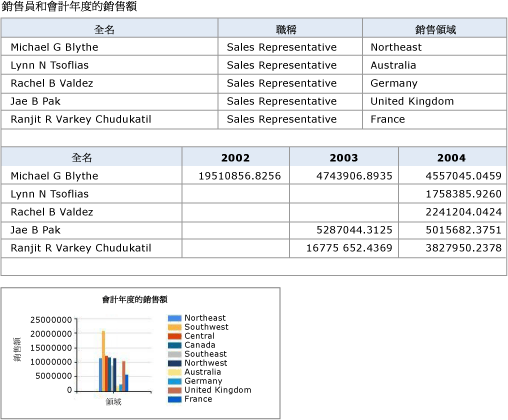
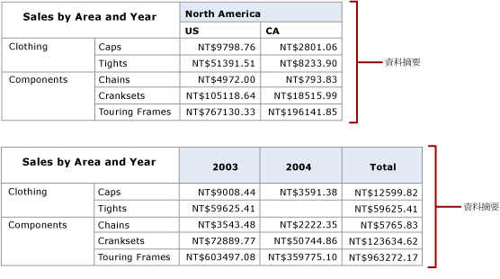

# 從多個報表產生資料摘要 (報表產生器及 SSRS)

  [!INCLUDE[ssRSnoversion](../../includes/ssrsnoversion-md.md)] Atom 轉譯延伸模組會產生 Atom 服務文件，其中會列出可從分頁報表取得的資料摘要，以及來自報表中之資料區的資料摘要。 您可以使用此延伸模組產生符合 Atom 的資料摘要，這些資料摘要可以使用可取用報表產生之資料摘要的應用程式讀取與交換。 例如，您可以使用 Atom 轉譯延伸模組產生您之後可用於 Power Pivot 或 Power BI 的資料摘要。  
  
 Atom 服務文件在報表中，每個資料區至少會列出一個資料摘要。 根據資料區的類型以及該資料區顯示的資料， [!INCLUDE[ssRSnoversion](../../includes/ssrsnoversion-md.md)] 可能會產生來自某個資料區的多個資料摘要。 例如，矩陣或圖表可以提供多個資料摘要。 當 Atom 轉譯延伸模組建立 Atom 服務文件時，系統會針對每個資料摘要建立一個唯一的識別碼，而您會在 URL 中使用該識別碼來存取資料摘要的內容。  
  
 Atom 轉譯延伸模組針對資料摘要產生資料的方式類似於逗點分隔值 (CSV) 轉譯延伸模組將資料轉譯為 CSV 檔案的方式。 資料摘要就像是 CSV 檔案，是報表資料的扁平化表示法。 例如，包含加總群組內銷售量之資料列群組的資料表會在每個資料列中重複顯示這個總和，而且沒有僅包含總和的個別資料列。  
  
 您可以使用 [!INCLUDE[ssRSnoversion](../../includes/ssrsnoversion-md.md)] 、報表伺服器或是與 [!INCLUDE[ssRSnoversion](../../includes/ssrsnoversion-md.md)]整合的 SharePoint 網站，產生 Atom 服務文件與資料摘要。  
  
 Atom 適用於成對的相關標準。 Atom 服務文件符合 RFC 5023 Atom 發行通訊協定規格，而資料摘要符合 RFC 4287 Atom 同步發佈格式通訊協定規格。  
  
 下列章節提供如何使用 Atom 轉譯延伸模組的其他資訊：  
  
 [!INCLUDE[ssRBRDDup](../../includes/ssrbrddup-md.md)]  
  
##   當做資料摘要的報表  
 您可以匯出實際報表做為資料摘要，或者您可以建立其主要用途為以資料摘要的形式提供資料給應用程式的報表。 當資料不容易透過用戶端資料提供者存取時，或當您想要隱藏資料來源的複雜度，讓資料的使用更為簡單時，使用報表做為資料摘要提供您另一種將資料提供給應用程式的方式。 使用報表資料作為資料摘要的另一個優點是，您可以使用安全性、排程及報表快照集之類的 [!INCLUDE[ssRSnoversion](../../includes/ssrsnoversion-md.md)] 功能來管理提供資料摘要的報表。  
  
 為充分利用 Atom 轉譯延伸模組，您應該了解如何將報表轉譯為資料摘要。 如果您要使用現有的報表，能夠預測報表所要產生的資料摘要是一項相當實用的功能；如果您要撰寫專門當做資料摘要使用的報表，則可以包含資料並微調報表配置以充分發揮資料摘要實用性，就是非常重要的功能。  
  
 如需詳細資訊，請參閱[從報表產生資料摘要 &#40;報表產生器及 SSRS&#41;](../../reporting-services/report-builder/generate-data-feeds-from-a-report-report-builder-and-ssrs.md)。  
  
  
##   Atom 服務文件 (.atomsvc 檔)  
 Atom 服務文件會指定一個或多個資料摘要的連接。 連線至少是產生摘要之資料服務的簡單 URL。  
  
 當您使用 Atom 轉譯延伸模組轉譯報表資料時，Atom 服務文件會列出可用於報表的資料摘要。 此文件至少會列出報表中每個資料區的一個資料摘要。 資料表和量測計各自只會產生一個資料摘要，但是矩陣、清單和圖表可能會根據所顯示的資料，產生多個資料摘要。  
  
 下列圖表顯示使用兩個資料表和一個圖表的報表。  
  
   
  
 從此報表產生的 Atom 服務文件包含三個資料摘要，兩個資料表和一個圖表各一個資料摘要。  
  
 根據矩陣的結構，矩陣資料區可能會有一個以上的資料摘要。 下列圖表顯示使用產生兩個資料摘要之矩陣的報表。  
  
   
  
 從此報表產生的 Atom 服務文件包含兩個資料摘要 (每個動態對等資料行各一個)：Territory 和 Year。 下列圖表顯示每個資料摘要的內容。  
  
   
  
  
##   資料摘要  
 資料摘要是一種 XML 檔案，這個檔案擁有一致的表格格式 (不會隨時間而變更) 與變數資料 (每次執行報表時都可能不同)。 [!INCLUDE[ssRSnoversion](../../includes/ssrsnoversion-md.md)] 所產生的資料摘要與 ADO.NET Data Services 所產生的資料摘要格式相同。  
  
 一個資料摘要包含兩個區段：標頭和資料。 Atom 規格會定義每個區段中的元素。 標頭包含搭配資料摘要使用之字元編碼結構描述之類的資訊。  
  
### 標頭區段  
 下列 XML 程式碼顯示資料摘要的標頭區段。  
  
 `<?xml version="1.0" encoding="utf-8" standalone="yes"?><feed xmlns:d="http://schemas.microsoft.com/ado/2007/08/dataservices" xmlns:m="http://schemas.microsoft.com/ado/2007/08/dataservices/metadata" xmlns="http://www.w3.org/2005/Atom">`  
  
 `<title type="text"></title>`  
  
 `<id>uuid:1795992c-a6f3-40ec-9243-fbfd0b1a5be3;id=166321</id>`  
  
 `<updated>2009-05-08T23:09:58Z</updated>`  
  
### 資料區段  
 資料摘要的資料區段在 Atom 轉譯延伸模組產生之扁平化資料列集的每個資料列中包含一個 \<**entry**> 項目。  
  
 下列圖表顯示使用群組和總計的報表。  
  
   
  
 下列 XML 顯示來自資料摘要中該報表的 \<**entry**> 項目。 請注意，\<**entry**> 項目包含群組之銷售量與訂單的總計，以及所有群組之銷售量與訂單的總計。 \<**entry**> 項目包含報表上所有的值。  
  
 `<entry><id>uuid:1795992c-a6f3-40ec-9243-fbfd0b1a5be3;id=166322</id><title type="text"></title><updated>2009-05-08T23:09:58Z</updated><author /><content type="application/xml"><m:properties>`  
  
 `<d:ProductCategory_Value>Accessories</d:ProductCategory_Value>`  
  
 `<d:OrderYear_Value m:type="Edm.Int32">2001</d:OrderYear_Value>`  
  
 `<d:SumLineTotal_Value m:type="Edm.Decimal">20235.364608</d:SumLineTotal_Value>`  
  
 `<d:SumOrderQty_Value m:type="Edm.Int32">1003</d:SumOrderQty_Value>`  
  
 `<d:SumLineTotal_Total_2_1 m:type="Edm.Decimal">1272072.883926</d:SumLineTotal_Total_2_1>`  
  
 `<d:SumOrderQty_Total_2_1 m:type="Edm.Double">61932</d:SumOrderQty_Total_2_1>`  
  
 `<d:SumLineTotal_Total_2_2 m:type="Edm.Decimal">109846381.399888</d:SumLineTotal_Total_2_2>`  
  
 `<d:SumOrderQty_Total_2_2 m:type="Edm.Double">274914</d:SumOrderQty_Total_2_2></m:properties></content>`  
  
 `</entry>`  
  
### 處理資料摘要  
 報表所產生的所有資料摘要包含產生資料摘要之資料區父系範圍內的報表項目。 整合的 SharePoint 網站，產生 Atom 服務文件與資料摘要。 設想一個包含數個資料表和一個圖表的報表。 報表主體中的文字方塊會提翁每個資料區的描述文字。 報表所產生之每個資料摘要中的每個項目都包含文字方塊的值。 例如，如果文字為 "Chart displays monthly sales averages by sales region" (圖表依銷售區域顯示每月的平均銷售額)，全部三個資料摘要都會在每個資料列上加入這段文字。  
  
 如果報表配置包含階層式資料關聯性 (如巢狀資料區)，這些關聯性就會包含在報表資料的扁平化資料列集中。  
  
 巢狀資料區的資料列通常很寬，特別是巢狀資料表和矩陣包含群組和總計時更是如此。 將報表匯出至資料摘要，以及檢視資料摘要以確認產生的資料就是預期的資料時，您可能會發現這個功能相當實用。  
  
 當 Atom 轉譯延伸模組建立 Atom 服務文件時，系統會針對資料摘要建立一個唯一的識別碼，而您會在 URL 中使用該識別碼來檢視資料摘要的內容。 以上所顯示的範例 Atom 服務文件包含 URL `http://ServerName/ReportServer?%2fProduct+Sales+Summary&rs%3aCommand=Render&rs%3aFormat=ATOM&rc%3aDataFeed=xAx0x1`。 此 URL 會識別報表 (Product Sales Summary)、Atom 轉譯延伸模組 (ATOM)，以及資料摘要的名稱 (xAx0x1)。  
  
 報表項目名稱預設為報表項目的報表定義語言 (RDL) 元素名稱，而且這些名稱通常不容易了解或是不容易記住。 例如，置於報表中之第一個矩陣的預設名稱為 Tablix 1。 資料摘要會使用這些名稱。  
  
 若要讓資料摘要更容易處理，您可以使用資料區的 DataElementName 屬性來提供易記的名稱。 如果您提供 DataElementName 的值，資料摘要子項目 \<**d**> 將會使用它來取代預設的資料區名稱。 例如，如果資料區的預設名稱為 Tablix1 而 DataElementName 設定 SalesByTerritoryYear，則資料摘要中的 \<**d**> 會使用 SalesByTerritoryYear。 如果資料區有兩個資料摘要，如上述的矩陣報表，則在資料摘要中使用的名稱為 SalesByTerritoryYear _Territory 和 SalesByTerritoryYear _Year。  
  
 如果您比較顯示在報表上的資料與資料摘要中的資料，可能會發現部分差異。 報表通常會顯示格式化的數值和時間/日期資料，而資料摘要則包含未格式化的摘要。  
  
 資料摘要會以副檔名 .atom 儲存。 您可以使用文字或 XML 編輯器 (例如 [記事本] 或 XML 編輯器) 來檢視檔案結構和內容。  
  
  
##   扁平化報表資料  
 Atom 轉譯器會提供 XML 格式的報表資料做為扁平化的資料列集。 除了以下幾個例外情況之外，扁平化資料表的規則與 CSV 轉譯器的規則相同：  
  
-   範圍中的項目已扁平化為詳細資料層次。 與 CSV 轉譯器不同的是，最上層的文字方塊會出現在寫入資料摘要的每個項目中。  
  
-   報表參數值在輸出的每個資料列上已經過轉譯。  
  
 階層式與群組資料必須扁平化，才能以符合 Atom 的格式表示。 轉譯延伸模組會將報表扁平化為樹狀結構，可表示資料區域內的巢狀群組。 若要將報表扁平化：  
  
-   資料列階層要在資料行階層之前扁平化。  
  
-   資料列階層的成員會在資料行階層的成員之前，轉譯為資料摘要。  
  
-   資料行的排列順序如下：文字方塊在主體順序中為由左至右、由上至下，後面接著以由左至右、由上至下排列的資料區域。  
  
-   在資料區域中，資料行的排列順序如下：邊角成員、資料列階層成員、資料行階層成員，然後是資料格。  
  
-   對等資料區域是一種資料區域或動態群組，可以共用一般資料區域或動態上階。 對等資料會以扁平化樹狀結構的分支識別。  
  
 如需詳細資訊，請參閱 [資料表、矩陣和清單 &#40;報表產生器及 SSRS&#41;](../../reporting-services/report-design/tables-matrices-and-lists-report-builder-and-ssrs.md)。  
  
  
##   Atom 轉譯規則  
 轉譯資料摘要時，Atom 轉譯延伸模組會忽略下列資訊：  
  
-   格式和配置  
  
-   頁首  
  
-   頁尾  
  
-   自訂報表項目  
  
-   矩形  
  
-   線條  
  
-   影像  
  
-   自動小計  
  
 其餘的報表項目會先由上至下，再由左至右排序。 接著，每個項目會轉譯成資料行。 如果報表有巢狀資料項目 (例如，清單或資料表)，則父項目會在每一個資料列中重複。  
  
 下表指出報表項目轉譯時的外觀：  
  
|項目|轉譯行為|  
|----------|------------------------|  
|Table|藉由展開資料表，並為每個資料列與資料行以最低層級的詳細資料建立資料列與資料行，來進行轉譯。 小計資料列和資料行沒有資料行或資料列標題。 不支援鑽研報表。|  
|矩陣|藉由展開矩陣，並為每個資料列與資料行以最低層級的詳細資料建立資料列與資料行，來進行轉譯。 小計資料列和資料行沒有資料行或資料列標題。|  
|清單|轉譯每個詳細資料列或清單中執行個體的記錄。|  
|子報表|內容的每個執行個體都會重複父項目。|  
|圖表|以每個圖表值的所有圖表標籤轉譯記錄。 階層中數列和類別目錄的標籤會扁平化，並且包含在圖表值的資料列中。|  
|資料橫條|像圖表一樣轉譯。 資料橫條通常不包含階層或標籤。|  
|走勢圖|像圖表一樣轉譯。 走勢圖通常不包含階層或標籤。|  
|量測計|轉譯為包含線性標尺的最小與最大值、範圍的開始與結束值，以及指標值的單一記錄。|  
|指標|以作用中的狀態名稱、可用的狀態以及資料值轉譯成單一記錄。|  
|對應|針對每一個地圖資料區域產生資料摘要。 如果多個地圖圖層使用相同的資料區域，則資料摘要會包含所有地圖圖層。 此資料摘要包含一筆記錄，其中包含地圖圖層之每一個地圖成員的標籤和值。|  
  
  
##   裝置資訊設定  
 您可以變更此轉譯器的某些預設設定，包括要使用的編碼結構描述。 如需詳細資訊，請參閱 [ATOM Device Information Settings](../../reporting-services/atom-device-information-settings.md)。  

## 後續步驟

[匯出至 CSV 檔案](../../reporting-services/report-builder/exporting-to-a-csv-file-report-builder-and-ssrs.md)   
[匯出報表](../../reporting-services/report-builder/export-reports-report-builder-and-ssrs.md)  

更多問題嗎？ [請嘗試詢問 Reporting Services 論壇](http://go.microsoft.com/fwlink/?LinkId=620231)
