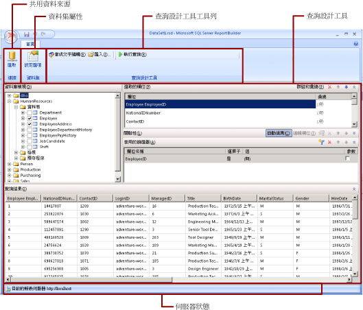

# 共用資料集設計檢視 (報表產生器)
  在報表中，資料集代表在外部資料來源上執行查詢時所傳回的報表資料。 共用資料集是在報表伺服器上發行，可供多個報表使用。 您可以建立資料集，以與其他人共用。 在 [Shared Dataset Design (共用資料集設計)] 視窗中，您可以選取共用資料來源、指定共用資料集的屬性，以及在查詢設計工具中建立查詢。  
  
   
  
 如需使用報表中資料的詳細資訊，請參閱 [報表資料集 &#40;SSRS&#41;](../../reporting-services/report-data/report-datasets-ssrs.md)。  
  
##   功能區  
 [功能區] 可協助您快速找到完成工作所需的命令。 命令會分成下列邏輯群組：連接、資料集和查詢設計工具。  
  
### 連接  
 使用 [連接] 群組中的 **[選取]** 按鈕，可選取報表中的共用資料來源，或瀏覽到報表伺服器上的共用資料來源。  
  
> [!NOTE]  
>  共用資料集必須以共用資料來源為基礎。 如果您需要的資料來源無法使用，則需要在報表伺服器上建立一個資料來源。 如需詳細資訊，請參閱[建立、 修改及刪除共用資料來源 &#40;SSRS &#41;](../../reporting-services/report-data/create-modify-and-delete-shared-data-sources-ssrs.md) .  
  
 如需詳細資訊，請參閱＜ [Data Connections, Data Sources, and Connection Strings in Report Builder](http://msdn.microsoft.com/library/7e103637-4371-43d7-821c-d269c2cc1b34)＞。  
  
### 資料集  
 使用 **[設定選項]** 按鈕可設定共用資料集屬性。 這些選項包括：  
  
-   欄位。 您可以在欄位集合中加入欄位或編輯欄位。  
  
-   資料選項。 您可以設定選項來影響比對準則和排序順序，例如區分大小寫和定序。  
  
-   篩選器。 您可以定義篩選器，在從資料連接擷取資料後，限制出現在報表中的資料。  
  
-   參數。 您可以加入參數或編輯參數選項。 例如，您可以為每個參數指定預設值，以便為報表伺服器上的這個共用資料集建立快取重新整理計劃。  
  
 您設定的值會變成報表伺服器上共用資料集定義的一部分。 當報表作者在報表中包含這個共用資料集時，您指定的選項會套用到該資料集執行個體。  
  
 將共用資料集加入報表後，報表作者可以覆寫下列選項：定序、區分大小寫、區分腔調字、區分假名、區分全半形、小計。 還可以建立其他資料集篩選器來限制報表中的資料。  
  
 如需詳細資訊，請參閱[報表內嵌資料集和共用資料集 &#40;報表產生器及 SSRS&#41;](../../reporting-services/report-data/report-embedded-datasets-and-shared-datasets-report-builder-and-ssrs.md)。  
  
 如需有關快取重新整理計劃的詳細資訊，請參閱[快取共用資料集 &#40;SSRS &#41;](../../reporting-services/report-server/cache-shared-datasets-ssrs.md).  
  
### 查詢設計工具  
 使用查詢設計工具工具列可協助建立查詢，以指定從資料連接擷取的資料。 您所看到的工具列，會視與資料連接的資料來源類型關聯的查詢設計工具而定。  
  
 如需詳細資訊，請參閱[從外部資料來源加入資料 &#40;SSRS&#41;](../../reporting-services/report-data/add-data-from-external-data-sources-ssrs.md) 中對應於資料來源類型的主題。  
  
  
##   查詢設計工具介面  
 查詢設計工具可協助您以外部資料來源所需的語法建立查詢。  
  
 某些資料來源類型提供圖形化查詢設計工具，可用來瀏覽外部資料來源上的中繼資料。 您可以用互動方式將名稱從中繼資料窗格拖曳到查詢設計介面，或用互動方式選取要使用的名稱。  
  
 某些資料來源類型則支援以文字為基礎的查詢設計工具，可用來貼上您已在其他工具 (如 [!INCLUDE[ssManStudioFull](../../includes/ssmanstudiofull-md.md)]) 中建立的查詢。  
  
 每種資料來源類型對於在外部資料來源執行的查詢都有特定需求。 如需詳細資訊，請參閱[從外部資料來源加入資料 &#40;SSRS&#41;](../../reporting-services/report-data/add-data-from-external-data-sources-ssrs.md) 和 [Reporting Services 支援的資料來源 &#40;SSRS&#41;](../../reporting-services/report-data/data-sources-supported-by-reporting-services-ssrs.md) 中對應於資料來源類型的主題。  
  
  
##   檢視查詢結果  
 在共用資料集設計檢視中，您所建立的查詢會在處理報表時，從資料連接擷取資料。  
  
 請執行查詢以查看資料連接傳回的範例資料，以確認查詢傳回您所要的資料類型。 結果集中的資料行來自於資料連接傳回之資料結構描述的中繼資料。 資料行名稱會變成資料集欄位集合。 您在查詢結果集中看到的資料值是設計階段資料。 將共用資料集儲存成報表伺服器上的共用資料集定義之後，只會儲存查詢文字。 查詢結果集中的資料不會儲存。  
  
 當報表作者將這個共用資料集加入到報表時，會加入指向報表伺服器上資料集定義的指標。 在報表中，資料集欄位集合會出現在 [報表資料] 窗格中。 查詢文字不會出現。  
  
 您用來執行查詢的認證，與用來預覽報表或從報表伺服器執行報表的認證不同。 如需詳細資訊，請參閱 [指定報表資料來源的認證及連接資訊](../../reporting-services/report-data/specify-credential-and-connection-information-for-report-data-sources.md)。  
  
### 使用參數執行報表  
 當您的查詢包含查詢變數時，系統會自動建立資料集參數。 接著，當您完成建立資料集查詢時，系統會自動建立設為資料集參數的報表參數。  
  
 如果報表包含參數，所有參數都必須具有預設值，然後報表才能自動執行。 如果某個參數沒有預設值，當您執行報表時，就必須選擇該參數的值，然後按一下 **[執行]** 索引標籤上的 **[檢視報表]** 。  
  
 如需詳細資訊，請參閱 [報表參數 &#40;報表產生器和報表設計師&#41;](../../reporting-services/report-design/report-parameters-report-builder-and-report-designer.md)。  
  
  
##   儲存共用資料集  
 若要儲存建立的查詢，請按一下 **[報表產生器]** 按鈕上的 **[儲存]** 或 **[另存新檔]**。 瀏覽至報表伺服器上適當的資料夾，然後儲存共用資料集定義。 除非將共用資料集儲存在報表伺服器上，否則其他人將無法使用它。  
  
  
## 請參閱＜  
 [報表資料集 &#40;SSRS&#41;](../../reporting-services/report-data/report-datasets-ssrs.md)   
 [篩選、 群組和排序資料 &#40;報表產生器及 SSRS &#41;](../../reporting-services/report-design/filter-group-and-sort-data-report-builder-and-ssrs.md)   
 [報表參數 &#40;報表產生器和報表設計師&#41;](../../reporting-services/report-design/report-parameters-report-builder-and-report-designer.md)  
  
  
