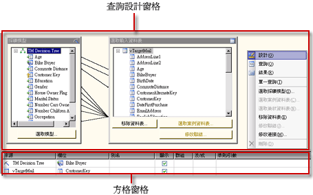
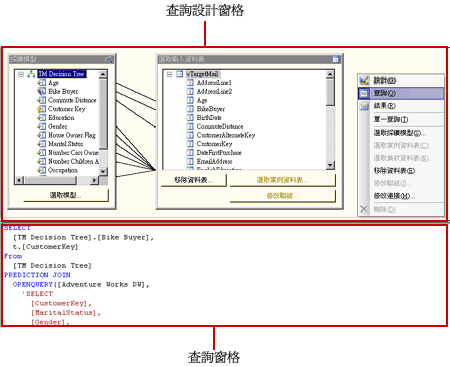
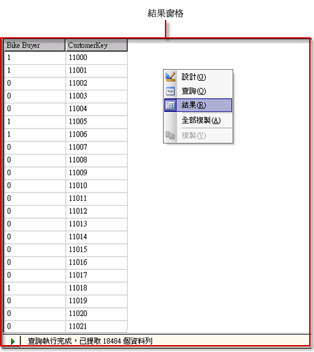

# Analysis Services DMX 查詢設計工具使用者介面
  [!INCLUDE[ssRSnoversion](../../includes/ssrsnoversion-md.md)] 提供了圖形化查詢設計工具，可用來建立 [!INCLUDE[ssASnoversion](../../includes/ssasnoversion-md.md)] 資料來源的資料採礦運算式 (DMX) 查詢和多維度運算式 (MDX) 查詢。 此主題即描述 DMX 查詢設計工具。 如需 MDX 查詢設計工具的詳細資訊，請參閱 [Analysis Services MDX 查詢設計工具使用者介面](../../reporting-services/report-data/analysis-services-mdx-query-designer-user-interface.md)。  
  
 DMX 圖形化查詢設計工具有三種模式：「設計」、「查詢」和「結果」。 若要切換模式，請以滑鼠右鍵按一下 [查詢設計工具] 窗格並選取模式。 每一種模式都會提供 [中繼資料] 窗格，您可以在這個窗格中，從選取的 Cube 中拖曳成員，以建立 DMX 查詢，在處理報表時為資料集擷取資料。  
  
## 圖形化 DMX 查詢設計工具工具列  
 查詢設計工具工具列會提供按鈕，協助您使用圖形化介面設計 DMX 查詢。 下表描述這些按鈕及其功能。  
  
|按鈕|說明|  
|------------|-----------------|  
|**當成文字編輯**|這種資料來源類型已停用此選項。|  
|**匯入**|從檔案系統上的報表定義 (.rdl) 檔案匯入現有的查詢。 如需詳細資訊，請參閱 [報表內嵌資料集和共用資料集 &#40;報表產生器及 SSRS&#41;](../../reporting-services/report-data/report-embedded-datasets-and-shared-datasets-report-builder-and-ssrs.md)。|  
||切換到 MDX 查詢設計工具模式。|  
||切換到 DMX 查詢設計工具模式。|  
||重新整理資料來源中的中繼資料。|  
||從查詢中刪除 [資料] 窗格中選取的資料行。|  
||顯示 **[查詢參數]** 對話方塊。 當您指派預設值給變數時，就會在您切換到 [報表設計師] 中的 [配置] 檢視時建立對應的報表參數。|  
||準備查詢。|  
||在「設計」模式與「查詢」模式之間切換。 若要變更為結果檢視，請以滑鼠右鍵按一下 [設計] 窗格並選擇 [結果]。|  
  
## 設計模式中的圖形化 DMX 查詢設計工具  
 當您編輯的資料集所使用的 [!INCLUDE[ssASnoversion](../../includes/ssasnoversion-md.md)] 資料來源沒有有效的 Cube，但是具有有效的採礦模型時，圖形化查詢設計工具會在 [設計] 模式下開啟。 下圖會標示出設計模式的窗格。  
  
   
  
 下表會描述各個窗格的功能。  
  
|窗格|函數|  
|----------|--------------|  
|[查詢設計] 窗格|使用 [採礦模型] 及 [選取輸入資料表] 對話方塊建立 DMX 查詢。|  
|[方格] 窗格|針對方格中的每一個資料列，使用 [來源] 下拉式清單選取函數或運算式，並選擇要在 DMX 查詢中使用的欄位、群組和準則或引數。 若要查看依據選取項目所產生的 DMX 查詢文字，請按一下工具列上的 [設計模式] 按鈕。|  
  
 若要執行 DMX 查詢並將結果顯示在 [結果] 窗格中，請以滑鼠右鍵按一下 [查詢設計] 窗格並選取 [結果]。  
  
## 查詢模式中的圖形化 DMX 查詢設計工具  
 若要將圖形化查詢設計工具變更為「查詢」模式，請按一下工具列上的 [設計模式] 按鈕，或是以滑鼠右鍵按一下查詢設計介面並從捷徑功能表中選擇 [查詢]。 使用這種模式可直接在 [查詢] 窗格中輸入 DMX 文字。  
  
 下圖會標示出「查詢」模式中的窗格。  
  
   
  
 下表會描述各個窗格的功能。  
  
|窗格|函數|  
|----------|--------------|  
|[查詢設計] 窗格|使用 [採礦模型] 及 [選取輸入資料表] 對話方塊建立 DMX 查詢。|  
|[查詢] 窗格|直接在窗格中檢視或編輯 DMX 查詢文字。 如果變回 [設計] 模式，則無法保存 DMX 查詢文字的變更。|  
  
 若要執行 DMX 查詢並將結果顯示在 [結果] 窗格中，請以滑鼠右鍵按一下 [查詢設計] 窗格並選取 [結果]。  
  
## 結果模式中的圖形化 DMX 查詢設計工具  
 若要顯示「結果」模式，請以滑鼠右鍵按一下查詢設計介面並從捷徑功能表中選擇 [結果]。 當您切換到「結果」模式時，DMX 查詢便會自動執行。  
  
 下圖會顯示「結果」模式中的查詢設計工具。  
  
   
  
 若要切換回「設計」模式或「查詢」模式，請以滑鼠右鍵按一下 [結果] 窗格並選取 [設計] 或 [查詢]。  
  
## 另請參閱  
 [在 Analysis Services 的 MDX 查詢設計工具中定義參數 &#40;報表產生器及 SSRS&#41;](../../reporting-services/report-data/define-parameters-in-the-mdx-query-designer-for-analysis-services.md)   
 [建立共用資料集或內嵌資料集 &#40;報表產生器及 SSRS&#41;](../../reporting-services/report-data/create-a-shared-dataset-or-embedded-dataset-report-builder-and-ssrs.md)   
 [DMX 的 Analysis Services 連接類型 &#40;SSRS&#41;](../../reporting-services/report-data/analysis-services-connection-type-for-dmx-ssrs.md)   
 [從資料採礦模型擷取資料 &#40;DMX&#41; &#40;SSRS&#41;](../../reporting-services/report-data/retrieve-data-from-a-data-mining-model-dmx-ssrs.md)   
 [RSReportDesigner 組態檔](../../reporting-services/report-server/rsreportdesigner-configuration-file.md)   
 [MDX 的 Analysis Services 連接類型 &#40;SSRS&#41;](../../reporting-services/report-data/analysis-services-connection-type-for-mdx-ssrs.md)   
 [DMX 的 Analysis Services 連接類型 &#40;SSRS&#41;](../../reporting-services/report-data/analysis-services-connection-type-for-dmx-ssrs.md)  
  
  
