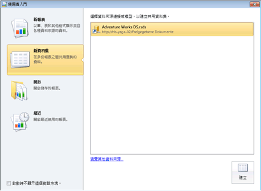

# 建立共用資料集或內嵌資料集 (報表產生器及 SSRS)
內嵌資料集適用於單一 [!INCLUDE[ssRSnoversion_md](../../includes/ssrsnoversion-md.md)] 報表。 報表伺服器上的共用資料集可供多份報表使用，行動和分頁報表皆可。 若要建立資料集，您需要內嵌或共用的資料來源。  
  
## 報表產生器工作

報表產生器用於下列工作：  
  
1.  在資料集設計檢視中建立共用資料集。 共用資料集必須使用已發行的共用資料來源。  
  
2.   在報表設計檢視中建立內嵌資料集。  
  
3.   將資料集直接儲存至報表伺服器或 SharePoint 網站。  
  
## 報表設計師工作

請使用 [!INCLUDE[ssBIDevStudioFull](../../includes/ssbidevstudiofull-md.md)] 中的報表設計師來執行下列工作：  
  
1.  在 [方案總管] 中建立共用資料集。 共用資料集必須使用 [方案總管] 中 [共用資料來源] 資料夾內的資料來源。  
  
2.  在 [報表資料] 窗格中建立內嵌資料集。  
  
3.  (選擇性) 使用報表來部署共用資料集和共用資料來源。 您可以針對每種項目類型，使用 [專案屬性] 來指定報表伺服器或 SharePoint 網站上資料夾的路徑。  
  
 如需詳細資訊，請參閱 [報表內嵌資料集和共用資料集 &#40;報表產生器及 SSRS&#41;](../../reporting-services/report-data/report-embedded-datasets-and-shared-datasets-report-builder-and-ssrs.md)。  
  
> [!NOTE]  
>  [!INCLUDE[ssRBRDDup](../../includes/ssrbrddup-md.md)]  
  
## 在報表產生器中建立共用資料集
  
1.  開啟報表產生器。 **[新增報表或資料集]** 窗格隨即開啟，如下圖所示：  
  
       
  
    > [!NOTE]  
    >  如果 [New report or dataset pane (新增報表或資料集窗格)] 未出現，請從 [報表產生器] 按鈕按一下 [新增]。  
  
2.  在左窗格的 **[建立資料集]** 底下，按一下 **[共用資料集]**。  
  
3.  在右窗格中，按一下 **[瀏覽]** 從報表伺服器選取共用資料來源，然後按一下 **[建立]**。 隨即開啟與共用資料來源相關聯的查詢設計工具。  
  
4.  在查詢設計工具中，指定要併入資料集的欄位。  
  
5.  按一下 **「執行」** (**!**) 來執行查詢。  
  
6.  在 **[報表產生器]** 按鈕上，按一下 **[儲存]** 或 **[另存新檔]** ，將共用資料集儲存在報表伺服器上。  
  
7.  若要結束報表產生器，請按一下 **[報表產生器]**，然後按一下 **[結束報表產生器]**。 若要處理報表，按一下 **[報表產生器]**，然後按一下 **[新增]** 或 **[開啟]**。  
  
## 若要設定查詢參數選項  
  
1.  開啟報表產生器。  
  
2.  按一下 **[開啟]**。  
  
3.  瀏覽至報表伺服器，並選取共用資料來源的資料夾。  
  
4.  在 **[下列類型的項目]** 中，按一下下拉式清單中的資料集 (*.rsd)。  
  
5.  選取共用資料集，然後按一下 **[開啟]**。 隨即開啟關聯的查詢設計工具。  
  
6.  在功能區上，按一下 **[資料集屬性]**。  
  
7.  按一下 **[參數]**。 在這個頁面上，將預設值設定為常數或運算式，並將參數標示為唯讀、可為 Null 或 [從查詢中忽略]。 如需詳細資訊，請參閱 [報表參數](../../reporting-services/report-design/report-parameters-report-builder-and-report-designer.md)。  
  
8.  [!INCLUDE[clickOK](../../includes/clickok-md.md)]  

  
## 若要從 SQL Server 關聯式資料庫建立資料集  
  
1.  在 [報表資料] 窗格中，以滑鼠右鍵按一下資料來源的名稱，然後按一下 **[加入資料集]**。 **[資料集屬性]** 對話方塊的 **[查詢]** 頁面隨即開啟。  
  
2.  在 **[名稱]** 中，輸入資料集名稱或是接受預設名稱。  
  
    > [!NOTE]  
    >  資料集名稱是在報表的內部使用。 為了清楚起見，我們建議資料集的名稱應該要描述查詢所傳回的資料。  
  
3.  在 **[資料來源]** 中，瀏覽並選取現有的共用資料來源名稱，或是按一下 **[新增]** 來建立新的內嵌資料來源。  
  
4.  選取 **[查詢類型]** 選項。 選項會因資料來源類型而異。  
  
    -   選取 **[Text]** ，即可使用資料來源的查詢語言來撰寫查詢。  
  
    -   選取 **[Table]** ，即可傳回關聯式資料庫資料表中的所有欄位。  
  
    -   選取 **[StoredProcedure]** 即可依名稱執行預存程序。  
  
5.  在 **[查詢]** 中，輸入查詢、預存程序或資料表名稱。 或者，您也可以按一下 **[查詢設計工具]** 來開啟圖形化或是以文字為基礎的查詢設計工具，或是按一下 **[匯入]** 從現有的報表匯入查詢。  
  
     在一些情況下，查詢所指定的欄位集合只能透過在資料來源上執行查詢來判斷。 例如，預存程序可能會在結果集中傳回一組變動的欄位。 按一下 **[重新整理欄位]** 可在資料來源上執行查詢，並擷取在 [報表資料] 窗格中填入資料集欄位集合所需的欄位名稱。 當您關閉 **[資料集屬性]** 對話方塊之後，資料集節點底下會出現欄位集合。  
  
6.  在 **[逾時]** 中，輸入報表伺服器等候資料庫回應的秒數。 預設值為 0 秒。 當逾時值為 0 秒時，此查詢不會逾時。  
  
7.  [!INCLUDE[clickOK](../../includes/clickok-md.md)]  
  
     資料集和它的欄位集合會出現在 [報表資料] 窗格的資料來源節點底下。  
  
## 另請參閱  
 [報表內嵌資料集和共用資料集 &#40;報表產生器及 SSRS&#41;](../../reporting-services/report-data/report-embedded-datasets-and-shared-datasets-report-builder-and-ssrs.md)   
 [資料集欄位集合 &#40;報表產生器及 SSRS&#41;](../../reporting-services/report-data/dataset-fields-collection-report-builder-and-ssrs.md)   
 [報表資料集 &#40;SSRS&#41;](../../reporting-services/report-data/report-datasets-ssrs.md)   
 [資料連接、資料來源及連接字串 &#40;報表產生器和 SSRS&#41;](https://msdn.microsoft.com/library/7e103637-4371-43d7-821c-d269c2cc1b34)   
 [內嵌和共用資料集 &#40;報表產生器及 SSRS&#41;](../../reporting-services/report-data/embedded-and-shared-datasets-report-builder-and-ssrs.md)  
  
  
