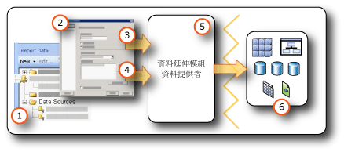

# <a name="data-connections-data-sources-and-connection-strings-report-builder-and-ssrs"></a>資料連接、資料來源及連接字串 (報表產生器和 SSRS)

[!INCLUDE [ssrs-appliesto](../../includes/ssrs-appliesto.md)] [!INCLUDE [ssrs-appliesto-2016-and-later](../../includes/ssrs-appliesto-2016-and-later.md)] [!INCLUDE[ssrs-appliesto-pbirsi](../../includes/ssrs-appliesto-pbirs.md)] [!INCLUDE[ssrs-appliesto-sharepoint-2013-2016i](../../includes/ssrs-appliesto-sharepoint-2013-2016.md)]

[!INCLUDE [ssrs-previous-versions](../../includes/ssrs-previous-versions.md)]

  若要在[!INCLUDE[ssRBnoversion](../../includes/ssrbnoversion.md)]和[!INCLUDE[ssRSnoversion](../../includes/ssrsnoversion-md.md)]分頁報表中包括資料，您必須先建立「資料來源」  與「資料集」  。 本主題說明資料來源的類型、如何建立資料來源，以及與資料來源認證相關的重要資訊。 資料來源包括資料來源類型、連接資訊，以及要使用的認證類型。 資料來源有兩種類型：內嵌和共用。 內嵌資料來源是定義在報表中，而且只能供該報表使用。 共用資料來源則與報表分開定義，而且可以供多個報表使用。 如需詳細資訊，請參閱[內嵌和共用資料集 &#40;報表產生器及 SSRS&#41;](../../reporting-services/report-data/embedded-and-shared-datasets-report-builder-and-ssrs.md)。  

## <a name="data-in-includessrbnoversionincludesssrbnoversionmd"></a>[!INCLUDE[ssRBnoversion](../../includes/ssrbnoversion.md)] 中的資料  
   
  
1.  **報表資料窗格中的資料來源** ：在您建立內嵌資料來源或加入共用資料來源之後，[報表資料] 窗格中就會出現資料來源。  
  
2.  **連接對話方塊** ：使用 [連接對話方塊] 可建立連接字串或貼上連接字串。  
  
3.  **資料連接資訊** ：連接字串會傳遞至資料延伸模組。  
  
4.  **認證** ：認證會與連接字串分開管理。  
  
5.  **資料延伸模組/資料提供者** ：資料可經由多個資料存取層連接。  
  
6.  **外部資料來源** ：從關聯式資料庫、多維資料庫、SharePoint 清單、Web 服務或報表模型擷取資料。  

##  <a name="bkmk_data_sources"></a> 內嵌與共用資料來源  
 如果資料來源使用頻率很高，則共用資料來源很有用。 建議您盡量使用共用資料來源。 它們會簡化報表和報表存取的管理，而且有助於提升報表和報表所存取之資料來源的安全性。 如果您需要共用資料來源，請要求系統管理員為您建立一個。  
  
 內嵌資料來源是儲存在報表定義中的資料連接。 內嵌資料來源連接資訊只能用於內嵌該資訊的報表中。 若要定義和管理內嵌資料來源，請使用 **[資料來源屬性]** 對話方塊。  
  
 內嵌與共用資料來源之間的差異在於建立、儲存和管理的方式。  
  
-   在報表設計師中，您可以將內嵌或共用資料來源建立成 [!INCLUDE[ssBIDevStudioFull](../../includes/ssbidevstudiofull-md.md)] 專案的一部分。 您可以控制要在本機使用它們進行預覽，還是將它們當做專案的一部分部署至報表伺服器或 SharePoint 網站。 您可以使用已經安裝在電腦以及報表伺服器或 SharePoint 網站 (部署報表的所在位置) 上的自訂資料延伸模組。  
  
     系統管理員可以安裝與設定其他資料處理延伸模組以及 .NET Framework 資料提供者。 如需詳細資訊，請參閱[資料處理延伸模組與 .NET Framework Data Providers &#40;SSRS&#41;](../../reporting-services/report-data/data-processing-extensions-and-net-framework-data-providers-ssrs.md)。  
  
     開發人員可以使用 <xref:Microsoft.ReportingServices.DataProcessing> API 建立資料處理延伸模組，以支援其他類型的資料來源。  
  
-   在 [!INCLUDE[ssRBnoversion](../../includes/ssrbnoversion.md)]中，您可以瀏覽至報表伺服器或 SharePoint 網站，然後選取共用資料來源或在報表中建立內嵌資料來源。 您無法在 [!INCLUDE[ssRBnoversion](../../includes/ssrbnoversion.md)]中建立共用資料來源。 您無法在 [!INCLUDE[ssRBnoversion](../../includes/ssrbnoversion.md)]中使用自訂資料延伸模組。  
  
 下表摘要列出內嵌與共用資料來源之間的差異。  
  
|Description|內嵌<br /><br /> 資料來源|共用<br /><br /> 資料來源|  
|-----------------|------------------------------|----------------------------|  
|資料連接會內嵌在報表定義中。|||  
|報表伺服器上資料連接的指標會內嵌在報表定義中。|||  
|在報表伺服器上管理|||  
|共用資料集所需|||  
|元件所需|||  
  
##  <a name="bkmk_DataConnections"></a> 內建的資料延伸模組  
 [!INCLUDE[ssRSnoversion](../../includes/ssrsnoversion-md.md)] 中預設的資料延伸模組包括下列資料連接類型：  
  
-   Microsoft SQL Server 和 Microsoft Azure SQL Database
  
-   Microsoft SQL Server Analysis Services  
  
-   Microsoft SharePoint 清單  
  
-   [!INCLUDE[ssSDSFull](../../includes/sssdsfull-md.md)]  
  
-   Microsoft SQL Server Parallel Data Warehouse  
  
-   OLE DB  
  
-   Oracle  
  
-   SAP NetWeaver BI  
  
-   Hyperion Essbase  
  
-   Teradata  
  
-   XML  
  
-   ODBC  

 如需 [!INCLUDE[ssRSnoversion](../../includes/ssrsnoversion-md.md)] 支援之資料來源與版本的完整清單，請參閱 [Reporting Services 支援的資料來源 &#40;SSRS&#41;](../../reporting-services/report-data/data-sources-supported-by-reporting-services-ssrs.md)。  
  
##  <a name="bkmk_connection_examples"></a> 一般連接字串範例  
 連接字串是資料提供者之連接屬性的文字表示。 下表列出各種資料連接類型之連接字串的範例。  
 
 > [!NOTE]  
>  [Connectionstrings.com](https://www.connectionstrings.com/) 是取得連接字串範例的另一個資源。 
  
|**Data source**|**範例**|**說明**|  
|---------------------|-----------------|---------------------|  
|本機伺服器上的 SQL Server 資料庫|`data source="(local)";initial catalog=AdventureWorks`|將資料來源類型設為 **Microsoft SQL Server**。 如需詳細資訊，請參閱 [SQL Server 連接類型 &#40;SSRS&#41;](../../reporting-services/report-data/sql-server-connection-type-ssrs.md)。|  
|SQL Server 執行個體<br /><br /> [資料庫]|`Data Source=localhost\MSSQL13.<InstanceName>; Initial Catalog=AdventureWorks`|將資料來源類型設為 **Microsoft SQL Server**。|  
|Azure SQL Database|`Data Source=<host>;Initial Catalog=AdventureWorks; Encrypt=True`|將資料來源類型設定為 **Microsoft Azure SQL Database**。 如需詳細資訊，請參閱 [SQL Azure 連接類型 &#40;SSRS&#41;](../../reporting-services/report-data/sql-azure-connection-type-ssrs.md)。|  
|SQL Server 平行資料倉儲|`HOST=<IP address>;database= AdventureWorks; port=<port>`|將資料來源類型設為 **Microsoft SQL Server Parallel Data Warehouse**。 如需詳細資訊，請參閱 [SQL Server 平行資料倉儲連接類型 &#40;SSRS&#41;](../../reporting-services/report-data/sql-server-parallel-data-warehouse-connection-type-ssrs.md)。|  
|本機伺服器上的 Analysis Services 資料庫|`data source=localhost;initial catalog=Adventure Works DW`|將資料來源類型設為 **Microsoft SQL Server Analysis Services**。 如需詳細資訊，請參閱 [MDX 的 Analysis Services 連線類型 &#40;SSRS&#41;](../../reporting-services/report-data/analysis-services-connection-type-for-mdx-ssrs.md) 或 [DMX 的 Analysis Services 連線類型 &#40;SSRS&#41;](../../reporting-services/report-data/analysis-services-connection-type-for-dmx-ssrs.md)。|  
|具有 Sales 檢視方塊的 Analysis Services 表格式模型資料庫|`Data source=<servername>;initial catalog= Adventure Works DW;cube='Sales'`|將資料來源類型設為 **Microsoft SQL Server Analysis Services**。 在 cube= 設定中指定檢視方塊名稱。 如需詳細資訊，請參閱 [檢視方塊 &#40;SSAS 表格式&#41;](https://docs.microsoft.com/analysis-services/tabular-models/perspectives-ssas-tabular)。|  
|Oracle 伺服器|`data source=myserver`|將資料來源類型設為 **Oracle**。 Oracle 用戶端工具必須安裝在報表設計師電腦和報表伺服器上。 如需詳細資訊，請參閱 [Oracle 連接類型 &#40;SSRS&#41;](../../reporting-services/report-data/oracle-connection-type-ssrs.md)。|  
|SAP NetWeaver BI 資料來源|`DataSource=https://mySAPNetWeaverBIServer:8000/sap/bw/xml/soap/xmla`|將資料來源類型設為 **SAP NetWeaver BI**。 如需詳細資訊，請參閱 [SAP NetWeaver BI 連接類型 &#40;SSRS&#41;](../../reporting-services/report-data/sap-netweaver-bi-connection-type-ssrs.md)。|  
|Hyperion Essbase 資料來源|`Data Source=https://localhost:13080/aps/XMLA; Initial Catalog=Sample`|將資料來源類型設為 **Hyperion Essbase**。 如需詳細資訊，請參閱 [Hyperion Essbase 連接類型 &#40;SSRS&#41;](../../reporting-services/report-data/hyperion-essbase-connection-type-ssrs.md)。|  
|Teradata 資料來源|`data source=`\<NNN>.\<NNN>.\<NNN>.\<NNN>`;`|將資料來源類型設為 **Teradata**。 連接字串是四個欄位形式的網際網路通訊協定 (IP) 位址，其中每個欄位都可以是 1 到 3 位數。 如需詳細資訊，請參閱 [Teradata 連線類型 &#40;SSRS&#41;](../../reporting-services/report-data/teradata-connection-type-ssrs.md)。|  
|Teradata 資料來源|`Database=` \<資料庫名稱>  `; data source=` *\<NN*N *>.\<NNN>.\<NNN>.\<N*NN *>* `;Use X Views=False;Restrict to Default Database=True`|與前述範例類似，將資料來源類型設為 **Teradata**。 請只使用在 Database 標記中指定的預設資料庫，而不要自動探索資料關聯性。|  
|XML 資料來源, Web 服務|`data source=https://adventure-works.com/results.aspx`|將資料來源類型設為 **XML**。 連接字串是支援 Web 服務定義語言 (WSDL) 之 Web 服務的 URL。 如需詳細資訊，請參閱 [XML 連線類型 &#40;SSRS&#41;](../../reporting-services/report-data/xml-connection-type-ssrs.md)。|  
|XML 資料來源、XML 文件|`https://localhost/XML/Customers.xml`|將資料來源類型設為 **XML**。 連接字串是 XML 文件的 URL。 
|XML 資料來源, 內嵌 XML 文件|*Empty*|將資料來源類型設為 **XML**。 XML 資料內嵌在報表定義中。|  
|SharePoint 清單|`data source=https://MySharePointWeb/MySharePointSite/`|將資料來源類型設為 **SharePoint 清單**。|  
| Power BI Premium 資料集（從 Reporting Services 2019 開始） | 伺服器 = powerbi：//api.powerbi.com/v1.0/myorg/<workspacename>; 初始目錄 = <YourDatasetName> | 將資料來源類型設為 **Microsoft SQL Server Analysis Services**。 |

  
 如果無法使用 **localhost**連接到報表伺服器，請檢查 TCP/IP 通訊協定的網路通訊協定是否已啟用。 如需詳細資訊，請參閱 [Configure Client Protocols](../../database-engine/configure-windows/configure-client-protocols.md)。  
  
 如需連接到這些資料來源類型所需組態的詳細資訊，請參閱[從外部資料來源加入資料 &#40;SSRS&#41;](../../reporting-services/report-data/add-data-from-external-data-sources-ssrs.md) 或 [Reporting Services 支援的資料來源 &#40;SSRS&#41;](../../reporting-services/report-data/data-sources-supported-by-reporting-services-ssrs.md) 下的特定資料連接主題。  
  
##  <a name="bkmk_special_password_characters"></a> 密碼中的特殊字元  
 如果您設定 ODBC 或 SQL 資料來源以提示密碼或將密碼包含在連接字串中，則當使用者輸入含有特殊字元 (例如：標點符號) 的密碼時，某些基礎資料來源驅動程式無法驗證這些特殊字元。 當您處理報表時，訊息「不是有效密碼」可能會指出此問題。 如果無法變更密碼，您可以洽詢資料庫管理員，將適當的認證儲存在伺服器上，做為系統 ODBC 資料來源名稱 (DSN) 的一部分。 如需詳細資訊，請參閱 [!INCLUDE[dnprdnshort](../../includes/dnprdnshort-md.md)] SDK 文件集中的＜OdbcConnection.ConnectionString＞。  
  
##  <a name="bkmk_Expressions_in_connection_strings"></a> 以運算式為基礎的連接字串  
 以運算式為基礎的連接字串是在執行階段進行評估。 例如，您可以將資料來源指定為參數，包括連接字串中的參數參考，並允許使用者選擇報表的資料來源。 例如，假設有一家跨國企業，在許多國家 (地區) 有資料伺服器。 執行銷售報表的使用者可以在執行報表之前，使用以運算式為基礎的連接字串，來選取特定國家 (地區) 的資料來源。  
  
 下列範例說明在 [!INCLUDE[ssNoVersion](../../includes/ssnoversion-md.md)] 連接字串中，使用資料來源運算式。 本範例假設您已經建立一個名為 `ServerName`的報表參數：  
  
```  
="data source=" & Parameters!ServerName.Value & ";initial catalog=AdventureWorks"  
```  
  
 資料來源運算式是在執行階段，或者在預覽報表時處理。 運算式必須以 [!INCLUDE[vbprvb](../../includes/vbprvb-md.md)]撰寫。 定義資料來源運算式時，請使用下列指導方針：  
  
-   使用靜態連接字串設計報表。 靜態連接字串是指未透過運算式設定的連接字串 (例如，您遵循建立報表特定或共用資料來源的步驟執行時，所定義的就是靜態連接字串)。 使用靜態連接字串可以讓您連接到報表設計師中的資料來源，以便取得建立報表所需的查詢結果。  
  
-   定義資料來源連接時，請勿使用共用資料來源。 您不能在共用資料來源中使用資料來源運算式。 您必須為報表定義內嵌的資料來源。  
  
-   分開指定認證與連接字串。 您可以使用預存認證、提示認證或整合式安全性。  
  
-   加入報表參數，以指定資料來源。 針對參數值，您可以提供靜態可用的值清單 (在此情況下，可用的值應為可以搭配報表使用的資料來源)，或者定義在執行階段擷取資料來源清單的查詢。  
  
-   請確定資料來源清單共用相同的資料庫結構描述。 所有的報表設計都是從結構描述資訊開始。 如果用於定義報表的結構描述，和報表在執行階段使用的實際結構描述不符，報表可能不會執行。  
  
-   發行報表之前，請以運算式取代靜態連接字串。 等到設計好報表之後，再以運算式取代靜態連接字串。 一旦使用運算式，就不能在報表設計師中執行查詢。 此外，[報表資料] 窗格中的欄位清單與 [參數] 清單也不會自動更新。  

## <a name="next-steps"></a>後續步驟

[建立、修改及刪除共用資料來源](../../reporting-services/report-data/create-modify-and-delete-shared-data-sources-ssrs.md)   
[建立和修改內嵌資料來源](../../reporting-services/report-data/create-and-modify-embedded-data-sources.md)   
[設定部署屬性](../../reporting-services/tools/set-deployment-properties-reporting-services.md)   
[指定報表資料來源的認證及連線資訊](../../reporting-services/report-data/specify-credential-and-connection-information-for-report-data-sources.md)  

更多問題嗎？ [請嘗試詢問 Reporting Services 論壇](https://go.microsoft.com/fwlink/?LinkId=620231)
