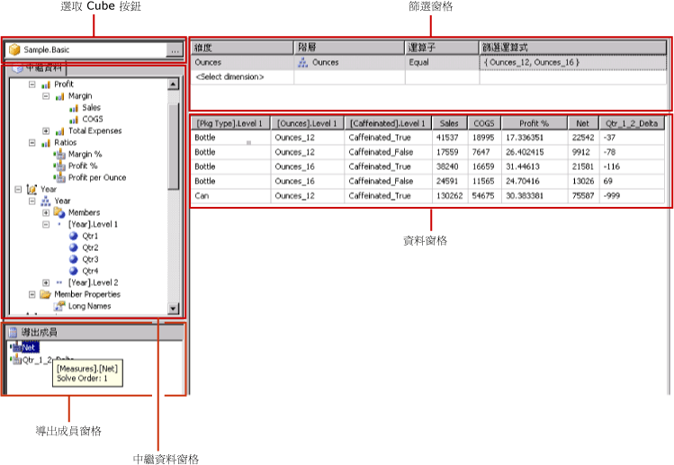
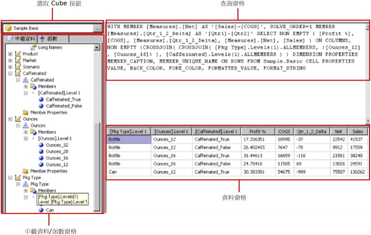

# Hyperion Essbase 查詢設計工具使用者介面
  [!INCLUDE[ssRSnoversion](../../includes/ssrsnoversion-md.md)] 會提供圖形化查詢設計工具，可用以建立 [!INCLUDE[extEssbase](../../includes/extessbase-md.md)] 資料來源的多維度運算式 (MDX) 查詢。 MDX 圖形化查詢設計工具有兩種模式：「設計」模式和「查詢」模式。 每一種模式都會提供 [中繼資料] 窗格，而且您可以透過這個窗格，從資料來源上定義的 Cube 中拖曳成員，以便建立可在處理報表時擷取資料的 MDX 查詢。  
  
> [!IMPORTANT]  
>  當使用者建立與執行查詢時，可以存取資料來源。 您應該授與資料來源的最小權限，例如唯讀權限。  
  
 如需使用 [!INCLUDE[extEssbase](../../includes/extessbase-md.md)] 多維度資料來源的詳細資訊，請參閱 [Hyperion Essbase 連線類型 &#40;SSRS&#41;](../../reporting-services/report-data/hyperion-essbase-connection-type-ssrs.md)。  
  
 本節會針對圖形化查詢設計工具的各種模式，描述其中的工具列按鈕和查詢設計工具窗格。  
  
## 設計模式中的圖形化查詢設計工具  
 當您為資料集編輯的 MDX 查詢使用了 [!INCLUDE[extEssbase](../../includes/extessbase-md.md)] 資料來源時，圖形化查詢設計工具會在設計模式下開啟。  
  
 下圖會標示出設計模式的窗格。  
  
   
  
 下表列出此模式下的窗格。  
  
|窗格|函數|  
|----------|--------------|  
|[選取 Cube] 按鈕|顯示目前選取的 Cube。|  
|[中繼資料] 窗格|顯示 Cube 的階層式清單。|  
|[導出成員] 窗格|顯示目前已定義，可在查詢中使用的導出成員。|  
|[篩選] 窗格|顯示要在查詢中套用的篩選。|  
|[資料] 窗格|顯示執行查詢的結果。|  
  
 您可以將 [中繼資料] 窗格中的維度和量值以及 [導出成員] 窗格中的導出成員，拖曳至 [資料] 窗格中。 如果工具列上的 **[自動執行]** 切換按鈕為開啟狀態，則每次您將物件放到 [資料] 窗格中時，查詢設計工具便會執行查詢。 如果 **[自動執行]** 為關閉狀態，則當您對 [資料] 窗格進行變更時，查詢設計工具不會執行查詢。 您可以使用工具列上的 **[執行]** 按鈕，以手動方式執行查詢。  
  
 在 [篩選] 窗格中，您可以選取維度值來限制從資料來源擷取的資料。 您在「設計」模式中的篩選內定義的值會顯示於「查詢」模式中的 MDX Where 子句。  
  
### 設計模式中的圖形化查詢設計工具工具列  
 查詢設計工具工具列會提供按鈕，協助您使用圖形化介面設計 MDX 查詢。 下表會顯示這些按鈕並描述其功能。  
  
|按鈕|描述|  
|------------|-----------------|  
|**當成文字編輯**|在以文字為基礎的查詢設計工具和圖形化查詢設計工具之間切換。 無法用於這種資料來源類型。|  
|**匯入**|從檔案系統上的報表定義 (.rdl) 檔案匯入現有的查詢。 如需詳細資訊，請參閱 [報表內嵌資料集和共用資料集 &#40;報表產生器及 SSRS&#41;](../../reporting-services/report-data/report-embedded-datasets-and-shared-datasets-report-builder-and-ssrs.md)。|  
||重新整理資料來源中的中繼資料。|  
||顯示 **[導出成員產生器]** 對話方塊。 您可以使用這個對話方塊來建立或編輯導出成員的運算式，包括設定 **[解決順序]** 屬性。|  
||在顯示或隱藏 [資料] 窗格中的空白資料格之間切換 (這相當於使用 MDX 中的 NON EMPTY 子句)。|  
||每次進行變更 (例如刪除 [資料] 窗格中的資料行) 時自動執行查詢並顯示結果。 結果會顯示在 [資料] 窗格中。|  
||從查詢中刪除選取的項目。 您可以使用此按鈕來刪除 [篩選] 窗格中的選取資料列。|  
||執行查詢並將結果顯示在 [資料] 窗格中。|  
||取消查詢。|  
||在「設計」模式與「查詢」模式之間切換。|  
  
## 查詢模式中的圖形化查詢設計工具  
 若要將圖形化查詢設計工具變更為「查詢」模式，請按一下工具列上的 **[設計模式]** 切換按鈕。 下圖會指出查詢設計工具在「查詢」模式中的各個部分。  
  
   
  
 下表會描述各個窗格的功能。  
  
|窗格|函數|  
|----------|--------------|  
|[選取 Cube] 按鈕|顯示目前選取的 Cube。|  
|[中繼資料/函數] 窗格|顯示索引標籤式的視窗，列出可用來建立查詢文字的可用中繼資料或函數清單。|  
|[查詢] 窗格|顯示目前的查詢文字。|  
|結果窗格|顯示查詢的結果。|  
  
 您可以從 [中繼資料] 窗格，將 **[中繼資料]** 索引標籤中的量值和維度拖曳至 [MDX 查詢] 窗格中。 您也可以將 **[函數]** 索引標籤上的函數拖曳至 [MDX 查詢] 窗格中。 當您執行查詢時，[結果] 窗格便會顯示目前 MDX 查詢的結果。  
  
### 查詢模式中的圖形化查詢設計工具工具列  
 查詢設計工具工具列會提供按鈕，協助您使用圖形化介面設計 MDX 查詢。 「設計」模式與「查詢」模式的工具列按鈕完全相同，唯一不同的是在「查詢」模式中未啟用下列按鈕：  
  
-   **當成文字編輯**  
  
-   **加入導出成員** ()  
  
-   **顯示空的資料格** ()  
  
-   **自動執行** ()  
  
## 另請參閱  
 [建立共用資料集或內嵌資料集 &#40;報表產生器及 SSRS&#41;](../../reporting-services/report-data/create-a-shared-dataset-or-embedded-dataset-report-builder-and-ssrs.md)   
 [RSReportDesigner 設定檔](../../reporting-services/report-server/rsreportdesigner-configuration-file.md)  
  
  
