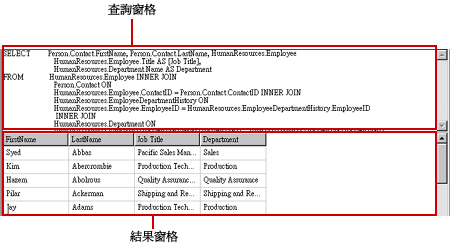
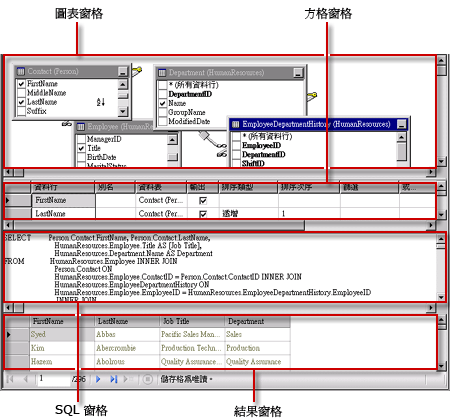
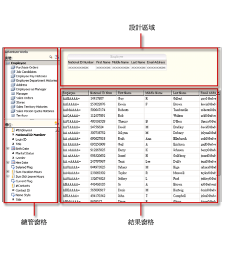
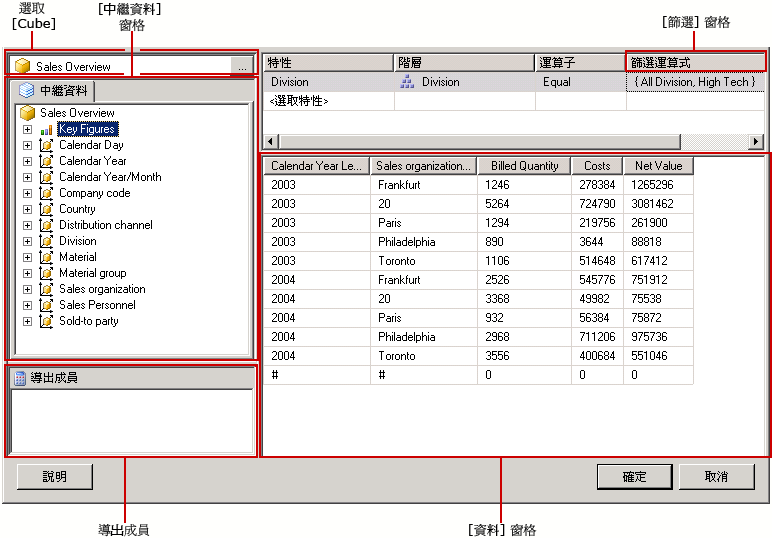

# 查詢設計工具 (SSRS)
  [!INCLUDE[ssRSnoversion](../../includes/ssrsnoversion-md.md)] 提供各種查詢設計工具，您可以在報表設計師中利用這些工具來建立資料集查詢。 某些查詢設計工具還提供替代模式，讓您能夠選擇使用視覺化模式或直接使用查詢語言。 本主題簡介每個工具，並描述每個工具支援的資料來源類型。 本主題將描述下列工具：  
  
-   [以文字為基礎的查詢設計工具](#Textbased)  
  
-   [圖形化查詢設計工具](#Graphical)  
  
-   [報表模型查詢設計工具](#Model)  
  
-   [MDX 查詢設計工具](#MDX)  
  
-   [DMX 查詢設計工具](#DMX)  
  
-   [SapNetWeaver BI 查詢設計工具](#SAPBW)  
  
-   [Hyperion Essbase 查詢設計工具](#Hyperion)  
  
 當您使用報表伺服器專案範本或報表伺服器精靈專案範本時，所有的查詢設計工具都會在 [!INCLUDE[ssBIDevStudioFull](../../includes/ssbidevstudiofull-md.md)] 的資料設計環境中執行。 如需使用查詢設計工具的詳細資訊，請參閱 [Reporting Services 查詢設計工具](https://msdn.microsoft.com/library/07efd3f1-804f-45f7-b62a-3e727a3d9835)。  
  
 您使用的資料來源類型會決定特定查詢設計工具的可用性。  
  
 報表中的可用資料來源類型取決於用戶端或報表伺服器上安裝的 [!INCLUDE[ssRSnoversion](../../includes/ssrsnoversion-md.md)] 資料延伸模組。 如需詳細資訊，請參閱 [RSReportDesigner 組態檔](../../reporting-services/report-server/rsreportdesigner-configuration-file.md) 和 [RsReportServer.config 組態檔](../../reporting-services/report-server/rsreportserver-config-configuration-file.md)。  
  
 資料處理延伸模組及其相關聯的查詢設計工具，在資料來源支援的下列方式可能會有不同：  
  
-   **依查詢設計工具類型。** 例如， [!INCLUDE[ssNoVersion](../../includes/ssnoversion-md.md)] 資料來源同時支援圖形化查詢設計工具以及以文字為基礎的查詢設計工具。  
  
-   **依查詢語言變化。** 例如， [!INCLUDE[tsql](../../includes/tsql-md.md)] 這類的查詢語言在語法上可能會視資料來源類型而有所不同。 [!INCLUDE[msCoName](../../includes/msconame-md.md)] [!INCLUDE[tsql](../../includes/tsql-md.md)] 語言和 Oracle SQL 語言在查詢命令的語法上有些不同。  
  
-   **依資料庫物件名稱的結構描述部分支援。** 當資料來源使用結構描述做為資料庫物件識別碼的一部分時，必須針對不使用預設結構描述的任何名稱，提供結構描述名稱做為查詢的一部分。 例如： `SELECT FirstName, LastName FROM [Person].[Person]` 。  
  
-   **依查詢參數支援。** 資料提供者的差異在於參數的支援。 有些資料提供者支援指名參數，例如， `SELECT Col1, Col2 FROM Table WHERE <parameter identifier><parameter name> = <value>`。 有些資料提供者則支援未指名參數，例如， `SELECT Col1, Col2 FROM Table WHERE <column name> = ?`。 參數識別碼可能依資料提供者而有所不同，例如， [!INCLUDE[ssNoVersion](../../includes/ssnoversion-md.md)] 使用 @ 符號，而 Oracle 使用冒號 (:)。 而有些資料提供者不支援參數。  
  
-   **依匯入查詢的能力。** 例如，若為 [!INCLUDE[ssNoVersion](../../includes/ssnoversion-md.md)] 資料來源，您可以從報表定義檔案 (.rdl) 或 .sql 檔案匯入查詢。  
  
##   以文字為基礎的查詢設計工具  
 以文字為基礎查詢設計工具是預設的查詢建置工具，適用於大部分支援的關聯式資料來源，包括 [!INCLUDE[msCoName](../../includes/msconame-md.md)] [!INCLUDE[ssNoVersion](../../includes/ssnoversion-md.md)]、Oracle、Teradata、OLE DB、XML 和 ODBC。 相較於圖形化查詢設計工具，此查詢設計工具在查詢設計期間並不會驗證查詢語法。 下圖說明以文字為基礎的查詢設計工具。  
  
   
  
 建議您利用以文字為基礎的查詢設計工具來建立複雜的查詢、使用預存程序、查詢 XML 資料，以及撰寫動態查詢。 根據資料來源，您可能可以切換工具列上的 [當成文字編輯]  按鈕，以便在圖形化查詢設計工具和以文字為基礎的查詢設計工具之間切換。 如需詳細資訊，請參閱 [以文字為基礎的查詢設計工具使用者介面](https://msdn.microsoft.com/library/44b7c664-03aa-494e-a484-052b318e810c)。  
  
##   圖形化查詢設計工具  
 圖形化查詢設計工具用於建立或修改根據關聯式資料庫執行的 [!INCLUDE[tsql](../../includes/tsql-md.md)] 查詢。 此查詢設計工具可用於數種 [!INCLUDE[msCoName](../../includes/msconame-md.md)] 產品以及其他 [!INCLUDE[ssNoVersion](../../includes/ssnoversion-md.md)] 元件。 根據資料來源類型，它支援文字模式、StoredProcedure 模式和 TableDirect 模式。 下圖說明圖形化查詢設計工具。  
  
   
  
 您可以切換工具列上的 [當成文字編輯]  按鈕，以便在圖形化查詢設計工具和以文字為基礎的查詢設計工具之間切換。 如需詳細資訊，請參閱 [圖形化查詢設計工具使用者介面](../../reporting-services/report-data/graphical-query-designer-user-interface.md)。  
  
##   報表模型查詢設計工具  
 報表模型查詢設計工具是用於建立或修改針對已發行至報表伺服器的 SMDL 報表模型所執行的查詢。 針對模型執行的報表支援 clickthrough 資料瀏覽。 查詢會在執行階段判斷資料瀏覽的路徑。 下圖說明報表模型查詢設計工具。  
  
   
  
 若要使用報表模型查詢設計工具，您必須定義指向已發行模型的資料來源。 當您定義資料來源的資料集時，您可以在報表模型查詢設計工具中開啟資料集查詢。 報表模型查詢設計工具可用於圖形化模式或以文字為基礎的模式。 您可以切換工具列上的 [當成文字編輯]  按鈕，以便在圖形化查詢設計工具和以文字為基礎的查詢設計工具之間切換。 如需詳細資訊，請參閱 [報表模型查詢設計工具使用者介面](../../reporting-services/report-data/report-model-query-designer-user-interface.md)。  
  
##   MDX 查詢設計工具  
 多維度運算式 (MDX) 查詢設計工具用於建立或修改針對包含多維度 Cube 之 [!INCLUDE[ssASnoversion](../../includes/ssasnoversion-md.md)] 資料來源所執行的查詢。 下圖說明定義查詢和篩選之後的 MDX 查詢設計工具。  
  
 ![Analysis Services MDX 查詢設計工具，[設計] 檢視](../../reporting-services/report-data/media/rsqd-dsawas-mdx-designmode.gif "Analysis Services MDX 查詢設計工具，[設計] 檢視")  
  
 若要使用 MDX 查詢設計工具，您定義的資料來源必須包含有效而且已經經過處理的可用 Analysis Services Cube。 當您定義資料來源的資料集時，您可以在 MDX 查詢設計工具中開啟查詢。 必要時，使用工具列上的 MDX 和 DMX 按鈕，在 MDX 與 DMX 模式之間切換。 如需詳細資訊，請參閱 [Analysis Services MDX 查詢設計工具使用者介面](../../reporting-services/report-data/analysis-services-mdx-query-designer-user-interface.md)。  
  
##   DMX 查詢設計工具  
 資料採礦預測運算式 (DMX) 查詢設計工具用於建立或修改針對包含採礦模型之 [!INCLUDE[ssASnoversion](../../includes/ssasnoversion-md.md)] 資料來源所執行的查詢。 下圖說明選取模型和輸入資料表之後的 DMX 查詢設計工具。  
  
 ![Analysis Services MDX 查詢設計工具，[設計] 檢視](../../reporting-services/report-data/media/rsqd-dsawas-dmx-designmode.gif "Analysis Services DMX 查詢設計工具，[設計] 檢視")  
  
 若要使用 DMX 查詢設計工具，您定義的資料來源必須已經包含有效的可用資料採礦模型。 當您定義資料來源的資料集時，您可以在 DMX 查詢設計工具中開啟查詢。 必要時，使用工具列上的 MDX 和 DMX 按鈕，在 MDX 與 DMX 模式之間切換。 選取模型之後，您可以建立資料採礦預測查詢，提供資料給報表。 如需詳細資訊，請參閱 [Analysis Services MDX 查詢設計工具使用者介面](../../reporting-services/report-data/analysis-services-dmx-query-designer-user-interface.md)。  
  
##   Sap NetWeaver BI 查詢設計工具  
 [!INCLUDE[SAP_DPE_BW_1](../../includes/sap-dpe-bw-1-md.md)] 查詢設計工具用於擷取 [!INCLUDE[SAP_DPE_BW_1](../../includes/sap-dpe-bw-1-md.md)] 資料庫中的資料。 若要使用此查詢設計工具，您所具備的 [!INCLUDE[SAP_DPE_BW_1](../../includes/sap-dpe-bw-1-md.md)] 資料來源必須至少已經定義一個 InfoCube、MultiProvider 或 Web 查詢。 下圖說明 [!INCLUDE[SAP_DPE_BW_1](../../includes/sap-dpe-bw-1-md.md)] 查詢設計工具。 如需詳細資訊，請參閱 [SAP Netweaver BI 查詢設計工具使用者介面](../../reporting-services/report-data/sap-netweaver-bi-query-designer-user-interface.md)。  
  
   
  
##   Hyperion Essbase 查詢設計工具  
 [!INCLUDE[extEssbase](../../includes/extessbase-md.md)] 查詢設計工具是用來擷取 [!INCLUDE[extEssbase](../../includes/extessbase-md.md)] 資料庫與應用程式中的資料。 下圖說明 [!INCLUDE[extEssbase](../../includes/extessbase-md.md)] 查詢設計工具。  
  
   
  
 若要使用此查詢設計工具，您所具備的 [!INCLUDE[extEssbase](../../includes/extessbase-md.md)] 資料來源必須至少擁有一個資料庫。  
  
 如需詳細資訊，請參閱 [Hyperion Essbase 查詢設計工具使用者介面](../../reporting-services/report-data/hyperion-essbase-query-designer-user-interface.md)。  
  
## 另請參閱  
 [Reporting Services 工具](../../reporting-services/tools/reporting-services-tools.md)   
 [報表資料集 &#40;SSRS&#41;](../../reporting-services/report-data/report-datasets-ssrs.md)   
 [建立資料連接字串 - 報表產生器 & SSRS](../../reporting-services/report-data/data-connections-data-sources-and-connection-strings-report-builder-and-ssrs.md)   
 [Reporting Services 教學課程 &#40;SSRS&#41;](../../reporting-services/reporting-services-tutorials-ssrs.md)   
 [Reporting Services &#40;SSRS&#41; 支援的資料來源](../../reporting-services/report-data/data-sources-supported-by-reporting-services-ssrs.md)   
 [建立內嵌或共用資料來源 &#40;SSRS&#41;](https://msdn.microsoft.com/library/b111a8d0-a60d-4c8b-b00a-51644b19c34b)  
  
  
