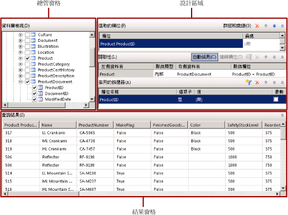
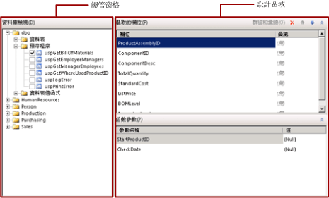

# 關聯式查詢設計工具使用者介面 (報表產生器)
  [!INCLUDE[ssBIDevStudioFull](../../includes/ssbidevstudiofull-md.md)]中的報表產生器和報表設計師同時提供圖形化查詢設計工具和以文字為基礎的查詢設計工具，可協助您建立查詢，用來指定從 [!INCLUDE[msCoName](../../includes/msconame-md.md)] [!INCLUDE[ssNoVersion](../../includes/ssnoversion-md.md)] 和 [!INCLUDE[msCoName](../../includes/msconame-md.md)] [!INCLUDE[ssSDS](../../includes/sssds-md.md)] relational databases 和 [!INCLUDE[msCoName](../../includes/msconame-md.md)] [!INCLUDE[ssDWCurrentFull](../../includes/ssdwcurrentfull-md.md)] 中針對報表資料集擷取的資料。 使用圖形化查詢設計工具來瀏覽中繼資料、以互動方式建立查詢以及檢視查詢的結果。 使用以文字為基礎的查詢設計工具來檢視圖形化查詢設計工具所建立的查詢，或是修改查詢。 您也可以從檔案或報表匯入現有的查詢。  
  
> [!NOTE]  
>  在報表產生器中，若要指定 Oracle、OLE DB、ODBC 和 Teradata 資料來源類型的查詢，您必須使用以文字為基礎的查詢設計工具。 如需詳細資訊，請參閱[以文字為基礎的查詢設計工具使用者介面 &#40;報表產生器&#41;](../../reporting-services/report-data/text-based-query-designer-user-interface-report-builder.md)。  
  
> [!IMPORTANT]  
>  當使用者建立與執行查詢時，可以存取資料來源。 您應該授與資料來源的最小權限，例如唯讀權限。  
  
## 圖形化查詢設計工具  
 在圖形化查詢設計工具中，您可以瀏覽資料庫資料表和檢視表、以互動方式建立 SQL SELECT 陳述式，以便指定要從中為資料集擷取資料的資料庫資料表和資料行。 您可以選擇要包含在資料集中的欄位，並選擇性地指定限制資料集中之資料的篩選。 您可以指定將篩選當做參數使用，並在執行階段提供篩選的值。 如果您選擇多個相關的資料表，查詢設計工具會描述兩個資料表集合之間的關聯性。  
  
 圖形化查詢設計工具分成三個區域。 根據查詢使用資料表/檢視表還是預存程序/資料表值函式而定，查詢設計工具的配置會有所不同。  
  
> [!NOTE]  
>  [!INCLUDE[ssDWCurrentFull](../../includes/ssdwcurrentfull-md.md)] 不支援預存程序或資料表值函數。  
  
 下圖顯示搭配資料表或檢視表使用時的圖形化查詢設計工具。  
  
   
  
 下圖顯示搭配預存程序或資料表值函式使用時的圖形化查詢設計工具。  
  
   
  
 下表會描述各個窗格的功能。  
  
 [資料庫檢視](#DatabaseView)  
 顯示資料表、檢視表、預存程序和資料表值函式的階層式檢視 (依照資料庫結構描述所組織)。  
  
 [選取的欄位](#SelectedFields)  
 顯示來自 [資料庫檢視] 窗格中選取之項目的資料庫欄位名稱清單。 這些欄位會成為報表資料集的欄位集合。  
  
 [函數參數](#FunctionParameters)  
 針對 [資料庫檢視] 窗格中的預存程序或資料表值函式顯示輸入參數的清單。  
  
 [關聯性](#Relationships)  
 顯示關聯性清單，這些關聯性是從 [資料庫檢視] 窗格中的資料表或檢視選取的欄位所推斷，或是顯示您手動建立的關聯性。  
  
 [套用的篩選](#AppliedFilters)  
 針對 [資料庫檢視] 窗格中的資料表或檢視表顯示欄位和篩選準則的清單。  
  
 [查詢結果](#QueryResults)  
 針對自動產生的查詢顯示結果集的範例資料。  
  
###   資料庫檢視窗格  
 [資料庫檢視] 窗格會顯示您有權檢視之資料庫物件的中繼資料，而這個權限是由資料來源連接和認證所決定。 階層式檢視會檢視依照資料庫結構描述所組織的資料庫物件。 您可以展開每個結構描述的節點，以便檢視資料表、檢視表、預存程序和資料表值函式。 您可以展開資料表或檢視表來顯示資料行。  
  
###   選取的欄位窗格  
 [選取的欄位] 窗格會顯示報表資料集中的欄位，以及查詢中要包含的群組和彙總。  
  
 以下為顯示的選項：  
  
-   **選取的欄位** ：顯示您為資料表或檢視表選取的資料庫欄位，或是預存程序或資料表值函式的輸入參數。 顯示在這個窗格中的欄位會成為報表資料集的欄位集合。  
  
     使用 [報表資料] 窗格檢視報表資料集的欄位集合。 這些欄位代表檢視報表時，您可以在資料表、圖表和其他報表項目中顯示的資料。  
  
-   **群組和彙總** ：在查詢中切換使用群組和彙總。 如果您在加入群組和彙總之後關閉群組和彙總功能，就會將它們移除。 **(無)** 這個字表示未使用群組和彙總。 如果您再次開啟群組和彙總功能，則會還原之前的群組和彙總。  
  
-   **刪除欄位** ：刪除選取的欄位。  
  
#### 群組和彙總  
 查詢包含大型資料表的資料庫可能會傳回對報表而言並不實用的大量資料列，並且對傳輸大量資料的網路以及處理報表的報表伺服器造成效能上的影響。 若要限制資料列的數目，查詢中可以包含 SQL 彙總，用來摘要資料庫伺服器上的資料。 SQL 彙總與用戶端彙總不同，後者是在轉譯報表時套用。  
  
 彙總會提供資料摘要，而資料會進行分組，以支援傳遞摘要資料的彙總。 當您在查詢中使用彙總時，查詢傳回的其他欄位會自動分組，且查詢會包含 SQL GROUP BY 子句。 您可以僅使用 [群組和彙總]  清單中的 [群組依據]  選項摘要資料，而不新增彙總。 許多彙總會包含使用 DISTINCT 關鍵字的版本。 包含 DISTINCT 可消除重複的值。  
  
 [!INCLUDE[msCoName](../../includes/msconame-md.md)] [!INCLUDE[ssNoVersion](../../includes/ssnoversion-md.md)] 使用 [!INCLUDE[tsql](../../includes/tsql-md.md)] 和 [!INCLUDE[msCoName](../../includes/msconame-md.md)] [!INCLUDE[ssDWCurrentFull](../../includes/ssdwcurrentfull-md.md)] 使用 [!INCLUDE[DWsql](../../includes/dwsql-md.md)]。 SQL 語言的這兩種方言都支援查詢設計工具提供的子句、關鍵字和彙總。  
  
 如需 [!INCLUDE[tsql](../../includes/tsql-md.md)] 的詳細資訊，請參閱 msdn.microsoft.com 上《[!INCLUDE[ssNoVersion](../../includes/ssnoversion-md.md)] [線上叢書》](https://go.microsoft.com/fwlink/?LinkId=141687)中的 [Transact-SQL 參考 &#40;資料庫引擎&#41;](../../t-sql/transact-sql-reference-database-engine.md)。  
  
 下表列出彙總並提供彙總的簡要說明。  
  
|Aggregate|Description|  
|---------------|-----------------|  
|Avg|傳回群組中值的平均值。 實作 SQL AVG 彙總。|  
|Count|傳回群組中的項目數。 實作 SQL COUNT 彙總。|  
|Count Big|傳回群組中的項目數。 它是 SQL COUNT_BIG 彙總。 COUNT 和 COUNT_BIG 之間的差異在於，COUNT_BIG 會固定傳回 **bigint** 資料類型的值。|  
|Min|傳回群組中的最小值。 實作 SQL MIN 彙總。|  
|Max|傳回群組中的最大值。 實作 SQL MAX 彙總。|  
|StDev|傳回群組中所有值的統計標準差。 實作 SQL STDEV 彙總。|  
|StDevP|傳回群組指定之運算式中所有值的母體統計標準差。 實作 SQL STDEVP 彙總。|  
|SUM|傳回群組中所有值的總和。 實作 SQL SUM 彙總。|  
|Var|傳回群組中所有值的統計變異數。 實作 SQL VAR 彙總。|  
|VarP|傳回群組中所有值的母體統計變異數。 實作 SQL VARP 彙總。|  
|Avg Distinct|傳回唯一平均值。 實作 AVG 彙總和 DISTINCT 關鍵字的組合。|  
|Count Distinct|傳回唯一計數。 實作 COUNT 彙總和 DISTINCT 關鍵字的組合。|  
|Count Big Distinct|傳回群組中項目的唯一計數。 實作 COUNT_BIG 彙總和 DISTINCT 關鍵字的組合。|  
|StDev Distinct|傳回唯一統計標準差。 實作 STDEV 彙總和 DISTINCT 關鍵字的組合。|  
|StDevP Distinct|傳回唯一統計標準差。 實作 STDEVP 彙總和 DISTINCT 關鍵字的組合。|  
|Sum Distinct|傳回唯一總和。 實作 SUM 彙總和 DISTINCT 關鍵字的組合。|  
|Var Distinct|傳回唯一統計變異數。 實作 VAR 彙總和 DISTINCT 關鍵字的組合。|  
|VarP Distinct|傳回唯一統計變異數。 實作 VARP 彙總和 DISTINCT 關鍵字的組合。|  
  
###   函數參數窗格  
 [函數參數] 窗格會顯示預存程序或資料表值函式的參數。 系統會顯示下列資料行：  
  
-   **參數名稱** ：顯示預存程序或資料表值函式所定義之參數的名稱。  
  
-   **值** ：在設計階段執行查詢時，用於參數的值，以便擷取要顯示於 [查詢結果] 窗格中的資料。 在執行階段執行報表時，不會使用這個值。  
  
###   關聯性窗格  
 [關聯性] 窗格會顯示聯結關聯性。 關聯性可以從擷取自資料庫中繼資料的外部索引鍵關聯性自動偵測，您也可以手動建立關聯性。  
  
 以下為顯示的選項：  
  
-   **自動偵測** ：在資料表之間自動建立關聯性的自動偵測功能。 如果開啟自動偵測，查詢設計工具就會從資料表中的外部索引鍵建立關聯性；否則，您必須手動建立關聯性。 當您在 [資料庫檢視]  窗格中選取資料表時，自動偵測會自動嘗試建立關聯性。 如果您在手動建立聯結之後開啟自動偵測，則會捨棄這些聯結。  
  
    > [!IMPORTANT]  
    >  搭配 [!INCLUDE[ssDWCurrentFull](../../includes/ssdwcurrentfull-md.md)] 使用時，並不會提供建立聯結所需的中繼資料，而且無法自動偵測關聯性。 如果您的查詢從 [!INCLUDE[ssDWCurrentFull](../../includes/ssdwcurrentfull-md.md)]擷取資料，則所有資料表聯結都必須手動建立。  
  
-   **新增關聯性**：將關聯性新增至 [關聯性]  清單。  
  
     如果開啟自動偵測，包含查詢中所使用資料行的資料表會自動新增至 [關聯性]  清單。 當自動偵測識別出兩個資料表彼此相關時，其中一個資料表會新增至 [左側資料表]  資料行，另一個則會新增至 [右側資料表]  資料行，並且在兩個資料表之間建立內部聯結。 每一項關聯性都會在查詢中產生 JOIN 子句。 如果資料表彼此不相關，則所有資料表都會列入 [左側資料表]  資料行中，且 [聯結類型]  資料行會指出資料表彼此不相關。 當自動偵測開啟時，您無法在自動偵測判定為彼此不相關的資料表之間手動加入關聯性。  
  
     如果關閉自動偵測，您就可以加入並改變資料表之間的關聯性。 按一下 [編輯欄位]  ，即可指定用來聯結兩個資料表的欄位。  
  
     關聯性出現在 [關聯性]  清單中的順序，就是聯結在查詢中執行的順序。 您可以在清單中上下移動關聯性來改變其順序。  
  
     在查詢中使用多項關聯性時，每項關聯性 (但不包括第一項關聯性) 的其中一個資料表必須是後續關聯性中的參照。  
  
     如果某一項關聯性的前一項關聯性參考其中的兩個資料表，則該項關聯性不會產生個別的聯結子句；而是聯結條件會加入至為前一項關聯性產生的聯結子句。 聯結類型是由參考相同資料表的前一項關聯性推斷。  
  
-   **編輯欄位**：開啟 [編輯相關欄位]  對話方塊，您可以在其中新增和修改資料表之間的關聯性。 您已在右側和左側資料表中選擇要聯結的欄位。 您可以聯結左側資料表和右側資料表中的多個欄位，以便在關聯性中指定多項聯結條件。 聯結左側和右側資料表的兩個欄位不需要擁有相同名稱。 聯結的欄位必須具有相容的資料類型。  
  
-   **刪除關聯性**  ：刪除選取的關聯性 **。**  
  
-   **上移**和**下移**：在 [關聯性]  清單中上下移動關聯性。 關聯性在查詢中放置的順序可能會影響查詢的結果。 關聯性是依照出現在 [關聯性]  清單中的順序新增至查詢。  
  
 系統會顯示下列資料行：  
  
-   **左側資料表** ：顯示屬於聯結關聯性一部分之第一份資料表的名稱。  
  
-   **聯結類型** ：顯示在自動產生之查詢中使用的 SQL JOIN 陳述式類型。 根據預設，如果系統偵測到外部索引鍵條件約束，就會使用 INNER JOIN。 其他聯結類型可以是 LEFT JOIN 或 RIGHT JOIN。 如果這些聯結類型都不適用，則 [聯結類型]  資料行會顯示 [不相關]  。 針對不相關的資料表不會建立任何 CROSS JOIN 聯結；您必須透過聯結左側和右側資料表中的資料行，手動建立關聯性。 如需 JOIN 類型的詳細資訊，請參閱 msdn.microsoft.com 上《 [!INCLUDE[ssNoVersion](../../includes/ssnoversion-md.md)] [線上叢書》](https://go.microsoft.com/fwlink/?LinkId=141687) 中的＜JOIN 基礎觀念＞。  
  
-   **右側資料表** ：顯示聯結關聯性中第二份資料表的名稱。  
  
-   **聯結欄位** ：列出聯結的欄位組，如果關聯性有多個聯結條件，則會以逗號 (,) 分隔聯結的欄位組。  
  
###   套用的篩選窗格  
 [套用的篩選器] 窗格會顯示用來限制在執行階段擷取之資料列數目的準則。 此窗格中指定的準則會用來產生 SQL WHERE 子句。 當您選取參數選項時，就會自動建立報表參數。 以查詢參數為基礎的報表參數可讓使用者指定查詢的值，以便控制報表中的資料。  
  
 系統會顯示下列資料行：  
  
-   **欄位名稱** ：顯示要套用準則的欄位名稱。  
  
-   **運算子** ：顯示要在篩選運算式中使用的作業。  
  
-   **值** ：顯示要在篩選運算式中使用的值。  
  
-   **參數** ：顯示要將查詢參數加入至查詢的選項。 您可以使用資料集屬性來檢視查詢參數與報表參數之間的關聯性。  
  
###   查詢結果窗格  
 [查詢結果] 窗格會針對其他窗格中之選取項目所指定的自動產生查詢顯示結果。 結果集中的資料行就是您在 [選取的欄位] 窗格中指定的欄位，而且資料列資料是由您在 [套用的篩選] 窗格中指定的篩選所限制。 如果查詢包含彙總，結果集就會包含新的彙總資料行。 例如，如果 **Color** 資料行是使用 Count 彙總進行彙總，則查詢結果會包含新的資料行。 依預設，此資料行的名稱為 **Count_Color**。  
  
 這項資料代表您執行查詢時來自資料來源的值。 這項資料不會儲存在報表定義中。報表中的實際資料是在處理報表時擷取的。  
  
 從資料來源中擷取資料的順序會決定結果集中的排序次序。 不過，您可以透過修改查詢，或在擷取報表的資料之後，變更排序次序。  
  
### 圖形化查詢設計工具工具列  
 關聯式查詢設計工具的工具列會提供下列按鈕來協助您指定或檢視查詢的結果。  
  
|按鈕|Description|  
|------------|-----------------|  
|**當成文字編輯**|切換至以文字為基礎的查詢設計工具，以便檢視自動產生的查詢，或是修改查詢。|  
|**匯入**|從檔案或報表匯入現有的查詢。 支援 .sql 和 .rdl 檔案類型。|  
|**執行查詢**|執行查詢。 [查詢結果] 窗格會顯示結果集。|  
  
## 了解自動產生的查詢  
 當您在 [資料庫檢視] 窗格中選取資料表和資料行或預存程序和檢視表時，查詢設計工具就會從資料庫結構描述中擷取基礎主索引鍵和外部索引鍵關聯性。 查詢設計工具會透過分析這些關聯性，偵測兩個資料表之間的關聯性，並且將聯結加入至查詢。 然後您就可以加入群組和彙總、加入或變更關聯性以及加入篩選，藉此修改查詢。 按一下 [當成文字編輯]  ，即可檢視查詢文字，該文字會顯示要從中擷取資料的資料行、資料表之間的聯結，以及所有群組或彙總。  
  
## 以文字為基礎的查詢設計工具  
 若要對查詢擁有最佳控制權，請使用以文字為基礎的查詢設計工具。 若要切換至以文字為基礎的查詢設計工具，請按一下工具列中的 [當成文字編輯]  。 您在以文字為基礎的查詢設計工具中編輯查詢之後，就無法再使用關聯式查詢設計工具。 之後，查詢永遠都會在以文字為基礎的查詢設計工具中開啟。 如需詳細資訊，請參閱[以文字為基礎的查詢設計工具使用者介面 &#40;報表產生器&#41;](../../reporting-services/report-data/text-based-query-designer-user-interface-report-builder.md)。  
  
## 另請參閱  
 [查詢設計工具 &#40;SSRS&#41;](query-design-tools-ssrs.md)  
  
  
