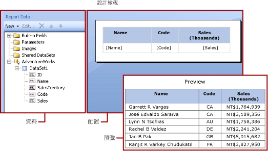

# 報表資料集 (SSRS)
  若要將資料加入至報表中，您要建立資料集。 每個資料集都表示從資料來源執行查詢命令而得到的結果集。 結果集中的資料行為欄位集合。 結果集中的資料列則為資料。 資料集不包含實際資料。 資料集包含從資料來源擷取一組特定資料所需的資訊。  
  
 資料集有兩種類型：內嵌和共用。 內嵌資料集是在報表中定義，而且只能供該報表使用。 共用資料集則是在報表伺服器或 SharePoint 網站上定義，而且可供多份報表使用。 在報表產生器中，您可以在 [共用資料集] 模式中建立共用資料集，或在 [報表設計師] 模式中建立內嵌資料集。 在 [!INCLUDE[ssBIDevStudioFull](../../includes/ssbidevstudiofull-md.md)]的報表設計師中，您可以建立共用資料集做為專案的一部分，或建立內嵌資料集做為報表的一部分。  
  
-   **內嵌資料集。** 與您直接在工作表中處理資料的應用程式 (例如 [!INCLUDE[msCoName](../../includes/msconame-md.md)] Office Excel) 不同，在報表產生器或報表設計師中，您將會使用中繼資料，其代表會在處理報表時才擷取資料。 若要建立內嵌資料集，請選取資料來源並指定一個查詢。 建立資料集之後，使用 [報表資料] 窗格檢視欄位集合。 您可以在資料區 (例如資料表或圖表) 中顯示來自資料集的資料。 在每個資料區中，您可以對資料進行分組、篩選和排序，以便組織資料。 當您設計報表配置之後，可以執行報表以查看實際的資料。  
  
     在下表中，[報表資料] 窗格會在資料集欄位集合中顯示一個名稱為 [!INCLUDE[ssSampleDBUserInputNonLocal](../../includes/sssampledbuserinputnonlocal-md.md)]的資料來源、一個為名稱為 DataSet1 的資料集，以及 5 個欄位。 [配置] 窗格會顯示一個資料表，其中頂端資料列為資料行標題，而底部資料列則為包含文字的資料表資料格。 預留位置文字 [Name] 是 [名稱] 欄位的中繼資料。 當報表執行時，預留位置文字會由實際資料值取代。 資料表會視需要展開，以顯示所有資料。  
  
       
  
-   **共用資料集。** 當您想要在多個報表中使用資料集時，請建立共用資料集。 若要建立共用資料集並將其儲存至報表伺服器或 SharePoint 網，請在共用資料集設計檢視中使用報表產生器。 若要建立共用資料集做為可部署到伺服器或網站之專案的一部分，請使用報表設計師。  
  
     下圖顯示報表產生器中的共用資料集設計檢視。 您可以選取或修改資料連接、資料集屬性、查詢、篩選，以及將篩選選擇性地標示為參數，並檢視查詢結果。 接著，您可以將變更存回伺服器或網站。  
  
       
  
 如需詳細資訊，請參閱[內嵌和共用資料集 &#40;報表產生器及 SSRS&#41;](../../reporting-services/report-data/embedded-and-shared-datasets-report-builder-and-ssrs.md) 和[內嵌和共用資料連接或資料來源 &#40;報表產生器及 SSRS&#41;](http://msdn.microsoft.com/library/f417782c-b85a-4c4d-8a40-839176daba56)。  
  
 您也可以透過加入包含相依資料集的報表組件，將資料集加入至報表中。 [!INCLUDE[ssRBrptparts](../../includes/ssrbrptparts-md.md)]  
  
 若要了解如何建立報表，以顯示 [!INCLUDE[ssNoVersion](../../includes/ssnoversion-md.md)] 資料庫的資料，請參閱[教學課程︰建立基本資料表報表 &#40;報表產生器&#41;](../../reporting-services/tutorial-creating-a-basic-table-report-report-builder.md)。 若要建立包括自己本身資料的報表，請參閱[教學課程︰離線建立快速圖表報表 &#40;報表產生器&#41;](../../reporting-services/report-builder/tutorial-create-a-quick-chart-report-offline-report-builder.md)。  
  
> [!NOTE]  
>  [!INCLUDE[ssRBRDDup](../../includes/ssrbrddup-md.md)]  
  
##   加入報表資料  
 在報表產生器中，您可以使用下列方式加入報表資料。  
  
-   將報表組件從報表伺服器加入至報表中。 每個報表組件都是獨立的，並包含相依的資料集。 系統會預先定義資料集。  
  
-   使用資料表/矩陣、圖表和地圖精靈。 您可以從這些精靈選取共用資料來源與共用資料集，或建立新資料集，然後繼續設計報表。  
  
-   從報表伺服器加入共用資料集。 共用資料集是預先定義的，而且會從預先定義的資料來源指定要使用的資料。 當您將共用資料集加入至報表時，您會加入一個指向共用資料集定義的資料集參考。  
  
 在報表產生器或報表設計師中，您可以使用下列方式加入報表資料。  
  
-   根據共用資料來源加入內嵌資料集。  
  
-   根據內嵌資料來源加入內嵌資料集。  
  
> [!NOTE]  
>  在報表伺服器上，系統會透過個別方式，或透過繼承發行共用項目所在資料夾的權限來保護共用項目。 若要讓其他使用者可以存取您所儲存的共用資料集，您必須了解如何授予權限。 如需詳細資訊，請參閱[安全性 &#40;報表產生器&#41;](../../reporting-services/report-builder/security-report-builder.md) 或[保護共用資料集項目的安全](../../reporting-services/security/secure-shared-dataset-items.md)。  
  
 將資料加入至報表之後，您可以利用資料區組織報表頁面上的資料、修改報表組件並與其他人共用這些變更，以及讓使用者限制或排序他們在報表中所看到的資料。 如需詳細資訊，請參閱下列相關主題：  
  
-   [資料表、矩陣和清單 &#40;報表產生器及 SSRS&#41;](../../reporting-services/report-design/tables-matrices-and-lists-report-builder-and-ssrs.md)  
  
-   [圖表 &#40;報表產生器及 SSRS&#41;](../../reporting-services/report-design/charts-report-builder-and-ssrs.md)  
  
-   [走勢圖和資料橫條 &#40;報表產生器及 SSRS&#41;](../../reporting-services/report-design/sparklines-and-data-bars-report-builder-and-ssrs.md)  
  
-   [指標 &#40;報表產生器及 SSRS&#41;](../../reporting-services/report-design/indicators-report-builder-and-ssrs.md)  
  
-   [報表參數 &#40;報表產生器和報表設計師&#41;](../../reporting-services/report-design/report-parameters-report-builder-and-report-designer.md)  
  
-   [報表組件 &#40;報表產生器及 SSRS&#41;](../../reporting-services/report-design/report-parts-report-builder-and-ssrs.md)  
  
-   [篩選、分組和排序資料 &#40;報表產生器及 SSRS&#41;](../../reporting-services/report-design/filter-group-and-sort-data-report-builder-and-ssrs.md)  
  
  
##   加入包含報表組件的資料  
 報表組件包含它們所相依的資料集。 這些資料集是在報表伺服器上提供的共用資料來源上建立的。 在報表產生器中，當您將報表組件加入至報表時，相依的資料集也會加入到報表中，就像您手動加入它們一樣。 例如，預先定義的圖表包含資料集。 若要查看資料，請預覽報表。  
  
> [!NOTE]  
>  [!INCLUDE[ssRBrptparts](../../includes/ssrbrptparts-md.md)]  
  
 報表組件、共用資料來源與共用資料集是事先定義的，並儲存在報表伺服器中。 若要存取它們，您必須在伺服器模式下，連接到報表伺服器以開啟報表產生器。 如果您有伺服器的寫入權限，可以使用這些項目來建立您自己的新版本。  
  
-   如需詳細資訊，請參閱[報表組件 &#40;報表產生器及 SSRS&#41;](../../reporting-services/report-design/report-parts-report-builder-and-ssrs.md) 和[報表設計師中的報表組件 &#40;SSRS&#41;](../../reporting-services/report-design/report-parts-in-report-designer-ssrs.md)。  
  
  
##   查詢和查詢設計工具  
 若要指定資料來源中所需的資料，您要建立一個查詢命令。 每種資料來源類型都會提供一個相關的 *「查詢設計工具」* (Query Designer) 來協助您建立查詢。 查詢設計工具可以是圖形化或以文字為基礎。 在圖形化查詢設計工具中，您可以檢視代表外部資料來源之資料的中繼資料，並將欄位或項目拖曳到查詢設計介面，以互動方式建立查詢。 在以文字為基礎的查詢設計工具中，您可以使用外部資料來源支援的查詢語法撰寫或匯入查詢。  
  
 在查詢設計工具中，您可以執行查詢來檢視範例資料並驗證查詢命令語法。 在結果集中的資料行名稱會變成您在 [報表資料] 窗格中看到的欄位名稱。 結果集必須是單一一組資料列和資料行，其中每個資料列都有相同數目的值。 不支援來自單一查詢的多個結果集。 不支援沒有固定資料行數目，而且每個資料列可能產生不同資料值數目的不完全階層。  
  
 若要執行查詢，您必須要有設計階段的認證。 如需詳細資訊，請參閱[在報表產生器中指定認證](http://msdn.microsoft.com/library/7412ce68-aece-41c0-8c37-76a0e54b6b53)和[資料連線、資料來源及連接字串 &#40;報表產生器及 SSRS&#41;](../../reporting-services/report-data/data-connections-data-sources-and-connection-strings-report-builder-and-ssrs.md)。  
  
 資料延伸模組和外部資料來源之間的通訊是由資料提供者處理。 查詢命令語法、查詢參數，以及結果集中之值資料類型的支援取決於每個資料提供者。 如需詳細資訊，請參閱特定資料延伸模組類型的主題和[查詢設計工具 &#40;報表產生器&#41;](http://msdn.microsoft.com/library/553f0d4e-8b1d-4148-9321-8b41a1e8e1b9)。  
  
  
##   如何主題  
 [加入及驗證資料連接 &#40;報表產生器及 SSRS&#41;](../../reporting-services/report-data/add-and-verify-a-data-connection-report-builder-and-ssrs.md)  
  
 [建立共用資料集或內嵌資料集 &#40;報表產生器及 SSRS&#41;](../../reporting-services/report-data/create-a-shared-dataset-or-embedded-dataset-report-builder-and-ssrs.md)  
  
 [加入、編輯、重新整理報表資料窗格中的欄位 &#40;報表產生器及 SSRS&#41;](../../reporting-services/report-data/add-edit-refresh-fields-in-the-report-data-pane-report-builder-and-ssrs.md)  
  
 [在關聯式查詢設計工具中建立查詢 &#40;報表產生器及 SSRS&#41;](../../reporting-services/report-data/build-a-query-in-the-relational-query-designer-report-builder-and-ssrs.md)  
  
 [針對多維度資料的參數值顯示隱藏的資料集 &#40;報表產生器及 SSRS&#41;](../../reporting-services/report-data/show-hidden-datasets-for-parameter-values-multidimensional-data.md)  
  
 [將篩選加入至資料集 &#40;報表產生器及 SSRS&#41;](../../reporting-services/report-data/add-a-filter-to-a-dataset-report-builder-and-ssrs.md)  
  
 [在資料區域中設定沒有資料的訊息 &#40;報表產生器及 SSRS&#41;](../../reporting-services/report-data/set-a-no-data-message-for-a-data-region-report-builder-and-ssrs.md)  
  
 [將查詢參數與報表參數產生關聯 &#40;報表產生器及 SSRS&#41;](../../reporting-services/report-data/associate-a-query-parameter-with-a-report-parameter-report-builder-and-ssrs.md)  
  
 [在 Analysis Services 的 MDX 查詢設計工具中定義參數 &#40;報表產生器及 SSRS&#41;](../../reporting-services/report-data/define-parameters-in-the-mdx-query-designer-for-analysis-services.md)  
  
  
##   本節內容  
 [報表產生器中的報表組件和資料集](../../reporting-services/report-data/report-parts-and-datasets-in-report-builder.md)  
  
 [報表產生器中的資料連接、資料來源及連接字串](http://msdn.microsoft.com/library/7e103637-4371-43d7-821c-d269c2cc1b34)  
  
 [在報表產生器中指定認證](http://msdn.microsoft.com/library/7412ce68-aece-41c0-8c37-76a0e54b6b53)  
  
 [報表內嵌資料集和共用資料集 &#40;報表產生器及 SSRS&#41;](../../reporting-services/report-data/report-embedded-datasets-and-shared-datasets-report-builder-and-ssrs.md)  
  
 [資料集欄位集合 &#40;報表產生器及 SSRS&#41;](../../reporting-services/report-data/dataset-fields-collection-report-builder-and-ssrs.md)  
  
  
## 另請參閱  
 [報表設計檢視 &#40;報表產生器&#41;](../../reporting-services/report-builder/report-design-view-report-builder.md)   
 [報表撰寫概念 &#40;報表產生器及 SSRS&#41;](../../reporting-services/report-design/report-authoring-concepts-report-builder-and-ssrs.md)  
  
  
