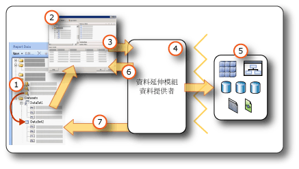

# <a name="report-embedded-datasets-and-shared-datasets-report-builder-and-ssrs"></a>報表內嵌資料集和共用資料集 (報表產生器及 SSRS)
  資料集會從資料連接指定您要使用的資料。 資料集是以報表中儲存為內嵌資料來源或報表伺服器上共用資料來源參考的資料連接為基礎。 資料集包含指定一組欄位的查詢。 當您將這些欄位拖曳至設計介面時，您可以建立報表執行時評估為實際資料的運算式。  
  
 資料集有以下兩種不同的類型：  
  
-   **共用資料集。** 共用資料集定義於報表伺服器上。 您可以瀏覽到伺服器以建立共用資料集，或選取要加入至報表中的預先定義資料集。 您可以使用共用資料集來提供多個報表能夠使用的查詢。 共用資料集會儲存在報表伺服器上，並且與報表或共用資料來源分開管理。 例如，報表伺服器管理員可能會更新查詢以利用改善的索引或其他最佳化查詢效能的方法。  
  
-   **內嵌資料集。** 內嵌資料集定義於其內嵌的報表中，且只有內嵌了該資料集的報表才可加以使用。 如果您要從外部資料來源取得資料，並且僅用於一個報表中，則使用內嵌資料集。 當您想要建立的查詢沒有其他相依性而且不需要用於多個報表時，內嵌資料集將會很實用。  
  
 資料集也包含參數、篩選和資料選項，這些選項會指定字元特性，例如大小寫、假名類型、寬度、腔調字及定序資訊。  
  
   
  
1.  **報表資料窗格中的資料集** ：在您建立內嵌資料集或加入共用資料集之後，[報表資料] 窗格中就會出現資料集。 資料集是以資料來源為基礎。  
  
2.  **查詢設計工具** ：當您設計資料集查詢時，與資料來源類型相關聯的查詢設計工具便會開啟。  
  
3.  **查詢命令** ：查詢設計工具可協助您建立查詢命令。 命令語法是由資料提供者決定。  
  
4.  **資料延伸模組/資料提供者** ：資料可經由多個資料存取層連接。  
  
5.  **外部資料來源** ：從關聯式資料庫、多維資料庫、SharePoint 清單、Web 服務或報表模型擷取資料。  
  
6.  **查詢結果** ：您可以執行查詢並查看範例結果集。 您必須擁有設計階段認證，才能執行查詢。  
  
7.  **來自結構描述的中繼資料** ：資料提供者會將結構描述查詢命令與查詢分開執行，以擷取資料集欄位集合的中繼資料。 例如， [!INCLUDE[tsql](../../includes/tsql-md.md)] **SELECT** 陳述式會傳回資料庫資料表的資料行名稱。 使用 [報表資料] 窗格展開資料集，即可檢視資料集欄位集合。  
  
 資料也可以使用預先定義的共用資料集和報表組件併入報表中。 這些項目已經有您所需的資料連接資訊。 如需詳細資訊，請參閱[報表資料集 &#40;SSRS&#41;](../../reporting-services/report-data/report-datasets-ssrs.md) 和[報表組件 &#40;報表產生器及 SSRS&#41;](../../reporting-services/report-design/report-parts-report-builder-and-ssrs.md)。  
  
 如需內建資料來源類型和資料延伸模組的詳細資訊，請參閱[從外部資料來源加入資料 &#40;SSRS&#41;](../../reporting-services/report-data/add-data-from-external-data-sources-ssrs.md)。  
  
> [!NOTE]  
>  [!INCLUDE[ssRBRDDup](../../includes/ssrbrddup-md.md)]  
  
##  <a name="Overview"></a> 了解報表資料集與查詢  
 報表資料集包含的查詢命令可在外部資料來源上執行，並指定要擷取的資料。 若要建立查詢指令，您可以使用與外部資料來源之資料延伸模組相關聯的查詢設計工具。 在查詢設計工具中，您可以執行查詢命令並檢視結果集。 結果集是一個矩形資料列集，其中的資料行名稱和資料列在每個資料列中都有相同數目的值。 不支援階層式資料，也稱為 *「不完全階層」*(Ragged Hierarchy)。 資料行名稱會當做資料集欄位的清單儲存在報表定義中。  
  
 將資料集加入至報表後，您可以將欄位從 [報表資料] 窗格中的欄位集合拖曳至資料表、圖表，以及您用來設計報表配置的其他報表項目。 如需使用欄位的詳細資訊，請參閱 [資料集欄位集合 &#40;報表產生器及 SSRS&#41;](../../reporting-services/report-data/dataset-fields-collection-report-builder-and-ssrs.md)。  
  
### <a name="understanding-data-from-a-report-dataset"></a>了解報表資料集的資料  
 根據資料延伸模組，報表資料集可由下列類型的資料組成：  
  
-   來自關聯式資料庫的結果集，這可能是從執行資料庫命令、預存程序或使用者定義函數而產生。 如果透過單一查詢擷取多個結果集，則系統只會處理第一個結果集，而且會忽略其他所有結果集。 例如，當您在以文字為基礎的查詢設計工具中執行下列查詢時，只有 `Production.Product` 的結果集會出現在結果窗格中：  
  
    ```  
    SELECT ProductID FROM Production.Product  
    GO  
    SELECT ContactID FROM Person.Contact  
    ```  
  
-   來自多維度資料來源的扁平化資料列集，該資料來源使用 XML for Analysis (XMLA) 通訊協定。 某些資料提供者會提供來自資料來源的其他資料格和維度屬性，您無法在結果集中看到這些屬性，但是可以在報表中使用。  
  
-   來自 XML 資料來源的扁平化結果集，這些資料來源包括 XML 元素、其屬性及其子元素。  
  
-   來自任何已註冊並已設定之 [!INCLUDE[dnprdnshort](../../includes/dnprdnshort-md.md)] 資料提供者的結果集。  
  
-   來自已針對特定資料來源設計之報表模型的資料，其中包含預先定義的實體、實體關聯性以及欄位。 如需詳細資訊，請參閱《SQL Server 線上叢書》中 [Reporting Services 文件集](http://go.microsoft.com/fwlink/?linkid=121312) 的＜使用報表模型當做資料來源＞。  
  
 當報表在執行階段處理時，針對查詢傳回的實際結果集可能擁有零或多個資料列。 在查詢中定義的資料行也可能從資料來源遺失。 來自資料來源的 Null 值會對應到 [!INCLUDE[dnprdnshort](../../includes/dnprdnshort-md.md)] 值 **System.DBNull.Value**。  
  
 如需資料集欄位的詳細資訊，請參閱 [資料集欄位集合 &#40;報表產生器及 SSRS&#41;](../../reporting-services/report-data/dataset-fields-collection-report-builder-and-ssrs.md)。  
  
### <a name="dataset-query"></a>資料集查詢  
 當您在設計階段，於查詢設計工具中執行資料集查詢時，您會從資料來源看到一個顯示範例資料的資料列集。 當使用者在執行階段檢視報表時，資料集查詢可能會產生不同的值，因為資料來源上的資料已變更。 每次處理報表時，新的資料可能就會出現。  
  
 當您定義每個資料集時，報表產生器就會開啟對應到資料來源類型的查詢設計工具，來協助您設計查詢。 例如，若要從 SQL Server 關聯式資料庫定義資料的查詢，「資料表/矩陣精靈」、「圖表精靈」和「地圖精靈」會開啟一個簡單的圖形化介面，協助您建立查詢；您需要做的只有選取資料集中您要的欄位。  
  
 在查詢設計工具中，您可以進行下列作業：  
  
-   在圖形化查詢檢視與以文字為基礎的查詢檢視之間切換。 使用圖形化查詢檢視瀏覽資料來源上的結構描述、資料表、檢視表及預存程序。 使用以文字為基礎的檢視來輸入、貼上或檢視通常用於複雜查詢的現有查詢，這種查詢無法顯示在圖形化查詢設計工具中。 例如，您可以從 [!INCLUDE[tsql](../../includes/tsql-md.md)] (.sql) 檔案、報表伺服器上的不同報表，或檔案共用中的報表定義 (.rdl) 檔匯入查詢。  
  
-   執行查詢，以便查看資料。 查詢會傳回結果集。 結果集中的資料行會成為資料集的欄位集合。 結果中的資料列會成為資料集的資料。 您可以持續使用此查詢，直到取得所需的資料行為止。  
  
-   加入查詢參數，以便協助單獨擷取想要用於報表的資料。 查詢參數會自動產生相符的報表參數。 若是報表模型資料來源，您指定的篩選會自動產生相符的報表參數。 報表參數可讓使用者指定執行報表時想要查看的報表資料。 例如，使用者會選取他們希望資料所屬的產品類別目錄，因此在報表執行時，只有那些產品類別目錄的資料會出現在報表中。  
  
-   從其他報表匯入現有的查詢。  
  
 根據資料來源類型，查詢設計工具可以提供圖形模式或文字模式。 如果您選擇文字模式，您必須為資料來源使用適當的查詢語法。  
  
 當您定義報表資料集時，您可以在查詢中設定資料屬性，或接受由資料提供者所設定的預設值。 您可以使用下列其中一個策略來變更資料類型：  
  
-   重新撰寫資料集查詢，將欄位特別轉換為不同的資料類型。  
  
-   編輯資料集中的欄位，並提供自訂格式。  
  
-   根據資料集欄位建立新的自訂欄位，並提供自訂格式。  
  
 如需詳細資訊，請參閱 [資料集欄位集合 &#40;報表產生器及 SSRS&#41;](../../reporting-services/report-data/dataset-fields-collection-report-builder-and-ssrs.md)。  
  
### <a name="importing-existing-queries-for-a-dataset"></a>匯入資料集的現有查詢  
 建立資料集時，您可以建立新的查詢，也可以從檔案或其他報表匯入現有的查詢。 從其他報表匯入查詢時，您可以選擇要從報表中資料集之清單匯入的查詢。  
  
 系統只支援 .sql 和 .rdl 檔案類型。 多維度運算式 (MDX) 查詢、資料採礦預測 (DMX) 查詢以及模型查詢 (SMQL) 只能由相關聯的查詢設計工具產生。  
  
##  <a name="Compare"></a> 比較和建立共用資料集與內嵌資料集  
 內嵌資料集是在報表或已發行的報表組件中定義的。 對內嵌資料集所做的變更只會影響該報表或該報表組件。  
  
 共用資料集是在報表伺服器或 SharePoint 網站上定義、以共用資料來源為基礎，而且可由多個報表及報表組件使用。 對共用資料集定義所做的變更會影響使用該定義的所有報表和所有報表組件。  
  
 當您將共用資料集加入至報表時，系統會將資料集欄位集合更新為報表伺服器上目前的定義。 在報表伺服器上進行變更時，您不會收到更新通知。 若要同步處理欄位集合的本機複本與在報表伺服器上對共用資料集定義所做的變更，您必須重新整理本機欄位集合。 如需詳細資訊，請參閱[加入、編輯、重新整理報表資料窗格中的欄位 &#40;報表產生器及 SSRS&#41;](../../reporting-services/report-data/add-edit-refresh-fields-in-the-report-data-pane-report-builder-and-ssrs.md)。  
  
 已發行的報表項目包含相依的內嵌資料集和共用資料集。 如需詳細資訊，請參閱 [報表產生器中的報表組件和資料集](../../reporting-services/report-data/report-parts-and-datasets-in-report-builder.md)。  
  
 內嵌與共用資料來源之間的差異在於建立、儲存和管理的方式。 下表摘要列出內嵌與共用資料來源之間的差異：  
  
|Description|內嵌<br /><br /> 資料來源|共用<br /><br /> 資料來源|  
|-----------------|------------------------------|----------------------------|  
|資料連接會內嵌在報表定義中。|||  
|報表伺服器上資料連接的指標會內嵌在報表定義中。|||  
|在報表伺服器上管理|||  
|共用資料集所需|||  
|元件所需|||  
  
 在報表設計師中，您可以建立共用資料集做為報表專案的一部分，以及控制是否要將它們部署至報表伺服器。 但是，您無法瀏覽至報表伺服器，然後選取要加入至報表的共用資料集。  
  
 在報表產生器中，您可以執行下列作業：  
  
-   若要建立共用資料集，請使用共用資料集設計檢視。 您可以將它儲存至報表伺服器或 SharePoint 網站，以便與其他報表共用。 您也可以瀏覽至報表伺服器，然後編輯現有的共用資料集。 在此檢視中，您可以建立查詢並設定所有資料集選項。 如需詳細資訊，請參閱[共用資料集設計檢視 &#40;報表產生器&#41;](../../reporting-services/report-builder/shared-dataset-design-view-report-builder.md)。  
  
-   若要將共用資料集加入至報表，請在 [報表設計檢視] 中開啟報表產生器。 從精靈或 [報表資料] 窗格中，瀏覽到報表伺服器，並選取您要加入至報表的共用資料集。 在此檢視中，除非加入欄位，否則您無法變更查詢。 您可以覆寫其他資料選項和加入篩選。 不過不能移除篩選。  
  
 下表比較可在報表伺服器上針對共用資料集的定義設定的屬性，以及針對報表定義中共用資料集的執行個體設定的屬性。  
  
|屬性|定義的設定注意事項|執行個體的設定注意事項|  
|--------------|--------------------------------------------|------------------------------------------|  
|查詢文字|設定查詢，包括將它定義為運算式。|無法變更查詢。|  
|查詢參數|無法參考報表參數<br /><br /> 包含預設值<br /><br /> 包含唯讀旗標|設定未在定義中標記為唯讀的參數|  
|篩選|定義篩選|無法檢視或變更屬於定義之一部分的資料集篩選<br /><br /> 可以建立其他篩選|  
|資料來源|必須為共用資料來源|無法變更資料來源|  
|欄位|來自查詢命令的欄位<br /><br /> 導出欄位不屬於資料集定義的一部分|檢視欄位，但是無法變更欄位<br /><br /> 根據您將共用資料集加入至報表時的查詢，欄位集合是靜態的。 若要更新，請按一下 **[資料集屬性]** 對話方塊中的 **[重新整理欄位]** 。 實際的欄位集合是定義中目前的查詢所傳回的任何內容。<br /><br /> 加入導出欄位|  
|資料集|資料選項，例如區分大小寫|覆寫執行個體中的資料選項|  
  
 如需建立資料集的詳細資訊，請參閱《SQL Server 線上叢書》中 [Reporting Services 文件](http://go.microsoft.com/fwlink/?linkid=121312)的[建立共用資料集或內嵌資料集 &#40;報表產生器及 SSRS&#41;](../../reporting-services/report-data/create-a-shared-dataset-or-embedded-dataset-report-builder-and-ssrs.md) 和 [Reporting Services 工具](../../reporting-services/tools/reporting-services-tools.md)。  
  
##  <a name="SortGroupFilter"></a> 篩選、排序及分組資料集中的資料  
 資料集中的資料是在外部資料來源上執行查詢命令而產生的。 資料延伸模組的查詢命令語法會決定是否可以排序或分組資料。 排序與分組要在擷取報表的資料前，於查詢中進行。 篩選則在擷取報表的資料之後進行。  
  
 如需詳細資訊，請參閱 [篩選、分組和排序資料 &#40;報表產生器及 SSRS&#41;](../../reporting-services/report-design/filter-group-and-sort-data-report-builder-and-ssrs.md)(將互動式排序加入資料表或矩陣 (報表產生器及 SSRS))。  
  
### <a name="filtering-data-in-a-dataset"></a>篩選資料集中的資料  
 篩選在報表中屬於資料集定義的一部分。 使用資料集篩選從資料集指定要包含在報表中的資料。 當您在資料集上指定篩選時，以資料集為基礎的所有資料區只會顯示通過資料集篩選的資料。  
  
 篩選是共用資料集定義的一部分。 共用資料集篩選會影響包含共用資料集的所有報表。 將共用資料集加入至報表後，或加入包含相依共用資料集的元件之後，您可以建立其他資料集篩選。 您建立的篩選僅能用於您的報表，它們不屬於報表伺服器上共用資料集定義的一部分。  
  
 您可以針對資料區或資料區群組設定其他篩選。 您也可以使用參數和篩選的組合，讓使用者選擇想要在報表中看到的資料。 如需詳細資訊，請參閱 MSDN 上的 [報表參數 &#40;報表產生器和報表設計師&#41;](../../reporting-services/report-design/report-parameters-report-builder-and-report-designer.md)類型之報表資料來源為基礎的資料集。  
  
### <a name="sorting-data-in-a-dataset"></a>排序資料集中的資料  
 在資料集中，資料的順序就是資料從外部資料來源擷取的順序。 這是您在查詢設計工具中執行查詢時看到的相同順序。 如果查詢命令語法支援排序，您可以在查詢當做報表資料傳回前，編輯查詢來排序來源的資料。 例如，若是 [!INCLUDE[tsql](../../includes/tsql-md.md)] 查詢，ORDER BY 陳述式會控制排序次序。  
  
 若要在資料傳回報表前進行排序，請在資料區和資料區群組上定義排序運算式。 如需詳細資訊，請參閱特定資料區類型的主題，例如[資料表、矩陣和清單 &#40;報表產生器及 SSRS&#41;](../../reporting-services/report-design/tables-matrices-and-lists-report-builder-and-ssrs.md)。  
  
 您也可以使用參數與排序運算式的組合，讓使用者選擇資料在報表中的排序次序。 如需詳細資訊，請參閱 MSDN 上的 [報表參數 &#40;報表產生器和報表設計師&#41;](../../reporting-services/report-design/report-parameters-report-builder-and-report-designer.md)類型之報表資料來源為基礎的資料集。  
  
### <a name="grouping-data-in-a-dataset"></a>在資料集中分組資料  
 您無法在資料集中分組資料。 若要彙總資料集中的資料，您可以在擷取報表的資料前，編輯查詢命令來計算彙總。 這些值稱為 *「伺服器彙總」*(Server Aggregate)。 在運算式中，若要將這些值識別為預先計算的彙總，請使用彙總函式。 如需詳細資訊，請參閱[彙總函式 &#40;報表產生器及 SSRS&#41;](../../reporting-services/report-design/report-builder-functions-aggregate-function.md)。  
  
##  <a name="Parameters"></a> 使用參數與資料集  
 針對包含查詢變數的內嵌資料集查詢，系統會自動建立查詢參數和對應的報表參數。 當報表執行時，報表參數的值會連結到資料集查詢參數。 利用這個方式，在外部資料來源上執行的查詢命令會包含針對報表參數所指定的值。 報表參數可讓使用者選擇他們想要在報表中查看的資料。 您可以在 [資料集屬性] 對話方塊的 [參數] 頁面中檢視如何連結查詢參數與報表參數。  
  
 若是共用資料集，查詢參數是共用資料集定義的一部分，可以在報表伺服器上與報表分開管理。 下列清單描述查詢參數值的支援：  
  
-   可以以運算式為基礎。  
  
-   可以包含預設值。  
  
-   可以設定為唯讀。 唯讀參數無法在報表的共用資料集執行個體中變更。  
  
-   無法包含內建 Parameters 集合 (表示報表參數) 的參考。  
  
 若要設定共用資料集的查詢參數值，請以資料集設計模式瀏覽至並從報表伺服器開啟共用資料集，並在 [資料集屬性] 對話方塊的 [參數] 頁面上設定選項。 如需詳細資訊，請參閱 [建立共用資料集或內嵌資料集 &#40;報表產生器及 SSRS&#41;](../../reporting-services/report-data/create-a-shared-dataset-or-embedded-dataset-report-builder-and-ssrs.md)。  
  
 對於某些多維度資料來源 (例如 [!INCLUDE[ssASnoversion](../../includes/ssasnoversion-md.md)])，圖形化查詢設計工具可讓您指定查詢篩選，然後選取一個選項來建立對應的查詢參數。 當您選取參數選項時，資料延伸模組會自動建立一個個別的報表資料集，以便針對該參數的下拉式清單提供可用的值。 根據預設，這些隱藏的資料集不會出現在 [報表資料] 窗格內。  
  
 從外部資料來源傳回資料之前，連結至查詢參數的報表參數會協助篩選資料。 您也可以建立屬於報表定義一部分的篩選來篩選報表中的資料。 如需詳細資訊，請參閱 [篩選、分組和排序資料 &#40;報表產生器及 SSRS&#41;](../../reporting-services/report-design/filter-group-and-sort-data-report-builder-and-ssrs.md)(將互動式排序加入資料表或矩陣 (報表產生器及 SSRS))。  
  
### <a name="displaying-hidden-datasets"></a>顯示隱藏的資料集  
 當您針對某些多維度資料來源建立參數化查詢時，系統會自動建立提供有效參數值的資料集。 在某些查詢設計工具上，您可以指定篩選，然後選取要建立參數的選項來達到這個目的。 根據預設，這些資料集不會出現在 [報表資料] 窗格內，但是它們可以顯示出來。 如需詳細資訊，請參閱[針對多維度資料的參數值顯示隱藏的資料集 &#40;報表產生器和 SSRS&#41;](../../reporting-services/report-data/show-hidden-datasets-for-parameter-values-multidimensional-data.md)。  
  
##  <a name="Maps"></a> 使用地圖與資料集  
 如果您在報表中包含地圖，就必須提供空間資料。 空間資料可能來自報表資料集、地圖厙中的地圖，或 ESRI 形狀檔。 來自報表或 ESRI 形狀檔的空間資料不會當做資料集出現在 [報表資料] 窗格中。 如需詳細資訊，請參閱[地圖 &#40;報表產生器及 SSRS&#41;](../../reporting-services/report-design/maps-report-builder-and-ssrs.md)。  
  
##  <a name="Multiple"></a> 顯示多個資料集的資料  
 報表通常有一個以上的資料集。 下列清單描述您如何在報表中使用資料集：  
  
-   您可以使用個別的資料區域顯示每個資料集中的資料。 如需詳細資訊，請參閱[資料區及地圖 &#40;報表產生器及 SSRS&#41;](../../reporting-services/report-design/data-regions-and-maps-report-builder-and-ssrs.md)。  
  
-   您可以將一個以上的資料區域連結至一個資料集，並提供相同資料的多個檢視。 如需詳細資訊，請參閱 [將多個資料區連結至相同的資料集 &#40;報表產生器及 SSRS&#41;](../../reporting-services/report-design/linking-multiple-data-regions-to-the-same-dataset-report-builder-and-ssrs.md)。  
  
-   您可以使用資料集提供可用值的下拉式清單，或報表參數的預設值。 如需詳細資訊，請參閱 MSDN 上的 [報表參數 &#40;報表產生器和報表設計師&#41;](../../reporting-services/report-design/report-parameters-report-builder-and-report-designer.md)類型之報表資料來源為基礎的資料集。  
  
-   您可以搭配鑽研報表或子報表使用參數，從多個資料集連結相關的資料。 例如，銷售報表可以顯示所有存放區的摘要資料，而鑽研連結可以將存放區識別碼指定為報表的參數，其中包含擷取指定之存放區個別銷售額的資料集查詢。 如需詳細資訊，請參閱[鑽研、向下鑽研、子報表和巢狀資料區 &#40;報表產生器及 SSRS&#41;](../../reporting-services/report-design/drillthrough-drilldown-subreports-and-nested-data-regions.md) 和[子報表 &#40;報表產生器及 SSRS&#41;](../../reporting-services/report-design/subreports-report-builder-and-ssrs.md)。  
  
-   您無法在單一資料區域中，顯示來自多個資料集的詳細資料。 不過，您可以在資料區域中，顯示多個資料集的彙總或內建函數值。 如需詳細資訊，請參閱 [彙總函式參考 &#40;報表產生器和 SSRS&#41;](../../reporting-services/report-design/report-builder-functions-aggregate-functions-reference.md)。 如果您需要將多個資料集的詳細資料結合到一個資料區中，必須重新撰寫查詢以便將資料當做單一資料集擷取。  
  
##  <a name="NoRows"></a> 沒有可用的資料列時顯示訊息  
 在報表處理期間，當資料集的查詢執行時，結果集可能不包含任何資料列。 在轉譯的報表中，連結到空資料集的資料區域會顯示為空資料區域。 您可以指定要在轉譯之報表中顯示的文字來取代空資料區域。 當所有資料集的查詢在執行階段沒有產生任何資料時，您也可以指定子報表的訊息。 如需詳細資訊，請參閱[在資料區域中設定沒有資料的訊息 &#40;報表產生器及 SSRS&#41;](../../reporting-services/report-data/set-a-no-data-message-for-a-data-region-report-builder-and-ssrs.md)。  
  
##  <a name="Options"></a> 設定資料集選項  
 對於支援國際資料的資料來源，您可能需要針對影響排序次序、國際字元屬性，以及區分大小寫的資料集調整屬性。 這些屬性包含大小寫、假名、寬度、腔調字和定序。 如需如何設定這些屬性的詳細資訊，請參閱[資料集屬性對話方塊、選項 &#40;報表產生器&#41;](../../reporting-services/report-data/dataset-properties-dialog-box-options-report-builder.md)。  
  
## <a name="see-also"></a>另請參閱  
 [資料集欄位集合 &#40;報表產生器及 SSRS&#41;](../../reporting-services/report-data/dataset-fields-collection-report-builder-and-ssrs.md)   
 [報表產生器中的資料連接、資料來源及連接字串](http://msdn.microsoft.com/library/7e103637-4371-43d7-821c-d269c2cc1b34)   
 [報表資料集 &#40;SSRS&#41;](../../reporting-services/report-data/report-datasets-ssrs.md)  
  
  
